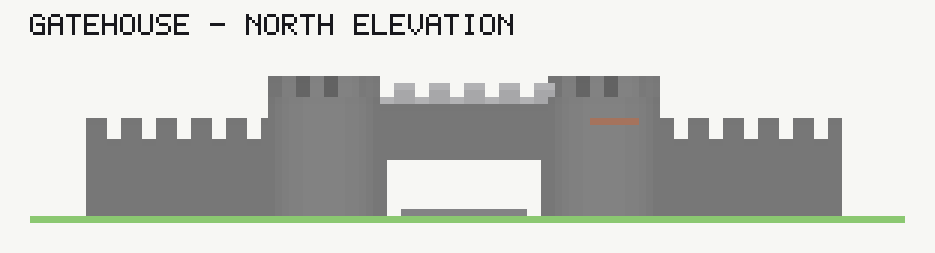

# Sculpting with layers

The sketch tool's layer system was built to stack storeys. This is the record of what happens when it is
asked for something else — a robot, a dragon, a starship, a Rubik's cube, a walker, a ring station, a car, a
statue — and of the facts that decide how far it goes. Everything here was measured against a running studio; the three boards are
in `maps/form-gallery`, `maps/sculpture-gallery` and `maps/opus5-automaton`, the documents beside them in
`sculpture/`, and the tools that produced them in `tools/sculpt/` and `tools/render/`.

**The short answer is that it goes further than the documentation suggests, and the ceiling is not where it
looks.** A layer is not a flat slab. It is one arbitrary *height field* — a `(floor, top)` pair per column —
and a stack of layers is a set of those fields with air between them. Any solid whatever can be written in
that form.

**`techniques/sculpture-with-layers` is the worked card beside this.** Sixteen made things on one board with
the column reads that prove each claim, where this file is the account of how far the system goes and what
it costs. A rule measured there is measured; a rule here is argued.

**And what it costs is the paint, not the shape.** The number of layers a sculpture needs is how many
separately-coloured runs its busiest column passes through, and for every model measured here the colour term
dominates: a 70-block starship is two layers of geometry and four in the end, a robot is five and sixteen, and
a **Rubik's cube — a solid box with one run per column — is one and seven**. §6 costs the one-record change
that removes most of it, and that change has shipped as the `height` band axis.

---

## 1. What a layer actually is

`docs/tools/sketch.md` states the rule plainly — *"a layer is a slab … one layer holds exactly one span per
column … where two adds contest a cell the taller replaces the shorter outright, floor included"* — and the
last five words are the whole of what makes sculpture possible.

**The taller add wins the column, and it brings its own floor with it.** So a stack of nested shapes, ordered
so that the one meant to own a ring of columns is the tallest over it, writes a height field with no
subtraction and no per-column authoring. A dome is concentric discs whose tops rise inward. A *hollow* dome
is the same discs with their floors rising too, by the shell's own curvature, so what each column keeps is
the thickness of the shell at that radius. Thirteen circles, one layer, one number changed between the solid
and the hollow case.

`SK9` names a pair of stacked shapes only where one shape's **floor sits at or above another's top**. Nested
discs sharing a floor say nothing; nested discs whose floors rise by less than the shell is thick say nothing
either. The rule is aimed at a roof drawn over a floor, and it does not fire on any of this.

**There are exactly two height fields per layer, not one.** The set algebra is
`((adds − subtracts) ∪ override-adds) − override-subtracts`, and the two add sets each settle among
themselves by height before the override plane overwrites the ordinary one. An override add therefore
replaces the column it lands on *whatever its height is*, which is what puts a one-block floor inside a
twelve-block wall, and a threshold through a doorway, with neither shape cut against the other.

**Nesting can only build a field that rises inward.** A bowl falls inward, and the outer disc that should
keep only its own ring is also the tallest thing over the middle — nested discs come out as a flat plate.
A falling field needs shapes that do not overlap at all.

**A layer is fanned onto the symmetry's orbit unless the group carrying its shapes says otherwise.** The
rasterizer copies a group onto every orbit axis where `mirrors` is true, which `tools/sculpt/props.py`'s
`LayerBuilder` leaves it, so a sculpture one team owns is built for every team without asking. A landmark
seated on the symmetry centre is the case that states `mirrors=False`, and every emitter forwards `**kw`.

**Nothing refuses a sculpture built for one team and no other.** The store answers 200, pre-flight opens,
and its mirror check reads spawns, wool rooms and build zones rather than made geometry. `column` at the
image is the read that sees it, and the image of block `z` is `−z−1`, so probing `−z` lands a block off and
libels a board that is exactly symmetric.

## 2. A ring is one polygon, and a subtract is not what it looks like

The obvious way to draw a ring is an outer circle minus an inner one. It works, and on a board with anything
else on it, it is refused.

`SK13` reads a subtract as **the board's negative space** — the void a plan's buffer pieces compile to — and
refuses any add that fills it, *on any layer*. So the deck a roundhouse stands on and the roof over it both
collide with the subtract that hollowed the roundhouse: eleven `SK13` findings and a 422 from
`POST /map/from-documents`, on the first attempt at this.

The exemptions are narrow and do not help: an add listed **earlier than the subtract in the same layer's shape
array** is exempt, and a same-layer override add whose floor is above the subtract's is read as a lid.

The way through is that **an outline is filled even-odd**. Run the outer ellipse, slit inward, run the inner
ellipse the other way round and close: a ray into the middle crosses two boundaries and lands outside the
fill, and the slit's two coincident edges cancel. That is one polygon, no subtract, no `SK13` — and it is what
every hollow form in `tools/sculpt/props.py` is written with.

Where a hollow needs a floor rather than a hole, the override plane does it: an override-add disc inside the
wall, one block thick, at the wall's own floor.

**A ring is also what keeps a curved shell out of the findings, and that is measured.** Nested discs whose
floors rise build a hollow dome correctly and report every nested pair as a lost span: on radius 11, eleven
discs raise **sixteen** `SK9` where eleven rings covering the same shell raise none. The world is the same
either way; what the rings buy is a gate that still means something.

**And a field that falls inward is the case nesting gets silently wrong.** Eleven nested discs sized as an
amphitheatre come out a **flat plate 22 cells across at one height**, with no `SK9`, no `SK10` and no
complaint of any kind, because the disc that should keep only its own ring is also the tallest thing over the
middle. Stated as rings the same eleven tiers build the bowl.

## 3. The compiler: run index, not height

For a form that is not a stack of round profiles — a figure with limbs, a car, a shelled torus — the general
decomposition is mechanical and it is **not** one layer per Y level.

Take the model's blocks. Per column, split them into maximal runs of one material. Send the *n*-th run of every
column to layer *n*.

Within a layer every column then carries at most one run by construction, so the shapes are the rectangle cover
of each `(material, floor, top)` group — and the groups are disjoint, so nothing contests anything.

Two runs of one column always have air between them, so no pair of layers is ever driven into another and `SK10`
stays silent. Two shapes on a layer never overlap, so `SK9` stays silent.

`tools/sculpt/layers.py` is thirty lines of that. What it costs, over seven models:

| model | size (x, y, z) | blocks | **shape** | layers | shapes |
|---|---|---|---|---|---|
| robot | 26 × 45 × 14 | 4,486 | 5 | 16 | 746 |
| droid | 18 × 21 × 13 | 1,726 | 4 | 9 | 212 |
| Rubik's cube | 23 × 23 × 23 | 12,167 | **1** | **7** | 123 |
| hooded statue | 25 × 45 × 23 | 6,699 | 4 | 8 | 363 |
| car | 22 × 14 × 38 | 4,630 | **1** | 3 | 212 |
| walker | 44 × 36 × 46 | 8,813 | 3 | 4 | 476 |
| dragon | 84 × 44 × 70 | 15,316 | 4 | 6 | 2,185 |
| starship | 66 × 28 × 70 | 15,518 | 2 | 4 | 540 |
| space station | 118 × 58 × 66 | 29,418 | 6 | 7 | 2,557 |

The **shape** column is the layer count the geometry alone would need — maximal runs per column, ignoring
colour. Read it against the one beside it, because the gap between them is the whole cost model.

**Height has nothing to do with the layer count.** The station is 58 blocks tall and mostly hollow, and takes
seven; the car is 14 tall and takes three; the 70-block starship takes four.

What sets the geometric number is the busiest column — the one that passes through a boot, then air, then a
hand, then air, then a brim. The dragon is the sharpest case: 84 blocks of wingspan, a neck that curls back over
its own shoulders, a wing held above the body — **four**.

**A creature needs a primitive the rest do not.** A plan crossed with a profile gives a body that is a
function of one axis, and nothing doubling back over itself is. `tube` sweeps a radius along a 3-D polyline
so the tail, the spine and the neck are one statement each with round joints; `sheet` lifts a plan outline
onto a surface, which is how a wing membrane arcs over its own spars. Both are in `tools/sculpt/solid.py`, and
between them they are what makes the dragon possible at all.

**And the geometry is almost never what you pay for.** A layer's span carries one theme, so a colour change
inside a contiguous run splits it as surely as air does.

The Rubik's cube is the pure case: a **solid box**, one run per column, no hole in it anywhere — and seven
layers, because a column down its east face crosses white, black, red, black, red, black, red, black, yellow.
`sculpture/models/renders/rubik-layers.png` is the picture of it, and there is not one gap in the model.

The robot is the same story with a face: five layers of shape and eleven more of visor, brow, eyes, chest panel
and mouth grille, nine of which hold fewer than eighty blocks each.

## 4. What the painter does to a sculpture

The terrain painter's five buckets — bedrock, fill, wall, surface, rim — are a model of **ground**: a wall down
every exposed riser, a rim capping every plateau boundary. A curved voxel form is nothing but plateau
boundaries, so a three-tone theme speckles the whole surface of a sphere.

Every piece here therefore states a **solid** theme, one block a material, and lets the geometry do the reading.
The ground keeps its shading.

**A pass resolves its bands from the bedrock course up to its own top** — the right model for ground and
nonsense for a sculpture flying at y24, whose fill band then claims the whole column beneath it. Only the
stone-only invariant stops the damage, and that makes two things load-bearing that do not look it.

**Every layer is painted over its own span**, so a made thing standing on a plinth takes its own courses and
leaves the plinth's to the plinth. The painter orders the stack by the lowest surface each layer carries and
the document's order is only a tiebreak between layers at one height, so a sculpture's layers may be listed
in whatever order the model builds them in.

**The stone-only invariant is over the whole block and not its id**, which is what keeps two passes off each
other where their spans do meet. Stone's id is shared by granite, diorite, andesite and their polished forms,
so an id-only test read a course a lower layer had already finished as unpainted ground: a plinth in polished
diorite under a red car came back red at y1–5, while the same plinth in sandstone came back sandstone. The
read now compares `(id, data)` against `(Stone, 0)`, which is what the write beside it always compared.

Beside them, one smaller fact: **`bedrock` clamps to at least one course.** `BedrockSpec.PaintFloor` is
`clamp(value, 1, surfaceTop)`, so y=0 is bedrock wherever a column has ground at all. It never reaches a prop
standing above the terrain, and a prop that starts at y=0 will have a bedrock sole.

## 5. Where it stops

**Three of the four limits this section recorded are answered, and the two words that answer them are on the
layer.** `kind: "made"` says a layer is a thing standing on the ground rather than being it, and `seat:
"ground"` says where it stands. The measurements below are `techniques/sculpture-with-layers`, which carries
them as panels.

**A made thing seated on a relief is `seat: "ground"`, and the studio does the reading.** The whole thing is
dropped until its lowest floor is one above the lowest ground under its footprint, and the terrain under it
is cut to that course, so it beds into a grade instead of perching on the uphill end. Layers naming one
`part_of` are seated together, which is what keeps a model whose runs are split across layers in one piece.

**Measured on one grade:** a crate stated at `base_y` 15, from a `sketch/columns` read of the highest ground
under it, comes out brick y15–19 over a gap at y14 and grass at y13 — hovering. The same crate ten blocks
away with no height stated at all comes out brick y12–16 on grass at y11, where the grade beside it tops at
y13.

**`SK10` and `SK11` come off a made layer, and that is measured too.** A board of twenty sculptures raises
fourteen `SK11` findings and every one of them is a ground layer: a torus on edge, a hollow sphere and a
compiled wheel raise none between them, though all three are pure overhang.

**What is left is the editability the drawn half has and the compiled half does not.** A compiled wheel is
116 rectangles nobody can adjust as a wheel, and a board's layer list stops being readable well before the
count a big model needs — the limit below is the one still standing.

**A board's layer list stops being readable.** `opus5-automaton` carries thirty-one layers, twenty-four of
which are `colossus-L0 … sentinel-L7`. `GET …/render/topdown?layer=` takes a sketch layer id, and the refusal
message for a bad one now prints all thirty-one. `part_of` is what a strip would group them by; the strip
itself is still one row a layer.

## 6. What could become a tool

**Three of the four below have shipped: `kind: "made"` and `seat: "ground"`, which are §5's subject, and a
material that reads absolute Y.** They are
left here with what they were asked for, because the argument for them is the measurement that produced
them, and the entries are marked where the studio now answers.

**A prop library is not one of the remaining two, and the author's ruling is that it should not be.** A
catalogue of parametric forms is what this exercise produced and what agents then reached for, and a dozen
building-shaped emitters is a vocabulary nobody chose — the thing worth carrying across is the ladder from
one shape to a compiled solid, which is `techniques/sculpture-with-layers`. What follows is kept as the
record of what was measured, not as a plan.

**A prop library of parametric forms, emitting sketch shapes.** `tools/sculpt/props.py` is the prototype:
`ring_wall`, `ellipse_wall`, `dome`, `spire`, `ziggurat`, `arch`, `colonnade`, `tapered_tower`, `bowl`. Each
takes a footprint and a few numbers and returns shapes an author can then drag, because they *are* circles
and polygons with a floor and a height — not a stamped block soup. The cost is measured and small:

| form | layers | shapes |
|---|---|---|
| roundhouse wall, two doors, floor | 1 | 4 |
| crenellated curtain wall, 35 long | 1 | 13 |
| drum tower with a crenellated crown | 2 | 12 |
| **gatehouse** — two towers, a gate, two curtains | 8 | 74 |
| conical roof | 1 | 9 |
| hollow dome, radius 13, 3 thick | 1 | 13 |
| hollow ellipse, 15 × 9 | 1 | 2 |
| tapered tower, 30 tall | 1 | 6 |
| ziggurat, five tiers | 1 | 5 |
| arch, 22 span | 1 | 11 |
| colonnade of twelve | 1 | 12 |
| amphitheatre, six tiers | 1 | 7 |

Eight of the nine single forms are one layer.

The **gatehouse** is the shape the tool would actually want: a composite of five of the emitters, one call,
eight layers and 74 shapes for a fifty-block frontage — a stamper, not a new subsystem, wanting the same shape
the house stamper already has and emitting into the sketch document instead of into the world.



**A battlement is where `SK9` earns its keep.** State a merlon as `[wall top, wall top + parapet]` and the
taller add wins those columns *floor included*, so the wall vanishes under every merlon and the battlement
builds as a picket fence with daylight between the pales. `SK9` names the pair, and the fix is to state each
merlon from the wall's own floor to the merlon's top — then it is simply the taller shape over its columns
and the wall beneath survives. It is the one place in this whole exercise where the rule that makes sculpture
possible also bites.

**Seat a prop against the solved ground. — shipped, as `seat: "ground"`.** It asked for a field on the layer
taking each shape's floor from the ground under it; what landed drops the thing as a unit to the lowest
ground under its footprint and cuts the terrain to receive it, which removes the whole `SK10` class.

**Say that a layer is a made thing. — shipped, as `kind: "made"`, with `part_of` beside it.** It takes the
layer out of `SK10`'s pair walk and `SK11`'s reachability walk, and `part_of` names the thing a stack of
layers is one slice of, which is what seats them together and what a strip would group by.

And one more, which is the largest of the four and the cheapest:

**A material that reads absolute Y. — shipped, as a `layered` material on the `height` axis.** A stack stating
`"axis": "height"` and a `from` resolves each course by `Y − from`, so one span carries every band.
`techniques/designing-a-structure` spends it on a façade and on a lattice's marking. The argument that asked
for it follows.

Everything §3 measures says the same thing — the layer count is the paint
job, not the shape — and a layer only splits on colour because a span carries **one** material. Give it a stack
keyed on world Y and the split stops.

`TerrainMaterial` is already polymorphic under a `kind` discriminator with fourteen derived types,
`BucketContext` carries `Y`, so this was one more axis on a record that already existed, and no change to the
rasterizer, the painter or the gate.

What it is worth, measured by re-compiling every model with runs split on **air only** and shapes grouped by
`(floor, top, colour sequence)`:

| model | layers now | shapes now | layers banded | shapes banded | distinct stacks |
|---|---|---|---|---|---|
| robot | 16 | 746 | **5** | **396** | 118 |
| droid | 9 | 212 | 4 | 118 | 32 |
| Rubik's cube | 7 | 123 | **1** | **33** | 6 |
| hooded statue | 8 | 363 | 4 | 272 | 110 |
| car | 3 | 212 | 1 | 152 | 33 |
| walker | 4 | 476 | 3 | 473 | 89 |
| dragon | 6 | 2,185 | 4 | **1,669** | 516 |
| starship | 4 | 540 | 2 | 471 | 88 |
| space station | 7 | 2,557 | 6 | 1,467 | 81 |

It is not a trade. It is fewer layers **and** fewer shapes in every case, because splitting a run by colour
also shatters its footprint into small rectangles, and keeping the run whole lets big ones form again. The
cube goes from seven layers and 123 shapes to **one layer and 33**, and the whole board's storey strip becomes
readable at the same time.

## 7. Running it

```bash
python3 tools/sculpt/gallery_forms.py     /tmp/forms     maps/form-gallery        # nine parametric forms
python3 tools/sculpt/gallery_sculpture.py /tmp/sculpture maps/sculpture-gallery   # seven compiled models
python3 tools/sculpt/make_board.py        specs/archive/opus5-automaton
python3 tools/drive.py specs/archive/opus5-automaton "Automaton" --out /tmp/automaton
```

The second argument to either gallery is the world directory to export into — `region/`, `level.dat` and
`map.xml`, the three things a server reads. A gallery states no objective, and `EX2` refuses to export a map
no player can enter, so both boards declare one visitor team and a pad at the south edge; that is the whole
of their intent.

Each posts to a running studio at `$PGM_STUDIO_API` (or, unset, the one `tools/drive.py` discovers), reads the built
world back through `POST …/sketch/columns` and renders it. The renderer is `tools/render/` — a PNG writer, an
isometric painter and an orthographic elevation, in the standard library alone, because the studio's own 3-D
preview is WebGL in the browser and there is no way to take a picture from it.
