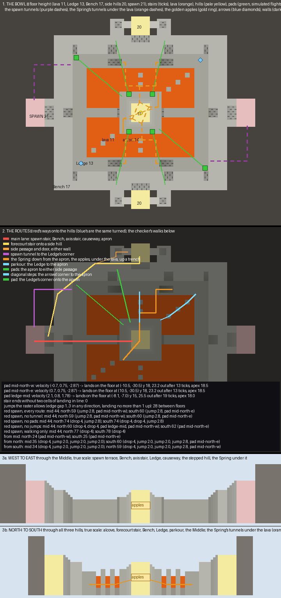

# Calcite — the plan

A King of the Hill board, planned over three reviews and built. It is a white marble quarry cut in two grounds
round a lava pit, with three hills: the Middle on an island in the pit, paying double, and a side hill in an
alcove behind the north and the south Bench, paying single.

## What already exists, and what I took from it

**Mush is the reference, read from its region files and XML.** It is about 109 blocks across, with three
8 × 8 hills on one diagonal and the two spawns on the other. Its rotations are carried by ten jump pads, and
its XML turns fall damage off for a player who has just used one. Each hill scores a point a second, with a
5-second capture, no decay, and nobody owning a hill at the start.

**PGM's jump pad is one line.** `<apply region=… velocity="x,y,z"/>` sets a player's velocity as they step into
the region, each axis clamped to ±3.9 blocks a tick, and 1.8's physics carries them from there. Each tick
moves the player by the velocity, then `vy = (vy − 0.08) × 0.98` and the horizontal speed falls by 0.91.
`scripts/pad.py` runs those steps. Run on Mush's pads, it lands them where Mush built the platforms for them,
so this board's pads are designed by simulation rather than by trial.

**Mush Pit, the author's own five-point map, was read from its region files and XML.** It is about 70 × 87, a
ring of roofed corridors round void with a cross and one diagonal running through a round middle. The floors
are stacked two and three deep under giant mushroom caps at the corners. Its points are rooms on the ring's
sides and the middle, each capture region a plus-shaped union of cuboids that takes in the room's doorways,
and every fall off a corridor is into the void (`renders/ref-mushpit-topdown.png`).

**What I take from Mush Pit:** a capture region shaped to its room and its thresholds rather than a bare
square, floors stacked over each other so a fight has an above and a below, a diagonal that breaks the grid,
and a low ground that kills: Mush Pit's void is Calcite's lava.

**The 5CP variant was read and set aside.** In the include, captures go in order, the middle point needs your
own second point, and spawns move as points fall. That is a tournament format, and this board is the usual
three hills; the bowl could carry 5CP later with two more points on the benches.

## The board

| Level | Height | What it is |
|---|---|---|
| The pit | 11 | lava, 46 × 38: a fall into it is the end |
| The Ledge | 13 | the low ground: a ring 6 wide round the lava, two over it |
| The apron | 14 | the Middle's island, 18 × 18, a step up from the causeways |
| The Bench | 17 | the high ground: a ring 8 wide, four over the Ledge, the quarry wall standing straight behind it |
| The Middle | 17 | 8 × 8 on two rings of single steps, level with the Bench; the Spring under it |
| The side hills | 20 | 8 × 8 in an alcove behind the Bench, three over it, walled on three sides, open toward the Middle |
| The spawn terraces | 21 | cut into the wall on each team's axis, four over the Bench, a stair of four down |
| The wall | 28 | the quarry face round everything |

**Two grounds, four blocks apart, and nothing above them but the spawns.** The Rim of the earlier plans is gone:
nobody would have spent time on it. The quarry wall stands straight behind the Bench, and only a terrace in
front of each spawn rises above it.

**Every stair is met head-on, with room to run up to it and to turn off it.** Each flight runs straight off the
level it starts from and ends at the level it arrives at, with two cells of floor in line at its foot and two
at its top. `plan_check.py` checks every stair end on the board for this and finds none without. Between the
Ledge and the Bench there are three steps: a stair on each team's axis, one at every corner of the Ledge, and
one either side of each side hill's forecourt.

**The board is 120 × 96, and blue's half is red's turned half a circle.** Each side hill is mirrored about its
own middle, so both are 78 to 79 blocks from either spawn on foot.

**Each team's half is coloured.** A band of the team's stained clay runs through every face on its half, in the
Bench's face and in the quarry wall above it. Its colour runs along every edge of the Ledge and the Bench where
the ground drops away, and the spawn terrace is checkered in it. The centre line splits each side hill's
alcove, so its west wall is red and its east wall blue.

## The routes, and what each is for

**Every route has a job, and a moment in the match when it is the right one.** Lengths are red's, walked on the
plan by `scripts/plan_check.py`; blue's are the same turned.

| Route | Length | One way? | What it is for, and when it is used |
|---|---|---|---|
| **The main lane:** the spawn's stair, the Bench, the axis stair, the causeway, the apron | 46 to the Middle | no | the straight push onto the Middle at the start and after a wipe; the causeway is four wide over the lava |
| **A forecourt stair:** three steps out of the Bench onto a side hill | 78 to 82 from a spawn | no | the frontal attack on a side hill, in the open line from the Middle |
| **A side passage:** cut into the wall from the Bench, wide enough to turn in, a stair of three up through a door | 75 to 85 from a spawn | no | the flank onto a held side hill, from either side, past the walls that hide it from the Bench |
| **The spawn tunnel** to the Ledge's corner | 78 to a side hill | no | the covered way down to the low ground |
| **The pads from the apron,** two to each side hill, landing at the mouth of either passage | 29 and 30 from the Middle | yes | the rotation from the Middle to either flank of a side hill |
| **The parkour:** two pillars from the Ledge onto the apron over the lava | 36 from a side hill | no, but up is the point | a side hill's way back to the Middle, fast and exposed; a miss is death |
| **The diagonal steps:** three pillars from the arrows' corner to the apron's corner | 40 from the arrows to the Middle | no, but up is the point | the corner's way onto the Middle: restock arrows, then jump in |
| **The corner pads:** from the Ledge's corner over the lava onto the apron | 19 ticks of flight | yes | the corner's way onto the Middle in the two corners without arrows |
| **The Spring:** down a stairwell from the apron, past the golden apples, under the lava in a glass tunnel, a fork, up a trench along the Ledge | 71 from the Middle to a side hill | no | the covered rotation: out of sight and through the apples, arriving on the Ledge below a side hill |
| **The drops** from the Bench to the Ledge, 4, all round | — | yes | a flank anywhere, at no cost but the climb back |

**The Middle is the hub.** The shortest way from a spawn to a side hill is through the Middle and one of its pads
(59 to 60), and a side hill's quickest way to the other is through the Middle as well.

**The jumps are only the ones planned.** The checker looks for every gap of one to three blocks, in any
direction, that a player can cross landing no higher than a block up and that saves more than a few steps. It
finds the two parkour lines, the two lines of diagonal steps, and a hop across each inner corner of the Bench,
and nothing else.

**The pads were tuned in the simulator and flown again through the built blocks.**

| Pad | Velocity | Lands | Flight |
|---|---|---|---|
| apron, west, to the North hill's west passage | −0.70, 0.75, −2.87 | the Bench at (−10.5, −30.5), y 18 | 13 ticks, apex 18.5 |
| apron, east, to its east passage | 0.70, 0.75, −2.87 | (10.5, −30.5), its mirror | 13 ticks, apex 18.5 |
| the Ledge's corner onto the apron | 2.10, 0.80, 1.78 | the apron at (−8.1, −7.0), y 15 | 19 ticks, apex 18.0 |

## The hills

- **No cover on a hill.** Each is an 8 × 8 top of polished diorite inside a ring of wool that turns the
  holder's colour. It is held with players.
- **The Middle is stepped:** two rings of single steps round it on every side, from the apron at 14 to its top
  at 17. It is attacked from every side: two causeways, two parkour lines, two lines of diagonal steps, two
  corner pads, and from below out of the Spring.
- **A side hill stands in an alcove** cut into the quarry wall behind the Bench, three over it. The Bench in
  front is its forecourt, and the Middle's top sees straight into it; the Bench cannot see in from the sides.
- **A side hill is the same from either side:** the forecourt stair in front, and a passage and door in each
  wall. Either team can take either flank.

## The Spring

**The room under the Middle is a crossroads as well as a larder.** Two stairwells come down into it, each in the
apron's band with the band's length as its landing. Two tunnels leave it north and south under the lava, each
forking under a side hill's forecourt and running on under the Ledge to a trench that rises along the Ledge.
The golden apples spawn in the middle of the room, so every route through it passes them.

**The tunnels run under the lava, with the lava on their roofs.** Their floors are at 7 and their glass roofs at
10, and the lava stands on the glass at 11, so nobody walks on them. A player in one walks under a ceiling of
lava, and a player on the causeway sees them below it.

## What `map.xml` says

- `<king>`: three hills with a 5-second capture, a neutral start and no decay. The Middle pays 2 a second and
  the side hills 1. First to 600, or the most points at 15 minutes.
- **Spawners:** golden apples in the Spring, one at a time, every 30 seconds; arrows in the Ledge's north-east
  and south-west corners, where the diagonal steps start.
- **Pads:** each pad's region carries its velocity, and fall damage is denied until the player lands.
- **No block interaction at all;** the lava kills as it is; enemy entry to a spawn is denied.

## Theme

- **A dimension-stone quarry:** faces cut in courses of diorite, polished diorite and stone with a drill line of
  andesite every fourth column; the Ledge's floor grey, the Bench's white, the spawn terraces quartz.
- **Made things:** quartz stairs, iron rails along the causeways, slime pads, timber derricks on the wall's
  top at the four corners.
- **The team's colour** in a band through every face on its half, along its edges, and on its spawn.

## How the plan changed

| Review | What it said | What changed |
|---|---|---|
| first | the room under the Middle as a route; the Ledge as a ground; arrows in two corners; side hills encased | the Spring and its tunnels; stairs between the grounds; arrows north-east and south-west; the alcoves |
| second | lava; side hills mirrored; pads mirrored; diagonal steps from the arrows | all four |
| building | the corner pad up to the Rim hit the Bench's face in the built world | it carries the player onto the Middle instead |
| third | stairs thrown into walls; more team colour; tunnel roofs walked on; too much height | every stair met head-on with a landing check; team bands and edges; tunnels under the lava; the Rim gone, the grounds four apart, the side hills three over the Bench |
