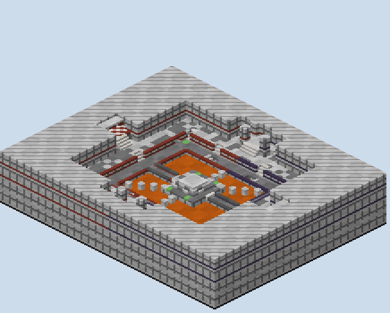

# Calcite — what was built

A King of the Hill board, built from the plan in `PLAN.md` and rebuilt after the first review of the built
world. It is a white marble quarry cut in two grounds round a lava pit. The Middle stands on an island and pays
double, and a side hill stands in a walled alcove on the north and on the south, paying single.

## How it was made

**The world is built from the plan's own raster.** `scripts/plan.py` holds every column's floor height and
kind; `plan_check.py` walked it, `sketch.py` drew it, and `gen.py` builds each column to exactly that floor. A
stair the checker climbed is a quartz stair in the world, facing the way the raster says it rises.

**What a raster cannot hold is built on top.** That covers the Spring under the Middle with its two stairwells,
the glass tunnels under the lava, the spawn tunnels inside the quarry wall, the spawn roofs and banners, the
slime pads, the hills' wool rings and the derricks. Each is built for red and turned for blue.

**Each ground has its own floor tone.** The Ledge is andesite and stone, the Bench diorite, the floors at a side hill
polished diorite with quartz, in cells of three. A player knows their level by what is under their
feet. The cut faces run in courses of diorite and polished diorite, with a darker course of stone and a drill
line of andesite every fourth column.

## What the review of the built world changed

**Every stair is met head-on now.** The first build threw stairs into walls, with no floor in front to run up
to them or turn on. Each flight now runs straight off the level it starts from, with two cells of floor in line
at its foot and two at its top. `plan_check.py` audits every stair end on the board, and none fails.

**The board is two grounds, four blocks apart.** The first build had three grounds six apart and a Rim at the
top that nobody would have used. The Rim is gone, the quarry wall stands straight behind the Bench, and only a
terrace in front of each spawn rises above it.

| Level | Was | Is |
|---|---|---|
| lava | 10 | 11 |
| the Ledge | 16 | 13 |
| the apron | 19 | 14 |
| the Bench, the Middle's top | 22 | 17 |
| a side hill | 23, one over the Bench | 20, three over it |
| the spawn | 28, on the Rim | 21, a terrace four over the Bench |

**Each team's half is coloured.** A band of the team's stained clay runs through every cut face on its half,
at 15 in the Bench's face and at 22 in the quarry wall. The same colour trims every edge of the Ledge and the
Bench where the ground drops, and the spawn terrace is checkered in it. A side hill's alcove is split down the
centre line, so its west wall is red and its east wall blue.

**The Spring's tunnels run under the lava, with lava on their roofs.** In the first build the tunnels' roofs
stood above the lava and could be walked on. Their floors are now at 7, their glass roofs at 10, and the lava
lies on the glass at 11.

## What the built world measures

`renders/walks.txt` walks the built blocks on foot from each spawn, with no pads and no jumps:

| From red's spawn | Blocks |
|---|---|
| the Middle's top | 44 |
| the North hill, the South hill | 78, 79 |
| the Spring, the golden apples | 54 |
| the Spring's tunnel, at its fork under the lava | 73 |
| a trench's top on the Ledge | 78 |
| a side hill's west door, east door | 74, 85 |
| the arrows in the north-east corner | 88 |
| red's tunnel mouth on the Ledge | 36 |

**Blue's walks are red's, turned.** Blue's spawn reaches the Middle in 45 and the two side hills in 80 and
79, and both spawns reach the same 4,744 standing cells.

**Every pad was flown again against the built blocks.** The walk runs 1.8's physics from each pad and its turned
twin and reports the first block the player's body meets:

| Pad | Comes down on |
|---|---|
| apron, north-west and north-east, and their twins | the Bench at (∓10.5, ∓30.5), y 18, at a side passage's mouth, after 13 ticks |
| the Ledge's corner, and its twin | the Middle's apron at (∓8.1, ∓7.0), y 15, after 19 ticks |

**The corner pad was changed by the first build.** The plan's checker tested where a pad comes down but not
what it passes on the way. In the world the corner pad up to the Rim met the Bench's face in three ticks. It
now crosses the lava onto the Middle, the corner's answer to the diagonal steps in the other two corners.

## The renders

- `00-plan-sketch.png`: the plan as rebuilt; `-v1` to `-v3` are the earlier versions, and `scripts/*_v1`–`_v3` the scripts that drew and built them.
- `01`, `02`: the studio's top-down and height reads of the region files.
- `10`–`15`: true-scale sections: west to east, north to south through all three hills, along a Spring
  tunnel, through a stairwell, across the North hill's forecourt, and down red's spawn tunnel.
- `30`–`36`: isometric views of the quarry, the North hill, the Middle, the Spring cut open, a corner and a
  spawn.
- `50`, `51`: elevations of the North hill from the Middle and of the Middle from the west.

## What I wanted, how hard it was, and what a studio feature would need

| What I wanted | How hard it was | What a studio feature would need |
|---|---|---|
| Routes each with a purpose, measured before building | Moderate: a height raster, a walker with stairs, drops, tunnels and pads, and a length for every named route | A route layer on the plan: named waypoints, walked and measured on every edit |
| Only the jumps I planned | Moderate: a search for every gap of one to three blocks in any direction, with corner hops filtered out | A jump audit on the plan, listing every jumpable gap so an accident shows before it is built |
| Jump pads that land where they are meant to | Easy to simulate; the lesson was to fly them through the built blocks, not over a height map | A pad tool: pick a target, solve the velocity, and draw the flight against the real geometry |
| A board symmetric for teams, with each side hill mirrored about itself | Moderate: half-turn for the teams, a mirror per hill, mirrored pad velocities | A symmetry setting per piece, not only per board |
| Tunnels under lava, in glass | Easy: a carved run whose walls and roof turn to glass where they meet the lava | A tunnel piece that knows what it passes through and lines itself to match |
| Stairs between the grounds that read as stairs, with room to run up and turn | Easy once the sections were drawn at true scale; the landing audit came only after a review found stairs thrown into walls | True-scale sections in the plan view, and a check that every stair end has floor in line |
| Each team's half readable at a glance | Easy: a team colour picked by which side of the centre line a block is on | A team-colour slot in a theme, painted by side of the symmetry axis |
| Hill regions and wool rings that match the hill | Easy by hand from the plan's boxes | Hill pieces that write their capture, progress and captured regions with the hill |
| Validation of a KOTH map | Not attempted here; the XML follows PGM's source and Mush's | KOTH support in the studio's round-trip, so a hill's regions are read back against the world |

## After the playtest

**The north tunnel under the lava was walled shut by glass, and is open again.** The fork's run east and west
lines its sides with glass where it lies under the lava, and that glass filled the north tunnel where the two
meet. A tunnel's glass no longer fills air another tunnel carved.

**The trench feet are three high.** A player stepping up onto the first stair still stands partly in the
corridor's last column, a block higher, so two of air there stopped them.

## After the second playtest

**The way down to the golden apples could not be walked: two stairs ran into a ceiling two blocks high.** A player on
a stair's lower half stands half a block up, and stepping off it their head is already over the next column, under
that column's ceiling. The stairwells into the Spring met a passage two high, and so did the steps out of it north.

**Both now have three blocks of air where a stair meets the flat.** That is the stairwells' passages into the room,
and the first two blocks of the tunnel north off the foot of its steps, in both halves. It is the rule the trench
feet already followed.

**The walk could not have caught it.** It counts a place passable with two blocks of air over its floor and does
not test a body standing across two columns, so its numbers are the same before and after.
