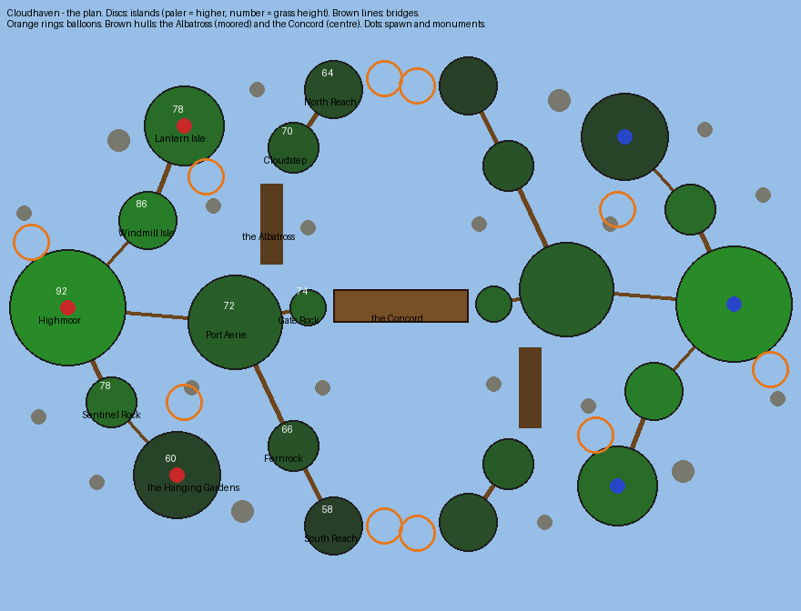

# Cloudhaven — the plan

Written before any terrain existed. The sections after *As first drawn* record how the plan changed and why.

## The board in one sentence

**An archipelago in the sky: islands of every size float at different heights over the void, some joined
by rope bridges and stairs and the rest only by building, with hot-air balloons hanging in the gaps,
an airship moored at each team's harbour, and a great double-ended airship at the centre as the crossing.**

What a player remembers: the Concord's deck between the teams, the willows trailing off the Hanging Gardens,
and stepping off a bridge into a balloon's basket.

## Mode: destroy the monument, two a team

**Two monuments, on islands thirty-two blocks apart in height.** Monument A is under a stone gazebo on
Lantern Isle, high (y 78) and north. Monument B is in a sunken garden on the Hanging Gardens, low (y 60) and
south. Both are off the line between the spawns, one each side. A defender on one can see the other, but
not reach it quickly: the way between them runs back through the spawn.

## Arrangement

- **Halves:** red holds the west, blue the east, and blue's half is red's turned half a circle about the
  centre. The Concord lies across the seam and is symmetric under the turn, so each team builds half of it.
- **Heights:** the spawn at 92, falling towards the middle and the flanks, to 58 at the lowest rock. Every
  bridge goes downhill from home, so attacking is a climb.
- **Three ways across:** the Concord in the middle, reached from Port Aerie by Gate Rock. A north flank runs
  from Port Aerie over the moored airship to Cloudstep and North Reach, and a south flank by Fernrock to
  South Reach. Each flank ends at a gap with two balloons hanging in it, and the far side of it is the
  enemy's flank rock.
- **The flanks pair the objectives.** The north flank lands on the enemy's south side, where their Gardens
  are; the south flank lands by their Lantern Isle.
- **The void is everywhere below.** Nothing stands on anything: the islands' rock hangs under them in
  dripping cones.

## The places (red half; blue's are their half-turn)

| Place | Where (x, z) | Grass at | What it is | Why a player goes there |
|---|---|---|---|---|
| Highmoor | −92, 0 | 92 | Red's spawn: a keep with its gate to the east, a waterfall off the north rim | spawn |
| Windmill Isle | −70, −24 | 86 | a windmill | the step to Lantern Isle |
| Lantern Isle | −60, −50 | 78 | a stone gazebo over the monument, lanterns on posts | **red monument A** |
| Sentinel Rock | −80, 26 | 78 | a crag with a lookout | the step down to the Gardens |
| The Hanging Gardens | −62, 46 | 60 | terraces, willows over the rim, a sunken garden | **red monument B** |
| Port Aerie | −46, 4 | 72 | the harbour: dock, warehouse, crane, the Albatross at its pier | the forward base |
| Gate Rock | −26, 0 | 74 | a gangway onto the Concord | the middle |
| The Concord | centre | deck 74 | a double-ended airship, envelope overhead | the middle crossing |
| The Albatross | −36, −34…−12 | deck 72 | an airship moored at the pier | to Cloudstep; cover |
| Cloudstep | −30, −44 | 70 | a small rock at the Albatross's bow | the north flank |
| North Reach | −19, −60 | 64 | a ruined arch | the north crossing |
| Fernrock | −30, 38 | 66 | a mossy rock, a dovecote | the south flank |
| South Reach | −19, 60 | 58 | a brazier | the south crossing |
| Balloons | five a side | 60–104 | hot-air balloons: two in each flank gap, two free, one tethered over the spawn | stepping stones, cover, a sniper's perch |
| Debris | ten a side | — | little drifting rocks | parkour and cover |

## Palette, decided now

- **Islands:** grass over dirt over stone, granite and andesite in streaks, and hanging cones of rock under
  each with vines on the rims. Moss where water falls.
- **Built:** oak and birch timber, stone brick and white quartz for the gazebo and the keep, and gold
  trim on the Concord.
- **Balloons:** wool in stripes, three colourways, never red or blue so that they belong to neither team.
- **Trees:** willow and dense oak, cut from rockymine's tree showcase.
- **Biome:** plains, so the grass is the bright one.

## As first drawn

The table and sketch above are the plan as written before building.
