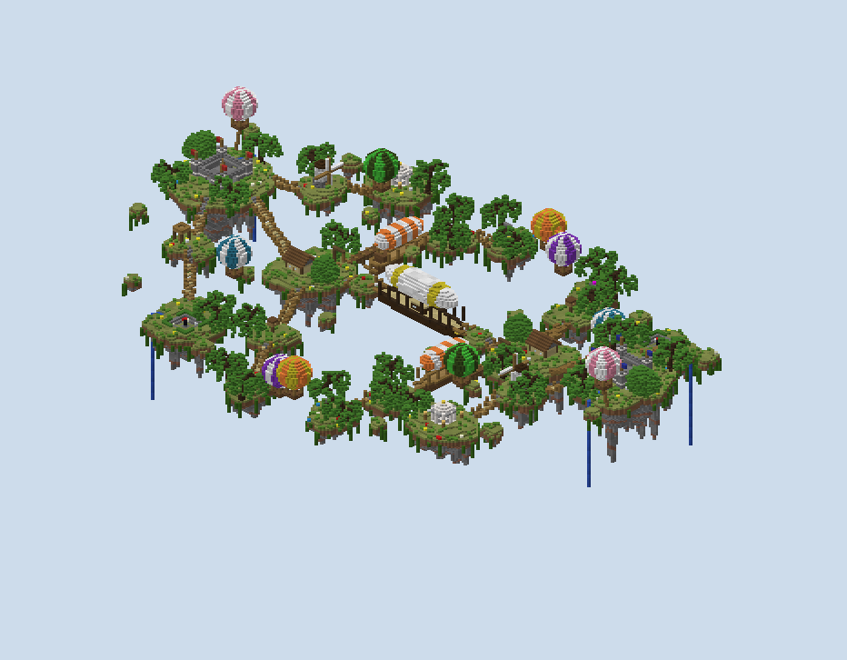
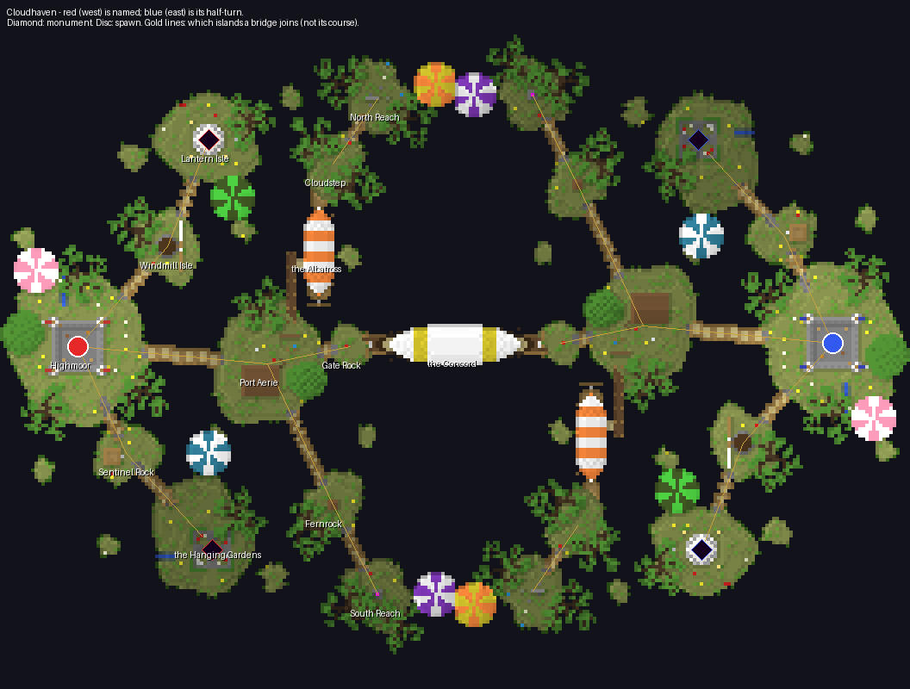

# Cloudhaven — report

**An archipelago in the sky.** Eleven islands a side float over the void at heights from 58 to 92, with
rock hanging under each in dripping cones and vines off the rims. Rope bridges and cut stairs join some of
them; the rest are crossed by building. Hot-air balloons hang in the gaps, an airship is moored at each
team's harbour, and a great double-ended airship, the Concord, floats at the centre as the crossing between
the teams.

It is a destroy-the-monument board, two monuments a team, sixteen a side, 264 × 200 blocks. Blue's half is
red's turned half a circle about the centre, `(x, z) → (−1 − x, −1 − z)`.

## What was built, and why

**Every island is the same recipe at a different size and height.** Each island is a disc of grass with a
ragged outline drawn from four low harmonics of angle, and a slight dome. Under it hangs a cone of rock as
deep as 1.3 to 1.8 times its radius, lumpy, with spikes where a noise field runs high. The rock is stone
streaked with granite and andesite, with dirt under the grass.

**The rims are dressed.** Vines catch on about a fifth of the rim's outer
faces and trail two to eight blocks down. Ten small debris rocks a side are the same thing at radius 3 to 4.

**The heights fall from the spawn towards the middle and the flanks, so every attack is a climb.** Highmoor
is at 92, Windmill Isle 86, Lantern Isle and Sentinel Rock 78, Gate Rock and the Concord 74, and Port
Aerie 72. Cloudstep is at 70, Fernrock 66, North Reach 64, the Gardens 60 and South Reach 58. The side
elevation (`renders/50-elev-board-from-south.png`) shows the board as a valley in the air.

**Nine bridges a side, built by one function that handles any drop.** A bridge runs along the line between
two island centres, three planks wide with a rope rail of fence, and sags a little where it has slack. Where
the drop is more than the gap, it starts early as a stair cut into the higher island's grass, in stone
brick, and if that is not enough it lands as a ramp on log posts. Every step is one block, which the audit
checks. The longest is Port Aerie to Fernrock, 31 blocks with 27 of them over the void.

**The airships and balloons are the fantasy, and each has a job.** The Concord's deck is the middle crossing.
The Albatross, moored at Port Aerie's pier, is the way onto the north flank, and its envelope is cover over
the gap. Two balloons hang in each flank's gap between the teams' last rocks as stepping stones, a few blocks
of building apart.

**The other balloons are perches.** A free one hangs over each team's side as a sniper's perch, and a tethered one floats over
each spawn. The balloon colourways avoid red and blue, so none belongs to a team.

**The trees are willow and dense oak.** They are cut from rockymine's tree showcase: willows on the rims,
where their crowns trail over the edge, and dense oaks inland, 42 a side. No crown comes within five blocks of
a monument.

## A tour (red's side; blue's is at `(−1 − x, −1 − z)`)

**Highmoor (−110, 0, grass 92) is the spawn.** It holds a walled court of stone brick with quartz courses,
open to the sky, with a tower at each corner flying red. Gates lead east to Port Aerie, north to Windmill Isle
and south to Sentinel Rock. There is a ladder to the wall walk and a chest of planks, and a waterfall falls
off the north rim into the void.

**Windmill Isle (−84, −29) is the step to monument A.** It has a stone windmill, a tapering round tower with
a timber cap and four sails of white wool on the east face.

**Lantern Isle (−72, −60, grass 78) holds monument A.** It stands under a quartz gazebo: eight pillars, a
stepped dome with a gold finial, and the monument on a chiseled pedestal in the middle. Lanterns on posts
stand round it. It is open on every side, so it can be seen and shot at from the bridge, from Cloudstep and
from the free balloon over the gap.

**The Hanging Gardens (−74, 55, grass 60) hold monument B.** They are the lowest of the home islands, with
willows trailing over every rim and a waterfall off the west side. Monument B stands in a sunken garden two
blocks deep, walled in mossy stone brick and hedged round its rim, with a flight of steps down on each side.

**Port Aerie (−55, 5) is the forward base.** It has a warehouse with stone gable ends, a crane over the pier
with a crate on its rope, and a stack of logs. The pier runs north past the island's rim with a gangplank to the
Albatross's side. Gate Rock (−31, 0) is just east of it, with a gangway onto the Concord's west end.

**The Albatross (x −40, z −41…−14) is moored at the pier.** It has a spruce hull, its bow north, and a cabin
aft with a chest. Its envelope is striped orange and white, a propeller is astern, and a gangway runs off the
bow onto Cloudstep.

**The Concord (x −23…22, deck 74) is the middle.** It is a double-ended dark oak hull with gold at the prows,
a birch deck and a deckhouse astride the seam. A white envelope with gold bands rides over it on struts,
and there is a propeller at each end. It is symmetric under the half-turn, so each team built half of it.

**The flanks are Cloudstep and North Reach, then Fernrock and South Reach.** North Reach has a ruined arch,
South Reach a brazier burning on netherrack, Fernrock a dovecote, and Sentinel Rock a lookout platform with a
ladder.

## How a match is meant to flow

**Both monuments are off the line between the spawns, one each side of it.** Lantern Isle is north and high,
and the Gardens are south and low, eighteen blocks apart in height. A defender at one can see the other but
not reach it quickly. The way between them runs back through Highmoor, 90 blocks to each.

**The middle is crossed in three places, and the flanks pair the objectives.** The Concord is the direct way.
The north flank, over the Albatross to Cloudstep and North Reach, lands on the enemy's South Reach and leads
to their Gardens. The south flank by Fernrock lands on their North Reach and leads to their Lantern Isle. A
flank attack is therefore an attack on one known monument, but only after building across the balloons.

### The walks, measured

`scripts/walk.py` walks the built world from each spawn with no blocks placed. A step climbs one block,
drops at most three, opens doors and climbs ladders.

| From red's spawn | Blocks |
|---|---|
| Sentinel Rock | 37 |
| Windmill Isle | 47 |
| Port Aerie | 55 |
| Gate Rock | 79 |
| Own monument A (Lantern Isle) | 90 |
| Own monument B (the Gardens) | 90 |
| The Albatross's deck | 95 |
| The Concord's deck | 99 |
| Fernrock | 115 |
| Cloudstep | 125 |
| The Concord's far end | 126 |
| South Reach | 153 |
| North Reach | 158 |
| Enemy monument A | 296 |
| Enemy monument B | 302 |

**Blue's walks are the same, and the enemy is reachable on foot only over the Concord.** The flank rocks end
at their gaps, so a flank is a building job. The monuments are at the long end of the 40 to 90 a board wants.
That is the price of the scale-up, and the first thing to try in a playtest.

## What changed while building, and the placement audit

**`scripts/audit.py` checks the placements.** It looks for floors with air under them, buildings hanging off
a rim, claims on the same ground, ground that rises more than five blocks under a footprint, bridges through
buildings, and bridge steps over one block. Its last run reads `no placement problems found`
(`renders/audit.txt`). `PLAN.md` says what moved; in short:

- **The first build had 3,500 blocks of grass a side.** That is too little for sixteen players, and the trees
  could find room for only 18. The layout was scaled out, positions by 1.2 and radii by 1.3, to 5,910 blocks
  of grass and 42 trees.
- **The bridge down from Sentinel Rock ran through its lookout and into the sunken garden.** Both moved off
  the bridges' lines, and the bridge builder now records any building its deck crosses as a conflict.
- **The willows' crowns roofed monument B over.** Crowns now keep five blocks off a monument, not just
  trunks.
- **A waterfall could not find its rim after the scale-up**, because it only looked five blocks out. It now
  takes the nearest rim in any of four directions within fifteen.

## What I am proud of

- **It looks like a fantasy sky board and plays like a board.** Every island has a reason in the route, the
  balloons are stepping stones and cover, and the two airships are the crossings.
- **One bridge function covers every drop.** It is a span when the drop is gentle, a cut stair when it is
  steep, and a ramp on posts when it is steeper, with one-block steps throughout.
- **A ship built half by each team.** The Concord is symmetric under the half-turn, so red's half of the
  generator builds half a ship and the rotation completes it.

## What I would do next

- **Tighten the walks.** The monuments at 90 are at the edge; pulling Highmoor in by ten blocks would bring
  them to about 80.
- **Give the Concord more shape.** From above it reads as a long box under its envelope. Its prows should
  rise, and its deckhouse could be a bridge with windows.
- **Sails or ropes in the flank gaps.** A rope ladder hanging from each flank balloon to the rock below would
  make the flanks a climb, not a build.
- **It has not been played.**

## What I wanted to build, how hard it was, and what a studio feature would need

| What I wanted | How hard | What a studio feature would need |
|---|---|---|
| Islands at many heights, each with its own hanging underside | Easy: one recipe, per-island top, radius, depth and raggedness | **Per-island height and underside** in the island stage; the studio's islands share one plane and one underside profile |
| A ragged outline that is not a blob | Easy: a few harmonics of angle | An **outline noise** control on each island, separate from the terrain noise |
| Bridges between islands at different heights | Medium: the span is easy, but a 13-block drop over a 3-block gap needs a stair cut into one island and a ramp onto the other | A **bridge primitive between two places** that solves its own profile (span, cut stair, ramp) and guarantees one-block steps |
| Hot-air balloons | Easy: an ellipsoid shell in gores, a basket, ropes, a burner | A **prefab with parameters** (size, colourway) placed in the air, which the studio's placement only does on ground |
| Airships, one moored and one spanning the seam | Medium: hull shapes along an axis, an envelope on struts, and a ship symmetric under the half-turn so each half is built by one team | **Structures that sit across the symmetry seam**, built once and checked for symmetry |
| Waterfalls into the void | Easy: a source in a notch and a falling column that simply ends | A **water feature off an edge**; the studio's water fills basins |
| Trees on rims whose crowns hang over the edge | Easy: willows wherever the distance to the rim is under 3.5 | A **rim zone** to plant by: distance to the island's edge as a band axis, beside height and slope |
| More ground after the first build | Cheap: two scale factors in the plan, and the whole board regenerates in under a second | **Relayout without rewriting**: positions and sizes as parameters of the plan, not baked into each stage |

## Notes on the deliverable

- `scripts/build.sh` regenerates everything: the audit, the volume, the region files via `write_world.cs`,
  the renders, the annotated top-down and the walks.
- Generation is under a second, and writing the region files about ten.
- `world/` holds the region files, `level.dat` and `map.xml`.
- The writer writes no entities and lights everything fully, so the balloons' burners are glowstone and there
  are no boats, item frames or armour stands. The water in the falls is written falling and will settle when
  a block next to it changes.
- Not checked in game.

## After the playtest

**The islands carry less than half the trees they did.** The playtest found the board overgrown and hard to navigate, with the floor hidden. `dressing.py` now keeps 5% of the rim candidates and 1.5% of the inner ones, where it kept every one the spacing allowed, so the rim still has its willows and the middle opens up. Red's half went from 36 trees to 16, which is 44%, and blue's half is its turn.

**Per island, the counts read back from the generator.** Cloudstep 3 to 2, Fernrock 2 to 1, the Gardens 4 to 1, Highmoor 8 to 4, Lantern Isle 4 to 1, North Reach 3 to 2, Port Aerie 6 to 2, Sentinel Rock 1 to 0, South Reach 3 to 2 and Windmill Isle 2 to 1. The existing exclusions are unchanged: no tree on a bridge or ship, by a building or within five blocks of a monument, and the audit finds no placement problem.

**The walks barely move.** Standable cells reached from the spawn rose from 12,290 to 12,616 as the crowns came out. Walks to the enemy's monuments read 294 and 300 (296 and 302), and the Concord's deck 97 (99). The written map.xml reads valid with no issues.
