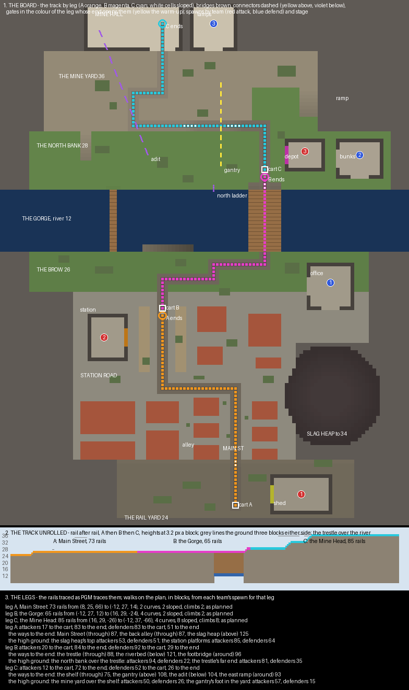

# Copperline — the plan

A payload board, planned and waiting on a review before anything is built. A mining railway runs up a valley,
from a rail yard through a town, over a gorge and up a mountainside into a mine. The attackers push an ore cart
along it in three legs, and the defenders stop them. The defenders win if the clock runs out first.

## What PGM does with a payload

**A payload is a control point that moves.** `PayloadDefinition` extends the control point's definition and adds
four things.

- `location`, the rail the cart starts on.
- `radius`, the sphere round the cart that counts as standing on the point.
- `show-beam`, a beacon beam over the cart.
- `display-filter`, which says when the particle ring and the beam are drawn.

**The cart's place on the track is the point's capture progress.** While attackers stand within the radius and
no defender does, progress grows and the cart rolls forward. Left alone it decays back, and a defender on it
holds it still where `contested-rate` is 0. At full progress the point is captured, and with `permanent` it stays
captured, which ends that leg.

**PGM builds the track once, when the match loads, by following rails from `location`.** It reads only each
rail's data value, 0 to 9, and steps to the next block in that rail's direction, or the block under it. It stops
where neither holds a rail. If the first step from the start finds nothing, it runs the other way.

**The tracer never checks that two rails actually join.** A rail that merely stands where the line would go next
is taken as part of it, and a loop never ends. So a bad track is not an error at load. It is a cart that stops
short or runs on into the next leg.

**Every cart is spawned when the match starts and stands at its start until its leg is pushed.** The minecart
carries a white wool block, recoloured to the team that dominates it. The module is an experiment: the server
must have `experiments.payload` on, or a map with `<payloads>` does not load.

## The two kinds of payload map

**There are two payload maps in PublicMaps, and they are two different games.**

| | Escort, in stages | Race |
|---|---|---|
| example | Bardo | Long Shot |
| teams | attackers push, defenders stop | each team pushes its own cart |
| carts | three, one per leg, each pushable only once the leg before is done (`player-filter` on `<completed>`) | two, one per team, in two mirrored lanes |
| ending | the last leg done, or the clock: `<time result="defenders">` | the first cart home: `points="1"`, `<score><limit>1</limit>` |
| spawns | move forward with each leg, by filters on `<completed>` | fixed |
| board | about 129 × 114, round, the track winding through cover | 353 × 65, two straight lanes over void with islands and doglegs |

**Bardo's track is three separate lengths of rail, one per leg, 59, 67 and 70 rails long.** Each starts on a
detector rail and ends where the next leg starts a block lower or higher. That height break is what stops the
trace. The legs climb (18 sloped rails in the second) and turn often: 10 curves in the first.

**Long Shot's lanes are 262 rails each and run over void from one end to the other.** They make doglegs on the
middle islands, five blocks across and twelve along, so a lane is never one sightline. A team entering the other
lane is given a health debuff, and block physics are denied over the tracks.

**I am building the escort kind.** It is the Overwatch game the brief describes: one cart, one direction, the
fight moving along the track as the cart does.

## Laying the rails

**Each leg is a list of waypoints, and the rails are laid from them.** Consecutive waypoints share an x or a z. A
waypoint where the line turns is a curve, and one where it runs on is a straight.

**A leg climbs only on its last cells before a waypoint, so every curve is flat.** A waypoint n higher than the
one before is preceded by n sloped rails, each one up from the last. The data each cell gets:

| data | rail |
|---|---|
| 0, 1 | straight, north–south and east–west |
| 2, 3, 4, 5 | sloped, rising to the east, west, north, south |
| 6, 7, 8, 9 | curves joining south–east, south–west, north–west, north–east |

**Between two legs a bumper block stands on the line.** The trace of one leg stops at the bumper, and the next
leg's start rail has nothing on its bumper side, so its trace runs the other way, up its own leg. Powered rails
are not used, because their data above 9 makes PGM throw at load.

**`scripts/track.py` is PGM's `Track` line for line, over a dict of rails.** `scripts/plan_check.py` lays the
plan's rails, traces each leg from its start and compares the trace with the leg as planned, cell by cell. After
the build the same tracer reads the world's own rails.

## The board

| Place | Height | What it is |
|---|---|---|
| the rail yard | 24 | the attackers' engine shed, wagons and coal stacks; cart A |
| the town | 26 | Main Street with closed houses either side, a back alley behind its west side, Station Road, the square and its chapel |
| the slag heap | to 34 | a black mound east of the town, looking down Main Street's end and along Station Road |
| the station | 27 | two platforms either side of the line; the station building beside them; cart B |
| the brow | 26 | open ground with coal stacks between the town and the gorge; the defenders' first spawn, the company office |
| the gorge | river at 12 | a river two deep, fourteen under the brow, crossed by the trestle and a plank footbridge |
| the north bank | 28 | the cutting the track climbs, the depot with cart C, the bunkhouse, the water tower, the foot of the gantry |
| the mine yard | 36 | north of the shelf, under the mountain, with the headframe; the mine hall and the lamp room behind |

**The board is 112 × 144.** It runs from the rail yard in the south to the mountain in the north, and the cart
climbs twelve blocks on the way.

## The three legs

**Each leg gives the attackers ways forward from different directions.** These are the track, a way above it,
and a way below or around it. Lengths are walked on the plan from the attackers' spawn for that leg to the leg's
end.

| Leg | Rails | Through | Above | Below or around |
|---|---|---|---|---|
| **A, Main Street** | 73, 2 curves, climbs 2 | Main Street, 87 | the slag heap over the corner | the back alley, 87, behind the west houses |
| **B, the Gorge** | 65, 4 curves, climbs 2 | the brow and the trestle, 88 | — | the riverbed and the north ladder, 121; the footbridge, 96 |
| **C, the Mine Head** | 85, 4 curves, climbs 8 | the shelf, 75 | the gantry over the shelf, 108 | the adit into the mine hall, 104; the east ramp, 93 |

**When a leg is done, the attackers' spawn moves up to its end and the defenders' falls back.** The spawn door
for the next leg opens.

| After | Attackers spawn | Defenders spawn |
|---|---|---|
| the start | the engine shed, its door shut for a 20-second warm-up | the company office on the brow |
| A | the station building | the bunkhouse on the north bank |
| B | the depot | the lamp room beside the mine hall |

**The defenders are first to each leg's high ground and each leg's end.** Walked on the plan, in blocks
(`renders/plan-check.txt`):

| Leg | Attackers to the cart | Attackers to the end | Defenders to the end | The high ground, attackers / defenders |
|---|---|---|---|---|
| A | 17 | 83 | 51 | the slag heap 53 / 51; the platforms 85 / 64 |
| B | 20 | 84 | 29 | the north bank over the trestle 94 / 22 |
| C | 12 | 72 | 26 | the mine yard over the shelf 50 / 26 |

**The gorge is the hard leg on purpose.** The defenders hold the north bank 22 from their spawn, and the
attackers cross under them. The riverbed is the slow way that comes up behind the bank, and the footbridge is
the way that comes round its end.

## The match

| Setting | Value |
|---|---|
| gamemode | `payload`, attackers and defenders, up to 12 a side |
| clock | 12 minutes; the defenders win when it runs out |
| a leg | `capture-time` 60 s for one pusher, `time-multiplier` 0.1 a pusher more, `decay-rate` 0.1, `contested-rate` 0, `radius` 3.5 |
| building | none: `block="never"`, so no rail is ever broken or reshaped by a neighbour |
| spawn rooms | each team kept out of the other's by `enter` filters, as Bardo does |
| kit | a stone sword, a bow, arrows, leather armour in team colours, a golden apple; arrows for a kill |

## What the build will do that the plan does not show

**The plan's shapes are rectangles, and the build will not keep them.** The gorge's walls will be cut back by
noise with scree at their feet. The yard, the brow and the bank will have edges that wander, and the slag heap
will have ridges. The plan fixes the heights, the track and the routes, and those stay as walked.

**Every cell the cart passes will be walked again in the built world.** The rails read back from the region
files will be traced by `track.py`, and a voxel walk will repeat the leg-by-leg lengths above.

## What I would like a ruling on

- **Escort rather than race.** A race would be a second board: two mirrored lanes and no stages.
- **No building.** Payload maps in PublicMaps allow none, and a placed block beside a rail can reshape it.
- **The defenders' last spawn is beside the end.** They reach the mine hall in 26, the attackers in 72; the
  final push is meant to be the hardest.
