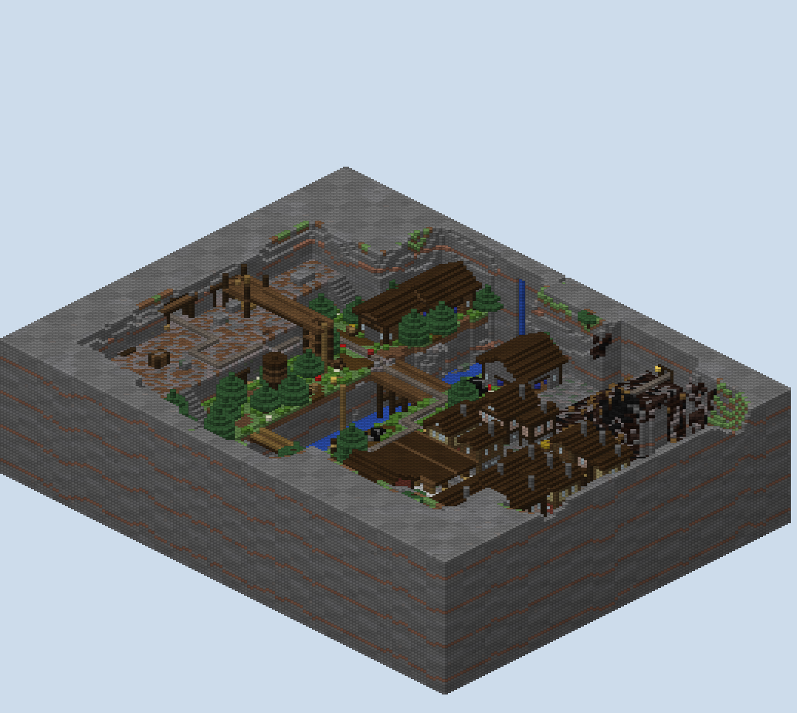
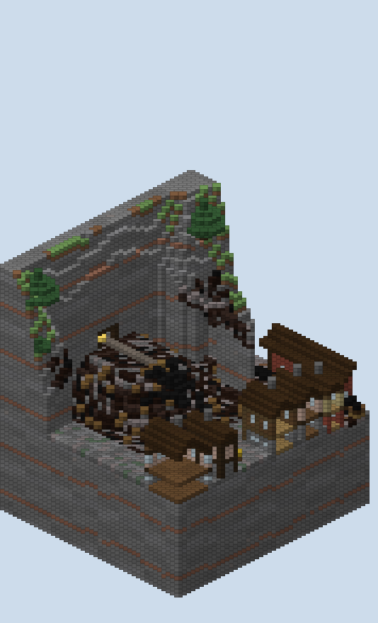
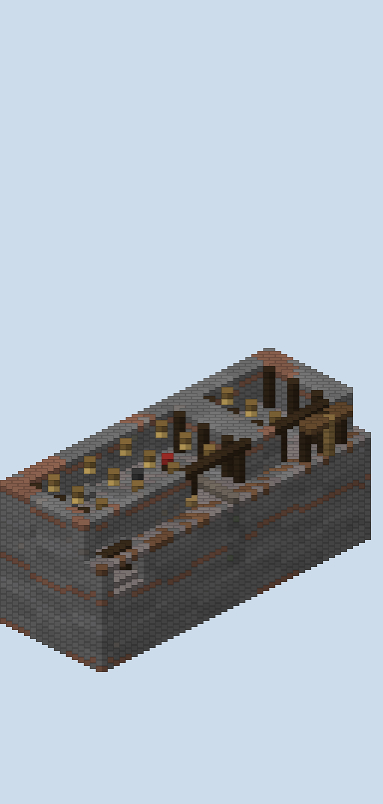

# Copperline — the report

A payload board of the escort kind, built from the approved plan with my own generator. A mining railway runs up
a valley from the rail yard to the mine, and the attackers push an ore cart along it in three legs. Escort and no
building were confirmed in review; the slag heap was to sit in the map rather than float, and the mining was to
show.

## What is in the folder

- `scripts/plan.py`, `plan_check.py`, `sketch.py`: the plan raster, the track's waypoints, the checker and its
  drawing, as reviewed, with the changes below.
- `scripts/track.py`: PGM's payload `Track`, line for line, over a dict of rails.
- `scripts/gen.py`: the generator. `scripts/mapxml.py` writes `map.xml` from the plan and the generator.
- `scripts/walk.py`: the built world read back, the rails traced and the legs walked.
- `scripts/build.sh`: the whole build from nothing, in about fifteen seconds.
- `world/`: the region files, `level.dat` and `map.xml`.
- `renders/`: the plan sketch, the studio's top-down and heightmap, cutaways, isometric views, `plan-check.txt` and
  `walks.txt`.

## The track, read back from the world

**Every rail in the built world was collected and each leg traced from its payload's location, as PGM does.**
Each trace is the leg as planned, rail for rail.

| Leg | Rails | Curves | Sloped | From | To |
|---|---|---|---|---|---|
| A, Main Street | 73 | 2 | 2 | the rail yard, (8, 25, 66) | the station, (−12, 27, 14) |
| B, the Gorge | 65 | 4 | 2 | the station, (−12, 27, 12) | the cutting, (16, 29, −24) |
| C, the Mine Head | 85 | 4 | 8 | the depot, (16, 29, −26) | the mine hall, (−12, 37, −66) |

**Nothing else on the board can join a leg.** There are 54 other rails: the engine shed's road, the adit's old
line and the tramway on the heap. None is within two blocks of a leg, and no rail carries data over 9.

**Each leg ends at a buffer stop.** A timber beam with a red block on it stands on the line past each end and
behind the line's start, so a trace stops there and the next leg's start traces away from it.

## The legs, walked on the blocks

**The built world walks as the plan did, within two blocks.** These are walks on foot over the built blocks, every
drop allowed, with the gates of the finished legs opened in a copy of the world (`renders/walks.txt`).

| Leg | Attackers to the cart / middle / end | Defenders to the cart / middle / end | Plan: attackers / defenders to the end |
|---|---|---|---|
| A | 17 / 47 / 83 | 83 / 55 / 51 | 83 / 51 |
| B | 20 / 52 / 84 | 92 / 60 / 29 | 84 / 29 |
| C | 12 / 45 / 70 | 50 / 40 / 26 | 72 / 26 |

**The ways the plan joined with connectors are built and walkable.**

- The north ladder, up the gorge's cliff: 15 on the blocks.
- The gantry, up its tower, over the shelf and down the headframe: 43.
- The adit, from the shelf's face up into the mine hall's floor: 39.

**The shed holds the attackers until the warm-up ends.** Before its bars are lifted, their cart cannot be reached.

**Nothing any spawn can reach stands on a mountain.** Every rock column next to the valley stands at least four
over the highest ground within eight blocks, and the walk over the built world, every gate open, finds no way up.
The river's cave and the waterfall's slot are both barred or roofed.

## The slag heap and the mining

**The heap is a tip poured out of an old adit in the east mountain, not a mound standing in the town.**

- It is full height, 34, from the mountain's face out to its crest, and falls a block a block westward into the
  town and southward to the office's yard.
- Where its flat foot met the mountain, the mountain was brought down to it along a noisy line. Spoil runs over
  the mountain's foot, so the black ground carries on up the slope.
- At its back the adit's mouth is cut into the cliff, timbered, with a rail line running out of it along the
  crest to a buffer and a tipped tub. The mouth is barred three blocks in.

**The mine shows in five places.**

- **The headframe** stands in the mine yard, sixteen high, with a sheave wheel and a cable down a fenced shaft.
  The gantry from the north bank lands on its platform.
- **The mine hall** is carved into the mountain at the end of the line, timbered every four blocks, with lamps,
  ore in its walls, tubs waiting and ore heaped by the wall. Its portal is framed in timber under a sign.
- **The adit** is a real drift, five wide, with timber sets every four blocks, a lamp in every other cap and an old line. It runs
  under the shelf and the yard and comes up through the hall's floor.
- **The lamp room** is the defenders' last spawn, cut into the mountain beside the hall.
- **The old upper adit** sits behind the heap.

## What changed from the plan

**The heap moved east and turned from a cone into a fan.** It is backed against the mountain at x 50, with its
crest at x 42. The defenders reach its top first: 37 against the attackers' 59, where the cone had it even.

**Two connectors moved to where they were built.** The gantry's foot in the yard is the headframe's ladder,
at (4, −56). The adit starts at the shelf's face, (−16, −36), and comes up in the hall at (−30, −62). Neither
changed a leg's length.

**The river ends in rock at both ends.** In the east it comes in as a waterfall from a roofed slot in the cliff. In
the west it runs out into a low cave, barred.

## The match

**`map.xml` is written by `scripts/mapxml.py`, so its coordinates are the plan's and the generator's.** It
follows Bardo's structure and PGM's parser.

- **Payloads:** three, each at its leg's first rail, `capture-filter` the attackers, `permanent`,
  `capture-time` 60 s, `radius` 3.5. The second and third take `player-filter` on the leg before being done.
- **Spawns:** by `<completed>` filters, in the spawn rooms. Each team is kept out of the other's rooms.
- **Gates:** the shed's door after the 20-second warm-up, the station's door when A is done, the depot's when B is.
- **Rules:** `block="never" use="never"`, a 12-minute clock with the defenders winning when it runs out.

**The map needs `experiments.payload: true` on the server.** Without it PGM refuses `<payloads>` at load.

## What was not done

**The map has not been loaded on a PGM server.** The XML follows the parser's source, and the track follows the
tracer's source, but no match was played on it.

**The minecart's own physics were not modelled.** PGM moves the cart by velocity each tick and teleports it when it
lags. Nothing stands over the line within three blocks of the rails, but whether the cart rides the sloped
rails smoothly was not seen.

## The renders

- `00-plan-sketch.png`: the plan, redrawn with the heap and the connectors as built.
- `01`, `02`: the studio's top-down and height reads of the region files.
- `10`–`14`: cutaways at true scale, drawn by `scripts/cutaway.py`:
  - over the trestle;
  - across the town and the heap to the old adit;
  - along the shelf, with the gantry over it and the adit under it;
  - north into the mine;
  - along the adit.
- `30`–`39`: isometric views:
  - the whole board from two corners, and with the mountains cut away;
  - each leg;
  - the heap;
  - the mine hall and the engine shed cut open;
  - the trestle.

## What I wanted, how hard it was, and what a studio feature would need

| What I wanted | How hard it was | What a studio feature would need |
|---|---|---|
| A track PGM reads as planned | Moderate: the tracer reads only each rail's data and never checks two rails join, so every rail was laid from waypoints and traced with a copy of PGM's own code, before and after the build | A track piece drawn as a line, with the rails laid from it and the payload's trace shown on the plan |
| Legs that end where they should | Easy once understood: a buffer block between legs, nothing else in line | Leg breaks as part of the track piece, the payload at each leg's start written into the XML |
| Ways above, below and around each leg | Moderate: a ladder, a gantry and an adit as connectors in the plan, then built and walked | Connector pieces (ladder, gantry, tunnel) that carry their own cost into the plan's walk |
| A valley nobody walks out of | Moderate: mountains rising from the highest ground near them, then a walk over everything reachable looking for a mountain top; three leaks found and closed | A board edge that is terrain, checked by a reachability read |
| A slag heap that belongs where it is | Moderate: a fan backed against the mountain, its flat foot given to the mountain along a noisy line, spoil poured over the mountain's foot | Terrain pieces that blend into their neighbours rather than stopping at their outline |
| Mining that reads as mining | Moderate: a headframe, a timbered drift, a carved hall, an old adit with its tramway | Prop pieces for a headframe, a drift and a portal |
| Validation of a payload map | Not attempted; the module is an experiment in PGM | Payload in the studio's round-trip: the track traced from the world and checked against the XML |
