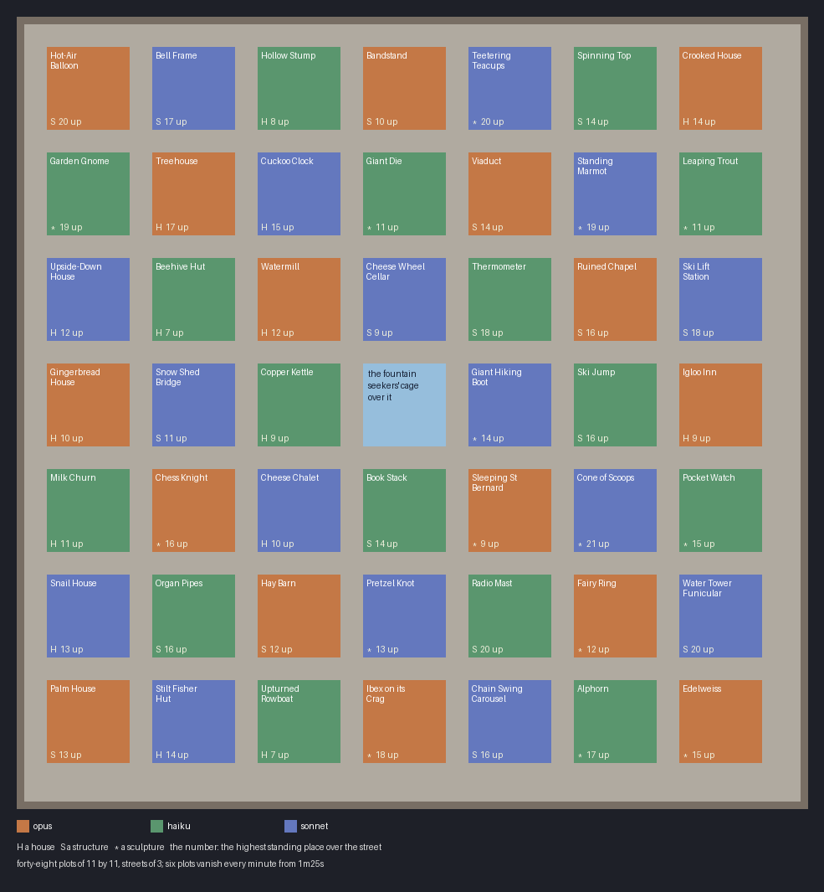

# Curio Square — the plan

A hide-and-seek board, planned and waiting on a review before anything is built. Forty-eight plots stand in a
walled square in an alpine market town, each one curiosity of the town's fair: a house, a structure or a
sculpture. Three builders share them, sixteen each: Opus, Sonnet and Haiku.

## What the hide-and-seek maps do

**The community has three: Hide n' Seek, Hide n' Seek: US States, and a Spanish one.** The first two were read
for this plan.

- **Hide n' Seek:** a grid of eight by eight plots of about eight blocks, each a small building: houses, a stall,
  a well. As the rounds go, plots are cleared one by one.
- **Hide n' Seek: US States:** fifty-six plots of eleven by eleven with three-block streets, a few of them double,
  each a US state built by its own author: the White House, a rocket, a lighthouse. Every minute eight plots
  vanish, filled with air.

**Both play the same match.**

- **Seekers:** a few, blinded for twenty-five seconds in a cage that is then cleared. They wear diamond armour with
  an iron sword and have Speed I.
- **Hiders:** up to fifty, with name tags hidden. They carry a compass that points at the nearest seeker and a
  potion of fifteen seconds' invisibility, with another every other round.
- **The end:** blitz for the hiders, one life each. The hiders win if any is alive at seven minutes or so.
- **The rest:** no fall damage, no hunger, nothing built or broken.

**US States is the closer model.** Its plots are the size wanted here, each by a different hand, and plots vanish
on a clock, so the board shrinks as the match goes on.

## The board

**Seven by seven plots of eleven by eleven, with three-block streets between them.** The middle plot is the
fountain, with the seekers' cage over it. That leaves forty-eight plots, ninety-five blocks across in all, inside
a four-block street round the edge and a wall.

**Each builder has sixteen plots, set so that no two plots side by side are by the same hand.** Builder places
follow a diagonal pattern, and each builder's plots are shuffled over them with a fixed seed, so houses,
structures and sculptures mix across the square.

| Builder | Houses | Structures | Sculptures |
|---|---|---|---|
| Opus | 5 | 6 | 5 |
| Sonnet | 5 | 6 | 5 |
| Haiku | 5 | 6 | 5 |

**The forty-eight subjects are in each builder's `plots/<builder>/IDEAS.md`.** Each row gives the subject, the way
up, where a hider hides and how high. The three lists were drawn up apart and then cleared of clashes: Sonnet's
list came first, and Opus and Haiku replaced every subject that was too close to one already taken.

**The square is paved and walled, with the market town round it.** The wall is high enough that nobody climbs
out. Beyond it are roofs, a church spire and the snow peaks, all out of reach.

## How the plots are built

**`PLOTS.md` is the whole contract, and every builder works to it.** A plot is one Python module with a name, a
kind and a `build(c)` that draws into an eleven-by-eleven canvas up to twenty-three blocks tall. The canvas
refuses anything outside the box.

**`scripts/plotkit.py` is the check every plot must pass.** It builds the plot alone and walks every place a
player can stand from the street round it. A plot fails on any of these:

- the highest standing place is less than six blocks over the street, so there is nothing to climb;
- fewer than twelve standing places are out of sight from the street, so there is nowhere to hide;
- a forbidden block: lava, fire, TNT, cobwebs, doors, flowing water;
- sand or gravel over air, or a torch or ladder hanging on nothing.

**Each builder builds and checks their own sixteen.** Sonnet and Haiku each get the brief, the kit and their list.
A plot goes in the square once it passes and its two pictures read from the street. I assemble the square,
render it, read it back and write the report, and I do not edit another builder's plot. A failing plot goes back
to its builder.

## The match

| Setting | Value |
|---|---|
| teams | hiders, up to 50, name tags hidden; seekers, up to 6 |
| seekers | diamond armour, iron sword, Speed I; blinded in the cage over the fountain for 25 s |
| hiders | a compass to the nearest seeker; a 15 s invisibility potion, another every other round and for a kill |
| the square | every minute from 1m25s, six plots chosen at random vanish to the grass |
| the end | blitz for the hiders, one life; the hiders win if any is alive at 7 minutes |
| the rest | no fall damage, no hunger, nothing built or broken |

**Thirty-six of the forty-eight plots are gone by the last minute.** Twelve plots and the streets are left for the
last hiders, and anyone on a plot as it goes drops into the open.

## What I would like a ruling on

- **The theme:** an alpine town's fair of curiosities. Any subject fits, which is what lets three builders work
  apart.
- **The forty-eight subjects** on the sketch.
- **Six plots vanishing a minute**, as US States does with eight of its fifty-six.
