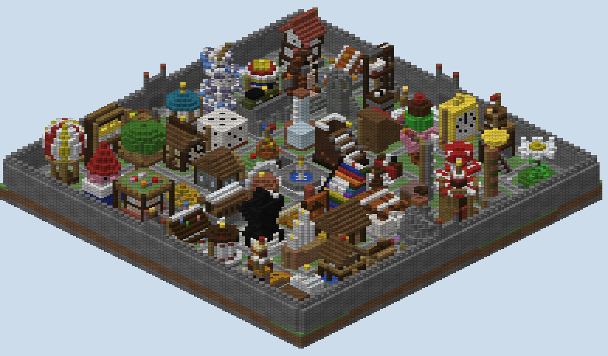
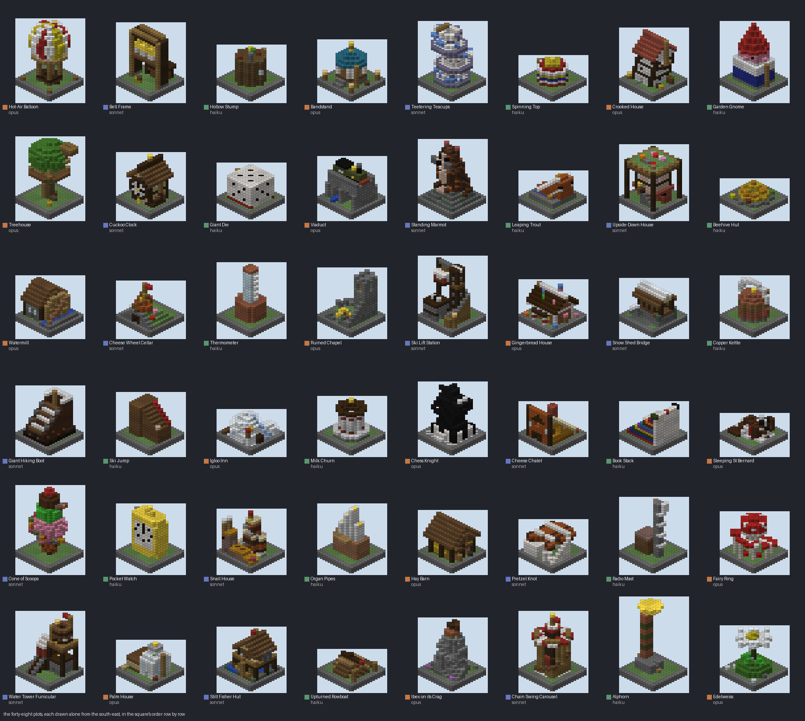
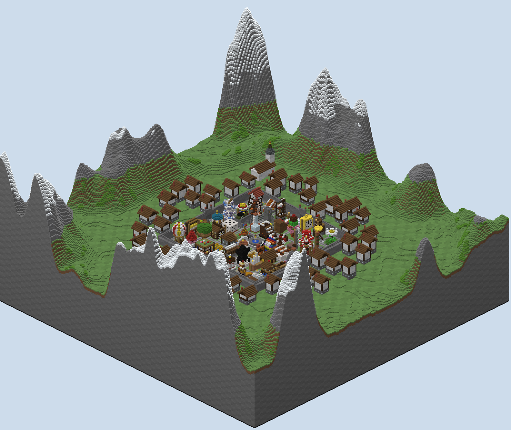

# Curio Square — the report

A hide-and-seek board built from the approved plan by three builders. Forty-eight plots stand in a walled square in
an alpine market town, each one curiosity of the town's fair. Sixteen are by Opus, sixteen by Sonnet and sixteen by
Haiku, each plot a Python module drawn into its own box. Every minute six of them vanish.

## What is in the folder

- `PLAN.md` and `PLOTS.md`: the plan as reviewed, and the brief all three builders worked to.
- `plots/opus/`, `plots/sonnet/`, `plots/haiku/`: the forty-eight plots, one module each, with each builder's
  `IDEAS.md`. `plots/_example.py` is the example in the brief.
- `scripts/plotkit.py`: the canvas every plot draws into and the check every plot passed alone.
- `scripts/plan.py`, `sketch.py`: the grid, who builds where, and the sketch.
- `scripts/gen.py`: the square, the plots in their places, the fountain and cage, the wall, the town and the
  mountains. `scripts/mapxml.py` writes `map.xml`.
- `scripts/walk.py`: the built world read back. `scripts/build.sh` runs the whole build in about half a minute.
- `world/`: the region files, `level.dat` and `map.xml`.
- `renders/`: the plan sketch, the studio's top-down and heightmap, the valley, the square from two corners, the
  fountain, a sheet of all forty-eight plots, and `walks.txt`.

## How three builders shared one board

**One brief, one canvas, one check.** `PLOTS.md` states the game, the theme and the contract. A plot is a module
with a name, a kind and a `build(c)` that draws into an eleven-by-eleven box up to twenty-three blocks high. The
canvas refuses a block outside the box, so no plot can touch a street or a neighbour.

**`scripts/plotkit.py` builds a plot alone and walks it from the street round it.** A plot passes only when its
highest standing place is six or more over the street and twelve or more standing places are out of sight from
every eye on the street. It also fails a plot for a forbidden block, a door, sand over air or a ladder on nothing.

**The plan was drawn up apart, then cleared of clashes.** Each builder proposed sixteen subjects without seeing the
others. Sonnet's list came first; it overlapped Opus's in eight subjects and Haiku's in six, and those two replaced
every clash. Then each builder built and checked its own sixteen. Nobody edited another builder's plot.

**The check changed once, mid-build.** It first counted glass, panes, iron bars and fences as hiding a player. A
seeker sees through all of those, so they became see-through, and both other builders were told and re-checked.

**Every builder found the same thing: a hiding place is a room whose way in does not look into it.** A door at
street level let some eye on the street see nearly every place inside. The plots that pass have rooms entered from
above, through a trap or a hole on top, or by a passage that turns.

## The three builders' plots

| Builder | Plots | Places to stand, on average | Highest, on average | Out of sight, on average | Fewest out of sight |
|---|---|---|---|---|---|
| Opus | 16 | 177 | 11.3 | 28.5 | 12 |
| Sonnet | 16 | 190 | 13.5 | 34.5 | 12 |
| Haiku | 16 | 138 | 10.4 | 23.8 | 12 |

**Every plot's line is in `renders/walks.txt`.** The tallest climb is the Teetering Teacups', twenty-two blocks; the
most places out of sight are the Upside-Down House's, 123.

**Sonnet's builder named its weakest plot itself.** The Pretzel Knot lies flat on salt-crystal huts, because
standing up it read as a thin slab, and from the street its knot is hard to read. The Cone of Scoops has a hollow
scoop nobody can get into. Four of its plots top out lower than its plan said, all over the minimum.

**Haiku's builder reviewed its own pictures and flagged what did not read.** It rebuilt the gnome, the die, the
alphorn, the trout, the thermometer, the pocket watch and the book stack until they did. It named the Spinning Top
as the one it could not make read as a top, because a point underneath could not be made climbable.

## What was built round the plots

**The square is paved in mixed stone with a kerb round every plot.** In the middle is a fountain: a round basin, a
quartz column and a gilded finial. The seekers' glass cage hangs fourteen blocks over it.

**A town wall eight high, with four gates shut by portcullises, rings the square.** Outside it, chalets in three
rings follow the roads out of the gates, and a church with a copper onion spire stands to the north-east. The
valley's meadows rise into snow mountains on every side.

## Read back from the blocks

**Every check passes on the built world** (`renders/walks.txt`).

- **The plots:** every plot passes the kit alone, and stands in the square block for block as it did alone.
- **The streets:** no street block has anything over it.
- **The walk:** from the hiders' spawn, every plot's highest place is reached in the square as it was alone.
- **The vanishing:** nothing a plot set lies above the region `map.xml` fills with air.
- **The spawns and the cage:** the hiders' spawn is clear street; the cage is glass all round and empty inside.

## The match

**`map.xml` is written by `scripts/mapxml.py`, after Hide n' Seek and Hide n' Seek: US States.**

- **Seekers:** up to six, blinded in the cage for twenty-five seconds. Then the cage is filled with air and they
  drop to the fountain in diamond armour with an iron sword and Speed I.
- **Hiders:** up to fifty, name tags hidden, spawning on the streets round the fountain. They carry a compass to
  the nearest seeker and a fifteen-second invisibility potion, with another in rounds one, three and five.
- **The vanishing:** at the start one of four shuffled orders is drawn at random. From 1m25s, every minute six
  plots in that order are filled with air down to their grass, and each is named in chat.
- **The end:** blitz for the hiders, one life. The hiders win if any is alive at seven minutes.
- **The rest:** no fall damage, no hunger, nothing built or broken by players. The area outside the walls cannot
  be entered, so no jump off a tall plot clears the wall.

## What was not done

**The map has not been loaded on a PGM server or played.** The fill actions, the random order and the enter rule
follow PGM's parser and the US States map, but the vanishing wants a real match to confirm.

**The plots are checked against a seeker standing on the street, not one climbing.** A seeker who climbs a
neighbour's roof sees more, so the out-of-sight counts are an upper bound.

**The Spinning Top, the Pocket Watch and the Pretzel Knot read as their subjects only with effort.** Their builder said so; the rule
that a plot belongs to its builder kept them as they are.

## What I wanted, how hard it was, and what a studio feature would need

| What I wanted | How hard it was | What a studio feature would need |
|---|---|---|
| Three builders on one board without stepping on each other | Easy once the contract was a canvas that refuses anything outside its box | A plot piece: a bounded canvas handed to a contributor, placed by the board |
| A measurable "place to hide" | Moderate: the first measure counted glass as cover; it had to learn what a seeker sees through | A sight read from a ring of eyes, with see-through materials |
| Rooms that hide | Hard for every builder: straight doors, thin round walls and diagonal gaps leak; drop-in rooms and turned passages work | A hiding-room check per plot that names the line of sight in |
| Plots that vanish on a clock | Moderate: four shuffled orders, one drawn at random, each a set of fills | A timed region-clear in the studio's map.xml, with a random order |
| Builders reviewing their own work | Haiku did it of its own accord and said which plots still did not read | A per-plot render sheet in the studio's read-back |

## After the playtest

**The outside terrain is 22% narrower on each side.** The generated world ran from -180 to 179 on both axes and now runs from -140 to 139, and the mountains rise over 37 blocks from a radius of 105, where they rose over 55. The walled square, the 48 plots, the market town round it and the church are untouched, since the town's rings stop at 90 blocks.

**The map.xml needed no change.** The `outside` region that keeps players in is the square's own box, from -51 to 52, not the world's extent, so it is the same before and after. The checker reads the map valid with no issues.

**Everything read back is the same.** All 48 plots are placed and pass the kit alone and identical in the square, the streets are clear, every plot's highest place is reached from the hiders' spawn, no plot has anything above its region, and the cage is glass all round and empty inside.
