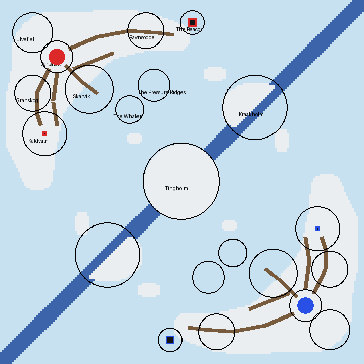

# Frostholm — the plan

Written before any terrain existed. The sections after *As first drawn* record how the plan changed and why.

## The board in one sentence

**A frozen archipelago played corner to corner: each team's home island is a rocky crescent round a bay
of sea ice, its core burning in the lantern of a lighthouse off one horn and its monument on an islet in a
frozen lake on the other, and the teams meet across a lead of open water where three islands stand astride
it.**

What a player remembers: the lighthouse, the ship frozen in the bay, the lake held high with its waterfall
frozen mid-fall.

## Mode: one core and one monument a team

**A combined board, because the crescent has two horns.** The core goes in the lighthouse on the north-east
horn and the monument on the lake islet in the south-west horn: an east and a west, 40° and more off the
line to the enemy. Defending both splits a team across its own bay. The combined board is the ordinary one
in the corpus (`approaches.md`) and neither earlier freeform board tried it.

**The core is in a lantern, and its leak is designed.** It sits in the lighthouse's lantern room on a stone
floor ringed by a gallery. A breach spills lava onto the gallery, which drains through gaps in its parapet
down the tower's face, and that fall is the leak.

## Arrangement

- **Not a floating island.** The islands stand in a frozen sea over a seabed. The board's edge is a frame
  of pack ice heaved up from the seabed, so the world reads as a sea, not a slab in the sky.
- **Corner to corner, by a half-turn.** Red holds the north-west, blue the south-east, and blue's half is
  red's turned 180°. The halves meet along the diagonal `x + z = −1`.
- **The lead.** A strip of open water about ten blocks wide runs along the diagonal: the seam between the
  teams. It is crossed on three islands that stand astride it — Tingholm at the centre and Kraakholm twice,
  at the north-east and south-west — or by bridging and swimming anywhere else.
- **Sea ice everywhere else.** It is walkable and breakable, and pressure ridges heaved up across it are
  the only cover on the open ice. The water around each horn's tip stays open, so the core and the
  monument are both reached across water or by their one land approach.
- **Heights:** sea ice at 47, island shores at 48–50, Jarlshall at 64, the crags to about 80, Kaldvatn held
  at 57, the lantern's core at 82.

## The places (red half; blue's are their half-turn)

| Place | Where (x, z) | What it is | Why a player goes there | How |
|---|---|---|---|---|
| Jarlshall | −62, −62 | Spawn: a long hall of dark timber on a stone plinth, crags at its back | spawn | its two doors |
| Ulvefjell | −74, −74 | the crags in the corner, snow on their ledges | frames the spawn; lookout | a goat path |
| Ravnsodde | −18, −75 | the north-east horn: a rock ridge out to the Beacon | the way to the core | Ridge Path |
| **The Beacon** | 5, −79 | lighthouse on a sea stack; the core in its lantern | **red core** | its stair; the footbridge; a sea cave in the stack |
| Kaldvatn | −68, −24 | frozen lake high in the south-west horn, a frozen fall from its lip | **red monument** on the islet Holmstein | lake ice; the wood; the crag |
| Granskog | −74, −44 | pine and spruce between the hall and the lake | cover to the monument | Lake Path |
| Skarvik | −46, −46 | fishing village on the bay: boathouses, racks, stave church, smithy, longhouses | cover from the bay to the hall | Shore Road, the pier |
| The Whaler | −26, −36 | a three-master frozen into the bay ice | cover and height on the open bay | over the ice |
| Tingholm | 0, 0 | the centre island: standing stones, a cairn | the middle crossing of the lead | over the ice |
| Kraakholm | 36, −37 | rocky island astride the lead: ruined watchtower one side, sealers' hut the other | the crossing between red's core and blue's monument | over the ice, across the lead |
| Pressure ridges | across the ice | heaved ice | the only cover on the open ice | — |

## Navigation

- **The board is a ring.** Red's core horn faces Kraakholm, and Kraakholm faces blue's monument horn. Red's
  monument horn faces the south-west Kraakholm, which faces blue's core horn. The two bays face each other
  across Tingholm. Every fight at a flank island is one team's core against the other's monument.
- **Spawn to own objectives:** about 68 to the core, 40 to the monument.
- **Approaches to the Beacon:** along the ridge and over the footbridge (*through*); bridging from the
  ridge's high point onto the gallery (*above*); across the open water into the sea cave and up inside the
  stack (*below*); around by the ice to the stack's seaward side.
- **Approaches to Holmstein:** across the lake ice, exposed (and the ice can be broken under you); through
  Granskog to the north shore; down from the crag over the frozen fall.

## Palette, decided now

- **Biome:** Cold Taiga on land and Frozen Ocean on the sea, both tinting grass `#80b497`, so grass and snow
  agree.
- **Ground:** snow on the flats over grass and dirt; stone and andesite with cobblestone where it is steep;
  gravel scree under the crags.
- **Ice:** sea ice of ice blocks; pressure ridges and the frame of packed ice; the frozen fall of packed ice.
- **Built:** dark oak and spruce timber on cobblestone plinths, roofs of dark oak under snow; the Beacon in
  stone brick, whitewashed with diorite courses.
- **Trees:** pine and spruce, cut from rockymine's tree showcase.

## As first drawn

The table and sketch above are the plan as written before building.
