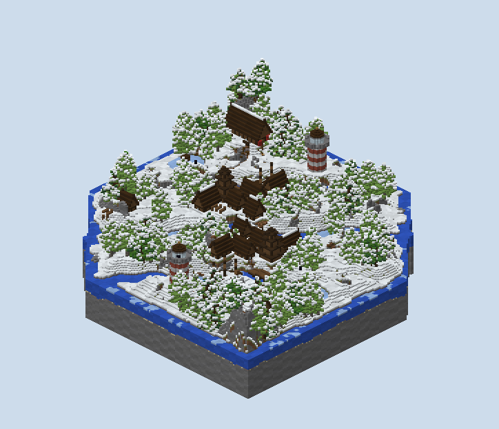
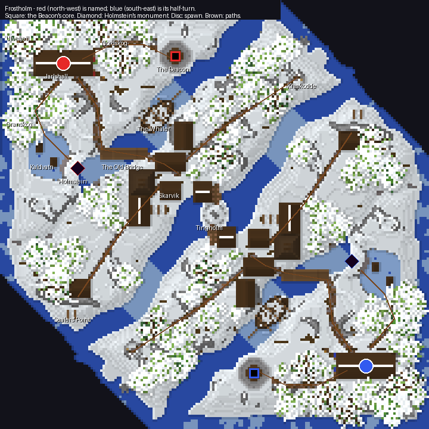

# Frostholm — report

**A winter coast played corner to corner.** It has four snow-covered islands cut apart by narrow straits
that freeze in stretches, all inside a band along the diagonal with the sea round the outside. Each team
spawns in a timber hall under sea crags. Their core burns in the lantern of a lighthouse on the headland, and
their monument stands on a rock knoll by a frozen lake. The teams meet over the middle island's fishing
village and the rock islet in the lead between them.

It is a combined board: one core and one monument a team (`<gamemode>dtm</gamemode><gamemode>dtc</gamemode>`).
It is 180 × 180 blocks with the corners off the diagonal cut away. Blue's half is red's turned half a circle
about the centre, `(x, z) → (−1 − x, −1 − z)`.

## What was built, and why

**The second version is land first, because the first was a frozen sea the author rejected.** Version one
was two crescents round bays of sea ice. The author judged it too much ice and not enough land, with the
monument on a cylindrical island, and wanted a board "set in the winter, not in Antarctica". `PLAN.md` keeps
both plans and says what moved; the first version's scripts are kept beside the second's.

**The ground is rolling snowfields, outcrops and crags, painted by angle.** Snow lies on grass and dirt
wherever the ground is under 36°, deeper in drifts, with podzol where the wind scoured it bare. Rock shows
where it is steeper: stone, andesite and cobblestone, with snow on the ledges. Gravel and stones line the
shores, and the crag tops above y 74 are snow blocks. A ledge rule keeps a terrace from reading as a cliff:
a cell with three level neighbours caps its angle.

**The water is narrow and mostly not frozen.** Ravnsund separates each home island from its middle island
and dies out inland as a fjord, so the two are joined at one end. Midsund, the lead between the teams, opens
into a pool round Tingholm at the centre. Each strait is frozen in two stretches and open between them. The
sea round the outside is open water with floes along the shore.

**The woods are what give the snow its colour.** There are 79 trees on each half: pine, spruce and small
spruce cut from rockymine's tree showcase, with snow caught on the crowns. Granskog runs from the hall to the
lake and Nordskog towards the Beacon, with copses across the middle island and a stand behind the hall.

## A tour (red's side; blue's is at `(−1 − x, −1 − z)`)

**Jarlshall (−64, −64) is the spawn.** It is a 23-block dark-timber longhouse on a stone plinth, with doors
at both ends and red banners at the east door. Ulvefjell's sea crags rise behind it, and woodpiles and a sled
stand in the yard.

**The Beacon (−17, −67) holds the core.** It is a lighthouse striped in brick and white diorite, twenty
blocks to its gallery. A spiral stair runs round an open well in the middle; every step is a plain step a
player walks up, turning on a landing at each corner. The core is obsidian round lava inside the glass
lantern at y 75–77, and it stands over the well's mouth. A breach leaks lava down the tower's whole height.

**Holmstein (−58, −20) holds the monument.** It is a rock knoll on Kaldvatn's shore with a flat crown, and
the two obsidian blocks stand three above it. Standing stones ring its foot 7½ blocks out, and trees keep 14
blocks off. It is reached across the lake ice past two ice-fishing huts, out of Granskog, or off the road.

**Ravnsund is crossed by the Old Bridge, the ice and the whaler.** The bridge is a timber trestle over the
strait's open water, a little arched, with bents into the bed. The whaler is a three-master on the
diagonal, frozen into the ice with a list, its sails furled on the yards. Its gangplank comes down on the
home side, and a chest sits in the stern cabin.

**Skarvik (−16, −14) is the fishing village on the middle island.** It has a tiered stave church, longhouses,
a smithy, a boathouse out over Midsund and drying racks. Every building asked for a spot near where the
village wanted it and took the nearest level one clear of everything else. A landing stage of planks on
piles runs from the shore onto Tingholm.

**Tingholm (0, 0) is the only ground both teams share.** It is a rock islet in the pool at the centre of
Midsund, with a ring of standing stones and a cairn. Each team's landing stage reaches it from its own
village.

**Kraakodde and Sealers' Point are the middle island's two ends.** A ruined watchtower stands on the
north-east point and a sealers' hut with its racks on the south-west. Each faces the other team's middle
island near one of Midsund's frozen stretches, the dry crossings towards the ends of the lead.

## How a match is meant to flow

**Both objectives are off the line between the spawns, one each side of it.** The core is due east of the
spawn and the monument due south, each 45° off the diagonal to the enemy. Defending both splits a team
across its own home island, with Granskog between the hall and the monument and Nordskog between the hall
and the Beacon.

**The middle is crossed in three places, and the flanks pair the objectives.** Tingholm at the centre is
the short way. The north-east crossing at Kraakodde leads onto the enemy's monument side, and the south-west
one at Sealers' Point onto their Beacon side. A team pushing one flank therefore threatens one objective,
and the defence knows which.

### The walks, measured

`scripts/walk.py` walks the built world from each spawn with no blocks placed. A step climbs one block,
drops at most three, opens doors and climbs ladders. It is run once with swimming allowed and once without.

| From red's spawn | Swimming | Dry |
|---|---|---|
| Own core (the lantern) | 69 | 69 |
| Own monument | 53 | 53 |
| The Old Bridge | 52 | 55 |
| The whaler's deck | 49 | 49 |
| Skarvik | 86 | 86 |
| Tingholm | 118 | 118 |
| Kraakodde | 107 | 120 |
| Sealers' Point | 117 | 119 |
| Enemy monument | 214 | 214 |
| Enemy core | 235 | 235 |

**Blue's walks are the same to the block, because the half-turn is exact.** The dry column matters most: the
board can be played across without a bucket or a bridge of your own. That is because the bridge, the frozen
stretches and the landing stages join every landmass.

## What changed while building, and the placement audit

**`scripts/audit.py` checks every placement.** It looks for a floor with air under it, a building standing
in the water, two claims on the same ground, ground that rises more than six blocks under a footprint, and
a tree in the water. Its last run reads `no placement problems found` (`renders/audit.txt`). On the way it
found:

- **The whaler overlapped both the Beacon and the Old Bridge.** It was first claimed as one bounding box
  of a diagonal hull, which covers a square of empty ice. It now claims small boxes along its keel. It was
  shortened from 22 to 18, and the bridge moved twelve blocks south-west along the strait.
- **The village's houses overlapped the church, the whaler and each other.** Each now asks `free_spot` for
  the nearest level footprint clear of every earlier claim.
- **The watchtower and the sealers' hut stood across the new shore's fall.** Both now take the nearest
  level ground by the same search.

**The walk found two places a player could not reach.** The Beacon's stair stepped diagonally round the
ring, and its last step came up under a pane of the lantern glass. The stair now walks the ring's cells with
a landing at each corner, and the panes over the hatch are open. Tingholm stood three to five blocks out of
the water on every side, with no way up, so the landing stages were built.

**The section through the Beacon showed its east wall hanging over the strait.** That fault is the one a
picture catches and a top-down does not. The tower moved three blocks inland, and the strait now gives way
round a headland of rock under it.

## What I am proud of

- **It reads as a winter landscape, not an ice field.** Snow on grass, woods with snow on their crowns, rock
  where it is steep, and water you can see, mostly open.
- **The islands are islands.** A sea runs round the outside of a diagonal board, so the edge is a shore
  and not a cut through stone.
- **The Beacon's leak is designed.** The core is over the well, so a breach pours the tower's height, and
  the stair is the only way up inside it.

## What I would do next

- **The whaler should sit lower.** Its keel is three below the water, so it reads as moored more than frozen
  in, and the ice heaved against the hull is thin.
- **The crags behind the hall want a goat path** to make them a lookout and not just a wall.
- **The middle island's long road is open ground.** A few more boulders or a second copse along it would
  give the push from Skarvik to the flanks some cover.
- **It has not been played.** The walks are measured; the fights are not.

## What I wanted to build, how hard it was, and what a studio feature would need

| What I wanted | How hard | What a studio feature would need |
|---|---|---|
| Land cut by narrow straits, frozen in stretches | Easy once the strait was a distance field `across(u)` with a wander odd in `u` | A **water body along a polyline** with a width profile and "frozen between u₀ and u₁" stretches; the studio's water is by height band, not by course |
| A diagonal board with the off-diagonal corners cut away | Easy: a band mask with a noisy edge, made symmetric | A **board outline** that is not a rectangle, honoured by every stage, not only by painting void |
| Sea round the outside so the islands read as islands | Easy, one distance-to-edge field | A **"coast to the edge"** option: land falls to a shore before the board's boundary |
| Snow on the ground, rock on the steep | Easy with the slope paint I wrote for Hollow Mesa | The studio's `slope` band axis does this; it needs a **snow-layer cover** material that lies over a ground block rather than replacing it |
| Snow caught on tree crowns | Easy: a layer on every leaf block that sees the sky | A **"weather" pass** after dressing: snow layers on exposed tops, icicles under eaves |
| A lighthouse with a spiral stair a player can walk | Medium: the first stair stepped diagonally and its hatch came up under glass | A **stair primitive** that guarantees four-connected steps and headroom, checked by `walk` |
| A core whose leak falls the tower's height | Easy here; it is the tower's well | A **core placement** that reads the leak path and reports the fall before the build |
| A ship frozen into the ice on the diagonal | Medium: rasterising a hull on a 45° axis, and claiming it without a bounding box covering half the strait | **Rotated footprints** for structures, and a claim system that takes polygons |
| Village buildings that never overlap | Easy once every builder asked `free_spot` | The studio's **placement with clearance** already does this; it wants an "as near as possible to here" mode |
| Rejected first version, rebuilt in an evening | Cheap: the volume generates in under a second and writes in about ten | Fast **whole-board rebuilds** are what made the rewrite affordable; the studio's per-stage rebuild should stay fast |

## Notes on the deliverable

- `scripts/build.sh` regenerates everything: the audit, the volume, the region files via `write_world.cs`, the
  renders, the annotated top-down and the walks.
- Generation is about a second, and writing the region files about ten.
- `world/` holds the region files, `level.dat` and `map.xml`.
- `scripts/plan_v1_frozen_sea.py` and `scripts/terrain_v1_frozen_sea.py` are the rejected first version, kept
  as the brief asked. `scripts/sketch.py` draws the first plan's sketch.
- The writer writes no entities and lights everything fully, so there are no item frames, armour stands or
  boats; the boats the plan drew up on Sealers' Point were not built.
- Not checked in game.
