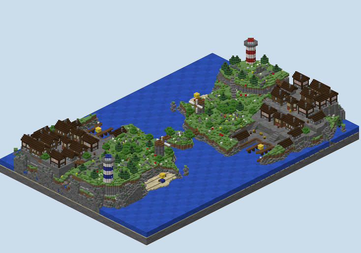

# Gullhaven DTM — what was built

A destroy-the-monument board made from the free-for-all island without redrawing it. Two copies of Gullhaven
face each other across a strait, the second turned half a circle about the Skerry, which becomes the islet
between them. Each team spawns in its own town and defends two monuments, each a cube of gold three on a side
with bedrock at its heart. One floats over the water between its harbour's piers, one over a pad on its beach.

## How it was made

**Nothing in the island was drawn again.** `scripts/compose.py` imports the free-for-all island's generator
from `../opus55-freeform-gullhaven/scripts`, builds it, and adds the monuments and the spawn square. It then
copies the whole volume, turns it half a circle with every stair, door and ladder turned with it, and lays both
into one board with the sea round them. A change to the island changes both halves of this board on the next
build.

**The turn is about the Skerry.** `(x, z) → (−38 − x, 115 − z)` puts the islet on itself, so its two bridges, the
first island's and the copy's, both land on it. The two islands' south shores face each other about thirty
blocks apart across the strait.

**The island underneath is the free-for-all's, fixes included.** Its town now stands on a sea wall with whole
rock under it, where a first build had cut the cliff away beneath the edge houses; both islands here carry it.

**Red holds the first island and blue the turned one.** The copy's red wool is made blue, so blue's lighthouse
is banded blue and white and its beach monument's plinth is ringed in blue.

## The monuments

| Monument | Where | What a player does |
|---|---|---|
| **the Harbour** | a cube of gold three on a side, bedrock at its centre, floating over the basin between the two piers with three blocks of air under it and two of water either side | builds out from a pier to it, or up from the water under it, and breaks the 26 gold round the bedrock |
| **the Beach** | the same cube floating three blocks over a pad of mossy cobble on the Cove's sand, the pad ringed in the team's wool | comes down the Cove's path or along the sand, in sight of the Downs' edge, and pillars up from the pad |

**Each monument is forward of its team's spawn,** in front of the town on its own island, so the defence holds
ground between the spawn and the monument. The harbour's sits under the town's terraces; the beach's is the far
side of the Downs.

## What the built board measures

`renders/walks.txt` walks the built board from each spawn, on foot, with no blocks placed, to the place under
each monument: the water at the harbour, the pad on the beach.

| From a team's spawn | Red | Blue |
|---|---|---|
| its own harbour monument | 72 | 72 |
| its own beach monument | 106 | 106 |
| the Skerry | 125 | 127 |
| the other team's beach monument | 157 | 157 |
| the other team's harbour monument | 206 | 206 |

**The two teams are even.** The Skerry is two blocks longer for blue because the merged islet is not exactly
symmetric about the turn; every objective is the same walk for both.

**On foot the only way across is the Skerry,** by one bridge onto it and the other off it. The strait is about
thirty blocks of sea, and in a destroy-the-monument match players will bridge it, so the walks above are the
long way round, not the way the match will go.

## What `map.xml` says

- **Teams:** red and blue, sixteen each.
- **The kit:**
  - an iron sword, a bow, an iron pickaxe and an iron axe;
  - a stack of wood, two golden apples, food and a water bucket;
  - 32 arrows;
  - armour, the helmet and boots in the team's colour.
- **The objective:** four destroyables, two each, every one a cuboid round its cube with `materials="gold
  block"` and `completion="100%"`: all 26 gold blocks, the bedrock at the centre left standing. A team wins
  by breaking both of the other's.
- **Building:** open everywhere except the spawn squares and above y 56. The enemy may not enter a spawn.
- **Fall damage on,** as usual for the mode.

## The renders

- `01`, `02`: the studio's top-down and height reads.
- `10`: a section down the strait through the Skerry.
- `30`, `31`: the board from two corners.
- `32`, `33`: red's harbour and beach monuments.
- `34`: the Skerry between the islands.
- `35`: blue's island.

## What I wanted, how hard it was, and what a studio feature would need

| What I wanted | How hard it was | What a studio feature would need |
|---|---|---|
| A second gamemode from a finished board | Easy: build the island, add the objectives, copy and turn it, merge at the islet | A board as a piece: placed twice, turned, and joined to itself at a chosen piece |
| The turned copy to read as the other team's | Easy: the copy's red wool made blue | A team-colour slot that a turn swaps |
| Facing blocks right after the turn | Easy with a turn table for stairs, doors, ladders and the rest, reused from an earlier board | The same table in the studio's own turn |
| A monument that floats, a cube with a bedrock heart | Easy: the cube, three blocks of air cleared under it, the destroyable's region round it, the gold its material | A monument piece with a float height and a core block |
| Monuments forward of each spawn, the same walk for both | Easy to place; the walk shows them even | Objective placement read against both spawns on the plan |
| Validation of the variant | Not attempted here; the XML follows PGM's destroyable module | DTM in the studio's round-trip, with the monuments read back against the world |
