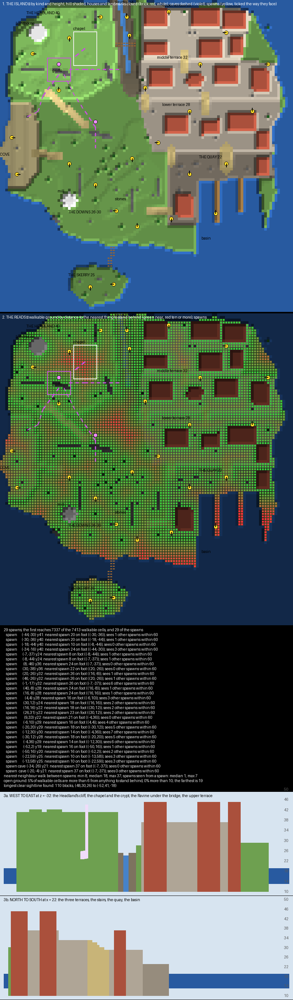

# Gullhaven — the plan

A free-for-all board, planned, reviewed and built. It is a fishing island with no symmetry at all: a headland
with a lighthouse, a ravine, a terraced town of closed houses, a harbour, rolling downs, a beach cove, sea caves
under the headland, and an islet off the south shore. Everyone is against everyone, and one hit kills.

## What already exists, and what I took from it

**Rage is one element in PGM, `<rage/>`.** `RageMatchModule` sets the damage to 1000 for a hit from a sword
with sharpness or an arrow from a bow with power. So a rage kit is any sharpness sword and any power bow, and
both kill in one hit.

**The arrow economy is the kit and the kill reward.** Rage Quit FFA gives one arrow at spawn and one per kill,
and removes arrows on death. A player who misses is down to the sword until they kill with it. PublicMaps' One
in the Quiver include does the same with a weaker sword.

**Spawns are a long list of points with `spread="true"`.** PGM puts a respawning player at the point farthest
from the other players, and `safe="true"` skips a point that is unsafe to stand on. Kryta Rage lists about 180
points over its map; Rage Quit lists seventeen.

**Rage Quit FFA is the scale reference.** It is read from its region files (`renders/ref-rage-quit-ffa-
topdown.png`): about 100 × 100 blocks of grassland cut by a river, with tents and huts, and a timer of five
minutes. Gullhaven is the same size for up to sixteen players.

## The island

| Place | Height | What it is, and what it is for |
|---|---|---|
| **The Headland** | 40 | a grass plateau in the north-west with cliffs on three sides, the lighthouse, a ruined chapel and a dry-stone wall across it. The high ground: it sees far, and is seen from far |
| **The Ravine** | 23 to 24 | a cleft seven wide between the Headland and the town, a stream down its floor, rising at its south end to the Downs. A sheltered lane, crossed overhead by a bridge |
| **The Town** | 36, 32, 28 | three terraces on the north-east, fourteen closed houses in rows with streets and a lane between, stairs between the terraces. Short sightlines and corners |
| **The Harbour** | 22 | a quay round a basin open to the sea, two piers, a fish shed and a net loft, crates, two boats |
| **The Downs** | 26 to 30 | rolling grass on the south-west, hedgerows with gaps, a copse, a ring of standing stones, the mill. The open ground, broken up |
| **The Cove** | 19 to 21 | a beach on the west under the Downs' edge, with driftwood and the sea cave's mouth |
| **The Skerry** | 24 to 26 | a rocky islet off the Downs' south shore, reached by a bridge over the sea. Two spawns, rocks and two spruces |
| **The Caves** | 21 | a grotto under the Headland and four ways into it: the sea cave from the Cove, a sinkhole on the Downs, a door from the Ravine's floor, and a ladder down from the chapel's crypt |

**Nothing is enterable.** Every house, the lighthouse and the mill are closed, with doors that do not open. The
chapel is a ruin, walls two high round an open floor, and so is cover rather than a room.

**Every way between two heights is a ramp or a stair, and every drop is free.** Fall damage is off in the
mode, so a cliff is a way down and never a way up. The ways up are the Headland's path, a stair between each
pair of terraces, the quay road and the quay's steps, the Cove's path and the Downs' path down to the quay.

## The reads

`scripts/plan_check.py` walks the plan and reads it the way a free-for-all is played
(`renders/plan-check.txt`):

| What | Measured |
|---|---|
| spawns | 29: four on the Headland, two in the Ravine, eight in the Town, four in the Harbour, five on the Downs, two in the Cove, two on the Skerry, two in the Caves |
| reach | every spawn reaches every other; 7,337 of 7,413 walkable cells are reached from one spawn |
| nearest spawn on foot | 8 to 37 blocks, median 18 |
| other spawns seen from a spawn, within 60 | median 1, at most 7 |
| open ground | 5% of the walkable ground is more than six blocks from anything to stand behind, none more than ten |
| the longest clear sightline | 110 blocks, from the Headland's west edge to the far end of the quay |

**The Headland's view is the one long sightline left.** From its edge at 40 the island falls away below it,
and a row of trees along its southern lip breaks most of the lines but not every one. That is the high
ground's price and its reward: a player there sees the whole island and is seen from it.

## What `map.xml` will say

- **`<rage/>`, `<score><kills>1</kills></score>`, eight minutes.** Up to sixteen players, each their own
  colour.
- **The kit:**
  - an iron sword with sharpness;
  - a bow with power;
  - one arrow;
  - a leather tunic in the player's colour.

  A kill pays one arrow, and arrows are removed on death.
- **The spawns:** the 29 points, `spread="true" safe="true"`, each facing into the island.
- **Fall damage off, no block interaction, no use;** the sea is deep enough to swim, and a region round the
  island keeps a swimmer from leaving it.

## Theme

- **A north-sea fishing village:**
  - houses of cobble and plaster under dark timber roofs;
  - streets of stone brick and cobble;
  - retaining walls of mossy stone between the terraces.
- **The Headland and the Downs:**
  - short grass and ferns;
  - grey rock outcrops and standing stones of andesite;
  - hedgerows of leaves;
  - oaks and spruces bent away from the sea.
- **The Harbour:**
  - spruce piers on posts;
  - crates of logs and hay;
  - nets of fence and wool;
  - two moored boats.
- **The landmarks:**
  - the lighthouse, white and red with a lantern of glowstone;
  - the mill on the Downs with sails of wool;
  - the chapel's broken walls of mossy stone brick.

## How the plan changed

| Review | What it said | What changed |
|---|---|---|
| first | an islet with a bridge to it, so players spawn there too; otherwise build | the Skerry off the Downs' south shore with two spawns, and a bridge to it over the sea; built |
| building | the harbourmaster's house stood a step below the lower terrace, and its roof could be walked onto | taken out; crates in its place |
| building | the Cove was a strip three blocks wide, and its path and the sea cave both started inland of it | the Cove widened to its polygon; the path and the sea cave start on the sand |
