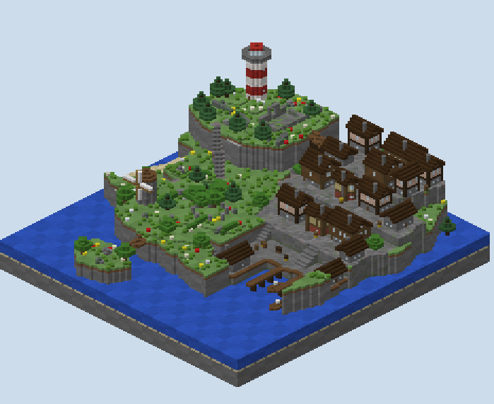

# Gullhaven — what was built

A free-for-all board for rage, one hit kills, built from the plan in `PLAN.md` after one review. It is a
fishing island with no symmetry: a headland with a lighthouse, a ravine, a terraced town of closed houses, a
harbour, rolling downs, a beach cove, sea caves, and an islet reached by a bridge.

## How it was made

**The ground is built from the plan's raster.** `scripts/plan.py` holds every column's height and kind,
assembled from polygons, polylines and noise, with an upper raster for the two bridges. `plan_check.py`
walked it, `sketch.py` drew it, and `gen.py` builds each column to that height with its top by kind. The kinds
are grass on soil over stone, sand over sandstone, the town's tiles, the quay's stone and spruce, and the
ravine's gravel.

**Every way up is a stair.** A ramp in the plan rises one block a cell; in the world each step of it is a
cobble stair on the grass and a stone brick stair in the town, so a player runs up it without jumping. Where
the town's terraces stand over lower ground their faces are stone brick, mossy toward the foot. Elsewhere a
cliff shows its strata.

**What a raster cannot hold is built on top:**
- the houses, by the rotated-house builder from an earlier board here;
- the lighthouse, in red and white bands with a lantern of glowstone;
- the mill, with sails of wool;
- the chapel's ruin and the caves;
- the bridges on log trestles with fenced sides;
- the piers on posts and the boats;
- the cover and the trees.

## Nothing is entered

**The houses are closed.** Fourteen in the town, a fish shed and a net loft on the quay, each with glass windows
and a door. With no block use on the board a door never opens, so the walk counts a door as a wall. It reaches
the inside of no house, and of neither the lighthouse nor the mill.

**No roof is walked on.** The walk found the roof of one house on the quay a step from the lower terrace. That
house is gone, and the walk now reaches no roof.

## The island

| Place | Height | In the world |
|---|---|---|
| the Headland | 40 | grass and ferns, spruces along its southern lip, a dry-stone wall, rocks, the lighthouse, the chapel's ruin with the crypt's ladder |
| the Ravine | 23 to 24 | gravel and coarse dirt, a stream, the bridge overhead, the cave door in its west wall |
| the Town | 36, 32, 28 | streets of stone brick, cobble and gravel; crates and hay; stairs between the terraces |
| the Harbour | 22 | a quay edged in spruce, two piers, crates, two moored boats |
| the Downs | 26 to 30 | grass, flowers, hedgerows, a copse of oaks, the ring of standing stones, the mill, the sinkhole |
| the Cove | 19 to 21 | a sand beach with driftwood, the path up to the Downs, the sea cave's mouth |
| the Skerry | 24 to 26 | a rocky islet with two spruces and a bridge to the Downs |
| the Caves | 21 | the grotto with a pool and glowstone in its roof, four tunnels lit along their walls |

## What the built world measures

`renders/walks.txt` walks the built blocks from a spawn on the Headland, on foot, every drop free (fall damage
is off), with no jumps:

| From the Headland's west spawn | Blocks |
|---|---|
| the chapel | 19 |
| the Cove, by the cliff | 40 |
| the Ravine's floor | 42 |
| the grotto | 44 |
| the standing stones | 80 |
| the upper terrace | 103 |
| the quay | 106 |
| the Skerry | 116 |
| the end of the west pier | 131 |

**Every spawn stands and every spawn connects.** All 29 points stand on solid ground with headroom, and every
one reaches every other on foot. A spawn's nearest other spawn is 8 to 36 blocks away on foot, median 18.

**The plan's reads still hold.** `renders/plan-check.txt` finds a spawn seeing a median of one other spawn
within 60 blocks, and 5% of the walkable ground more than six blocks from cover. The longest clear sightline is
110 blocks, from the Headland's edge to the far end of the quay: the high ground's view.

## What `map.xml` says

- **The mode:** `<rage/>`, one point a kill, eight minutes, two to sixteen players, each their own colour.
- **The kit:**
  - an iron sword with sharpness and a bow with power, both one-hit kills under rage;
  - one arrow;
  - a leather tunic in the player's colour;
  - two seconds of resistance.

  A kill pays one arrow, and arrows are removed on death.
- **The spawns:** the 29 points with `spread="true" safe="true"`.
- **The rules:** fall damage off, no block placing, breaking or use; a region round the island turns a swimmer
  back.

## The renders

- `00-plan-sketch.png`: the plan, with its reads and two sections.
- `01`, `02`: the studio's top-down and height reads of the region files.
- `10`–`14`: true-scale sections across the Headland and the Ravine, down the town to the basin, through the
  caves, down the sinkhole, and out to the Skerry.
- `30`–`37`: isometric views of the island from two sides, the town, the Headland, the harbour, the Downs and
  the Skerry, the caves cut open, and the Ravine.
- `ref-rage-quit-ffa-topdown.png`: the scale reference.

## What I wanted, how hard it was, and what a studio feature would need

| What I wanted | How hard it was | What a studio feature would need |
|---|---|---|
| Spawns spread so nobody spawns on someone | Moderate: a list of points, checked for spacing on foot and for what each sees | A spawn layer for free-for-all: points placed by zone, read for spacing and sightlines on every edit |
| Houses nobody walks into | Easy to build; the walk had to count a shut door as a wall to prove it | A closed-building flag that the walk honours, and a check that no roof is a step from the ground |
| Open ground broken up, not cluttered | Moderate: a read of how far each cell is from anything to stand behind | That read on the plan, shaded, so the bare patches show before anything is built |
| Long sightlines kept to one place | Hard to guarantee; a row of trees breaks most and not all | A sightline read that lists the longest lines and where they run |
| Caves under the ground with several ways in | Moderate: tunnels carved as discs along polylines, a grotto, a ladder shaft | A tunnel piece that knows the ground over it and opens its mouths where they meet the surface |
| Every way up a stair | Easy: a ramp one block a cell, a stair block on each step | Ramps as plan pieces whose steps the generator dresses |
| An islet with a bridge | Easy: a bridge on the upper raster, joined to the ground at each end within a block | Bridges as plan pieces that check their ends meet the ground |
| Validation of an FFA map | Not attempted here; the XML follows PGM's source and Rage Quit FFA's | FFA and rage in the studio's round-trip, with the spawn points read back against the world |
