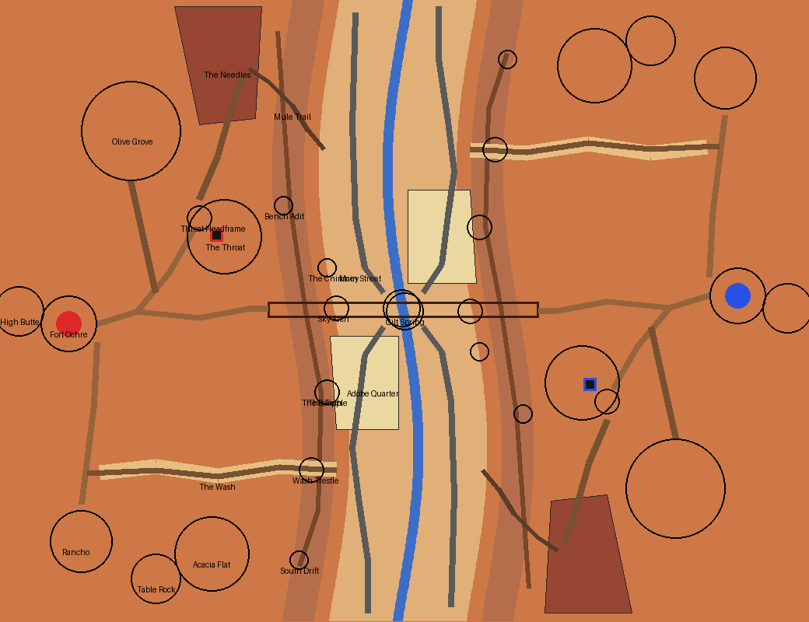

# Hollow Mesa — the plan

Written before any terrain existed. The sections after *As first drawn* record how the plan changed and why.

## The board in one sentence

**Two banded mesas face each other across a wide canyon; in the canyon a mining town grew round the one
spring on the board, and inside each mesa a team's core stands on the lip of a hole that falls straight
through the mesa into the void.**

What a player remembers: the core hanging over the hole, the stone arch rim to rim over the town, and the
olive groves on the red rock.

## Mode: destroy the core, one core a team

**DTC, because a core's leak can be designed.** The core stands in a cavern on a stub of rock beside a hole
to the void. A breach on the hole's side leaks at once; a breach on the far side pours lava onto the cavern
floor, where it pools and spreads toward the hole. The room changes as the core leaks, which a monument
cannot do.

**One core a team.** A core is the forward objective and is fought over where it stands; one each keeps the
whole fight underground and at the canyon wall.

## Arrangement

- **A half-turn about the centre, not a mirror.** Red holds the west mesa, blue the east; blue's half is
  red's turned 180°, `(x, z) → (−1 − x, −1 − z)`. Red's core is north of the line between the spawns and
  blue's is south of it, so the board reads as one canyon, not a reflection.
- **No void between the teams.** The canyon takes that role: 40 blocks of town between two walls 33 blocks
  high, crossed on the canyon floor, along a bench halfway up the wall, or over the Sky Arch at rim height.
- **The canyon's cross-section:** floor 41 (the creek at 40) for 22 blocks either side of a wandering
  centreline; a lower cliff to the **bench** at 57, 10 blocks wide; an upper cliff to the **plateau** at 74.
- **The core** sits in the Throat, a cavern under the plateau 12 blocks in from the rim, floor at 47, the
  core's obsidian at 49–52 on a stub of rock, the hole beside it falling through the island into the void.

## The places (red half; blue's are their half-turn)

| Place | Where (x, z) | What it is | Why a player goes there | How |
|---|---|---|---|---|
| Fort Ochre | −108, 4 | Spawn: adobe compound, timber gate, watchtower, its back to High Butte | spawn | the gate onto Fort Road |
| High Butte | −124, 0 | flat-topped butte 18 over the plateau | frames the spawn; sees the board | ladder from the fort |
| Olive Grove | −88, −58 | olives and acacias, windmill, stock tank | cover from the fort to the headframe and the Needles | Grove Track |
| The Needles | −74…−46, −98…−60 | banded clay spires on the north rim | perches over Main Street; the Mule Trail tops out here | Needles Path |
| Throat Headframe | −66, −30 | headframe over the shaft to the core | the defenders' way down | Fort Road |
| **The Throat** | −58, −24 | cavern with a hole to the void; core on its lip; miners' catwalk | **red core** | shaft, Bench Adit, Chimney |
| Bench Adit | −39, −34 | timbered drift from the bench, arriving on the catwalk over the hole | attack from the wall | the bench |
| The Chimney | −25, −14 | crack at the wall's foot climbing inside the rock to the Throat's floor | attack from below | Main Street |
| The Bench | along the wall | ledge carrying the mine tram | the middle storey | Mule Trail, tipple, trestle |
| Mule Trail | −26, −52 → −50, −78 | stairs cut into the wall, floor to bench to rim | the climb from town to mesa | Main Street |
| Sky Arch | rim to rim at z ≈ 0 | natural arch over the town and the spring | high road between the mesas | Rim Path |
| Main Street | x ≈ −16, z −96…−6 | saloon, store, hotel, bank, assay office, jail | the town fought through | the spring; the canyon's ends |
| Gilt Spring | 0, 0 | stone-rimmed pool; the creek leaves it north and south | the centre of the board | every street |
| Adobe Quarter | −24…−2, 8…38 | flat-roofed adobe with vigas, mission chapel, water tower, livery | low cover between spring and Wash | Lower Street |
| The Tipple | −25, 26 | timber tower where the tram dumps ore; its stair climbs to the bench | the climb from the quarter | Lower Street |
| The Wash | z ≈ 50, x −22 → −100 | dry side canyon rising from floor to mesa top | the long way up; the flank to the fort | Lower Street; Rancho |
| Wash Trestle | −30, 51 | timber trestle carrying the tram over the Wash | the bench goes on south | the bench |
| South Drift | −34, 80 | played-out drift, ore cart, foreman's chest | supplies; the tram's end | over the trestle |
| Rancho | −104, 74 | adobe ranch house, barn, corral, windmill and trough | outpost between the Wash and the fort | Ranch Road |
| Table Rock | −80, 86 | small flat butte with a ladder | lookout over the Wash | its ladder |
| Acacia Flat | −62, 78 | acacias on the south plateau | the south rim's cover and colour | Ranch Road |

## Navigation

- **Defenders to their core:** Fort Road to the headframe and down the shaft, about 55 blocks and a
  27-block ladder.
- **Attackers, four ways in:** *through* — across the canyon, up the Mule Trail or the tipple to the bench,
  into the Bench Adit; *below* — the Chimney from the canyon floor; *above* — over the Sky Arch onto the
  plateau and down the headframe shaft; *around* — up the Wash, past the Rancho, across the plateau.
- **Fights:** the arch, the spring, Main Street, the bench and the trestle, the catwalk over the hole.
- **Height:** the Needles over Main Street; the water tower over the spring; Table Rock over the Wash;
  High Butte over everything.

## Palette, decided now

- **Biome:** Mesa for the rock and the plateau (grass `#90814d`, so it lies in the orange rather than on
  it); Plains under the groves and along the creek, so their leaves and grass are the board's green.
- **Ground:** an orange set (red sand, orange clay) holding patches of dirt and coarse dirt ringed in
  hardened clay; grass on the dirt patches.
- **Cliffs:** horizontal bands of hardened clay with orange, yellow, white, light grey and brown stained
  clay, red only as a thin band; stone below the clay.
- **Built:** western timber false-fronts in spruce and oak; adobe in smooth sandstone with spruce vigas;
  mine works in dark oak.
- **Trees:** olive and acacia only, cut from rockymine's tree showcase.

## As first drawn

The table and sketch above are the plan as written before building.
