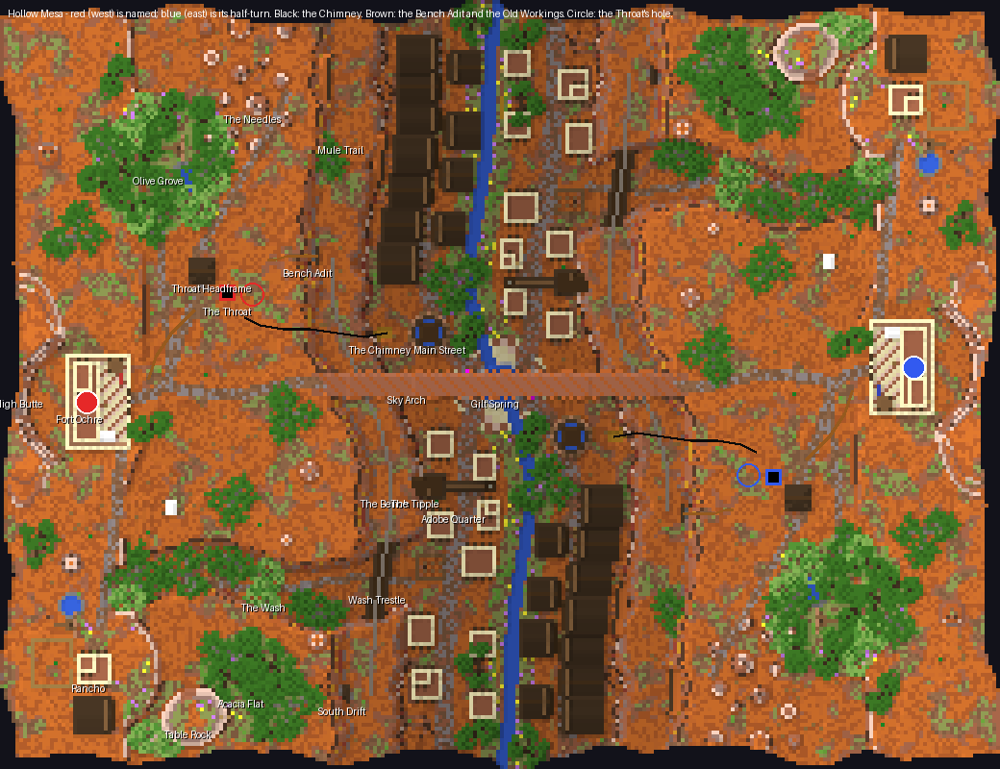

# Hollow Mesa — report

**Hollow Mesa is a destroy-the-core map for two teams of sixteen: two banded mesas facing each other across
a wide canyon.** In the canyon lies Gilt, a mining town that grew round the one spring on the board, with a
false-front Main Street, an adobe quarter and a natural stone arch spanning rim to rim over its plaza. Inside
each mesa a team's core stands on a stub of rock beside a hole that falls straight through the mesa into the
void, in a cavern called the Throat.

The whole board is generated by the scripts in `scripts/` and written through the studio's own region
writer; no studio authoring pipeline was used. `scripts/build.sh` audits the placements, regenerates the
world and draws every render in about half a minute.

## What was built, and why

**The core is placed over the void on purpose, and the leak is designed around it.** The core's obsidian
(49–52) stands on a two-block stub of clay on the Throat's floor (47), one block from the lip of a hole that
goes through the island. A breach on the hole's side leaks at once: the lava steps onto one block of floor
and falls. A breach on any other side pours lava onto the cavern floor, where it pools four blocks short of a
leak and spreads toward the hole. The `no-void` rule covers the whole board, so the hole cannot be plugged.

**The canyon takes the place of a void gap.** The teams' ground is joined only through the canyon: forty
blocks of town between two walls thirty-three high, crossed on the floor, along the bench halfway up the
wall, or over the Sky Arch at rim height.

**A half-turn, not a mirror.** Blue's half is red's turned 180° about the centre. Red's core is north of the
line between the spawns, blue's south of it; red's Main Street faces blue's across the creek, so the town
reads as one town on two banks.

**The surface carries the mesa as much as the rock does.** The mesa top steps: a scarp across each plateau
puts the fort on an upper tier, two buttes stand over it, and twenty spires and hoodoos a side stand on the rims and in
the Needles. The cliffs are horizontal beds of hardened and stained clay with one-block red bands, stone
below. The ground is the badlands recipe from `WHAT-A-BOARD-IS-MADE-OF.md`: orange holding patches of soil
ringed in hardened clay.

**The woods are the colour.** Olive Grove and Acacia Flat stand on grass under a Plains biome, so their leaves
and ground read green against the Mesa-tinted orange. The creek's banks carry trees the spring waters, and
the Rancho has an orchard in rows. All are rockymine's acacias and olives from the tree showcase.

## A tour (red's side; blue's is at `(−1 − x, −1 − z)`)

| Place | x, z (y) | What a player finds |
|---|---|---|
| Fort Ochre (spawn) | −105, 4 (75) | An adobe compound on the upper tier: two-storey quarters with vigas and a roof ladder, a timber watchtower with the red flag, a covered wagon, a wall-walk; the gate opens east onto Fort Road. |
| High Butte | −125, 0 (94) | A flat butte with a lower tier, laddered up both tiers on its south end: it sees the whole board. |
| Olive Grove | −88, −58 | Olives and acacias on green ground round a windmill and a stock tank, between the fort and the Needles. |
| The Needles | −80…−52, −98…−60 | Spires 8–22 blocks tall over Main Street; the Mule Trail tops out among them. |
| Throat Headframe | −78, −30 (73) | A timber headframe with a winding wheel over a 26-block ladder shaft down to the core. |
| **The Throat** | −70, −24 (47) | A cavern in the banded clay; **the core** on its stub at the hole's lip; a catwalk along the north and east walls at the adit's level, stairs down; a hoist frame over the hole with its chain hanging into the dark; glowstone lamps. |
| The hole | −65, −24 | About six blocks across, from the cavern floor through the bottom of the island. |
| Bench Adit | −48, 57, −34 | A timbered drift from the bench, rails on its level runs, arriving on the catwalk over the hole. |
| The Chimney | −30, 41, −14 | A cleft at the foot of the canyon wall on Main Street's south end; a water-cut passage climbs inside the rock to the Throat's floor. |
| Old Workings | −80 → −92, −20 → −2 | A drift off the Throat's west side, gold in its walls, a chest where the vein ran out. |
| The Bench | along the wall at 57 | A ten-block ledge carrying the tram from the adit to the South Drift. |
| Mule Trail | −30, −50 → −54, −80 | Red sandstone stairs cut into the wall from Main Street to the bench and on to the rim. |
| Sky Arch | rim to rim at z −3…2 (74–76) | A natural arch, thin at the crown and thickening into the walls, banded through; the plaza 35 blocks below. |
| Main Street | x ≈ −20, z −96…−6 | False-front timber stores on both sides: Grand Hotel, General Store, Saloon, Assay Office, Feed & Seed, Bank of Gilt, Barber, Rooms, Sheriff; boardwalk porches, hitching rails, the town sign at its end. |
| Water tower | −19, −14 | A round tank on four legs over Main Street, with a ladder and a walkway: the perch over the street and the spring. |
| Gilt Spring | 0, 0 | A round pool with a sandstone kerb at the board's centre, a pump and benches, the plaza paved round it; the creek leaves north and south and falls off both ends of the island. |
| Adobe Quarter | −22…−1, 12…86 | Flat-roofed adobe houses with vigas and roof terraces, some with a second storey set back; the mission chapel with its bell gable; Boot Hill's crosses beside it. |
| The Tipple | −21, 26 | A timber tower from the street to the bench with a switchback stair inside, an ore chute to a bin on the street. |
| The Wash | z ≈ 50, x −22 → −100 | A dry side canyon climbing from the floor to the mesa top; acacias and a broken wagon in it. |
| Wash Trestle | −32, 51 (57) | Timber bents carrying the tram across the Wash, fenced both sides. |
| South Drift | −40, 57, 80 | The tram's end: a short drift, an ore cart, the foreman's chest. |
| Rancho | −104, 74 (83) | An adobe ranch house with a roof room, a timber barn, a corral, a windmill over its tank, an olive orchard in rows. |
| Table Rock | −80, 86 (86) | A small flat butte, laddered up both tiers: the lookout over the Wash. |
| Acacia Flat | −66, 78 | Acacias on the south rim. |

## How a match is meant to flow

**Defenders drop straight to the core.** From the fort, Fort Road reaches the headframe in 48 blocks and the
shaft drops 26 to the Throat. A defender arriving by ladder lands at the cavern's west end, across the floor
from the core and the hole.

**Attackers have four ways in, and they arrive in different places.**

- *Through:* across Gilt, up the Mule Trail or the tipple to the bench, along the tram into the Bench Adit.
  They come out on the catwalk above the hole, looking down at the core.
- *Below:* into the Chimney's cleft at Main Street's south end and up inside the rock. They come out on the
  Throat's floor south of the core.
- *Above:* over the Sky Arch onto the enemy mesa, to the headframe and down the defenders' own shaft.
- *Around:* up the Wash, past the Rancho, across the plateau to the headframe.

**The town is where the two teams' routes cross.** Both teams' Main Streets and quarters share the canyon
floor, so an attacker heading for the Chimney or the Mule Trail walks the street the enemy's defenders use
on their way to the arch. The spring, under the arch, is the middle of every route.

**Height decides the canyon.** The Needles look down Main Street, the water tower over the plaza, the bench
over the whole floor, and the arch over everything in the middle.

### The walks, measured

`scripts/walk.py` walks the built world — one-block climbs, three-block drops, ladders, doors, swimming, no
blocks placed — and its output is `renders/walks.txt`.

| Walk | Blocks |
|---|---|
| spawn → own core | 85 |
| spawn → enemy core | 197 |
| spawn → headframe shaft head | 48 |
| shaft head → core | 32 |
| Bench Adit mouth → core | 29 |
| Chimney mouth → core | 46 |
| spawn → Sky Arch crown | 100 |
| spawn → Gilt Spring | 107 |

**The defender's walk sits inside the studio's 40–90 band; the enemy's is 2.3 times it and longer than the
studio's 85–150.** That ratio is below the studio's 3–4, because the shaft makes the defenders' way short
and the canyon makes everyone's long.

## What changed while building, and the placement audit

**Your note during the build — "your water tower landed on top of the bridge across the canyon" — found a
real defect, and the defect was bigger than the tower.** The arch wrote its deck height into the ground
map. Everything placed by "the ground here" near it then used the arch's top as the ground: the water tower
was built on the arch, and the plaza's paving, which clears anything over the ground, cut the arch out over
the spring. The arch is now recorded as a second storey, and the ground under it stays the ground.

**`scripts/audit.py` now checks every placement before a world is written,** and `build.sh` runs it first.
Every building, prop and structure claims its footprint, and the audit reports:

- two things in one place;
- a thing set into ground that rose more than five blocks across it;
- air under a floor;
- anything standing under the arch.

On its first run it found six more faults besides the tower: the tipple built through an adobe house, a
stock tank on a windmill, a corral and two stock tanks laid across the scarp, and a wagon jammed into the
Wash's wall. All are fixed, and the audit now reports none (`renders/audit.txt`).

## What I am proud of

- **The core over the hole.** One room, one hole, one designed leak, and three different ways into it, each
  arriving somewhere different: above the hole, beside it, across from it.
- **The arch over the spring.** It is the shortest way between the mesas, and from the plaza it is the roof
  of the town.
- **The cross-section** (`renders/51-elev-canyon-arch-z0.png`): beds of clay, the bench step, the arch rim
  to rim, the creek in the middle, stone under the clay.
- **The colour.** Green woods and creek banks on orange rock, as you asked.

## What I would do next

- **Play it.** It has not been on a server. The leak and the creek pouring off both ends of the island
  both need a player to disturb them.
- **Light the underground.** As on Riftwater, the writer marks every section fully sky-lit, so the Throat is
  bright; it should be dark with lamps.
- **More buildings on the east bank's south end, and fewer identical pairs.** The half-turn gives every
  building a twin. Signs could at least name them differently.
- **A second look at the false fronts at street level.** My renderers show their bulk but not how a facade
  reads to someone standing on the boardwalk.

## What I wanted to build, how hard it was, and what a studio feature would need

Riftwater's table (`../opus55-freeform-riftwater/REPORT.md`) still stands — caves, mines, bridges, mills,
props. These are the things this board added.

| Wanted | How it was built here | Effort | What a studio feature would have to do |
|---|---|---|---|
| **A core over the void, with a designed leak** | A cavern; a cylinder cut from the cavern floor to y 0; the core on a stub one block from the lip; `no-void` everywhere so it can't be plugged (`underground.py`) | Low | Let a core's casing stand next to void, and *show* the leak: where lava from each face would go and whether it reaches `leak`. The studio's "a core needs ground all round" check would become a report of how fast each face leaks. |
| **A canyon with a bench** — two cliffs, a ledge between, a wandering centreline | A cross-section as distance from a centreline: floor, lower cliff, bench, upper cliff, plateau, each line wandering by its own noise (`terrain.py`) | Low | A *canyon* landform: a centreline stroke and a cross-section profile (heights and widths of each step), with jitter per wall. |
| **A side canyon that climbs to the mesa top** | A second centreline cut with a floor that ramps 41 → 74 | Low | A *wash* stroke: a cut whose floor is a grade from one height to another, its walls joining whatever it cuts through. |
| **Clay strata** — horizontal beds, one-block red bands, stone below | A bed table by height, offset by a slow noise so beds undulate | Low | The studio's `layered` stack does this; what was missing was a mesa preset with the one-block-red rule. |
| **Spires, hoodoos, buttes, a scarp** | Heightfield columns with pointed or capped profiles; ellipses with a lower tier; a scarp line with gullies where roads go down | Low | *Spire* and *butte* landforms (radius, height, profile), and a *scarp* stroke with gaps. |
| **A natural arch** — rim to rim, thin at the crown | Built as voxels over the canyon after the terrain, banded like the cliffs | Low to build, **costly to get right**: it broke the town (see the audit section) | An *overhang* layer that is a storey of its own: the ground under it stays the ground for every placement, and anything tall under it is checked against its underside. |
| **A rail line that turns** | A 4-connected path along the bench with curve data worked out from each cell's neighbours (`rail_path`) | Low | Rails as a stroke, with corners and slopes resolved. |
| **A trestle and a tipple** | Bents every four blocks down to the ground; a timber tower with a switchback stair and an ore chute | Low each | A *trestle* bridge option; a *stair tower* prop between two storeys of ground. |
| **False-front stores** | A gable roof running back from the street and a square front standing over it, boardwalk porch with a one-block roof, sign on the front | Low | A room style with a *false front* and a porch, which the studio's room styles nearly are. |
| **Adobe with vigas** | Flat roof behind a parapet, log ends standing out of the walls under the roof, a roof terrace with a ladder, an upper storey set back | Low | A flat-roof style whose beam ends are its vigas, which matches the author's "a beam is the end of something" rule, and a set-back upper storey. |
| **Woods that change colour** | A Plains biome under the groves and the creek banks inside a Mesa board | Low | A biome per *place*, set by a shape — the studio's biome field can do it if a place carries one. |
| **A placement audit** | Every placement claims a box; an audit reports overlaps, ground set into cliffs, air under floors, things under the arch | Medium, and it should have been there first | The studio already refuses most of this. A freeform world needs the same refusals as a *report* run over any world, studio-built or not. |

## Notes on the deliverable

- `scripts/` holds every script written for this board, all of which run; `cut_trees.py` was run once and
  wrote `trees.json`. `build.sh` regenerates `world/` and `renders/` from nothing.
- The world is 260 × 200 blocks: 1,794,462 blocks in 232 chunks, 94 trees, 24 tile entities (chests and
  signs).
- `world/map.xml`: DTC, teams, spawns, a kit, two cores with `leak="5"`, spawn protection, and `no-void`
  over the whole board. The trees are credited to rockymine, who built them.
