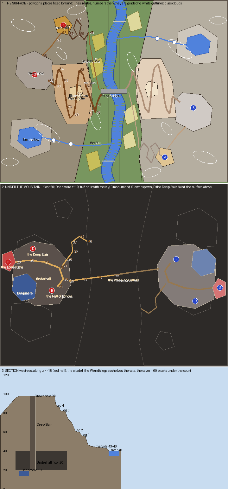

# Hollowcrown — the plan

Written before any terrain existed. The sections after *As first drawn* record how the plan changed and why.

## The board in one sentence

**Two fortress mountains face each other across a river vale: on each, a citadel on the summit, a town
climbing the valley face along a serpentine road, a tower on a northern spur holding one monument, and under
it all a delved city round an underground lake holding the other, with a spawn at the top and a spawn at the
bottom.**

What a player remembers: the Wend's hairpins stacked one above the other with houses set to every bend, the
Eyrie on its spur with cloud drifting past it, and the lake glimmering in the dark of Underhall.

## How this plan is drawn

**Every place is a polygon and every way is a polyline that carries its heights.** `scripts/plan.py` is the
plan: a place's outline, a summit's outline and height, and each route's bends as `(x, z, y)`. The generator
reads its masks and distances from those polygons and polylines (`scripts/geometry.py`), so what the sketch
shows is what the terrain is built from, not a picture of it.

**The sketch has three panels because the board has three layers.** The surface panel shows places filled by
kind and routes numbered with the y they are graded to. The underground panel shows the cavern, the lake and
the tunnels, with the surface faint above. The section cuts west to east through the citadel, the town's
shelves and the cavern sixty blocks below the court.

## Mode: destroy the monument, two a team, one high and one low

**Monument A is in the Eyrie, a tower on the north spur at y 92.** It is reached from the team's own citadel
along the Knife, a ridge path, and from the vale by the Goat Stair, ten hairpins cut into the spur's cliff.
**Monument B is in the Hall of Echoes, Underhall's temple at y 20.** It is reached from the vale by the Mine
Road, from the enemy's cavern by the Delving under the river, and from the team's citadel by the Deep Stair.

**Each team has two spawns, and a player chooses between them.** The match starts everyone in Crownhold's
court, the top spawn. A lift room off the court is a portal to the Lower Gate, the bottom spawn at the
cavern's west end, and a lift there returns to the top. Only the team's own players can use them.

## Arrangement

- **Halves:** red holds the west mountain, blue the east, and blue's half is red's turned half a circle about
  the centre. The river runs north to south through the middle, with a wander that the half-turn maps onto
  itself.
- **Heights:** the river at 40, the vale at 43 to 46, the town's four shelves at about 56, 64, 77 and 87, the
  citadel at 98, the Eyrie at 92 and the tarn at 71. Underhall's floor is at 20 and Deepmere at 19.
- **Crossings:** Kingsbridge in the middle, a ford of stepping stones at each end of the vale, and the
  Delving under it all.
- **Verticality is the board.** Every objective has a way that climbs, a way that delves and a way that
  builds across a cliff.

## The places (red half; blue's are their half-turn)

| Place | Outline | Height | What it is | Why a player goes there |
|---|---|---|---|---|
| Crownhold | heptagon round −84, −18 | 98 | the citadel: curtain walls on its polygon, towers, a keep set at an angle, the gatehouse | **top spawn** |
| The Eyrie | pentagon round −54, −70 | 92 | a tower on the north spur, the monument in its open crown | **monument A** |
| Wendholm | heptagon from −66 to −23 | 45–98 | the town along the Wend: houses set to the road, retaining walls between the shelves | the climb, and cover on it |
| Market Cross | pentagon round −40, 2 | 64 | the square: a cross, a well, three houses at 0°, 12° and 45° | the middle of the climb |
| Tarnhollow | hexagon round −89, 49 | 71 | a tarn on the south shoulder with shelving shores | the head of Millbrook |
| Millbrook | polyline, two falls | 71 → 40 | the tarn's stream: Greyfall, a pool, the Mill Leap, then the vale | the south flank's water |
| The Vale | the strip from the mountain's foot to the river | 43–46 | fields set at angles, the mill, the fords | the ground between |
| Kingsbridge | across the river at z −0.5 | 44 | a stone bridge | the middle crossing |
| Underhall | octagon under the mountain | 20 | the delved city, its houses at angles | the lower town |
| Deepmere | hexagon in the cavern's west | 19 | the underground lake, with shelving shores | frames the lower spawn |
| The Hall of Echoes | −66, 16 | 20 | the temple | **monument B** |
| The Lower Gate | pentagon at the cavern's west end | 21 | the gate hall | **bottom spawn** |
| The Deep Stair | −86, −28 | 98 → 20 | a spiral shaft from the court to the cavern | the defenders' way down |
| The Mine Road | polyline from Delver's Door | 46 → 21 | a mine tunnel from the vale into the cavern | the attackers' way in |
| The Delving | polyline under the river | 18–20 | the deep tunnel between the two caverns, the Weeping Gallery at its middle | the low crossing |

## What this board is for, besides a match

- **Houses at any angle.** Every house is drawn in its own frame and rasterised onto the grid, so a wall at
  45° steps one block at a time and a wall at 12° runs straight with a jog every few blocks. The town's
  houses take the Wend's heading wherever they stand, and the market shows 0°, 12° and 45° side by side.
- **Water that meets the land the way water does.** The river's beds shelve to the bank. Banks are cut steep
  on the outside of a bend and lie low as sand and gravel bars on the inside. Reeds stand where the water is
  shallow, and the tarn, the pools under the falls and Deepmere shelve the same way.
- **Clouds of glass.** Six a side, of white and light grey stained glass with plain glass at the edges, above
  everything that can be built to.

## Palette, decided now

- **Ground:** grass and coarse dirt on the gentle, stone and andesite on the steep, gravel scree under cliffs,
  sand and gravel on the inside of bends, clay under shallow water.
- **Town:** stone and cobble ground storeys, spruce-plank upper storeys framed in oak posts and laid oak
  beams, dark oak roofs over spruce gables; stone brick retaining walls; roads of gravel, cobble and andesite.
- **Underhall:** stone brick, polished andesite and chiseled stone, flat roofs, glowstone lanterns.
- **Trees:** oak in the vale and the town's gardens, spruce on the mountain, cut from rockymine's tree
  showcase.

## As first drawn

The tables and sketch above are the plan as written before building.

## How the plan changed

**The town's polygon was too tight for its own road.** As first drawn, the Wend's first and last legs ran
along the town polygon's edges, so every house on their outer side fell outside the town. The polygon was
widened by four to six blocks on each side, out to the vale on the east and to Crownhold's foot on the west.

**The three houses at 0, 12 and 45 degrees moved from Market Cross to a green at the Wend's foot.** Market
Cross turned out to be hemmed in: one leg of the Wend runs through it, and the legs above and below pass
within three blocks of each side. There was no room left on the square for a house that did not stand on a
road or hang over another shelf. The square kept its cross, well and stalls and shrank clear of the
neighbouring legs.

**Wendfoot green is where the three angles are compared.** The three houses stand round Wendfoot green on the level vale, where the same plan
rasterised three ways can be compared side by side.

**The drop between two shelves is laid in ledges three blocks high.** The first build cut each shelf
straight down to the next, a single wall up to twelve blocks high. Now the higher shelf gives way a block at a
time, never on the road itself, so each drop reads as a flight of terraces with grass on every ledge.

**The underground is claimed apart from the surface.** The Hall of Echoes lies under the town, and the
Weeping Gallery under Kingsbridge. With a single layer of claims each was reported as overlapping the
buildings above it, so the surface and the cavern now keep their own claims.

**The Goat Stair ends beside the Eyrie, not in it.** Its last bend was drawn inside the tower's footprint,
so it now arrives at the tower's east door.

**The glass clouds were raised above the build height.** One came down to y 109, inside the 112 a player
can build to, and all six now sit between 114 and 124.

**The first field moved north, off the town's polygon.**

### The places as built (red; blue's are the half-turn)

| Place | At | Height | As built |
|---|---|---|---|
| Crownhold | heptagon round −84, −18 | 98 | curtain walls on the polygon inset 2.5, seven round towers, gates where the Wend and the Knife arrive, the keep at 25°, the Deep Stair's head, the upper lift |
| The Eyrie | −54, −70 | 92 → 104 | a round tower with a spiral stair; **monument A** at 106–107 on its open crown |
| Wendholm | the Wend's four legs | 45 → 98 | 13 houses set to the road's heading, turned 7–12° or 45° to it at random; parapets along the drops |
| Market Cross | pentagon round −40, 1 | 64 | the cross, the well, two stalls |
| Wendfoot | −15, 32 | 45 | the green: houses at 0°, 12° and 45°, a maypole |
| Kingsbridge | x −14 … 13, z −3 … 2 | 44 → 46 | a stone bridge with an arch over the channel |
| The Mill | −20, 50 | 46 | the mill and its wheel on Millbrook |
| Underhall | octagon under the mountain | 20 | 7 delved houses along Undergate, lanterns, a pier into Deepmere |
| The Hall of Echoes | −66, 16 | 20 | an octagon turned 22.5°, pillars of quartz; **monument B** at 23–24 on a stepped dais |
| The Lower Gate | −112, −14 | 21 | the lower spawn, the lower lift |
