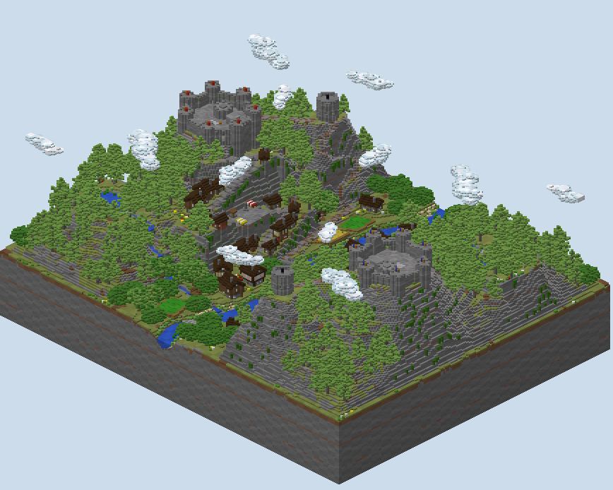
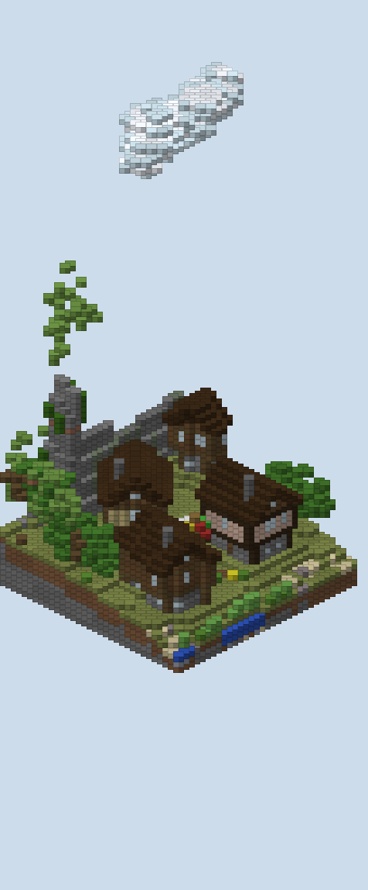
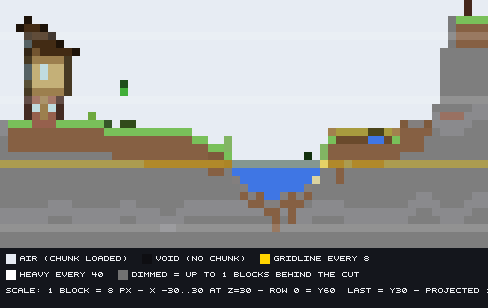
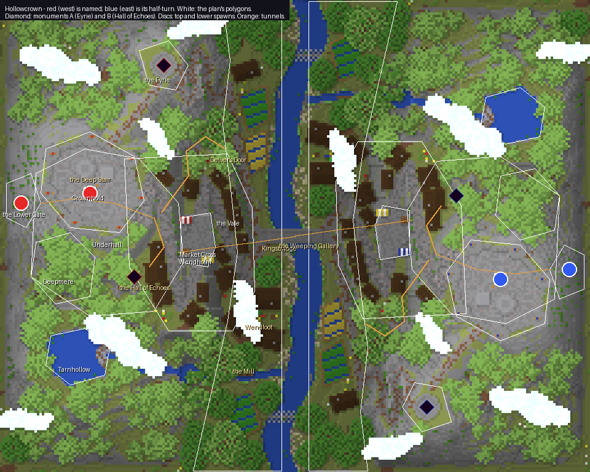
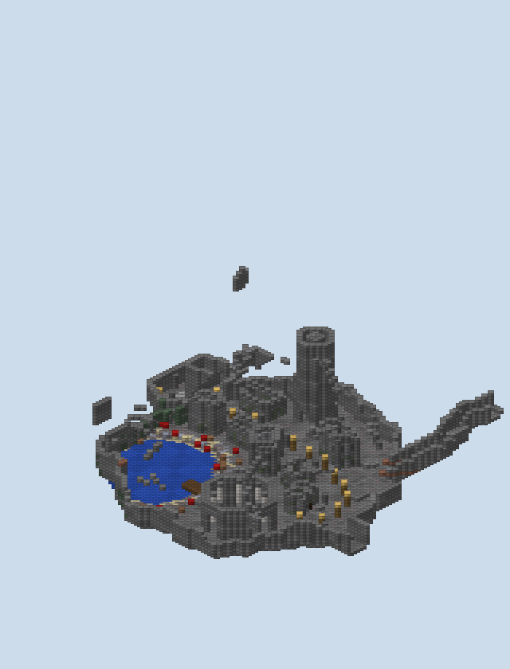

# Hollowcrown — report

**Two fortress mountains face each other across a river vale.** On each stands Crownhold, a citadel on the
summit where the team spawns. Below it, Wendholm climbs the mountain's valley face along the Wend, a road of
four switchback legs. On a spur to the north rises the Eyrie, the tower holding monument A. Under it all lies
Underhall, a delved city in a cavern round an underground lake, with monument B in its temple and the team's
second spawn at its Lower Gate.

It is a destroy-the-monument board, two monuments a team, sixteen a side, 240 × 192 blocks, from y 2 to the
clouds at 125. Blue's half is red's turned half a circle about the centre, `(x, z) → (−1 − x, −1 − z)`.

## What was asked, and where it is

| Asked | Where it is |
|---|---|
| A medieval town, a stronghold, and verticality first | Crownhold at 98, the Eyrie at 92 to 104, Wendholm's shelves from 45 to 90, Underhall at 20, the river at 40 |
| Serpentine pathways | the Wend: four legs and three hairpins from the vale to Crownhold's gate; the Goat Stair: ten hairpins up the Eyrie's cliff; the Mine Road winding down into the cavern |
| An underground civilisation, one monument down there and one up top | Underhall and the Hall of Echoes (B, y 23); the Eyrie (A, y 106) |
| Two spawns a team, the match starting on top | Crownhold's court is the spawn; a lift room off it is a portal to the Lower Gate, and one there returns (`map.xml`, `<portals>`) |
| Houses at 45° and at slight angles | every house is rasterised in its own frame (`scripts/house.py`); Wendholm's houses take the road's heading and are turned 7–12° or 45° from it; Wendfoot green has the same house at 0°, 12° and 45° |
| Clouds of glass | six a side, 6,572 blocks of glass on each half, between y 114 and 124 |
| Detail like the first two maps | 24 houses, 143 trees, 98 stands of reeds and 27 lilies on red's half; a citadel, a tower, a temple, a bridge, a mill, fields, two stairs into the rock |
| Water that melts into the land | the river, the tarn, Millbrook's pools and Deepmere all shelve to their shores; see below |
| A plan drawn in polygons | `scripts/plan.py` and the three-panel sketch; see `PLAN.md` |

## Houses at any angle

**A house is drawn in its own frame and every block asks where its centre falls.** `house.py` puts u along
the ridge and v across it, and tests each block's centre against the storey's rectangle in that frame. So
nothing in it assumes a wall lies along x or z. A wall at 45° comes out as a staircase, a wall at 12° as a
straight run with a jog every five blocks, and a wall at 0° as the ordinary grid house.

**A wall is the blocks inside with any of their eight neighbours outside, not four.** With four, a 45° wall
was a line of blocks touching only at their corners, which can be seen through. With eight, it steps two
blocks at a time and is closed (`scratch/house_angles.py` is the test that showed it).

**The roof is a surface, not a stack of stairs.** Its height over a block is `eave + (half-width − |v|)`,
laid two blocks thick so a roof at 45° has no gaps between its steps, with a slab wherever the surface is half
a block higher. The gable ends fill the end walls up to the roof's underside in spruce under the dark oak roof,
as the author's ruling has it.

**The frame follows the author's rules in any orientation.** Logs stand as posts at the corners and every
four blocks along the long walls. A laid course of log runs along each storey's head, its axis taken from the
wall's own run in the world. Beam ends show under a jettied upper storey, and windows sit between the posts.
Nothing rings the plate: the ground round a house is levelled as ground, and what is under the plate down to
the slope is stone.

**The headings that came out on red's half, modulo 90°,** are 0, 4, 9, 12, 21, 38, 45, 46, 51, 52, 59, 70,
72, 76, 78 and 82. The keep is at 25° and the Hall of Echoes is an octagon turned 22.5°.

## Where the water meets the land

**The river's bank depends on which side of the bend it is.** The outside of each bend is cut: the bank
stands a block above the water and rises to the vale within two or three blocks, earth showing in its face.
The inside lies low: the ground meets the water flush and climbs over four to eight blocks of sand and
gravel bar. That side is computed from the river's curvature, and the deepest water runs toward the
outside.

**Every bed shelves from its shore.** The river is a block deep at the edge and four and a half in the
channel. The tarn goes from one to six blocks over eight of shore, and Deepmere from one to seven over nine.
Each pool under a fall is three blocks deep at its middle, with a ring of ground one block above the water
round it. Millbrook's banks are held one block above its water all the way down.

**What grows and lies at the edge is the edge's own.** Under shallow water: sand, clay and gravel. On the
shore: sand, gravel and reeds where it is low, grass and tall grass on cut banks, three blocks of open shore
with no trees. Lilies sit on still, shallow water near the low side, and mossy boulders half in the water on
the outside of bends and in the pools. Underground, Deepmere's shore is gravel, clay and sand with mushrooms,
and moss on the cavern wall beside it.

## A tour (red's side; blue's is at `(−1 − x, −1 − z)`)

**Crownhold (y 98) is the citadel and the top spawn.** Its curtain walls are laid along the crown's
polygon inset by two and a half blocks, so they run at whatever angle the polygon does, with a round tower at
each of its seven corners. Gates open where the Wend and the Knife arrive, and the keep stands at 25°. In the
court are the spawn dais, the round head of the Deep Stair and the lift room down to the Lower Gate.

**The Eyrie (y 92 to 104) holds monument A on its open crown.** It is a round tower with a spiral stair round
a newel, arrow slits, and doors south to the Knife and east to the Goat Stair. The Knife is the ridge path
from Crownhold's north gate. The Goat Stair climbs from the vale in ten hairpins cut into the spur's cliff,
with cobble steps wherever it rises.

**Wendholm climbs the valley face on the Wend.** Each block of the town takes the Wend's height where the
road is nearest, so every leg is a shelf, and the drop to the next is laid in ledges three high. Houses line
both sides of every leg, with parapets wherever the road runs along a drop of three or more. Market Cross, on
the second leg, has the cross, the well and two stalls. Wendfoot green, at the bottom, has the three houses
at three angles and a maypole.

**The vale (y 43 to 46) is the ground between.** Kingsbridge crosses the river in the middle. A ford of
stepping stones crosses at each end. The mill stands where Millbrook comes in, and fields of wheat, carrots
and potatoes lie at the angle of their own first edge, with channels of water every fourth row.

**Tarnhollow and Millbrook come down the south shoulder.** The tarn (y 71) drains east over Greyfall to a
pool at 59, then over the Mill Leap to a pool at 46 and across the vale to the river.

**Underhall (y 20) is the delved city.** It is a cavern up to about 25 blocks high, held at least ten under the
surface, round Deepmere. Its houses are stone with flat parapeted roofs, set along Undergate at its heading
or turned 15° or 45° from it. The Deep Stair comes down into it from Crownhold, 78 steps round a solid
newel. The Mine Road comes in from Delver's Door in the vale, timbered every four blocks, and the Delving
leads east under the river to the Weeping Gallery and on to the enemy's cavern.

**The Hall of Echoes holds monument B.** It is an octagon turned 22.5° with quartz pillars and a doorway in
four faces, the monument on a stepped dais under a lantern.

## How a match is meant to flow

**A team spawns on top and chooses where to be.** The lift room off Crownhold's court drops a player to the
Lower Gate, 71 blocks from monument B; the lift there brings them back. Only the team's own players can use
them. Without the lifts, a player walks between the two spawns by the Deep Stair, 92 blocks from the court to
its foot.

**Each monument has a way that climbs, a way that delves and a way that builds.** Monument A is reached along
the Knife from home, up the Goat Stair from the vale, or by building up the spur's cliffs. Monument B is
reached down the Deep Stair or the lift from home, through Delver's Door and the Mine Road from the vale, or
from the enemy's cavern by the Delving. The attackers' ways both start in the vale, so the vale is where the
fights meet.

### The walks, measured

`scripts/walk.py` walks the built world with no blocks placed and the lifts not taken. A step climbs one
block, drops at most three, swims, opens doors and climbs ladders.

| From red's | Top spawn (the court) | Lower spawn (the Lower Gate) |
|---|---|---|
| Own monument A (the Eyrie's crown) | 95 | 215 |
| Own monument B (the Hall of Echoes) | 151 | 71 |
| The Eyrie's door | 68 | 188 |
| Market Cross | 77 | 215 |
| The Wend's foot | 99 | 182 |
| Kingsbridge | 114 | 168 |
| Delver's Door | 78 | 110 |
| The Deep Stair's foot | 92 | 26 |
| The Weeping Gallery | 190 | 126 |
| Enemy monument A | 283 | 363 |
| Enemy monument B | 257 | 209 |

**Blue's walks are the same, block for block.** Monument A is 95 from the top spawn, five more than the 90 a
board usually wants. The extra is the Eyrie's own stair: the tower's door is 68 away.

## What changed while building, and the placement audit

**`scripts/audit.py` checks every placement.** It looks for a plate with air under it, a house on a road or
in water, two claims on one block, a crown within four blocks of monument A, a monument above the build
height, and a cloud within it. Its last run reads `no placement problems found` (`renders/audit.txt`).
`PLAN.md` lists what moved. In short:

- **At 45° the first walls could be seen through**, and became eight-neighbour walls.
- **The first town had six houses.** Its polygon was too tight for the Wend's outer legs, houses were placed
  on one side of the road at a time, and the offset from the road was larger than the shelves allowed. It now
  has thirteen on red's half, both sides, set to the road.
- **The market could not hold the three angled houses**, which moved to Wendfoot green.
- **The walls between shelves were twelve blocks of masonry**, and became ledges three high.
- **The walk found the cavern cut off from the surface.** A delved house stood across the Mine Road's mouth,
  timber posts stood in the road where it turned, and the Deep Stair had no landing at its head. Houses now
  keep clear of every tunnel, the posts skip the road's other leg, and the head has a floor open only over
  the last steps.
- **The audit's "air under the floor" was the jetty.** The upper storey's overhang was being counted as
  plate, and the plate is now recorded on its own.
- **Riverside oaks roofed Kingsbridge over.** Trees now keep five blocks off roads, six off the bridge, and
  three off any water.

## What I am proud of

- **The rasteriser.** One function builds a framed, jettied, gabled house at any heading, closed at 45°,
  with the author's building rules kept in every orientation.
- **The town is the road.** The Wend's legs are the town's shelves and its houses take the road's heading,
  so the town reads as grown along the road, not stamped on the slope.
- **The water's edge is decided by the water**: cut on the outside of a bend, a bar on the inside, a shelf
  under every shore.
- **A three-layer plan that the generator reads directly.** The sketch draws the same polygons the terrain
  is built from, as a surface panel, an underground panel and a section.

## What I would do next

- **More houses on the upper legs.** The fourth leg has room for two or three more if the shelf behind it
  were a block wider.
- **Stairs on the Wend's steepest stretch.** The last climb through Crownhold's gate rises 8 in 10 blocks and
  is walked as steps of plain blocks; stair blocks would read better.
- **Rotated roofs in stairs rather than slabs.** At 0° the roof could be stairs and look like a hand-built
  roof; at 12° and 45° slabs are what keeps it closed.
- **Check the portals in game.** No map in the corpus uses one, so their form was written from PGM's
  documentation and has not been played.

## What I wanted to build, how hard it was, and what a studio feature would need

| What I wanted | How hard | What a studio feature would need |
|---|---|---|
| Houses at any heading, closed at 45° | Medium: the frame is easy; closing the 45° walls (eight-neighbour boundary) and the roof (a surface two thick) took two tries | A **heading on every structure**, with the rasteriser deciding wall, post, laid course, window, roof and gable per block in the structure's frame |
| A town that follows its road | Medium: placing along the road on both sides, at the road's heading, with clearance tests per block | **Placement along a polyline**: offset, heading from the road, alternating sides, clearance in blocks |
| Shelves with walls laid as ledges | Easy once the town took the road's height from the nearest point | A **terrace stage**: polygons or road-nearest shelves, with the drop between them as a parameter (wall, ledges, slope) |
| Serpentine roads graded to their bends | Easy: each route's y interpolated along its arc, cut or embanked beside it | **Routes with heights at their bends** that grade the ground themselves, and their switchbacks drawn as one polyline |
| Banks cut on the outside of a bend and barred on the inside | Easy with the river's curvature in hand | A **river stage** with bend-aware banks and shelving beds, rather than a water level |
| A cavern city, its own claims | Medium: the claims had to split into a surface layer and an underground layer | **Claims per layer**, so a temple under a town is not a conflict |
| Two spawns a team and a lift between them | Easy to build; unchecked in game | A **portal** object in the plan, written into `map.xml` from the two rooms it joins |
| Glass clouds | Easy: strings of flattened blobs, grey underneath, plain glass at a ragged rim | A **sky stage** that keeps its blocks above the build height and off the board's towers |
| A plan in polygons the generator reads | Medium: point-in-polygon and distances written in numpy, no other library | A **plan document of polygons and polylines** that the studio's stages read directly, and a sketch drawn from it |

## Notes on the deliverable

- `scripts/build.sh` regenerates everything: the audit, the volume, the region files via `write_world.cs`,
  the renders, the annotated top-down and the walks. Generation takes about two seconds and writing the
  region files about ten.
- `world/` holds the region files, `level.dat` and `map.xml`.
- `scripts/scratch/house_angles.py` is the test bench for the rasteriser: four houses on flat ground at 0°,
  12°, 45° and 30°.
- The writer writes no entities and lights everything fully, so the cavern is lit without torches and the
  glowstone lanterns are decoration. Falling water is written falling, and settles when a block beside it
  changes.
- Not checked in game.
