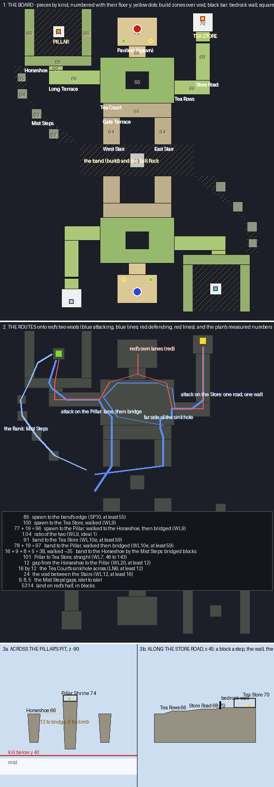

# Lantern Karst — the plan

A capture-the-wool board, planned and not yet built. This page is for a go or no-go.

## The board in one sentence

**Karst pillars stand in a void of mist, terraced for tea and hung with lanterns. Each team defends two
wools built to opposite ideas of a wool room: the Pillar Shrine on a pillar standing alone in a pit, reached
from any side of a horseshoe of terrace by building over the void, and the Tea Store at the dead end of a
long lane, reached one way only, behind a bedrock wall.**

What a player remembers: the shrine on its pillar with bridges reaching for it from three sides, the
lanterns along the Store Road, and the Bell Rock in the middle of the chasm where the staircases meet.

## What already exists, and what I took from it

**I read the account of how capture matches are played and the rules the generator holds capture boards
to.** The account is `pgm-studio/docs/gameplay/match-flow.md`, measured over 333 recorded matches. The rules
are `generator/rules.md` (SP, WL, LN, HB) and `gameplay/approaches.md`. Six community capture maps were
rendered from their region files and read.

| Map | What it does with its wools |
|---|---|
| Celestial Islands | island chains in the void; each wool on an isolated island at the end of a chain; spawns on ships |
| Chles Great Wall | radial symmetry; four round pods off a central spine, two wools a team, each pod reached by one arm |
| Geometric Domination | compact; an L-shaped lane to each wool ending in a narrow corridor; a half-disc in the middle |
| Bridgid II | a grid of square blocks; wools in the corners, two faces on void |
| Golden Drought VI | an H: two long lanes per team, a wool at each lane's end, the spawn between them, bridges across the middle |
| After Hours | a short board, two wools per team at the ends of their lanes |

**The account's lessons decided the plan.**

- **The late game is in the sky.** Teams staircase up from the band, a sky network forms at the build
  height, and the ground stops mattering once a wool's defenders have dug their pit. So the board's voids
  should be the kind that stay uncrossable at any height except where a build zone says otherwise.
- **A void in the hub buys a choice.** A ring hub lets an attacker take the far side and cross only 37% of
  the defender's lane instead of 76%. The Tea Court is a ring for that reason.
- **A two-legged frontline gives more attack routes.** 97% of objectives behind one have more than one way
  in, against 38% behind a plain bar. The Gate Terrace stands on two Stairs for that reason.
- **The arrangement the built maps converge on** is spawn at the back, wools left and right. That is this
  board's arrangement.
- **The rules this plan is held to:**
  - a room in a corner with two faces on void;
  - one bedrock wall per approach, narrow enough to be a line;
  - every gap beside a goal 16 or more across, so it cannot be jumped;
  - approaches climbing a block at a time;
  - wools comparably far from the spawn, at least 59 from the band, 46 to 143 apart;
  - the spawn at least 55 from the band.

**What I am adding that the survey does not have:** two wools per team built to opposite ideas, so the two
defences are different problems. One wool is a single chokepoint behind a wall. The other is a pillar in a
pit that can be bridged to from anywhere round it, with a flank chain of islets as a second way to its
horseshoe.

## Mode and size

**Capture the wool, two wools a team, sixteen a side.** The board is 192 × 224 blocks. Red holds the north
and blue the south, and blue's half is red's turned half a circle. So on each side of the board one team's
Pillar faces the other team's Tea Store: the west side carries red's Pillar and blue's Store, the east the
reverse.

## The pieces (red; blue's are the half-turn)

| Piece | Footprint | Floor | What it is |
|---|---|---|---|
| The Pavilion of Arrival | 28 × 20 at the back | 70 | spawn: a two-storey pavilion on its own terrace, one door, down the Lantern Steps |
| The Lantern Steps | 12 × 8 | 68 | the spawn's neck, a stair of one block a step to the hub |
| The Tea Court | 52 × 32 ring round a 16 × 12 sinkhole | 66 | the hub: tea terraces in rows, a well, lanterns; every crossing has a near side and a far side |
| The Gate Terrace | 48 × 10 | 65 | the frontline's bar, a gate pavilion over its middle |
| The West and East Stairs | 12 × 19 each | 64 | the frontline's legs down to the band, a 24-wide void between them |
| The band and the Bell Rock | 80 × 22 of void, a 10 × 10 islet | 68 | the build band across the chasm; a bell pavilion on the islet |
| The Long Terrace | 36 × 10 west from the hub | 66 | the lane to the Pillar |
| The Horseshoe | three arms round a 33 × 33 pit, open to the north | 66 | the Pillar's approach: any point of it is a place to start a bridge |
| **The Pillar Shrine** | 8 × 8 on a pillar | 74 | **lime wool**: an open shrine on top, 12 off the Horseshoe and 8 above it |
| The Mist Steps | four islets up the west edge | 62–65 | the flank: from the band's west end to the Horseshoe's south-west corner, gaps of 16, 9, 8 and 5 |
| The Tea Rows and the Store Road | 25 × 10 east, then 10 × 34 north | 66 → 70 | the lane to the Store, climbing a block every six or eight |
| The bedrock wall | 10 across the Store Road, 4 high | — | the Store's prepared line, seven blocks before the room |
| **The Tea Store** | 14 × 13 in the lane's corner | 70 | **yellow wool**: a stone storehouse, two faces on void, chests of better gear |

**The monuments stand either side of the Pavilion's steps**, where a carrier coming home cannot miss them:
lime on the left, yellow on the right.

## The two wools

**The Tea Store is the classic capture problem.** It has one road ten wide, climbing four blocks over 59,
and a bedrock wall across it seven blocks before the room. The room is in a corner, two faces on void and
open only to the road.

**Its attack is one road fought up.** Attackers come up the Tea Rows from the hub, choosing the near or the
far side of the Court's sinkhole, then fight up the road to the wall. The defence holds one line and digs one
pit.

**The Pillar Shrine is the opposite problem.** Its pillar stands alone in a pit of void 33 across, with the
Horseshoe of terrace round three sides of it. The pit is a build zone, so a bridge to the Pillar may start
from any point of the Horseshoe. It is 12 blocks at the shortest and 19 from the corner a lane arrives at,
and then 8 blocks up onto the shrine.

**There is no wall, because there is no single line to hold.** The defence must watch three arms of a
horseshoe and the flank from the top of a pillar. The defenders have the height, and every attacking bridge
is exposed for its whole length.

**The Mist Steps are the Pillar's second way in.** Four islets climb the west edge from the band to the
Horseshoe's corner, each gap a build zone, 38 blocks of bridging in all. An attacker who takes them never
passes the Tea Court, and arrives at the arm of the Horseshoe farthest from the spawn.

**The two are balanced by distance, not by shape.** By walking the plan (octile, land only, a bridge
counted at its length):

| Measured | Lantern Karst | Rule |
|---|---|---|
| spawn to the band's edge | 85 | SP10: at least 55 |
| spawn to the Tea Store | 100 | WL9: comparable |
| spawn to the Pillar (77 walked + 19 bridged) | 96 | WL9: comparable |
| their ratio | 1.04 | WL9: ideal 1 |
| band to the Tea Store | 91 | WL10e: at least 59 |
| band to the Pillar (78 walked + 19 bridged) | 97 | WL10e: at least 59 |
| Pillar to Tea Store, straight | 101 | WL7: 46 to 143 |
| Horseshoe to Pillar, the shortest bridge | 12 | WL20: at least 12 |
| the Tea Court's sinkhole | 16 × 12 | LN6: at least 12 |
| the void between the Stairs | 24 | WL12: at least 16 |
| land on red's half | 5,314 blocks | — |

`scripts/plan_check.py` prints this table from the plan's polygons.

## Heights and the void

- **The base is y 64.** The spawn is at 70, six above the hub, reached by a stair of single steps. The Store
  is at 70 by the road's climb, and the Pillar's top at 74.
- **The build height is 92**, 28 over the base, room for the staircases and the sky network the late game
  is played on.
- **Below y 40 a fall kills**, by the instant-damage kit Stratum uses. A mist of glass lies at 28 to 38, so
  the void reads as depth rather than as nothing.
- **Build zones:** the band, the Pillar's pit and the Mist Steps' gaps. Everywhere else the void cannot be
  built over, so the Court's sinkhole, the void between the Stairs and the bays round the Store stay
  uncrossable all match. That is the rule the account says makes a void's choice last.

## What `map.xml` will say

- `<wools>`: blue captures red's lime from the Pillar and red's yellow from the Store; red the reverse.
  `craftable="false"`.
- **Wool rooms:** a team may not enter its own rooms, and the rooms' blocks are protected. The Pillar's
  room is the shrine's top and the Store's room its interior.
- **Spawns:** entering the enemy's spawn is refused, and the spawn may not be edited.
- **Building:** the void may be built over only in the three build zones. Every land column may be built on,
  and the bedrock walls cannot be broken.
- **The fall:** `<apply kit="fall-kill" region="the-fall"/>` on `<below y="40"/>`.
- **The kit:** sword, bow, pickaxe, axe, shears, wood and team-coloured wool for bridging, and a golden
  apple. The rooms' chests hold better armour, as the account says a room should.

## Theme and palette, decided now

- **Karst:** pillars of stone, andesite and a little mossy cobblestone, standing in mist. Their sides are
  ledged and hung with vines, and spruce grows on their tops and from their ledges.
- **Terraces:** tea in rows of leaves on grass, laid along the terraces' contours, with podzol paths between
  them.
- **Built:** pavilions of spruce and dark oak with roofs of dark oak stairs curved up at the eaves, and
  white and jade (prismarine) panels. Lanterns are glowstone hung from fences. Steps are stone brick and
  andesite.
- **Red and blue only on the teams':** banners on the Pavilion and wool rooms. The lacquer red of a real
  pavilion is left out, because it would read as a team.
- **The mist:** white and light grey stained glass far below, as Stratum's clouds.

## Decisions for you

1. **The two-idea split.** Is a Pillar wool reached only by building, beside a Store wool behind a wall,
   what you want, or should both wools follow one idea?
2. **The Mist Steps flank.** Keep it, or let the Pillar be reached only from its Horseshoe?
3. **The Pillar's distance.** At 12 blocks of bridge and 8 of climb, it is within the rules. Should it be
   harder (a wider pit) or easier (a lower pillar)?
4. **The theme.** Karst, tea and lanterns, or something else?
