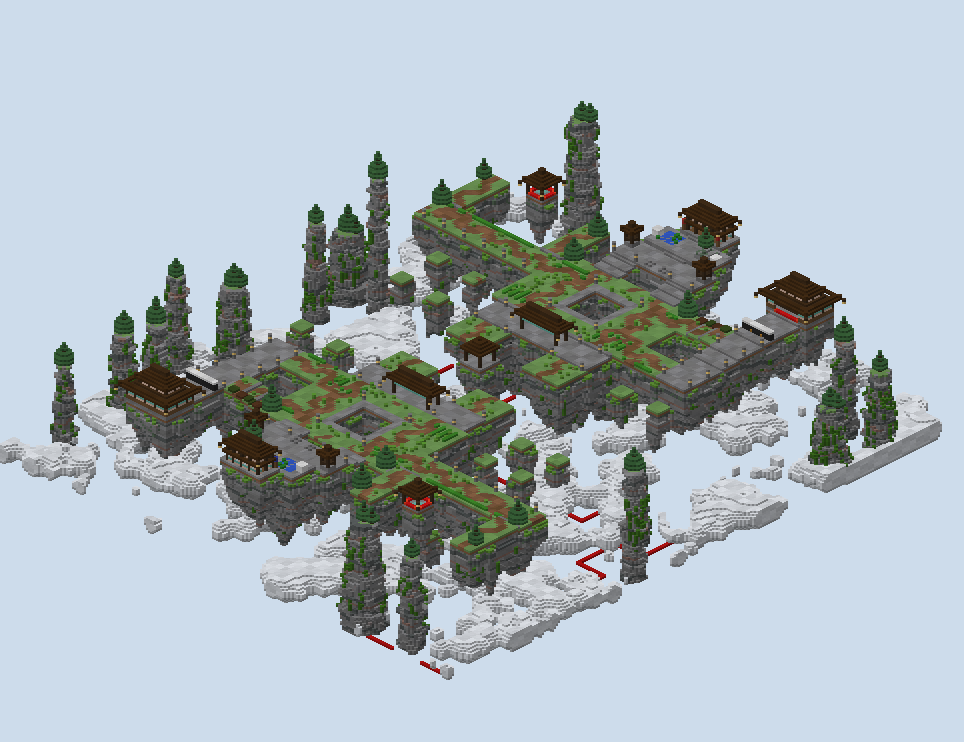

# Lantern Karst — what was built

A capture-the-wool board of floating karst islands, built from the plan in `PLAN.md` after four rounds of
the author's review. Two wools a team: lime on the Pillar Shrine and yellow in the Tea Store for red;
magenta and orange in the same rooms, turned, for blue.

## How it was made

**The world is generated, not authored through the studio.** `scripts/gen.py` builds red's half (z < 0) into
a numpy volume, turns it half a circle onto blue's with `rotate.py`, and lays the mist and the karst towers
over both halves with no symmetry. `write_world.cs` writes the volume to 1.8 region files through the
studio's own writer, and `scripts/build.sh` runs the whole thing in about twenty seconds.

**The walked top of every island is its plan polygon, exactly.** Each piece is filled at its floor height,
so every gap `plan_check.py` measured is the gap in the world. The karst is all under the floor: a cliff, a bedrock course six below, and a
fluted cone with spires below that.

**The rock is laid in beds by world height.** Stone carries them, with andesite courses, dark beds of cyan
stained clay (dark grey in 1.8), a pale bed of light grey stained clay, and specks of cobblestone and gravel.
The beds tilt a little by noise, and the karst towers carry the same beds.

**Joins between pieces are made walkable by rule.** One block of difference is a row of slabs on the lower
side. Two is a flight of stone brick stairs, the run's full width up to 14 and a flight of 10 in the middle
of a longer run, with a retaining wall either side. That is what gives the spawn its terraces.

**The floating board carries the two marks the author asked for.** Block 36 lies at y 0 under all 23,688
buildable columns, so PGM's void filter allows building there and nowhere else. The build zones are outlined
as the studio's generator does it (`ST5`): 518 blocks of unpowered redstone at y 1, two out from every
void-facing zone edge and one clear of the islands.

**Each wool room carries its entrance line (`ST1`).** A redstone line with a redstone torch at either end lies
across the Store's doorway and along all four sides of the Shrine's top, since every side of it faces the
pit's build zone.

**The spawn carries iron to mine.** Two 3 × 3 × 3 cubes of iron stand on each Pool Terrace either side of the
spawn point. The spawn region lets players break iron and nothing else, and `<renewables>` grows it back.

**The paint follows `WHAT-A-BOARD-IS-MADE-OF.md`.** Three families were named first: grass on stone for the
ground; a built floor of stone brick, polished andesite, andesite and stone, a quarter each in cells of
three; and the accent of tea green and glowstone. Paths are solid dirt, coarse dirt and spruce planks, and
they wander three blocks either side as they run from both spawn exits to every lane, room and bridging
edge.

**Ferns, large ferns and grass grow on about 6% of the grass, never on a rim a bridger leaves from.**

**Trees are pines only, and never where a bridger lands.** The islets and the ledges carry none. Pines stand
on the outer edges of the Arms, the hub's corners, the spawn's outcrop and the tops of the sixteen karst
towers out in the mist.

## What changed from the plan while building

| The plan said | What was built | Why |
|---|---|---|
| A bedrock wall 4 high across the Store Road | 2 thick, 3 courses of bedrock and one of cobweb | The studio's wall rule `ST4`; the web is cut with the shears in the kit |
| The wall 4 before the room | The wall where it was, the room 10 further back, 13 after the wall | The author's call: the wall is where attackers enter, and the room sat too close behind it |
| The Store Road climbs a block every nine | 66 past the Rows, then 67, 68, 69 in stretches of about nine, slabbed | So each step is one block and the Drying Floor meets it level |
| The Drying Floor at 67 | Rises 66, 67, 68 from the hub to the road | It joins the hub and the road with no step bigger than a slab |
| One neck from the spawn at 68 | Two exits, each 67 off the hub and 68 under the terrace | The author's last change; two one-block steps instead of one two-block one |
| A stone storehouse | A course of stone brick under spruce walls and white and jade panels | A building is never the ground it stands on; the islands are stone |
| A pool on each Ledge | No pool | The author's call: the kit has a water bucket, and the drop is the skill |
| Mist at 28 to 38 | Mist bodies at 24 to 38, never one layer thin | A clipped or single-layer body read as a flat sheet |

**Karst towers stand round the board.** Sixteen of them rise from the mist to 60–96, each at least 16 blocks
off any island or build zone of either half. They are scenery, the one part of the board the plan did not
draw.

## What the built world measures

`renders/walks.txt` walks the world on foot from each spawn, no blocks placed:

| Walk | Blocks |
|---|---|
| red spawn to its own monuments | 13 |
| red spawn to the Near Arm's end | 74 |
| red spawn to the Far Arm's end | 135 |
| red spawn to the West and East Stairs' feet at the band | 104, 105 |
| red spawn to the Store Road's foot | 116 |
| red spawn to the Store Road at its wall | 82 |
| red spawn to its own Store's door | not walked: behind the bedrock wall |
| blue spawn to anything of red's | not walked: every way crosses a build zone |

**Every enemy objective is reached only by building, which is what the plan intended.** The band, the
Pillar's pit and the two chains of steps are the only voids that can be built over. `renders/plan-check.txt`
holds the plan's own distances, unchanged from `PLAN.md`.

## The renders

- `00-plan-sketch.png`: the plan as approved, with `00-plan-sketch-v1.png` the first version.
- `01`, `03`: the studio's top-down reads of the region files, with the wool rooms boxed.
- `10`–`13`: sections through the spawns, the Pillar, the Ledges and the Store Road.
- `30`–`37`: isometric views of the board, the spawn, the Pillar, the Store, the hub and the middle.
- `50`–`53`, `60`: elevations of the Store, the Pavilion, the Pillar, the Gate and the whole board.

## What I wanted, how hard it was, and what a studio feature would need

| What I wanted | How hard it was | What a studio feature would need |
|---|---|---|
| A plan revised four times with the author before a block was placed | Easy in code: one polygon file, a checker and a three-panel sketch, rerun in seconds | A plan view that redraws as a piece is dragged, and prints the WL and SP numbers beside it |
| Lanes, gaps and holes held to stated widths (lanes 12–16, steps 12 apart, pillar 16 off) | Easy once stated; the hard part was knowing the numbers, which came from the author | Width rules per piece kind, checked on the plan with the measured value shown |
| A floating board whose build area is obvious | Moderate: block 36 at y 0 and the studio's y 1 redstone outline, both computed from the zones; I first laid the redstone on the island edges, which inverts its meaning | A build-zone layer that writes its own y 0 marker and edge line, so they cannot drift from the XML |
| A bedrock course under every island so a dug pit stops | Easy: one course six below each floor, skipped at the rim | A foundation option on a floating piece: depth and material |
| Karst cliffs instead of box sides, without moving the walked edge | Moderate: ledges and undercuts below floor-2 only, from noise | A cliff style for a piece's skirt that is guaranteed never to rise into the floor |
| Joins between pieces that are always walkable | Moderate: slabs for one block, stair flights for two, found by scanning neighbour heights | Automatic join stamping between adjacent pieces, with a flight width per join |
| A secret drop onto Ledges twenty blocks down, saved with a water bucket | Easy to build; whether it plays is untested | A playtest read of fall heights against the kit, so a drop is flagged as fatal, a skill, or free |
| Two wool colours a team on a half-turned board | Fiddly: the turn copies red's lime and yellow, which are recoloured to magenta and orange after | Per-team recolouring of turned wool, banners and monument pedestals |
| The paint the author's ruling asks for | Moderate: built floor and paths as cells of three, patches capped at about 7% | The ruling as defaults: a built-floor set, a path set and a patch cap a board starts from |
| Scenery karst towers out in the void | Easy: placed by rejection sampling at least 16 off anything playable | A scenery layer the gameplay checks ignore and the build-area marker never covers |

## After the playtest

**The bedrock wall now carries the studio's defence chests on its front face, the one the road comes up to.** It
had none; the only chests past it were the Store's, which a player had to get over the wall to find. Two chests
are set into the wall's road side at the lane's thirds, at the height a player on the road stands, each with the
block over it opened so its lid lifts. The bedrock behind each is untouched, so the wall still stands whole.

**The Store's chests carry the studio's wool-room loot, not a set of iron.** Each inner corner has two chests,
the lower with planks, Speed potions and golden apples, the upper with diamond leggings, Power bows and planks. That
is the loadout the studio's wool-room stamper gives, now in the library as `props.wool_chests`.

**The walks read back as before.** The chests stand in the Store's corners and in the wall, off every way a
player walks, and every distance in `renders/walks.txt` is unchanged.
