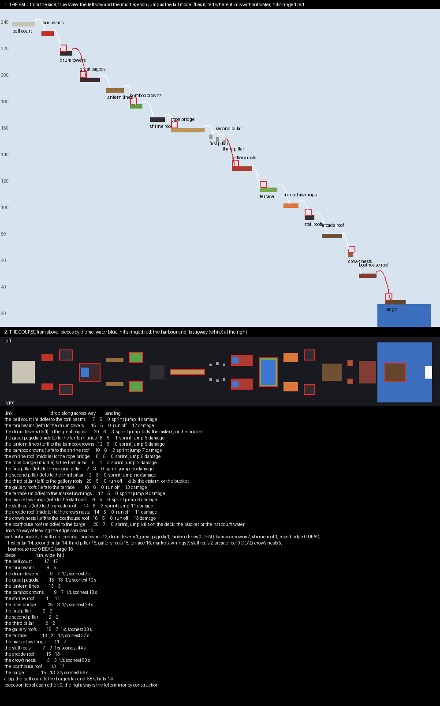

# Lantern Drop — the plan

A water drop board, planned and waiting on a review before anything is built. It is a spin-off of Lantern Pass:
the pass broken into floating pieces and run backwards, from the bell court among the snowy peaks down through
roofs, gates, bamboo, bridges and terraces to the harbour. Every player is against every other, taking hills on the
way down, and a punch anywhere can put a player in the void.

## What Limbo II is laid out like

**This plan follows Limbo II, measured from its world.** Sunwell, the plan before this one, was a closed shaft: no
void to knock anyone into and no way to run, so it was only a race down. Limbo II is a course.

- **One way:** 318 blocks long, from y 250 to y 33.
- **Small pieces over void:** about thirty-six, five to twenty-three across, each a drop of six to twenty-two below
  the last and a few blocks ahead of it.
- **A run on every piece:** three to fifteen blocks from where a player lands to the next edge.
- **Two ways:** twenty pieces on the middle line, and between them mirrored pairs six to twenty-four to either side
  that split off and meet again.
- **Hills:** fourteen, each a 5 × 5 × 5 box at a landing, taken at a touch and held through death.
- **The loop:** a launch pad at the foot throws players into a portal back to the top.

**Every water drop map in PublicMaps is a spin-off of another map's look.** Limbo II takes a King of the Hill map's,
and Sunrise over Paradise a Destroy the Monument map's. This one takes Lantern Pass's.

## The fall, in numbers

**Whether a jump can be made is read off a fall model.** It is Minecraft 1.8's fall a tick at a time: gravity, air
drag, and the push of a run or a sprint jump. How far a player is carried out from the edge before they have
fallen a given height:

| Drop | Running off | Sprint-jumping |
|---|---|---|
| 2 | 2.2 | 5.8 |
| 8 | 4.4 | 7.9 |
| 14 | 5.7 | 9.3 |
| 20 | 6.7 | 10.4 |

**A drop of nineteen or more kills with sixteen health; a shorter one hurts by its height less three.** Health comes
back a point every four seconds.

## The course

**Nineteen steps, from 240 down to 30, over three hundred blocks south.** Each piece is a fragment of the pass with
rock tapering away under it, as Lantern Pass's ridges have, hung with vines.

| Piece | Way | Top | Run × wide | What it is |
|---|---|---|---|---|
| the bell court | middle | 240 | 17 × 17 | the spawn: the court's paving, its lanterns |
| the torii beams | pair | 233 | 9 × 5 | the beams of a fallen torii |
| **the drum towers** | pair | 218 | 9 × 7 | tiled roofs; a hill on each |
| **the great pagoda** | middle | 198 | 15 × 13 | the pagoda's top roof, a rain cistern in it; a hill |
| the lantern lines | pair | 190 | 13 × 3 | timber beams strung with lanterns |
| **the bamboo crowns** | pair | 178 | 9 × 7 | the grove's crown, leaves thick enough to stand on; a hill on each |
| the shrine roof | middle | 168 | 11 × 11 | the shrine's black roof |
| **the rope bridge** | middle | 160 | 25 × 3 | the rope bridge, three wide, no rail; a hill on it |
| the gorge pillars | pair | 155, 153, 151 | 2 × 2 each | three stepping pillars, a sprint jump apart |
| **the gallery roofs** | pair | 131 | 15 × 7 | the gallery's roof, a cistern at its head; a hill on each |
| **the terrace** | middle | 115 | 13 × 21 | a rice terrace, its paddies a block deep; a hill |
| the market awnings | pair | 103 | 11 × 7 | striped awnings |
| **the stall roofs** | pair | 94 | 7 × 7 | stall roofs; a hill on each |
| the arcade roof | middle | 80 | 15 × 13 | the market arcade's timber roof |
| **the crow's nests** | pair | 66 | 3 × 3 | the barges' crow's nests; a hill on each |
| the boathouse roof | middle | 50 | 13 × 17 | the boathouse's roof |
| **the barge** | middle | 30 | 15 × 13 | a barge in the harbour; the last hill, three a second |

**The harbour is water round the barge, and its slipway sends a player back to the bell court.** Falling from the
boathouse roof into the harbour is safe anywhere; landing on the barge's deck takes a bucket.

## What each jump asks

**Every link can be made, and the checker found none that cannot.** Of the eighteen links:

- **Lethal without water, three:** onto the great pagoda, the gallery roofs and the barge, a drop of twenty each.
  Each has a cistern or the harbour to land in, or the bucket.
- **Hurting, thirteen:** two to thirteen damage each.
- **Harmless, two:** the pillars' hops.

**Without a bucket a player dies four times a lap.** That happens on the lantern lines, the rope bridge, the arcade
roof and the boathouse roof, where the damage has added up past what has grown back. A player can run the course
on the cisterns alone and take a few hills, but the bucket is what carries a player down. Low health is what makes a
punch on a narrow piece deadly.

**Most links take a sprint jump.** Five need only a run.

## The hills

**Fourteen hills: five mirrored pairs, three on the middle line, and the barge.** Each scores one point a second for
its holder; the barge scores three. Down the quickest line from the spawn:

| Hill | Wide | Soonest |
|---|---|---|
| the drum towers, a pair | 7 | 7 s |
| the great pagoda | 13 | 10 s |
| the bamboo crowns, a pair | 7 | 18 s |
| the rope bridge | 3 | 24 s |
| the gallery roofs, a pair | 7 | 33 s |
| the terrace | 21 | 37 s |
| the stall roofs, a pair | 7 | 44 s |
| the crow's nests, a pair | 3 | 50 s |
| the barge, three a second | 13 | 56 s |

**The narrow hills are the hard ones to keep.** The rope bridge and the crow's nests are three wide with void on
both sides.

**A lap, bell court to the barge's far end, is about 58 seconds.**

## The match

| Setting | Value |
|---|---|
| players | free for all, up to 40, each in their own colour |
| kit | three water buckets, locked; fists; sixteen health; three seconds of resistance at spawn |
| fighting | on everywhere but the bell court |
| placing | water only, anywhere but the bell court, taken back up at will; it never flows; the board's own water cannot be scooped |
| hills | fourteen, taken at a touch, held through death; one point a second, the barge three |
| winning | the most points when five minutes run out |
| the way back | the slipway in the harbour; a fall into the void is death, and a player respawns at the bell court |

**The scenery is Lantern Pass's.** Snowy peaks and a sea of cloud stand round the course, far out and well below it,
so nothing catches a falling player. The pieces keep the pass's materials: red lacquer, black tiles, dark timber,
paper lanterns, bamboo.
