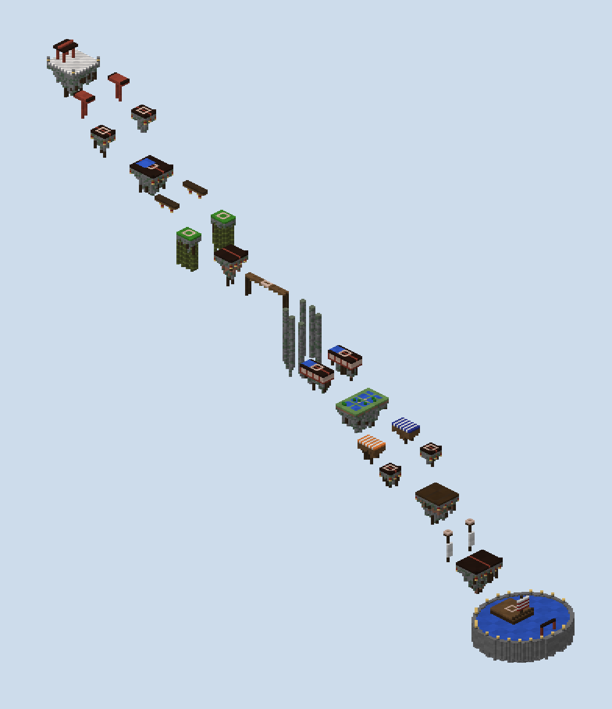
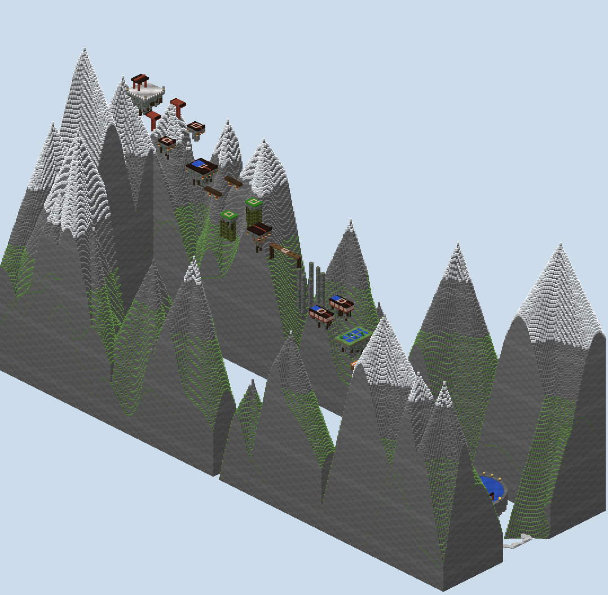

# Lantern Drop — the report

A water drop board built from the approved plan with my own generator. It is a spin-off of Lantern Pass: the pass
broken into floating pieces and run backwards, from the bell court among the snowy peaks down to a barge in the
harbour. It is laid out as Limbo II is: one way down over void, two mirrored ways that meet, fourteen hills, every
player against every other.

## What is in the folder

- `scripts/plan.py`, `plan_check.py`, `sketch.py`: the course as pieces, the checker of every jump against the fall
  model, and its drawing, as reviewed.
- `scripts/gen.py`: the generator. `scripts/mapxml.py` writes `map.xml` from the plan and the generator.
- `scripts/walk.py`: the built world read back: jumps, runs, water, hills and the void.
- `scripts/build.sh`: the whole build from nothing, in about twenty seconds.
- `world/`: the region files, `level.dat` and `map.xml`.
- `renders/`: the plan sketch, the studio's top-down and heightmap, two long sections, isometric views,
  `plan-check.txt` and `walks.txt`.

## The course as built

**Thirty pieces, from the bell court at 240 to the barge at 30, over three hundred blocks south.** Each keeps Lantern
Pass's materials and has rock tapering under it, hung with roots.

| Piece | How it is built |
|---|---|
| the bell court | quartz and andesite paving, stone lanterns at its corners, the bell tower at its back |
| the torii beams | red beams capped black, their broken posts hanging below |
| the drum towers, the shrine roof, the stall roofs, the boathouse roof | black tiles with a red ridge, lanterns hung from the eaves |
| the great pagoda | the same, with a rain cistern three deep at its near end |
| the lantern lines | dark timber beams with lanterns hung under them |
| the bamboo crowns | leaves to stand on, a grove of stalks hanging below |
| the rope bridge | planks on ropes, three wide, no rail, anchor posts hanging from its ends |
| the gorge pillars | stone columns rising thirty and more out of the void |
| the gallery roofs | tiles over red and white walls, a cistern at their head |
| the terrace | grass, its paddies a block deep between the bunds |
| the market awnings | striped wool on timber |
| the arcade roof | dark timber |
| the crow's nests | a platform on a mast, a furled sail below |
| the barge | a deck over a dark hull, its mast and striped sail at the stern, in a round harbour six deep |

**Round the course stand the snowy peaks, and a sea of cloud lies far below.** None of it comes within thirty-eight
blocks of the course's line or near its two ends.

## Read back from the blocks

**Every check passes on the built world** (`renders/walks.txt`).

- **The jumps:** for every link, nothing stands in the air a player crosses from one piece's far edge to the next,
  across both pieces' widths, and the first three rows of every landing are clear.
- **The runs:** every piece can be run across from its near edge to its far edge.
- **The water:** both cisterns are three deep, the paddies one deep, and the harbour six deep everywhere round the
  barge.
- **The hills:** all fourteen borders are of white clay, which PGM recolours to the hill's holder.
- **The void:** nothing within reach of the course but its own pieces and the harbour, so a player knocked off any
  piece falls to their death.

**The last check found the most.** My first dressing hung vines down the pieces' rims and gave the crow's nests a
sail wider than the nest. A falling player who touches a vine is caught by it, so both would have saved the very
players a punch is meant to kill. The roots now hang only under a piece's own footprint, and the sail is no wider
than its nest.

**Two smaller faults were found and fixed the same way.** Upturned roof corners stood in the rows where players land;
they are now on the far corners only. The barge's rail ran along its bow; it is now at the stern. The big peak behind
the bell court was moved back out of reach of anyone knocked off the court's back edge.

## The match

**`map.xml` is written by `scripts/mapxml.py`.** It follows Limbo II's structure and PGM's parser.

- **Players:** free for all, up to forty, each in their own colour.
- **Kit:** three locked water buckets, sixteen health (`health boost -2`), three seconds of resistance, survival so
  water can be placed.
- **Hills:** fourteen control points, `capture-time="0.1s"`, `neutral-state="false"`, each with a player filter so a
  holder does not retake their own hill. One point a second each, three for the barge.
- **Water:** players place and pick up water anywhere but the bell court, and it never flows. The board's own
  cisterns, paddies and harbour cannot be scooped up or built into.
- **Safety:** no damage and no placing in the bell court.
- **The way back:** the slipway's portal in the harbour returns a player to the bell court. Falling below y −5
  sends them sixty-four further down, to die at once, as Limbo II does.
- **Winning:** the most points when five minutes run out.

## What was not done

**The map has not been loaded on a PGM server or played.** The XML follows Limbo II and the parser, but the jumps'
feel, the hills' scoring and whether five minutes is right want a real match.

**The fall model is a model.** It is Minecraft 1.8's per-tick physics for a run and a sprint jump, without sprint
jumping's small variations or a player steering in the air. Every link clears with some margin, but the tightest,
a sprint jump of nine to ten over a drop of twenty, should be tried by hand.

## The renders

- `00-plan-sketch.png`: the approved plan.
- `01`, `02`: the studio's top-down and height reads of the region files.
- `10`, `11`: long sections down the left way and down the middle, true scale.
- `30`–`37`: isometric views:
  - the course among its peaks;
  - the course alone from both sides;
  - each stretch close, down to the boathouse and the harbour.

## What I wanted, how hard it was, and what a studio feature would need

| What I wanted | How hard it was | What a studio feature would need |
|---|---|---|
| A course laid out as the genre's best map is | Moderate: Limbo II measured from its world, and the first plan thrown away when it was the wrong shape | A course template read from a reference map: piece sizes, drops, runs, the split and merge of ways |
| Jumps that can be made, and drops that kill | Moderate: Minecraft's fall a tick at a time, every link tested, health carried down the line | A jump read between two pieces, with damage and the gentlest way that clears it |
| A void that kills | Easy once the checker looked for it, after vines and a sail were found catching fallers | A no-catch check: nothing within reach of a course but the course |
| Fourteen hills held through death | Easy: Limbo II's control points, a box over each landing, the border in clay that takes the holder's colour | Hill pieces that write their own control points |
| A spin-off of an existing board | Easy: the parent's materials, pieces and scenery carried over | A style read from a board, applied to another's layout |
| Validation of a water drop map | Not attempted | Control points and portals in the studio's round-trip |
