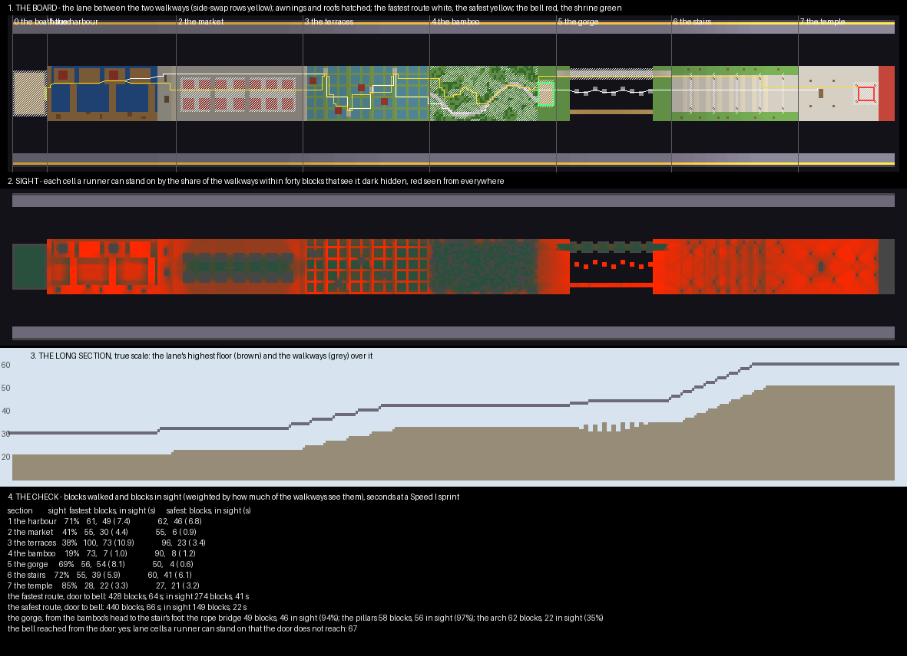

# Lantern Pass — the plan

A runners-and-shooters board, planned and waiting on a review before anything is built. A festival road climbs from
a harbour through a market, rice terraces, a bamboo grove, a gorge and a great stair to a mountain temple. Some
twenty runners cross it on one life each, while four shooters with power bows run along two walkways above the
lane across the void. A runner who holds the temple bell for two seconds wins it for the runners.

## What the runner maps in PublicMaps do

**Ten of PublicMaps' seventy arcade maps are this game.** Among them are Crossfire, Pixel Run, Biomes, Penguin
Pursuit, Rainbow Road and Sugar Cane Valley. They share one shape and one set of rules.

**The board is a long lane with a walkway on each side, across void.** I measured three of them:

| Map | Length | Lane width | Walkway width | Void between | Walkway over the lane |
|---|---|---|---|---|---|
| Crossfire | 656 | 28 | 5 | 17 | 9 to 16 |
| Penguin Pursuit | 407 | 24 | 7 | 11 | 0 to 24, stepping with the lane |
| Pixel Run | 648 | 16 | 3 | about 30 | about level |

**The lane is cut into themed sections.** Crossfire runs a desert town, a gravel field, cave islands and water.
Pixel Run makes each section a different retro game, and Penguin Pursuit runs snow, ice and open water.

**The rules are nearly the same everywhere.**

- **Teams:** up to 25 runners against 4 or 5 shooters.
- **Runners:** one life (`<blitz><lives>1</lives>`), Speed I, no fall damage. A broken wooden sword in Crossfire,
  a boat to cross its water.
- **Shooters:** an unbreakable bow with Power 3 and Infinity, often Punch, and Speed 3. Crossfire upgrades the bow
  after a three-kill streak.
- **The end:** the shooters win when a five- or six-minute clock runs out. The runners win by breaking a sponge
  monument at the end (Crossfire, Biomes), or by reaching a control point that captures in 0 to 2 seconds
  (Penguin Pursuit, Pixel Run).
- **On the way:** a strip that restores health (`<apply kit="regen">`), launch pads (`<apply velocity>`), and no
  building at all.

**A shooter changes sides through a portal.** Penguin Pursuit puts a portal along the outer row of each walkway,
which moves a shooter to the other walkway. Biomes and Penguin Pursuit link the walkway's levels with portals and
launch pads where the lane steps.

## What a runner map is made of

**The lane's whole design is what the shooters can see.** A runner has one life, and every section is a question of
how long they spend in sight and what they trade to spend less. So the checker reads sight first.

**Only a roof hides a runner.** Shooters stand ten above and look along forty blocks of walkway from both sides. My
first plan put crates, stalls and huts on the ground and was 80 to 100% in sight in every section. Cover that
stands on the ground only hides a runner from a shooter standing level with them.

**The checker measures each cell by the share of shooter positions that see it.** A position is the inner edge of
either walkway within forty blocks. A cell seen from one window scores near nothing; a quay seen from everywhere
scores near one. The fastest route and a safest route are then walked through each section
(`scripts/plan_check.py`).

## The board

**The lane is 24 wide and 386 long.** The walkways are 5 wide, across 14 blocks of void on either side, and stand
ten over the highest lane beside them. They step with the lane, never more than a block a block.

| Section | Length | Height | What it is | How much is in sight |
|---|---|---|---|---|
| 0 the boathouse | 15 | 20 | the runners' spawn, shut for a 10-second warm-up | — |
| 1 the harbour | 56 | 20, water 18–19 | a boardwalk on the west, three piers across, a chain of four barges a jump apart, open water between | 71% |
| 2 the market | 55 | 22 | two rows of stalls; open avenues at the sides, a roofed arcade down the middle with two light wells | 41% |
| 3 the terraces | 55 | 24 to 32 | five rice terraces, paddies and bunds, a stair cut in each riser, moved from side to side | 38% |
| 4 the bamboo | 55 | 32 | a grove too thick to see through, its crown closed overhead, one wandering path; the shrine at its head heals | 19% |
| 5 the gorge | 50 | 32 to 34 | void across the lane: a rope bridge, stepping pillars, or a walled gallery on a low arch | 69% |
| 6 the stairs | 55 | 34 to 50 | the temple's great stair, five torii over it, lanterns and pines either side | 72% |
| 7 the temple | 42 | 50 | the court, and the bell tower at its head | 85% |

**Open and covered sections take turns.** The harbour is open, the market half covered, the terraces open, the
bamboo almost hidden. Then the gorge is a choice between the two, and the last two sections are the exposed dash
to the bell.

## The routes

**Each section has a fast way and a covered way.** The checker's walk from the boathouse's door to the bell, in
blocks, with the blocks in sight weighted by how much of the walkways see them (`renders/plan-check.txt`):

| Section | Fastest: blocks, in sight | Safest: blocks, in sight |
|---|---|---|
| 1 the harbour | 61, 49 | 62, 46 |
| 2 the market | 55, 30 | 55, 6 |
| 3 the terraces | 100, 73 | 96, 23 |
| 4 the bamboo | 73, 7 | 90, 8 |
| 5 the gorge | 56, 54 | 50, 4 |
| 6 the stairs | 55, 39 | 60, 41 |
| 7 the temple | 28, 22 | 27, 21 |

**Door to bell is 428 blocks, about 64 seconds at a Speed I sprint.** The fastest way spends 41 of those seconds in
sight. The safest is twelve blocks longer and spends 22.

**The gorge's three crossings trade length for sight.**

| Crossing | Blocks | In sight | What it costs |
|---|---|---|---|
| the rope bridge | 49 | 94% | two wide, no rail: a Punch arrow puts a runner in the void |
| the stepping pillars | 58 | 97% | nine pillars two apart, a sprint jump each, some a block up |
| the arch | 62 | 35% | down six, across under a roof between walls with windows, up eight |

## The match

| Setting | Value |
|---|---|
| teams | runners up to 25, shooters up to 4 |
| runners | one life, Speed I, leather in their colour, no fall damage |
| shooters | an unbreakable bow, Power 3, Punch 1, Infinity; Speed 2; they spawn at the boathouse end of both walkways |
| the end | the runners win when one stands under the bell for 2 seconds (a control point); the shooters when 5 minutes run out |
| on the way | the bamboo shrine restores health on entering; the boathouse cannot be re-entered |
| the walkways | the outer row of each moves a shooter to the other walkway; nobody can break or place anything |

## What I would like a ruling on

- **The void.** The genre needs it: a runner knocked off the lane must be out. I would build the lane and the
  walkways as ridges with rock tapering away under them, not as slabs, with mist and distant peaks far below.
  Falling still ends a runner's life.
- **The finish.** A bell held for two seconds (Penguin Pursuit, Pixel Run) rather than a sponge broken behind
  cobwebs (Crossfire, Biomes). The bell makes the last dash a stand under fire.
- **The theme.** A festival road to a mountain temple: dark timber, red lacquer, paper lanterns, bamboo, rice
  water. It is far from the harbour, citadel and mining boards already built.
