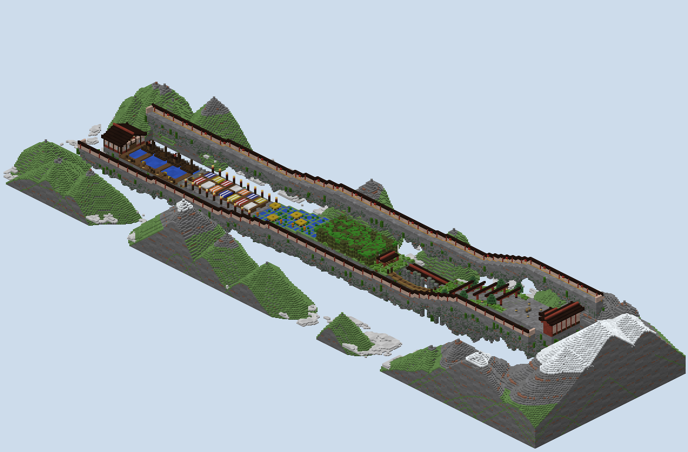
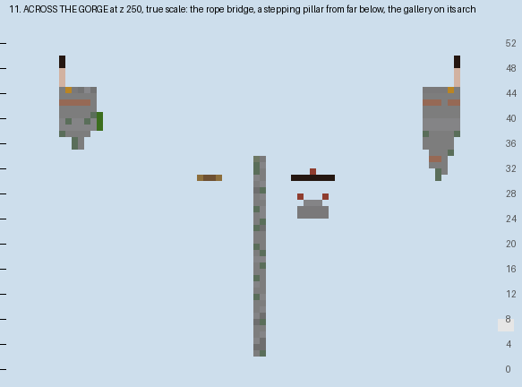

# Lantern Pass — the report

A runners-and-shooters board, built from the approved plan with my own generator. A festival road climbs from a
harbour to a mountain temple in seven sections. Runners cross it on one life each, and four shooters run the two
walkways above it. Ridges and the bell were confirmed in review.

## What is in the folder

- `scripts/plan.py`, `plan_check.py`, `sketch.py`: the plan raster, the checker of sight and routes, and its
  drawing, as reviewed, with the one fix below.
- `scripts/gen.py`: the generator. `scripts/mapxml.py` writes `map.xml` from the plan and the generator.
- `scripts/walk.py`: the built world read back: the run walked and sight measured through the real blocks.
- `scripts/build.sh`: the whole build from nothing, in under a minute.
- `world/`: the region files, `level.dat` and `map.xml`.
- `renders/`: the plan sketch, the studio's top-down and heightmap, cutaways, isometric views, `plan-check.txt` and
  `walks.txt`.

## The ridges

**The lane and both walkways are ridges of rock, not slabs.** Under every column the rock goes down by how far the
column is from its ridge's edge: three or four blocks at the rim, twenty and more at the spine, broken by noise.
The undersides are mossy and hung with vines.

**Nothing below can catch a falling runner.** The peaks and the sea of cloud stand only beyond the walkways' outer
walls and past the board's two ends, at least six blocks clear of anything a runner could fall from. The stepping
pillars rise from the void's floor at y 2, and a runner who misses one falls past it.

## The run, walked on the blocks

**The built world runs as planned.** These walks are on foot over the built blocks, with every drop allowed and
sprint jumps over gaps of up to three (`renders/walks.txt`).

- **The warm-up:** before the boathouse's gate opens, no runner leaves the boathouse.
- **The run:** gate open, the boathouse to the bell is 455 blocks, against the plan's 440.
- **The gorge:** each crossing works on its own. With only the rope bridge it is 451 to the bell, with only the
  pillars 467, and with only the arch 463.
- **The sides:** no place on a walkway is reachable by a runner, and no place on the lane by a shooter.
- **The walkways:** shooters walk each of them from the spawn to the temple, 371 blocks.

## Sight, measured through the built blocks

**The share of the walkways that sees a runner, section by section.** For every place a runner reaches, a ray is
traced from every shooter position within forty blocks to the runner's body and head, through the real blocks.
Water, rails and fences are counted as see-through.

| Section | Built | Plan |
|---|---|---|
| 1 the harbour | 65% | 72% |
| 2 the market | 32% | 41% |
| 3 the terraces | 78% | 58% |
| 4 the bamboo | 17% | 20% |
| 5 the gorge | 73% | 69% |
| 6 the stairs | 63% | 72% |
| 7 the temple | 84% | 85% |

**Covered and open still alternate.** The market and the bamboo are the two covered sections, the terraces, gorge,
stairs and temple court the open ones, and the harbour sits between them.

**The terraces are more open than the plan said.** The plan had dropped each paddy's floor a block but had left
its solid top where it was, so rays over the water were counted as blocked. With that fixed, the plan reads 58%. The
built world, which counts every place a runner can stand including wading heights, reads 78%. The built figure is
the true one: the terraces are the second most open section.

## The match

**`map.xml` is written by `scripts/mapxml.py`.** It follows PublicMaps' runner maps and PGM's parser.

- **Teams:** runners up to 25 in light purple, shooters up to 4 in dark blue.
- **Lives:** `<blitz filter="only-runners">` gives the runners one life; the shooters respawn.
- **Kits:** runners get Speed I and leather. Shooters get an unbreakable bow with Power 3, Punch 1 and Infinity,
  and Speed II.
- **The end:** the bell is a control point that captures in 2 seconds for the runners alone, under the bell
  tower. The shooters win when 5 minutes run out.
- **On the way:**
  - the boathouse's gate opens after a 10-second warm-up, and a runner cannot go back in;
  - the shrine at the bamboo's head restores health;
  - the yellow outer row of each walkway is a portal to the other walkway;
  - fall damage is off and nothing can be broken or placed.

## What was not done

**The map has not been loaded on a PGM server or played.** The XML follows the parser's source and the runner maps
in PublicMaps, but how the swap portals feel, and whether five minutes is right, wants a real match.

**The walk's jumps are a model of a sprint jump.** The stepping pillars are two apart and at most one up, inside it.
Whether a runner with Speed I clears them in practice was not tested.

## The renders

- `00-plan-sketch.png`: the plan, with the terraces' sight corrected.
- `01`, `02`: the studio's top-down and height reads of the region files.
- `10`–`13`: cutaways at true scale, drawn by `scripts/cutaway.py`:
  - across the market;
  - across the gorge;
  - along the arch;
  - up the great stair to the bell and the hall.
- `30`–`39`: isometric views:
  - the whole pass from either end;
  - each section close;
  - the bamboo under its crown;
  - the bell tower.

## What I wanted, how hard it was, and what a studio feature would need

| What I wanted | How hard it was | What a studio feature would need |
|---|---|---|
| A lane whose design is what the shooters see | Moderate: a sight read per cell, as the share of shooter positions with a clear ray, on the plan and then through the built blocks | Sight from a set of positions as a read on the plan and on the world, drawn as a heat map |
| Sections that are covered or open by choice | Moderate: ground cover hid nothing from shooters ten above; only roofs, crowns and walls did | Canopy pieces (awning, roof, tree crown) that the sight read counts |
| Routes that trade time for cover | Easy once sight was a number: a fastest and a safest route, each priced in blocks in sight | A route read with a weight on exposure, per section |
| Ridges over a void, not slabs | Easy: rock depth from each column's distance to its ridge's edge, noise, moss and vines below | A void-edge style for pieces: tapered, ragged, hung |
| Scenery that never saves a faller | Easy: peaks and cloud kept six blocks clear of anything a runner can leave | A no-catch margin under and around a lane |
| Shooters who swap sides | Easy: a portal on each walkway's outer row, offset to the other | Paired walkways with a swap row, the portal written into the XML |
| Validation of a runner map | Not attempted | Blitz, portals and control points in the studio's round-trip |
