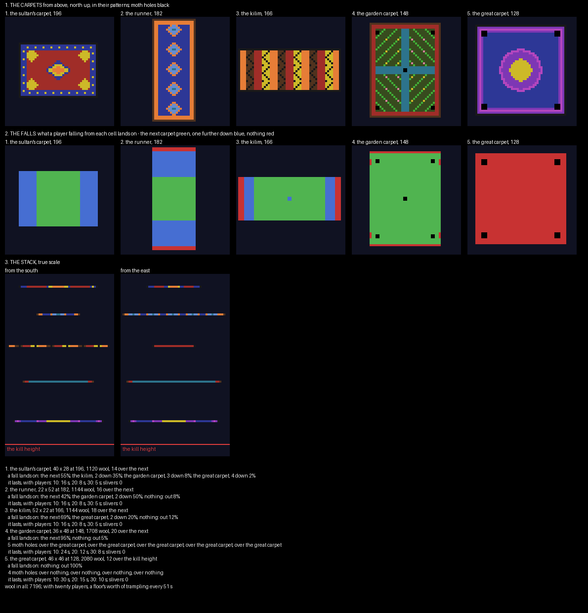

# Loomfall — the plan

A wool run board, planned and waiting on a review before anything is built. Five flying carpets hang one under
another over a desert city at night, each woven in its own pattern. Every block of wool a player steps on drops out
from under them, so a player who stops falls to the carpet below, and from the last one, out. The last player
standing wins.

## What the spleef maps in PublicMaps do

**The spleef family is four games.**

- **Crazy's Wool Run** is Hypixel's TNT Run: five round wool floors, about 51 across, stacked 13 to 22 apart over
  lava, falling away under every step.
- **Ghost Spleef** is a snow floor dug out from below by invisible ghosts.
- **TNT Spleef** is a floor blown apart with TNT and grenades, regrowing every forty seconds.
- **Skyfall** is a floor that never breaks under TNT falling from the sky.

**This plan is a wool run.** All four games give each player one life, and in all four the last one standing wins.

**Crazy's Wool Run makes its floors fall with two PGM modules.**

- **Block drops:** `<block-drops>` has a `trample="true"` rule that turns any wool a player walks on into white
  wool.
- **Falling blocks:** a `<falling-blocks>` rule makes white wool fall, with `<sticky><never/>`, so no neighbour
  holds it up.
- **The rest:** fall damage is off, PvP is off, and each player has five snowball grenades. Below y 0 a kit of harm
  kills.

**A trampled block falls only if nothing solid is under it.** PGM's falling-blocks rule always counts a solid block
directly below as support. So a carpet must be a single sheet of wool over air. Anything hung under it would hold
the wool up, and anything a player could land on beside it would be a place to wait out the match. No carpet can
be woven with white, which falls the moment it is placed.

## The board

**Five carpets, crossways, each turned from the one above.** Each is one sheet of wool.

| Carpet | Size | Height | Wool | Its pattern |
|---|---|---|---|---|
| the sultan's carpet | 40 × 28 | 196 | 1120 | a red field, a blue border spotted with gold, a gold medallion, gold quarter-medallions in the corners |
| the runner | 22 × 52 | 182 | 1144 | five cyan diamonds down a blue field, an orange border |
| the kilim | 52 × 22 | 166 | 1144 | stepped bands of orange, brown, red and yellow with black zigzags |
| the garden carpet | 36 × 48 | 148 | 1708 | four green gardens with flowers, cyan water crossing between them; five moth holes |
| the great carpet | 46 × 46 | 128 | 2080 | a gold star in purple rings on deep blue; four moth holes |

**Below the great carpet, at 116, is the kill height.** The city lies further down: domes, minarets and lit
windows. Floating paper lanterns hang far above the carpets and well clear of their edges, where no player can
reach one.

## Where a fall lands

**Every carpet's ends hang over something different.** The checker reads, for every cell of every carpet, what a
player falling from it lands on (`renders/plan-check.txt`):

| Carpet | the next | further down | nothing: out |
|---|---|---|---|
| the sultan's carpet | 55% | 45%: the kilim, the garden carpet, the great carpet | 0% |
| the runner | 42% | 50%: the garden carpet | 8% |
| the kilim | 69% | 20%: the great carpet | 12% |
| the garden carpet | 95% | — | 5% |
| the great carpet | — | — | 100% |

**A fall past the next carpet is a shortcut to fresh wool.** The ends of each carpet lie over a carpet two or three
down that nobody has walked yet, so a player who drops there early lands where the wool is whole. The far ends of
the runner and the kilim lie over nothing, and a player trapped there is out.

**The moth holes do the same in the middle of a carpet.** The garden carpet's five holes open onto the great carpet;
the great carpet's four open onto nothing.

## How long the wool lasts

**Wool in all: 7,196, against Crazy's Wool Run's 8,200.** A running player tramples about seven cells a second. With
twenty players, that is a whole carpet's worth every eight to fifteen seconds, and the whole board's worth every
fifty. The real match runs longer, because players run on the same wool together and stand still to drop.

**No carpet narrows to a sliver.** Every cell of wool has at least two neighbours of wool.

## The match

| Setting | Value |
|---|---|
| players | free for all, up to 40 |
| kit | five snowball grenades, adventure mode |
| the wool | trampled wool turns white and falls after half a second; falling wool that lands on a carpet below is cleared, so the carpets stay flat |
| damage | none from falls, none from players |
| the end | a player below the kill height is out; one life each; the last standing wins; a ten-minute clock in case |

## What I would like a ruling on

- **The theme.** Flying carpets over a desert city at night, a look of its own.
- **Five grenades**, as Crazy's Wool Run gives, to blow wool out from under other players.
- **Half a second** before trampled wool falls. Crazy's Wool Run uses PGM's default, two ticks, a tenth of a second.
