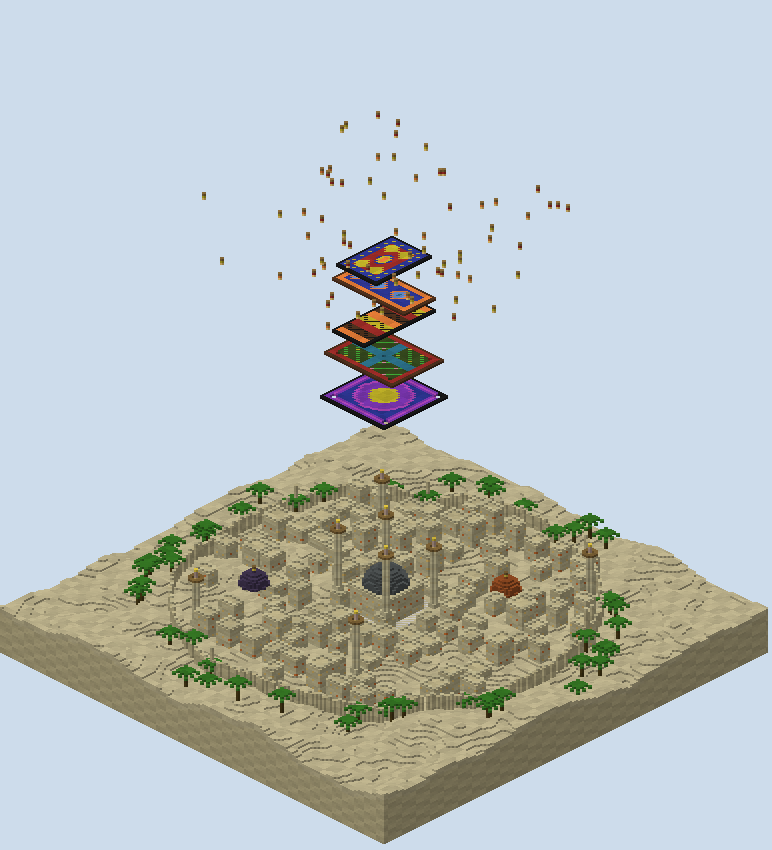

# Loomfall — the report

A wool run board built from the approved plan with my own generator. Five flying carpets hang one under another over
a desert city at night, each woven in its own pattern. Every block a player steps on turns white and drops out from
under them, and the last player still flying wins.

## What is in the folder

- `scripts/plan.py`, `plan_check.py`, `sketch.py`: the carpets with their holes and patterns, the checker of what
  every fall lands on, and its drawing, as reviewed.
- `scripts/gen.py`: the generator. `scripts/mapxml.py` writes `map.xml` from the plan.
- `scripts/walk.py`: the built world read back: the wool, the falls, and nowhere to wait.
- `scripts/build.sh`: the whole build from nothing, in about fifteen seconds.
- `world/`: the region files, `level.dat` and `map.xml`.
- `renders/`: the plan sketch, the studio's top-down and heightmap, two cutaways, isometric views of the stack and
  the city, each carpet alone, `plan-check.txt` and `walks.txt`.

## What was built

**Five carpets, each a single sheet of wool over air.**

- the sultan's carpet, 40 × 28 at 196, red with a gold medallion;
- the runner, 22 × 52 at 182, cyan diamonds on blue;
- the kilim, 52 × 22 at 166, stepped bands with black zigzags;
- the garden carpet, 36 × 48 at 148, four gardens and their water, with five moth holes;
- the great carpet, 46 × 46 at 128, a gold star in purple rings, with four moth holes.

**The city lies far below, its highest block at 66, fifty under the kill height.** It is a walled desert town of
flat-roofed houses with lit windows, a great mosque with a cyan dome and four minarets, more minarets and domes
across the town, and palms outside the walls. Seventy paper lanterns float above the top carpet.

## Read back from the blocks

**Every check passes on the built world** (`renders/walks.txt`).

- **The wool:** every carpet cell is wool in its pattern's colour, none of it white, and nothing solid is under any
  of it. PGM counts a solid block below as holding a falling block up, so this is what lets every trampled block
  fall.
- **The falls:** from every cell, straight down through the built blocks, the first thing above the kill height is
  the carpet the plan says, or nothing.
- **Nowhere to wait:** above the kill height there is nothing but the carpets and the lanterns over the top carpet.

**The last check changed the lanterns.** My first build scattered them round the stack at every height, well out from
the carpets' edges. With no fall damage, a long sprint jump off an edge carries a player sixteen and more blocks out
over a long fall, and a lantern stood on would have been a place to wait out the match. All of them now float six
and more over the top carpet.

## The match

**`map.xml` is written by `scripts/mapxml.py`.** It follows Crazy's Wool Run and PGM's parser.

- **Players:** up to forty, adventure mode, five snowball grenades each.
- **The wool:** a `<block-drops>` rule with `trample="true"` turns stepped-on wool white. A `<falling-blocks>` rule
  makes white wool fall half a second later, with `<sticky><never/>` so no neighbour holds it.
- **Clearing:** falling wool is cleared twice a second, as Dynamight Versus clears its falling blocks, so none
  lands on a carpet below as a bump.
- **The end:** a kit of harm below y 116 puts a player out. One life each, the last standing wins, with a ten-minute
  clock.
- **Damage:** none from falls or from other players; only the void and the harm kit.
- **Night:** `<world><timeset>18000</timeset><timelock>on</timelock></world>`, so the lanterns and windows glow.

## What was not done

**The map has not been loaded on a PGM server or played.** The trample and falling rules follow Crazy's Wool Run and
PGM's source, but how fast the carpets wear away, and whether half a second suits, want a real match.

**The falling wool is cleared on a timer.** Wool that falls past the half-second pulse could land on a carpet below
before it is cleared. A pulse twice as fast, or a falling-blocks region, would make it surer.

## What I wanted, how hard it was, and what a studio feature would need

| What I wanted | How hard it was | What a studio feature would need |
|---|---|---|
| Floors that fall away under a step | Easy once PGM's source was read: a single sheet of wool over air, nothing solid under it, no white woven in | A wool-run floor piece that keeps its underside empty |
| A stack whose ends land somewhere different | Easy: carpets crossways, every cell's fall read on the plan and again through the built blocks | A fall read per cell between stacked floors |
| Nowhere to wait out the match | Moderate: the lanterns had to move once the checker counted what a long jump could reach | A no-stand check: nothing reachable above the kill height but the floors |
| Patterns that read as rugs | Moderate: a pattern function per carpet, borders, medallions, diamonds, bands, gardens, a star | Pattern fills for flat pieces |
| Validation of a wool run | Not attempted | Block drops and falling blocks in the studio's round-trip |

## After the playtest

**Every carpet is now 0.7 of its old length and width, which is 49% of its area.** The playtest called them far too large. I scaled each dimension rather than only the area, so each carpet keeps its proportions and its place on the axis, and every height and gap between carpets is unchanged. The sizes went from 40 by 28, 22 by 52, 52 by 22, 36 by 48 and 46 by 46 to 28 by 20, 16 by 36, 36 by 16, 26 by 34 and 32 by 32.

**The moth holes keep their size and move with the scaling.** Each hole sits at its old place times 0.7, still symmetric about the board's axis, so the garden carpet's five holes still lie over the great carpet and the great carpet's four over nothing. Total wool read back is 3,564 blocks, where it was 7,196, and the spawn, the lanterns and the city beneath follow the plan.

**The plan check still passes, and a carpet lasts half as long.** No carpet cell is off its pattern, white, or held up from below, and every fall lands where the plan says. The sultan's carpet lasts 4 seconds with twenty players, where it lasted 8, and the great carpet 7 against 15. A fall off the runner is out 6% of the time against 8%, and the kilim's 11% against 12%. map.xml reads valid with no issues.
