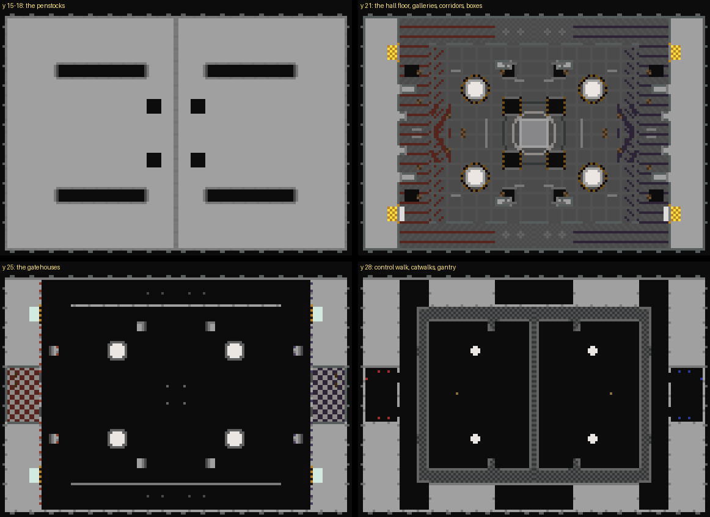

# Penstock — the plan

A Team Deathmatch board with score boxes: the inside of a hydroelectric station, carved out of one block of
concrete hanging in the void. A kill is a point and a score box two; the team with more after ten minutes wins.

## What already exists, and what I took from it

**Facility is the reference, read from its region files and XML.** It is a roofed hall about 75 × 125 blocks,
several levels high, with a spawn at each end and two score boxes in the wall beside each spawn. Its
corridors and floor are trimmed in each team's colour, and its middle is open. Diamonds spawn in the centre
and arrows in the side rooms, and a kill streak pays in diamonds.

**What makes a TDM board different is that the fight is the objective.** So the ground is flat, the sight
lines are long but broken by cover, and every level is reached by more than one way. The score boxes stand
where a defender leaving the spawn sees them.

**What I did not take is its plan.** Penstock is longer (140 × 96), has a hall with two levels over it and
two tunnels under it, and its holes go straight into the void.

## The places (red's; blue's are the mirror)

| Place | Size | Floor | What it is |
|---|---|---|---|
| The Gatehouse | 13 × 22 | 24 | spawn: four over the gallery, the shop at its back, windows and two exits down |
| The Intake Gallery | 12 × 94 | 20 | the team's back line, full width, the score boxes in its back wall |
| The two Sluices | 4 × 6 each | 21 | the score boxes, either side of the Gatehouse, framed in hazard stripes |
| The Control Walk | 5 × 72 | 27 | a deck over the gallery's front, two flights up, joining both catwalks |
| The Turbine Hall | 86 × 72 (both halves) | 20 | open to the roof; two generators a side, the Exciter in the middle |
| The Catwalks | 6 wide, both long walls | 27 | the upper level, railed, a flight up from the hall floor on each side |
| The Gantry | 4 × 60 | 27 | a bridge across the middle over the Exciter, joining the two catwalks |
| The Exciter | 12 × 12 dais | 22 | the diamond spawner, two steps up, in the middle of everything |
| The Tailrace Shafts | 6 × 6, two a side | — | holes in the hall floor into the void, railed on two sides only |
| The Penstocks | 5 × 34, two a side | 14 | tunnels under the hall, from the gallery down a stair to the middle up a stair |
| The Cable Corridors | 10 × 27, two a side | 20 | the low flanks outside the hall walls, three doors into the hall |
| The Pump Rooms | 32 × 10, two | 20 | where the corridors meet in the middle of each flank; the arrow spawners |

## The two score boxes

**Each team's two boxes are behind its own back wall, either side of its spawn.** An attacker has to cross
the whole station, through the enemy's gallery under their spawn's windows. Entering one scores two and
sends the scorer home.

**The two are guarded differently.** The north Sluice has a curtain of cobweb in its doorway, so an attacker
has to push through it. The south Sluice is open, but a strip of cobweb two deep lies on the floor in front
of it, where a defender can knock an attacker back into it.

## Economy

- **Diamonds** spawn on the Exciter every 25 seconds, one at a time, and pay for kill streaks of 2, 4 and 7.
- **Arrows** spawn in both Pump Rooms, four every 8 seconds, up to eight on the floor.
- **The shop** is a villager behind the Gatehouse counter: an iron sword for 3 diamonds, a Power II bow
  with ten uses left for 2, iron armour for 2 to 4, golden apples and leaves for 1.
- **The kit** is a stone sword, a bow, 16 arrows, a golden apple, 8 leaves and leather and chain armour.

**No block can be placed or broken except leaves.** A kill pays four, and a player may wall themselves into a
corner to heal. The spawns and the boxes take no blocks at all.

## Look

- **Concrete:** smooth stone, all faces; cyan clay (dark grey) for base courses, beams and pipes; stone brick
  pilasters every six; quartz for white; sea lanterns in the ceiling grid.
- **The team's side:** its gallery floor striped in its colour, a band of it round every wall of its gallery,
  corridors and spawn, a mural of diagonal bands on its back wall, a chevron at its end of the hall, and a
  checkered spawn floor.
- **The machine:** the penstocks run under the roof to each generator and drop into it; an overhead crane
  crosses the hall; rings of quartz and dark round the Exciter; hazard stripes at every hole and box.
