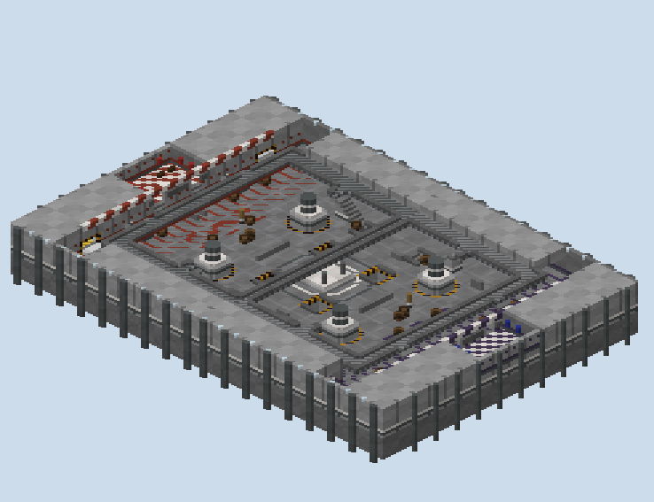

# Penstock — what was built

A Team Deathmatch board with score boxes, built in one pass from `PLAN.md`: the inside of a hydroelectric
station, 140 × 96 blocks, red in the west and blue in the east.

## How it was made

**The station is carved, not assembled.** `scripts/gen.py` fills red's half with one block of concrete and
cuts every room, hall, corridor, tunnel and box out of it as a box of air. Decks, stairs and furniture go back
in, and the shafts are cut through everything to the void. Then the half is mirrored onto blue's and
recoloured, and `write_world.cs` writes the region files.

**The paint is read off the carving.** Every exposed face of the mass is painted by what it faces: a floor by
the space it is the floor of, a wall by how high it stands above that space's floor, a ceiling by its place in
a grid of beams and lights. That is what puts the team's band round every wall of its own spaces and nowhere
else, and lines the tunnels in brick.

**The plan picture is read from the build.** `scripts/levels.py` slices the volume at the tunnels, the floor,
the spawns and the decks, so the plan and the world cannot disagree.

## What the walk measures

`renders/walks.txt` walks the station on foot from red's spawn, with no blocks placed:

| To | Blocks |
|---|---|
| the gallery | 20 |
| the Control Walk | 47 |
| the penstocks' middles | 55, 56 |
| the hall's middle, on the Exciter | 71 |
| the catwalks | 73, 74 |
| a Cable Corridor | 71 |
| a Pump Room | 97 |
| the Gantry's middle | 120 |
| the enemy's gallery | 121 |
| the enemy's score boxes | 150, 151 |

**Every place is reached, and every level by more than one way.** The hall floor connects to the catwalks by
a flight on each side and through the Control Walk, and to the tunnels by a stair at each end. The
13,152 cells a player can stand on are the same from either spawn.

## What the studio could not check

**The studio does not parse TDM maps.** Its parser refuses `tdm` and `scorebox` as gamemodes, so the
top-down render is drawn without the XML and nothing in it is validated against PGM. The XML follows PGM's
source for shops, shopkeepers, spawners, score boxes and portals, and Facility's XML for the shape of the rest.

## The renders

- `00-plan-levels.png`: the plan, one slice per level.
- `01-topdown-material.png`: the studio's top-down read of the region files.
- `10`–`13`: sections along the station, across the hall, along a penstock and through the score boxes.
- `30`–`36`: isometric views, whole and cut at each level, of the Gatehouse and boxes, the middle, and the
  tunnels alone.
- `50`, `51`, `60`: elevations of the back wall, across the hall and of the station from outside.

## What I wanted, how hard it was, and what a studio feature would need

| What I wanted | How hard it was | What a studio feature would need |
|---|---|---|
| A board of rooms and levels rather than of ground | Easy once the station was carved from one mass: rooms are boxes of air | A carve layer: spaces as subtracted volumes, with floors and ceilings |
| Walls painted by what they face, team colour on the team's own walls | Moderate: one pass over exposed faces, each looking up the space it faces | Face-aware paint keyed to the space and the height above its floor |
| Stairs, decks and tunnels that connect every level | Moderate: flights as solid columns topped with stairs, rails cleared at each landing | Flights and decks as pieces, with the rails and openings derived |
| Score boxes in a wall, guarded by cobweb two ways | Easy to build; the score, portal and enter regions are written by hand | A score-box piece that writes its alcove, its guard and its four XML regions together |
| A shop, a diamond spawner and arrow spawners | Easy in XML from PGM's source; untested in a match | Shop and spawner pieces placed on the board and written to XML |
| No block interaction but leaves | Easy: one apply rule and a kill reward | A building-rule option per board: none, a material list, or everything |
| Holes into the void as a risk | Easy: shafts cut to y 0, a fall-kill below 8 | A hole piece with its rail sides chosen and the kill height written |
| Validation of a TDM map | Not possible here: the studio refuses the gamemode | TDM and scorebox support in the parser, so the round-trip can read the XML |

## After the playtest

**The hall's flights up to the catwalks stand clear of the penstocks' stairs now.** Each flight's foot was on
the same columns as the stair coming up out of the penstock, so the two climbed through each other in the middle
of the hall. The flights and their landings moved six blocks west; two blocks of floor now lie between the
flight's foot and the penstock's opening.

**The gallery's flights up to the Control Walk have room before their first step.** Each began against the
gallery's back wall, so a player coming from the spawn could only step onto it from the side. A niche two blocks
deep is cut into the wall before each, three high, so the first step is walked up to head on.

**The walks read back as before.**
