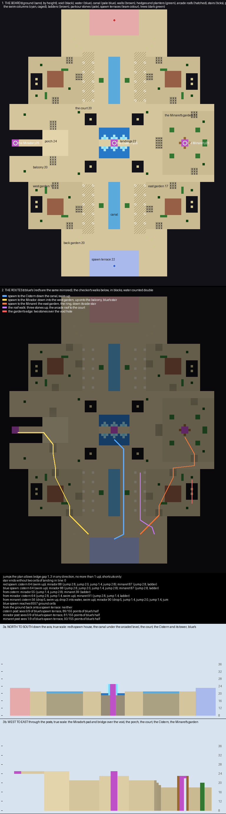

# Riad — the plan

A King of the Flag board, planned, built, and rebuilt after a review of the built world. It is a palace
water-garden floating over the void: a court with a cistern at its heart, sunken gardens either side of a long
canal, and three posts where the one flag can come back.

## What already exists, and what I took from it

**Desert Sanctuary is the reference, read from its region files and its XML.** It is 99 × 153 blocks, with
red and blue spawning at the two ends, 144 blocks apart, and three posts on the line across the middle. The
Mid Post is a banner on a beacon on a pillar standing in a fountain basin, and a player swims up the water
beside it. The East and West Posts are banners on raised platforms in alcoves at the board's sides
(`renders/ref-desert-sanctuary-topdown.png`, `-section-z24.png`).

**The gamemode is the shared `kotf` include in PublicMaps, and nearly every KotF map in it uses it.** One flag
is `shared`, and its holder scores at `points-rate="1"`, a point a second. The holder gets slowness, four hearts
and three seconds of absorption. A compass points every player at the carrier. First to 200 wins.

**A team that holds the flag does not respawn.** Each spawn carries `filter="has-flag"`, and with
`<respawn spectate="true">` a dead player waits until their team no longer holds the flag. So a carrying team
shrinks with every death while the other keeps coming back, which is what makes guarding the carrier the game.

**The posts are one `<post>` with several children, and the flag comes back at a random one.** The flag
returns `respawn-time` after it is dropped, 18 seconds in the include, at a child chosen in random order.
`sequential="true"` would make the order fixed. A child post can carry a `respawn-filter`, and Desert
Sanctuary uses one to switch its Mid Post off in its competitive variants.

**PGM needs a real banner at the flag's first post.** `Flag.java` looks for a banner block at the default post
and fails the match with "must have a banner at its default post" when there is none. The banner's colour and
pattern become the flag's, so the generator will place a standing banner at the Cistern as a tile entity.

**Other KotF maps keep the carrier out of places with `enter="deny-flag-carrier"`.** Maple Syrup keeps the
carrier off its dam, and Harb keeps the carrier out of the bases. Riad's first build used it to keep the carrier
in the middle of the board; the review took it out.

## The board

| Level | Height | What it is |
|---|---|---|
| the sunken gardens | 17 | four gardens either side of the canal's lane, and the Minaret's garden, three under the ground |
| the Cistern | 18 to 19 | the pool round the middle post, one deep; two deep at the foot of each water column |
| the ground | 20 | the court, the lane and its canal, the balconies, the back gardens, the ring round the Minaret's garden |
| the parkour stones | 21 to 23 | three stones from each back garden up to an arcade roof |
| the landings, the Minaret, the spawn terraces | 22 | two over the ground |
| the posts' tops, the porch, the roofs | 24 | the Cistern's tower and the Mirador's porch, bridge and pad; the arcade roofs |

**Red spawns in the north and blue in the south, and blue's half is red's mirrored, z → −z.** Nothing is
mirrored in x, so the east and the west posts can be different things and still be the same walk for both
teams. The board is 96 × 113.

**The gardens are sunk three blocks, and a stair goes in and out of each on three sides.** One comes down from
the middle band, one from the arcade, one from the back garden. The ground between them is a level higher, so
the board has a low ground, a ground and the roofs and posts above.

**A spawn is a terrace two over the back garden.** A player steps off its front or its sides, and nobody climbs
back: there is nothing a block under its edge to step from. The terrace has a canopy over its back half and
the enemy may not enter it.

**The board floats.** Its underside steps in a course for every block in from the edge, and a void hole in each
garden and four in the court open straight through it.

## The three posts

**Each post is a different fight, and each is the same walk for both teams.** The flag starts at the Cistern.
After each carrier's death it comes back 15 seconds later at one of the three, chosen at random.

| Post | Where | How it is reached | The fight it makes |
|---|---|---|---|
| **The Cistern** | the middle: a banner on a tower 3 × 3 in a pool one deep, four over the court | by swimming up one of two water columns caged in glass against the tower's north and south faces. The pool is two deep at their feet, so a player ducks under the cage's lip and rises | the mosh pit round the columns. A shorter column rises from the pool onto each landing, so a climber can stop there, out of the water, and drop back in for the tower's column. The carrier leaves by a landing: a bridge east or west off the tower, two under its top and two over the court, which nobody can climb onto from below |
| **The Mirador** | the west: a banner on a 3 × 3 pad at the end of a bridge over the void, ten long and three wide | from a porch four over the ground. Red climbs to it by a stair from the north balcony, blue by one from the south, and the court's side is a drop only | the waiting room: both teams on the porch, then a run across ten blocks of bridge in the open, in bow range of both balconies below |
| **The Minaret** | the east: a banner on a pillar 3 × 3, five over a sunken garden | by a ladder on any of its four faces | four ways up and one top. The court and the ring stand three over the garden and look down on the climbers. The void behind is a knock-off |

## The routes, and what each is for

**Every route has a job.** Lengths are blue's, walked on the plan by `scripts/plan_check.py`, in blocks with
water counted double and a climb counted at its cost; red's are the same mirrored.

| Route | Length | What it is for, and when it is used |
|---|---|---|
| **The lane:** off the terrace, down the canal's side to the court, through the pool and up a column | 64 to the Cistern's top | the straight way to the middle post |
| **The west garden:** down its stair, round the kiosk, up onto the balcony and blue's own stair onto the porch | 88 to the Mirador's pad | the side approach, below the lane's line of sight |
| **The east garden** and the ring round the Minaret's garden, down its side stair | 87 to the Minaret's top | the side approach to the east post |
| **The court's stones:** a void hole in each corner of the court, a stone in its middle | gaps of two | a short cut across the corner for whoever jumps it; a fall for whoever is knocked into it |
| **The garden's edge:** a void hole by each garden's outer edge, two stones across it, or a ledge two wide past it | gaps of two and one | the outside way round the kiosk or fountain house, quick and dangerous |
| **The arcades:** a covered walk either side of the canal, columns every four, arches between | — | cover along the lane, never a place to hide |
| **The roof walk:** three stones up from the back garden, then the arcade roof to the court | — | a high line over the lane and the court, level with the Cistern's tower |

**The jumps are only the ones planned.** The checker finds every gap of one to three blocks that a player can
cross and that saves more than a few steps. It finds the stones up to the roofs, the stones in the four court
holes and the stones in the four garden holes, and nothing else.

## Theme

- **A palace water-garden:** smooth sandstone ground with a lattice of red sandstone in the court, red
  sandstone walls in courses over a stepped underside, quartz on every edge where the ground drops.
- **The water:** the canal and the Cistern in prismarine lit by sea lanterns, the swim columns in light-blue
  glass.
- **The gardens:** grass with flowers, hedges, vanilla oaks and birches, a kiosk under a gold-capped dome, a
  fountain house in terracotta with a basin on its roof.
- **The arcades:** quartz columns, sandstone arches, terracotta roofs.
- **The teams:** each team's wool along its roof edges, in its parapets, in the band at the top of every
  garden wall on its half, and on its spawn terrace and canopy, with its banners hung under the canopy.

## How the plan changed

| Review | What it said | What changed |
|---|---|---|
| first | keep the middle post; the bridge is fine; build | built |
| the rebuilt world | swim up to a landing first, rest, then drop back in for the tower's column | a shorter caged column from the pool onto each landing, four in all |
| the built world | gardens three down with stairs; a landing off the middle post; pools one deep; a spawn left by a two-block ledge, not a box; no carrier line; trees for cover; void holes with a little parkour; a better look | the gardens and the Minaret's garden sunk to 17 with stairs on three sides; landings east and west off the tower at 22; the pools one deep with a sump at each column; terraces at 22 with canopies; the carrier line and its XML removed; oaks and birches; void holes in the court and the gardens with stones; arcades with arches, parapets, a stepped underside, a domed kiosk and a fountain house |
