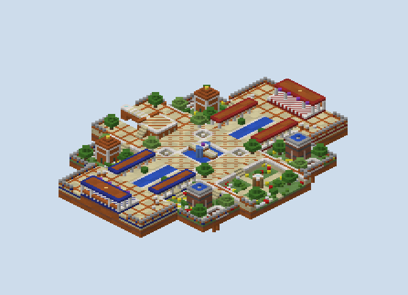

# Riad — what was built

A King of the Flag board, built from the plan in `PLAN.md` and rebuilt after a review of the first build. It
is a palace water-garden floating over the void: one shared flag, three posts of three kinds, sunken gardens
either side of a canal, and two spawn terraces a player steps off and cannot climb back onto.

## What the review of the first build changed

| What the review said | What was built |
|---|---|
| sink the gardens three, with stairs in and out | the four gardens and the Minaret's garden at 17, three under the ground, a stair on three sides of each |
| a safe landing off the middle post | a landing east and west off the Cistern's tower, two under its top and two over the court, arched over the pool |
| shallow pools | the Cistern one deep, two at the foot of each water column so a swimmer can duck under the cage; the canal one deep; the spawn pools gone |
| a two-block ledge, not a box, at the spawn | a terrace two over the back garden, a canopy over its back half |
| no purple line | the carrier line and its XML removed; the carrier may go anywhere |
| trees as cover | vanilla oaks and birches in the court, on the balcony and in every garden |
| void holes, with a little parkour across | a hole in each corner of the court with a stone in it, and a hole by each garden's outer edge with two stones across it |
| a better look | arcades with arches, crenellated parapets, a stepped underside, quartz on every drop's edge, flowers in the gardens, a domed kiosk and a fountain house |

The first build's scripts are kept as `scripts/*_v1.py` and `scripts/map_v1.xml`, and its renders in
`renders/v1/`.

## How it was made

**The world is built from the plan's own rasters.** `scripts/plan.py` holds every column's floor height and
kind, and the arcade roofs over them. `plan_check.py` walked them, `sketch.py` drew them, and `gen.py` builds
each column to exactly that floor. A stair the checker climbed is a sandstone stair in the world, facing the way
the raster says it rises.

**What a raster cannot hold is built on top.** That covers the Cistern's tower, its caged water columns and its
landings, the Minaret's ladders, the beacons under the posts, the kiosks and fountain houses, the spawn
canopies, the parapets, the arches and the trees.

**The flag's banner is a real banner.** PGM refuses a match whose flag has no banner block at its first post,
so the generator writes a standing banner at the Cistern as a tile entity: purple, with a white border and
roundel. The same writer hangs each team's banners under its spawn canopy.

**`map.xml` carries the whole gamemode itself.** It writes out PublicMaps' conquest and kotf includes in full:
the kit, the carrier's kit and the drop kit, the `has-flag` spawn filter, the spectating respawn, the compass
on the carrier, a score limit of 200, and the three posts. The enemy may not enter a spawn terrace, and there is
no block interaction.

## The paint

- **The ground:** the court in smooth sandstone with a lattice of red on the diagonals and a ring of chiseled
  quartz round the Cistern; the lane quartz-edged along the canal; the back gardens and balconies ruled every
  five blocks in red.
- **The gardens:** grass with poppies, bluets, daisies and dandelions, hedges of oak leaves, oaks and birches,
  and paths of smooth sandstone crossing the Minaret's garden to its pillar.
- **The drops:** quartz on every edge where the ground stands over a lower one, and chiseled quartz round every
  void hole, so an edge reads before the fall.
- **The buildings:** red sandstone in courses with terracotta, the underside stepping in a course a block. The
  arcades are quartz columns with sandstone arches under terracotta. The kiosk is red sandstone with blind arches
  under a stepped dome capped in gold, the fountain house terracotta banded in cyan with a basin and a jet.
- **The teams:** red holds the north and blue the south, each in its wool: along its arcade roofs' edges, inlaid
  in its parapets, in the band at the top of every garden wall on its half, and on its terrace and canopy.

## What the built world measures

`renders/walks.txt` walks the built blocks on foot from each spawn, with no jumps:

| From either spawn | Blocks |
|---|---|
| the canal's head at the court | 38 |
| the Cistern's top, by the water column | 59 |
| a Cistern landing, by the tower | 62 |
| the Mirador's porch | 76 |
| the Mirador's pad, across the bridge | 92 |
| the Minaret's top, up a ladder | 84 |

**The two spawns are exactly even.** Each reaches 7,109 standing cells on foot and every place in the table in
the same number of steps.

**Between the posts the Cistern is the hub.** From the Cistern's top the Minaret is 32 and the Mirador's pad
58, each by way of a landing; from one side post to the other is 80 to 88.

**The roofs and the void-hole stones are reached only by jumping.** With running jumps allowed, a player from
the spawn reaches the arcade roof's far end in 54 and a garden's void-hole stone in 72.

**Nobody gets back onto a spawn terrace.** A walk from the Minaret's garden with every drop, ladder and jump
allowed reaches neither. The first try did: the parapet beside a terrace was a step onto it, and it was taken
off there.

**The plan's checks still hold.** `renders/plan-check.txt` finds no stair end without two cells of landing in
line, and no jump on the board but the planned ones.

**The Cistern's top sees blue's terrace.** With the spawn a terrace, not a closed room, the plan's sightline
check finds a clear line from the tower to it, some fifty blocks off. A spawning player has seven and a half
seconds of resistance.

## The renders

- `00-plan-sketch.png`: the plan as rebuilt; `renders/v1/` is the first build.
- `01`, `02`: the studio's top-down and height reads of the region files.
- `10`–`16`: true-scale sections down the axis, across the posts, through a water column, up the porch's
  stairs, through a spawn terrace, along an arcade and across the gardens.
- `30`–`38`: isometric views of the board, the Cistern, the Mirador, the Minaret, blue's half, blue's spawn,
  the east garden and the Cistern's landings.
- `50`, `51`: elevations of the Mirador from the south and of the court from blue's side.
- `ref-desert-sanctuary-*.png`: the reference map, read from its region files.

## What I wanted, how hard it was, and what a studio feature would need

| What I wanted | How hard it was | What a studio feature would need |
|---|---|---|
| A KotF board whose posts are each a different fight | Moderate: a raster for the ground and one for the roofs, with ladders and water columns as special edges | A post piece with its approach built in: a tower in a pool, a bridge to a pad, a pillar with ladders |
| The flag's banner in the world | Easy once known; PGM's source says the match fails without it | The studio placing the banner when it writes a flag's first post |
| A spawn left by a one-way ledge | Easy, but the walk had to allow jumps to show that a parapet beside it was a step back up | A spawn piece with an exit kind, and a check that nothing within a jump climbs back onto it |
| Sunken gardens with stairs on three sides | Easy on the raster; each stair is checked for floor in line at both ends | Sunken pieces that place their own stairs where the plan's routes cross their edge |
| Void holes with a little parkour across | Easy: a hole in the raster with stones in it, which the jump audit finds and the walk crosses | A hole piece with its stones, laid so the jump audit lists exactly its crossing |
| Knowing what each post sees | Easy: a sightline cast over the raster from each post to the spawn and the gardens | A sightline check from every objective to every spawn, on the plan |
| Team colours a player can read | Easy, once it was clear stained clay was too dull | A theme's team-colour slot defaulting to wool |
| A board that looks made | The hardest part, and the first build failed it: the review asked for it outright | Theme pieces with their own detail — arches, parapets, domes, trees — rather than flat boxes |
| Validation of a KotF map | Not attempted here; the XML follows PGM's source and Desert Sanctuary's | KotF in the studio's round-trip: the posts read back against the world, the banner found |
