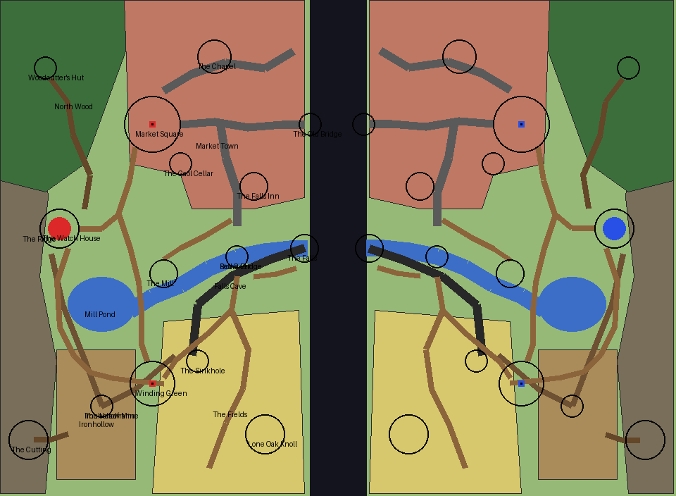

# Riftwater — the plan

Written before any terrain existed. The sections after *As first drawn* record how the plan changed and why.

## The board in one sentence

**A river valley split down the middle by a bottomless rift: on each side a market town on a bluff, a
mining village under a wooded ridge and wheat fields between them, and each side's river running past its
mill and under its stone bridge to pour off the edge as one of two facing waterfalls.**

What a player remembers: the twin falls, the broken Old Bridge reaching across the rift and not meeting, and
the cave behind the water.

## Mode: destroy the monument, two monuments a team

**DTM rather than DTC.** The board's best idea is the approach from below — a cave entered behind the falls
that comes up in a sinkhole beside one monument and in a gaol cellar beside the other — and a monument is
what a player breaks from underneath. A core's lava would pour into the cave it was meant to be reached
through.

**Two monuments a team, a north and a south.** The board is about 240 × 176 for 16 a side, and the valley
gives each team two different grounds: the town (fought through street by street) and the fields (open,
crossed under fire). One monument in each makes the two approaches genuinely different instead of one
lane repeated (`approaches.md`: *the approaches differ*).

## Arrangement

- **Mirror symmetry across the rift** (`x' = -1 - x`), red west, blue east. The north of the whole board is
  the town, which therefore straddles the rift and reads as one town split by it; the south is fields and
  the mining village.
- **The rift** is void for `x ∈ [-10, 9]` across the whole width, and is the build zone. It is the only thing
  joining the teams, per *One objective, and air between the two sides*. Three crossings are offered by the
  land: the **Old Bridge** stubs in the town (10 blocks of air), the **falls** in the middle (20), and the
  open **south fields** (20).
- **Heights:** ridge 66–80; spawn terrace 59; town bluff 51–52; the square 52; the river at 45 with the pond
  at 48; fields 47–49; the village 50–53 rising toward the ridge; the cave at 30–41, the mine at 36–52.

## The places (red half; blue mirrors)

| Place | Where (x, z) | What it is | Why a player goes there | How |
|---|---|---|---|---|
| The Watch House | −99, −7 | Spawn: stone watch house with a timber upper storey on a terrace cut into the ridge | spawn; sees down the valley | terrace steps east; Spring Path south; Forest Path north; the mine adit beside it |
| The Ridge | x < −100 | forested ridge with a north and a south spur, 14–22 over the spawn | frames the spawn | woods' paths |
| North Wood | −120…−74, −88…−24 | oak and birch on the north spur | cover onto the north monument's flank | Forest Path |
| Woodcutter's Hut | −104, −64 | log hut at the path's end: chest, chopping block, woodpile | supplies; where the path goes | Forest Path |
| Market Square | −66, −44 | paved square, town hall on its north side | **north monument** | Spawn Lane; Main Street; the cellar |
| Market Town | −76…−12, −88…−14 | brick-and-timber town on the bluff: Main Street to the rift, Bridge Street to the river, North Lane | the north approach, street by street | three streets |
| The Old Bridge | −14…−6, −44 | a stone bridge broken in the middle of the rift | shortest crossing, straight into town | Main Street |
| The Chapel | −44, −68 | stone chapel with a belfry | highest point in town; perch over the square | North Lane, ladder |
| The Falls Inn | −30, −22 | inn at the town end of the stone bridge | cover at the bridgehead | Bridge Street |
| The Gaol Cellar | −56, −30 | dungeon cells under the old gaol, broken through into the cave | the cave's way up, 18 from the north monument | the cave; the gaol's stair |
| The river | pond → (−36, 3) → (−11, 0) | sunk between the town bluff and the field bank | low, covered route from the falls to the bridge | banks, fords |
| Mill Pond | −84, 20 | the river's source; spring falling off the ridge; jetty and rowboat | frames the spawn; outlet footbridge is the quick way south | Spring Path; footbridge |
| The Mill | −62, 9 | watermill, wheel in the race beside the weir | the weir is a crossing | Mill Lane |
| Stone Bridge | −36, 3 | three-arch stone bridge, town to fields | the chokepoint between the two monuments | Bridge Street, Field Road |
| The Falls | −12, 0 | the river pours over the lip into the void | middle crossing; the cave mouth behind it | banks; Falls Walk |
| Falls Cave | under the river | water-cut gallery, a lake chamber, three ways up | **approach from below** | mouth in the rift face behind the water |
| Ironhollow | −100…−72, 36…82 | mining village: cottages on lanes, smithy, well, spoil heap | cover behind the south monument | Spring Path, Village Road |
| The Headframe | −84, 56 | timber tower over the shaft, winding wheel | height over the fields; the shaft | the lanes |
| Winding Green | −66, 48 | open grass where ore carts turn | **south monument** | Village Road; footbridge; the shaft |
| Ironhollow Mine | adit −102, 2 → shaft → breakthrough −58, 38 | timbered galleries, rails, iron in the walls | defenders' covered way south; the cave's way to the spawn | adit, shaft, breakthrough |
| The Fields | −62…−12, 22…87 | wheat strips, scarecrow, hay cart, barn, hedgerows | open ground before the south monument | Field Road; the south crossing |
| The Sinkhole | −50, 40 | where the cave roof fell in | the cave's way up, 16 from the south monument | the cave |
| Lone Oak Knoll | −26, 66 | grassy knoll by the rift, one big oak | lookout over the south crossing | fields |
| The Cutting | −110, 68 | clearing of stumps and log piles, a timber sledge | where the pit props came from; frames the village | Clearing Path |

## Navigation

- **Spawn to north monument:** Spawn Lane, ~47 blocks. **Spawn to south monument:** Spawn Lane south over
  the outlet footbridge (~60), Spring Path round the pond's west end (~75), or underground through the mine
  (adit → shaft, ~70, covered).
- **Enemy spawn to either monument:** 165+ blocks, across the rift.
- **North approach (through):** cross at the Old Bridge, fight up Main Street (houses either side, the chapel
  tower watching), arrive at the square from the east. Flank: North Lane along the cliff edge.
- **South approach (open):** cross the south rift, cross the fields under the headframe's eye, Lone Oak
  Knoll as the first foothold. Flank: the river valley under the field bank.
- **Middle (around/below):** cross at the falls, go up the river valley under the bluff to the stone bridge,
  then north to the town or south to the fields; or enter the cave behind the falls and come up by the
  sinkhole, the gaol cellar, or into the mine.
- **Fights:** the three rift crossings; the stone bridge; Main Street; the fields' edge at the knoll; the
  cave's lake chamber where its three branches meet.
- **Cover and height:** chapel tower (town), headframe (village), knoll (fields), the ridge spurs and woods
  behind each monument's flank, the bluff over the river.

## Palette, decided now

- **Biome:** Plains for the open ground (grass `#91bd59`); Forest on the woods so they read a shade darker;
  River in the channel.
- **Ground:** grass; worn ground dirt + coarse dirt; rock faces stone + andesite with cobblestone ≤ 30%.
- **Built (town):** brick ground storey, spruce-framed upper storey with white clay infill, dark-oak roofs.
- **Built (village):** spruce log frame, spruce plank and cobblestone walls, spruce roofs.
- **Accent:** dark oak (roofs, the mill wheel, the headframe).
- **Trees:** oak and birch only, cut from rockymine's hand-built tree showcase.

## As first drawn

The table and sketch above are the plan as written before building.

## How the plan changed

**Built against the plan, the board kept every place and moved five of them.** Each change below was made
looking at a render of the built world, and the reason is the render's.

- **The rift stopped being a ruled line.** From above it read as a wall between two slabs. Its lip now
  wanders and is bitten into bays where nothing stands, and is held straight only under the town's houses,
  at the Old Bridge and at the falls. The build zone widened from `|x| ≤ 10` to `|x| ≤ 16` so a bay's edge
  can still be bridged from.
- **The southern lanes were cut from five to three.** The first build's Field Road, Farm Track, Spawn Lane
  south and Village Road crossed each other in front of the south monument like spaghetti. Field Road now
  runs bridge to green, Farm Track runs green to barn to knoll round the field's back, and the field sits in
  the open between them.
- **Lone Oak Knoll moved from (−26, 66) to (−22, 74)** so the wheat field could stand directly in front of
  the south monument, which is the open ground an objective wants in front of it.
- **The gaol and its cellar moved onto the square's south-east corner** (−56…−48, −38…−30), so the cave's
  way up arrives eighteen blocks from the north monument rather than behind a row of houses.
- **The town was given a climb.** The first build's town was flat at 51–52 from the square to the rift. The
  ground now falls from 52 at the square to 49 at the rift, and the chapel stands on a rise at 55, so the
  north attack is uphill and Main Street steps.
- **The spawn terrace became a shoulder.** Drawn as a rectangle it built as a square pad against the ridge;
  it is now an oval spur at the ridge's foot with the ridge standing over it.
- **The cave gained a pillared hall, a smugglers' grotto and alcoves.** The first build's cave was four
  tubes meeting at a lake; it now has places in it.
