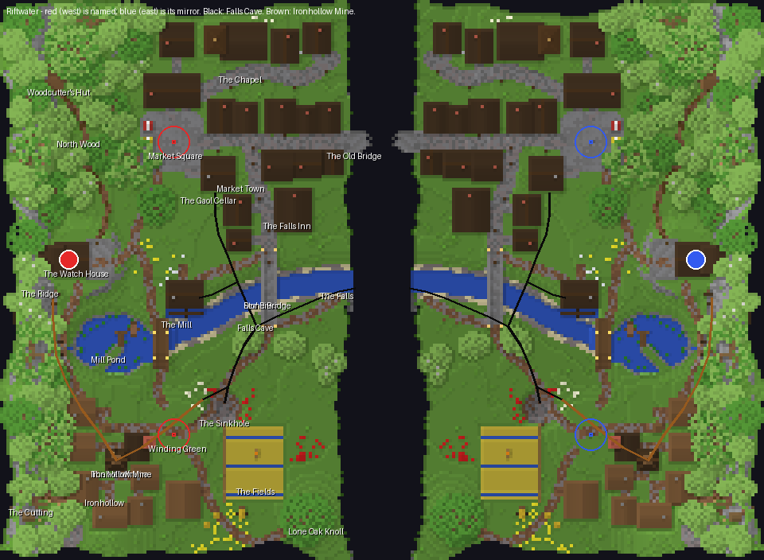

# Riftwater — report

**Riftwater is a destroy-the-monument map for two teams of sixteen: one river valley split down the middle
by a bottomless rift.** On each side a brick-and-timber market town climbs from the rift to its square, a
mining village sits under a wooded ridge, and wheat fields lie between them. Each side's river runs from a
mill pond past its mill and under its stone bridge, and pours off the rift's lip as one of two facing
waterfalls; behind each waterfall is a cave that comes up beside both of that side's monuments.

The whole board is generated by the scripts in `scripts/` and written through the studio's own region
writer; no studio authoring pipeline was used. `scripts/build.sh` regenerates the world and every render in
about twenty seconds.

## What was built, and why

**The arrangement is one valley floating in the void, mirrored across a rift twenty blocks wide.** The rift
is the build zone and the only thing joining the teams, as *One objective, and air between the two sides*
asks. Mirror symmetry makes the north of the whole board one town split by the rift and the south one stretch
of farmland, so each place reads as one place rather than two copies facing each other.

**DTM with two monuments a team, one in the town and one by the village.** The town and the fields are the
two different grounds the setting offers, and a monument in each makes the approaches differ: through
streets in the north, across open fields in the south. DTM rather than DTC because the board's best idea is
the approach from below, and a core's lava would pour into the cave it was meant to be reached through.

**Every place was written down with its reason before any terrain existed** (`PLAN.md`, `scripts/plan.py`).
The plan is code: the generator reads its coordinates, so the sketch drawn before building and the board
built afterwards cannot disagree.

**The cave is the centre of the design, not a decoration under it.** It is entered from the rift, behind the
waterfall, at a rock ledge a bridger can land on. It runs under the field bank to a lake chamber, and from
there branches four ways: up through a pillared hall to a sinkhole sixteen blocks from the south monument;
under the river to a gaol cellar eighteen blocks from the north monument; aside to a smugglers' grotto with a
chest; and west into the iron mine, which climbs to an adit beside the spawn.

## A tour (red's side; blue's is at `x' = -1 - x`)

| Place | x, z (y) | What a player finds |
|---|---|---|
| The Watch House (spawn) | −98, −7 (60) | A framed house and a four-storey stone tower on a terrace cut into the ridge, red wool hung from the tower. Stone stairs lead east down to Spawn Lane. |
| Ironhollow Mine adit | −104, 5 (59) | A timber portal in the hillside 23 blocks from the spawn: the defenders' covered way to the south monument. |
| North Wood, Woodcutter's Hut | −104, −64 | Oak and birch on the north spur; the forest path ends at a log hut with a chest, a chopping block and a woodpile. |
| Market Square, **north monument** | −66, −44 (54–55) | A paved square of stone brick and andesite, the monument floating in the open, the town hall closing its north side, market stalls well back on its west edge. |
| Market Town | −74…−14, −84…−11 | Sixteen buildings on Main Street, Bridge Street and North Lane, mostly brick-and-timber, stepping down from the square (52) to the rift (49): a hall, shops with signs, a bakery, an inn. |
| The Chapel | −44, −75 | A stone nave on the town's hill with a belfry tower 20 blocks high, laddered to the bell: the perch over the square. |
| The Gaol and its cellar | −52, −34 | A stone house on the square's corner; a ladder in its floor drops to three barred cells, and the cellar's south wall has fallen into the cave. |
| The Old Bridge | −12…−5, −44 (49) | Main Street carried out over the rift on a half-arch from the face, broken off with its ties hanging; blue's stub reaches back, eight blocks short. |
| The Falls Inn | −28, −22 | The inn at the bridgehead, tables and a bar inside, a sign on the street. |
| Stone Bridge | −36, −10…14 | A hump-backed bridge, one arch over the river with a keystone, stair-stepped deck, lamps at both ends. |
| The Mill and weir | −62, 4 | A stone-and-timber mill; a dark oak wheel turns in a race cut beside the river; the weir upstream is a wet crossing. |
| Mill Pond | −84, 20 | The river's source, fed by a spring falling from a cleft in the ridge; a spit with a jetty, a rowboat, reeds and lily pads; a timber trestle footbridge over the outlet. |
| The Falls | −11, 0 | The river pours off the lip into the void, facing blue's falls across the rift. |
| Falls Cave mouth | −12, 0…6 (36) | Behind the water, over a rock ledge. |
| Lake chamber | −40, 14 (31) | A wide low hall with a still pool where the cave's branches meet. |
| Pillar Hall | −46, 26 (34) | Natural pillars holding a low roof: the fight here is pillar to pillar. |
| Smugglers' grotto | −60, 6 (33) | A dead end under the mill with a chest of what they left. |
| The Sinkhole | −50, 40 | A funnel in the field where the cave roof fell in, climbable in one-block steps. |
| Winding Green, **south monument** | −66, 48 (52–53) | Open grass where Ironhollow's carts turn, the monument floating on it, the fields open in front. |
| Ironhollow | −99…−72, 38…76 | A mining village of spruce cottages on lanes — two of them a tall house with a low wing — gardens behind them, a smithy open to the lane, a well and the headframe collar in worn ground, a spoil heap, the stone engine house with its brick stack. |
| The Headframe | −84, 56 | A timber tower 17 blocks over the shaft with a winding wheel; the shaft drops by ladder to the mine gallery. |
| The Fields | −50…−31, 45…69 | Wheat in strips with ditches every ninth row, carrots and potatoes, a fence and gate on the village side, the scarecrow in the middle, a hay cart at its foot, a barn with hay and haystacks, a hedgerow along the farm track. |
| Lone Oak Knoll | −22, 74 | A grassy rise by the rift with one great oak: the south crossing's lookout. |
| The Cutting | −110, 68 | A clearing of stumps, two log piles, a sawhorse with a log on it and trodden bark, ringed by young trees. |

## How a match is meant to flow

**The opening is a race to the three crossings.** The Old Bridge stubs leave eight blocks of air in the
north, the falls twenty in the middle, the fields twenty in the south, and the bays in the rift's lip put
the south crossing a few blocks further out. A team that wants the north monument early bridges the Old
Bridge; a team that wants to split the defence crosses at the falls, where the low river valley hides a push.

**The north is fought through.** Attackers come off the Old Bridge into Main Street and climb it toward the
square, house by house, with the chapel tower watching the square from twenty blocks and the North Wood
giving the defender's flank. The gaol cellar is the way in from below.

**The south is crossed under fire.** Attackers from the south crossing face forty blocks of open field under
the headframe; the knoll is their first foothold and the hedgerow the only cover. The sinkhole, sixteen
blocks from the monument, is the way in from below, and the mine shaft is the defenders' way back up.

**The middle is the river.** An attacker who crosses at the falls can go up the river valley under the
bluff to the stone bridge and turn north or south there, or step behind the waterfall into the cave. The
stone bridge is where defenders rotating between their two monuments meet attackers doing the same.

**The underground is a second board.** Behind each team's waterfall a cave reaches both of that team's
monuments and, through the mine, its spawn. Defenders have a covered way into it from the adit beside their
spawn; attackers have to bridge down into the rift to reach it.

### The walks, measured

`scripts/walk.py` walks the built world from each spawn — one-block climbs, three-block drops, ladders,
doors, swimming, no blocks placed — and its output is `renders/walks.txt`.

| Walk | Blocks |
|---|---|
| spawn → own north monument | 63 |
| spawn → own south monument | 81 |
| spawn → mine adit | 23 |
| spawn → end of own Old Bridge stub | 122 |
| enemy spawn → north monument (Old Bridge, 8 bridged) | about 190 |
| cave mouth → sinkhole floor | 69 |
| cave mouth → gaol cellar | 84 |
| cave mouth → mine breakthrough | 72 |

**The goal walks sit inside the studio's bands where it has one.** Own spawn to goal is 63 and 81 against a
band of 40–90, and the enemy's walk is three times the defender's. The enemy's walk to a goal is longer than
the studio's 85–150, which is the cost of a board sized for sixteen a side.

## What I am proud of

- **The cave is a place with a plan.** It has a mouth you have to commit to reach, a hub, a fight space, a
  dead end with a reward, and three ways up that each arrive somewhere that matters.
- **Things that belong together are together.** The river has its mill, weir, bridge and falls. The mine has
  its adit, headframe, engine stack, ore and village. The fields have their scarecrow, cart, barn and
  hedgerow, and the felled wood its stumps and log piles beside the village whose pit props it became.
- **The broken Old Bridge.** Two half-arches reaching across the void and not meeting is the image of the
  board, and it is also its shortest crossing.
- **The town climbs.** Main Street steps up from the rift to the square, so the north attack is uphill.

## What I would do next

- **Play it.** Nothing here has been on a server: a waterfall poured into the void may behave differently
  once a player disturbs it, and the cave and the sinkhole have only been walked by `walk.py`.
- **Light the underground.** The writer marks every section fully sky-lit, so the cave is daylight-bright
  in game until something relights it; a real cave wants darkness and a few torches the miners left.
- **More relief in the middle.** The town now climbs three blocks and the chapel stands on a hill, but the
  fields are still nearly level; a second rise between the field and the rift would give the south approach
  a real choice.
- **Fewer, larger flower drifts and a second look at every tree.** The tree spacing follows the studio's
  crown rule; a few trees still stand where only the dice put them.

## What I wanted to build, how hard it was, and what a studio feature would need

Each row is one thing this board needed. *How* is what the script does; *Feature* is what the studio would
have to offer to let an author build it without writing a generator.

| Wanted | How it was built here | Effort | What a studio feature would have to do |
|---|---|---|---|
| **A cave** — passages with walkable floors, varied width, a hub chamber, side pockets, a pillared hall | Splines in 3-D (x, floor-y, z, radius) carved as chains of flattened ellipsoids; a floor clamp keeps them walkable; extra ellipsoids for chambers and alcoves; a never-break-the-surface guard (`underground.py`) | Medium: 300 lines, and the x-ray renderer to see it | A *tunnel* shape: a polyline with a floor height and a radius per point, carved below a stated depth from the surface; a *chamber* (ellipsoid with a floor); the carve must know the surface so it never opens one by accident, and say where it does on purpose. |
| **A cave dressed as a cave** — gravel and clay floor, stalactites, stalagmites against walls, ore glints, mushrooms, a pool | A pass over every air cell with rock above and below it (`dress_cave`, `stalagmites`) | Low once the carve existed | A *cave finish*: a theme whose buckets are floor, wall and ceiling of an enclosed void, plus hanging and standing props with a "keep the floor walkable" rule. |
| **An entrance in a cliff face** behind a waterfall, with a ledge to land on | Carved from the rift side; a stone ledge set in the void column; vines | Low here, impossible in the studio | A shape that opens a carve onto a void face, and a ledge prop that may stand over void inside a build zone. |
| **A sinkhole** — a funnel into a cave a player can climb out of | Concentric one-block terraces from the cave floor to the field, rubble paint, a grass lip, vines | Low | A *funnel* landform: a radius, a floor, a step height, joined to a named carve. |
| **A mine** — timbered galleries, stairs on the slopes, rails on the level, iron in the walls, an adit portal, a shaft with a ladder | Straight runs between waypoints, three wide and three tall; a timber set every four blocks; stairs where the floor changes; rails only where it is level (`mine`, `shaft`) | Medium | A *gallery* stroke (width, height, support style and spacing, rail rule) and a *shaft* prop (depth, ladder side, collar) that join to each other and to the surface. |
| **A dungeon under a house that leads somewhere** | A vault box with barred cells, a ladder through the house's floor, a breach into the cave | Low, because the house and the cave were both mine to place | A storey *below* a house (a cellar layer tied to its footprint) and a *breach* that joins a room to a carve. |
| **A river with levels** — a pond reach, a weir, a lower reach, and a waterfall off the board's edge | Water level per reach, a channel carved with a rounded bed, a stone sill with water spilling over, a falling column into the void (`terrain.py`, `mill`) | Medium; the water was placed, not simulated | A *watercourse* stroke with a level per reach and a structure at each change (weir, fall, cascade), and a rule for a fall off a void edge. |
| **A mill with a turning wheel** | A disc of dark oak planks and log spokes in a race cut beside the river, an axle into the mill | Low | A *wheel* prop (radius, axis, which water it sits in) and a *race* cut that leaves and rejoins a watercourse. |
| **A real bridge** — hump-backed, arched, keystoned, stepped | Deck height from the two banks with a crown over the water; an arch soffit as a half-ellipse; stairs where the deck climbs (`stone_bridge`) | Medium | A *bridge* prop between two points on two banks: arch count and shape, deck profile, parapet, and its ends read from the ground rather than stated. |
| **A broken bridge across the void** | A half-arch springing from the rift face, a ragged random break, iron ties hanging | Low | The same bridge prop with a *broken at* parameter, and permission to stand over the build zone. |
| **A footbridge on trestles** | Log legs every four blocks down to the bed, plank deck, fence rails | Low | A trestle option on the bridge prop. |
| **Houses that are framed** — brick ground storey, log posts at corners, laid log at the seam, plaster infill, gable roof with the verge overhanging a plank gable | A house builder with three styles (`house.py`) | Medium, and the studio already does most of it | Nothing new; the studio's room styles cover it. What I did not have was a way to set a *house on a slope* — I level a site under each house and ease the ground round it over two blocks. |
| **A town that climbs** | Each house takes the median ground under its footprint; streets are smoothed along their length and eased into the ground | Low | Placement that seats each building at its own ground and paves a street *through* the steps, rather than a flat pad per settlement. |
| **A headframe, an engine stack, a chapel tower** | Hand-written structures with leaning legs, a winding wheel, a brick stack, a belfry and spire | Low each | A *tower* prop family (legs, braces, head; or masonry with openings and a cap) whose height is a parameter. |
| **A wheat field** — strips, ditches every ninth row, farmland, crops at mixed ripeness, fence and gate | The field levelled as a tilted plane, strips by row (`wheat_field`) | Low | A *field* shape: crop list, strip width, ditch spacing (hydration is a game rule the studio could enforce), edge fence with gates. |
| **Props that are things** — scarecrow, hay cart, rowboat, haystacks, log piles, stumps, sawhorse, market stalls, lamp posts, a well, benches | Ten small functions of a few blocks each | Low each; the hard part is that each needed a reason and a place | A *prop library* of small multi-block things with a facing, and a placement that asks for the reason (`near`: a field, a lane, a door) instead of a scatter density. |
| **A boat on the lake, a cart** | Blocks only: the writer has no entities | Blocked | Entities in the writer — boats, minecarts, armour stands, item frames — so a boat is a boat. |
| **Trees that are someone's trees** | Cut whole from the tree showcase by `cut_trees.py`, planted with crown spacing, refused on paths, buildings, the rift's brink and within reach of a monument, crowns allowed to meet a hillside | Low, because the showcase and `tools/trees.py` already existed | Already in the studio; what this board wanted beyond it was a *clearing* (a ring of young trees round a felled area) and a *hedgerow* along a lane. |
| **A spring off the ridge** | A water source in a cleft and a falling column into the pond, mossy rocks either side | Low | A *spring* prop that finds a face above a water body. |
| **Mirror symmetry with facing blocks** | A lookup table turning every stair, door, torch, sign, bed, vine, trapdoor, gate and rail (`mirror.py`) | Low, once | The studio has this; a board-wide *recolour the mirrored team's marks* rule would have saved the special case for blue's wool. |
| **Seeing it** | An isometric renderer, an x-ray of every roofed void, straight-on elevations, an annotated top-down, a walk over the voxels (`render_iso.py`, `annotate.py`, `walk.py`) | Medium: a third of the effort of the whole run | The round-trip tool's `--section` and `--underground` were useful; what was missing offline was any read that shows *bulk* — an isometric, an x-ray of caves, an elevation — and a walk over a world the studio did not build. |
| **Light** | Not done: every section is written fully sky-lit | Blocked | A relight pass in the writer, so an enclosed cave is dark and a torch means something. |

## Notes on the deliverable

- `scripts/` holds every script written in this run, all of which still run. `cut_trees.py` is run once
  and wrote `trees.json`. `build.sh` regenerates `world/` and `renders/` from nothing.
- The world is 240 × 176 blocks: 1,007,258 blocks in 192 chunks, 106 trees, and 16 tile entities (chests and signs).
- `world/map.xml` is minimal: teams, spawns, a kit, four destroyables, the rift as the only place to build
  over void, and spawn protection. The trees are credited to rockymine, who built them.
- Requirements: python3 with numpy, scipy and pillow; dotnet 10; the studio repository at
  `/home/user/pgm-studio` with `tools/PgmStudio.RoundTrip` built.

## After the playtest

**A house keeps a block of wall either side of its door, never a window.** The windows were laid by their own
rhythm along each wall and the door was cut in after, so a pane could stand against the door's frame. Any pane in
the wall beside a door is now the wall's own block again: 34 panes beside the town's 57 doors before, none after.
The walks read back unchanged.

## After the fourth playtest

**The monuments hang three blocks over the floor.** Each of the four destroyables was two obsidian blocks with one block of air under them; they now start four over the floor, so three blocks of air lie between the ground and the lowest block, with nothing beneath. The square's monuments went from y 54-55 to 56-57 and the green's from 52-53 to 54-55, in both halves, and the map.xml regions moved with them. The walks to the monuments are unchanged and the audit reads 3 under all four.
