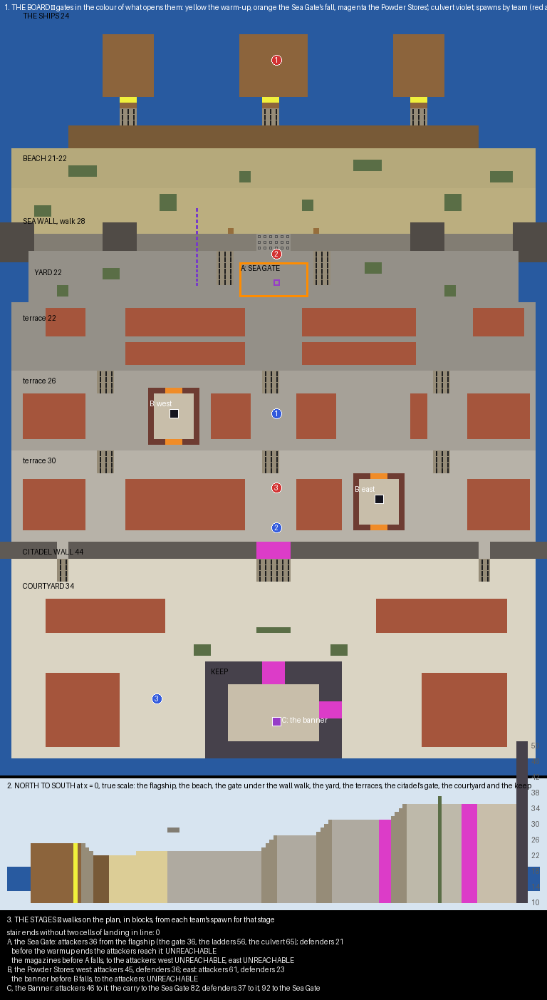

# Saltgate — the plan

An attack/defend board, planned and waiting on a review before anything is built. A walled harbour citadel is
stormed from the sea in three stages. Each stage, once done, opens the gates to the next and moves both teams'
spawns forward. The defenders win if the clock runs out first.

## What already exists, and what I took from it

**PGM has an attack/defend mode and the parts a staged siege is built from.** The gamemode `ad` exists. Goals
can belong to one team only: a destroyable owned by the defenders, a wool the attackers must carry. And
`<time result="defenders">` gives the defenders the match when the clock runs out.

**Bardo, a payload map in PublicMaps, is the pattern for stages.** It is a good worked example of the stage
machinery.

- Its three checkpoints are goals.
- A filter `<completed>checkpoint</completed>` says whether one is done.
- Each team's spawns are a list, each with a filter, so the spawn in use moves as checkpoints fall.
- A trigger on the same filter runs `<fill region=… material="air"/>`, which opens a gate in the world.
- A first gate opens after a warm-up, so the defenders are in place before the attack starts.

**Control points take `capture-filter`, `initial-owner` and `permanent`** (`ControlPointParser`). So the first
stage can be a point the defenders own at the start, that only the attackers can capture, and that stays
captured.

## The board

| Place | Height | What it is |
|---|---|---|
| the ships | 24 | three ships moored off the landing, the attackers' first spawn on the flagship's deck, a gangplank from each |
| the landing and the beach | 21, 22 | a wooden landing stage and a sand beach eighteen deep, with beached boats and rocks for cover |
| the sea wall | 28 | six over the beach, with a walk along its top, towers at its ends and the gatehouse in its middle |
| the yard | 22 | inside the wall, the Sea Gate's ground, with carts and crates for cover |
| the lower town | 22, 26, 30 | three terraces of closed houses with streets between, a stair between each pair of terraces in the middle and at either side; the two powder stores |
| the citadel wall | 44 | across the board, with its gate in the middle and a postern either side for the defenders alone |
| the courtyard | 34 | a barracks, stables, a chapel and an armoury round it, and the keep in its middle |
| the keep | 50 | its treasury inside at 34, where the banner is kept, with a front door and a side door |

**The board is 96 × 136.** It runs from the sea in the south to the citadel in the north.

## The three stages

| Stage | Goal | What the attackers do | What opens when it falls |
|---|---|---|---|
| **A, the Sea Gate** | a control point, 12 × 6, in the yard behind the gate; the defenders own it at the start, only the attackers can capture it, and once taken it stays theirs | get into the yard and hold it | the powder stores' doors; the attackers' spawn moves to the yard, the defenders' to a barracks on the top terrace |
| **B, the Powder Stores** | two monuments of obsidian, both the defenders', one in each store: the west on the middle terrace, the east on the top terrace | break both | the citadel's gate and both keep doors; the attackers' spawn moves to the top terrace, the defenders' to the courtyard |
| **C, the Banner** | a wool, the city's purple banner, on a pedestal in the keep's treasury | take it and carry it down through the town to a monument in the Sea Gate's yard | the match is won |

**The attackers wait twenty seconds on their ships before their gangplanks open.** The defenders have that time
to man the wall.

## The ways into the Sea Gate

**Three ways in sit side by side at the gatehouse, and each costs something different.** Lengths are walked on
the plan by `scripts/plan_check.py` from the flagship.

| Way | Length | What it costs |
|---|---|---|
| **the gate:** across the beach and through the passage under the gatehouse | 36 | the shortest, and the killing ground: the passage is under the wall walk, shot from above and from the yard |
| **the ladders:** a siege ladder against the wall either side of the gate, up to the walk, and a stair down into the yard | 56 | a climb a defender on the walk can knock a player off, but it comes out above the yard |
| **the culvert:** a drain under the wall, from the beach beside the gate into the yard beside the Sea Gate | 65 | out of sight all the way, and one wide way out a defender can watch |

## What each stage asks of each team

**At every stage the defenders arrive first.** Walked on the plan, in blocks, from each team's spawn for that
stage (`renders/plan-check.txt`):

| Stage | Attackers | Defenders |
|---|---|---|
| A: to the Sea Gate | 36 from the flagship | 21 from the town square |
| B: to the west store | 45 from the yard | 36 from the top terrace |
| B: to the east store | 61 from the yard | 23 from the top terrace |
| C: to the banner | 46 from the top terrace | 37 from the courtyard |
| C: the carry, the banner to the Sea Gate | 82 | the defenders chase: 92 from the courtyard to the Sea Gate |

**No stage can be skipped.** Before the Sea Gate falls neither powder store can be reached, and before both
stores fall the banner cannot; the checker walks it with the gates shut and finds no way.

**The two stores are not the same job.** The west one is on the middle terrace, closer and on the main approach.
The east one is a terrace higher and further in, by the defenders' barracks, so the attack has to split or take
them one after the other.

## What `map.xml` will say

- **`<gamemode>ad</gamemode>`:** teams red (attackers) and blue (defenders), sixteen each.
- **Time:** `<time result="defenders">15m</time>`.
- **Goals:**
  - A, a control point with `initial-owner` the defenders, `capture-filter` the attackers and `permanent`;
  - B, two destroyables of obsidian owned by the defenders;
  - C, a purple wool to the attackers with its monument in the yard.
- **Spawns:** three for each team, each filtered on what is `<completed>`.
- **Gates:** each opens by a `<trigger>` on the stage's completion that fills its region with air. The warm-up
  is an `<after duration="20s">` filter on the match starting.
- **Regions:**
  - the posterns let only the defenders through;
  - each team's spawn is denied to the other;
  - no building or breaking except the monuments' obsidian and the banner's wool.

## Theme

- **A granite port:**
  - walls and towers of stone brick, mossy and cracked toward the sea, with crenellations;
  - the town's houses in stone, plaster and timber under slate-dark roofs;
  - streets of cobble and andesite.
- **The attackers' ships:** dark oak hulls with red wool sails.
- **The defenders:** blue banners on the wall and the keep.
- **The powder stores:** low vaulted buildings of brick with iron-barred windows.
- **The keep:** a tall square tower with corner turrets, the treasury inside lit by lanterns.
