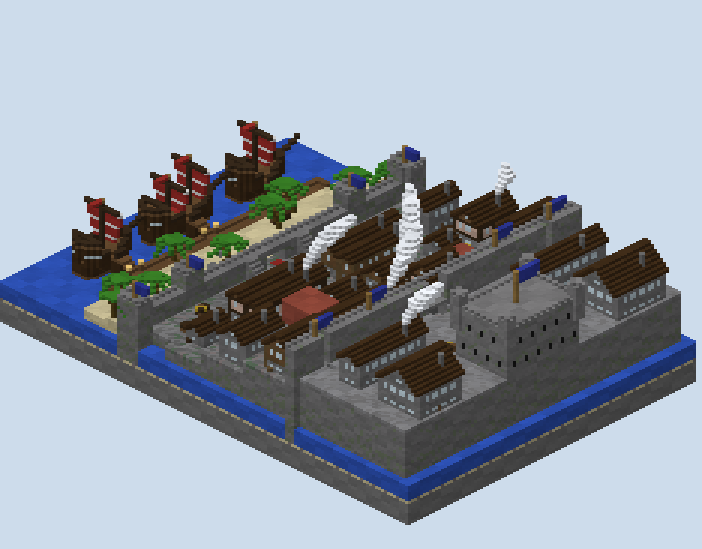

# Saltgate — what was built

An attack/defend board built from the plan in `PLAN.md` after one review, which settled no building and fifteen
minutes. A walled harbour citadel is stormed from the sea in three stages, each opening the next.

## How it was made

**The world is built from the plan's raster.** `scripts/plan.py` holds every column's height and kind, the gates
by stage, the culvert, the objectives and the spawns. `plan_check.py` walked it stage by stage, `sketch.py` drew
it, and `gen.py` builds each column to that height, its paving or masonry by kind.

**What a raster cannot hold is built on top:**
- the ships, with dark oak hulls, red sails and railed decks;
- the landing stage;
- the gatehouse, its arch and the walk over the passage, and the sea wall's crenellations and blue hangings;
- the siege ladders and the culvert;
- the town's houses, by the rotated-house builder;
- the powder stores, vaulted brick with their monuments;
- the citadel's portcullis and posterns, and the keep with its turrets and lit treasury;
- the banner's pedestal and its monument;
- the cover.

**Every gate is a block the match removes.** A fence across each gangplank, iron bars across the stores' doors,
the citadel's portcullis and the keep's two doors. `gen.GATE_REGIONS` lists their boxes, and `map.xml` fills
those same boxes with air when the stage falls.

## The detail pass

**The review asked for ships shaped like ships and for more on the ground; this is what was added.**

- **The ships** lie broadside to the beach, bow to the east, and each is its own shape. The deck is a hull's outline,
  rounded at the bow and full at the stern, and every course below it is a little shorter and narrower down to a
  keel of logs, so the sides curve in under the water. A spruce band runs along the waterline, and the bulwark and
  rail rise at the ends. Each has a stern cabin with windows and a railed roof, a bowsprit, and red sails striped
  in white under a yard; the flagship has two masts. The plan's decks are the same outline, so the walk stands on
  what is built.
- **The beach** has palms of my own: a jungle-wood trunk that leans as it rises, and a crown of two crosses of
  leaves laid one over the other, the second turned an eighth, each frond level and then drooping toward its
  tip. The landing stage is fenced along its seaward edge, with a lantern on a post either side of each
  gangplank.
- **The town's streets** have crates, logs and hay stacked against the houses' walls here and there, never on a
  stair, by a gate or near a spawn.
- **The keep** has a chiseled course at 42 and under the battlements, and dark glass windows two high on the
  upper storey, each with a sill. Arrow slits run along the lower storey, and a stone canopy stands over the door.
- **The flags** are blue wool on fence poles: a large one over the keep, four on the citadel wall and one on each
  of the sea wall's towers.
- **Smoke** rises from about a third of the chimneys. It is white glass, two by two where it leaves the chimney,
  swelling into a long balloon as it drifts east and a little north, each plume bending its own way.

**The walks did not move.** The stage-by-stage walk over the built blocks gives the same numbers within a block
or two, and still finds no stage that can be skipped.

## The match in `map.xml`

| Stage | Goal | When it is done |
|---|---|---|
| warm-up | twenty seconds after the match starts | the gangplanks' fences are filled with air |
| A, the Sea Gate | a control point in the yard: the defenders own it at the start, only the attackers can capture it (fifteen seconds), and it stays captured | the stores' doors open; the spawns move up |
| B, the Powder Stores | two destroyables of obsidian, the defenders', one in each store | the portcullis and the keep's doors open; the spawns move up |
| C, the Banner | a purple wool for the attackers, in the keep's treasury, its monument in the Sea Gate's yard | the attackers win |

- **The clock:** `<time result="defenders">15m</time>`.
- **Spawns:** each team's three spawns are filtered on what is `<completed>`.
- **Gates:** each is opened by a `<trigger>` on the same filter, with a message to the match.
- **The kits:** the attackers carry a diamond pickaxe to cut the obsidian; the defenders carry more arrows.
- **Regions:**
  - nothing may be broken but the stores' obsidian and the banner's wool;
  - nothing may be placed but the banner in its slot;
  - the posterns let only the defenders through;
  - the flagship is the attackers' alone.

## What the built world measures

`renders/walks.txt` replays the match in the built blocks. At each stage the gates already won are opened in a
copy of the world, the posterns are shut to the attackers, and each team's spawn for that stage is walked on
foot:

| Stage | Attackers | Defenders |
|---|---|---|
| A: to the Sea Gate | 34 from the flagship | 21 from the town square |
| B: to the west store | 43 from the yard | 37 from the top terrace |
| B: to the east store | 58 from the yard | 26 from the top terrace |
| C: to the banner | 44 from the top terrace | 36 from the courtyard |
| C: the carry, the banner to the Sea Gate | 79 | the chase: 91 from the courtyard |

**No stage can be skipped in the built world.** During the warm-up the attackers cannot leave their ships, since
the decks are railed and the gangplanks fenced. Before the Sea Gate falls neither store is reached, and before both
stores fall the banner is not. In every case the walk finds no way, not a long one.

**The ways into the Sea Gate** were walked on the plan from the flagship: the gate 36, the ladders 56, the culvert
65 (`renders/plan-check.txt`).

## The renders

- `00-plan-sketch.png`: the approved plan.
- `01`, `02`: the studio's top-down and height reads of the region files.
- `10`–`12`: cutaways at true scale, drawn by `scripts/cutaway.py`:
  - down the middle from the flagship to the keep;
  - along the sea wall;
  - through the culvert.
- `30`–`36`: isometric views:
  - the whole board from two corners;
  - the Sea Gate;
  - the town;
  - the west powder store cut open;
  - the citadel;
  - the treasury cut open;
  - the flagship, the beach and its palms, and the keep.
- `50`: an elevation of the town from the south, with its smoke.

## What I wanted, how hard it was, and what a studio feature would need

| What I wanted | How hard it was | What a studio feature would need |
|---|---|---|
| Stages that open in order | Moderate: gates as blocks in the world, their boxes shared by the generator and the XML, triggers on `<completed>` filters | Gates as plan pieces with the stage that opens them, and the XML written from them |
| Spawns that move with the front | Easy once the stage filters existed; three spawns a team, each filtered | A spawn layer by stage on the plan |
| Proof that no stage can be skipped | Moderate: the walk run on a copy of the world with each stage's gates opened and the posterns shut to the attackers | A stage-by-stage walk in the studio's reads, from each team's spawn to each objective |
| The defenders arriving first, every stage | Easy to read once the walk ran by stage; three spawns moved to get it | Arrival times by team and stage shown on the plan as it is drawn |
| Three different ways into the first objective | Easy: a passage, two ladders, a culvert, side by side | Approach pieces — gate, ladder, culvert — that measure themselves against each other |
| Ships, palms and smoke that read as themselves | Moderate: a hull drawn as an outline carried down to a keel, a palm as two turned crosses drooping, smoke as a swelling plume bent by a wind | Prop pieces with a shape rule — hull, palm, plume — rather than boxes |
| Validation of an attack/defend map | Not attempted here; the XML follows PGM's source and Bardo's | Attack/defend in the studio's round-trip, the gates and stages read back against the world |
