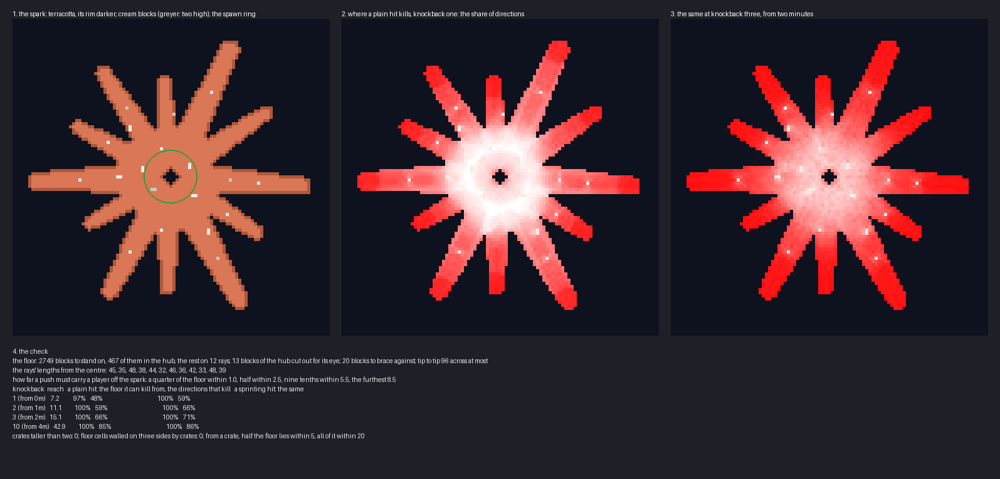

# Spark — the plan

A knockback board, planned and waiting on a review before anything is built. Its floor is the Claude spark: a
terracotta starburst of twelve rays of uneven length round a hub, hung in the sky over a sea of cloud. Everyone has
a stick whose knockback grows as the match goes on. One life each; the last player on the spark wins.

**This plan replaces an earlier one of five overlapping floes of lake ice.** The floes are kept as `scripts/*_v1.py`
and `renders/00-plan-sketch-v1.png`. The match is the same; only the floor changed, to the author's suggestion of
the logo, whose rays and gaps make the edges a knockback board is played on.

## What the knockback maps do

**The genre is Knockout Stick Fight, in the community maps under blitz and arcade.**

- **Knockout Stick Fight:** five round floating floors of about fifteen blocks' radius, overlapping, a block or two
  apart in height, each in its own colours.
- **Its Pond Edition:** one floor of lily pads about a hundred across, with holes in it, water and sand out of
  bounds.
- **Knockout Stadium:** a team variant built round a ring to hold.
- **Bigger Bubble Brawl,** in the public maps, plays the same way with a fishing rod.

**Both Knockout Stick Fights play the same match.**

- **The stick:** knockback one, then two at one minute, three at two minutes, ten at four minutes. Each step is a
  forced kit given on a time filter, with a broadcast as it comes.
- **The life:** blitz, one life, a five-minute clock.
- **The start:** three seconds of resistance 255, a second of slowness, and knockback reduction of 0.9, taken off at
  three seconds, so nobody is knocked off before the match starts.
- **The rest:** regeneration and no fall damage, so nothing kills but the void. Hunger is off and nothing is built
  or broken.

**This plan follows that match exactly.** It adds only a floor of its own.

## The board

**The spark is a hub twenty-five blocks across with twelve rays, ninety-six blocks from tip to tip.** Each ray is
a stroke from the centre, eleven blocks wide at the hub and tapering to five or six at its rounded tip. Long and
short rays alternate unevenly, from thirty-two to forty-eight blocks from the centre, as the logo's do.

| | Blocks |
|---|---|
| the floor in all | 2,749, about Knockout Stick Fight's |
| the hub | 467 |
| the twelve rays | 2,282 |
| the eye in the middle of the hub | 13, open to the void |

**The floor is flat, one block of terracotta at y 64.** Orange wool gives the logo's colour, with a rim of orange
clay a shade darker along every edge so the edges read from a distance. Under it hangs a tapering underside of
terracotta.

**Twenty blocks of cream stone are the only things on the floor.** Eleven stand round the hub and nine along the
rays. None is taller than two, and no cell of floor is walled on three sides by them. They are something to brace
against, never somewhere to hide.

## Where a hit kills

**The checker models a hit with Minecraft 1.8's own knockback code** (`renders/plan-check.txt`). The horizontal
speed is 0.4 plus 0.5 for each level, sprinting counting as one level, and 0.4 up. Air drag is 0.91 a tick, and on
the ground the speed falls by the footing's slipperiness times 0.91. It is an upper bound, because a player who
steers against the hit goes less far.

| Knockback | From | Reach | Directions that kill, a plain hit | Directions that kill, sprinting |
|---|---|---|---|---|
| 1 | the start | 7 | 48% | 59% |
| 2 | 1 minute | 11 | 59% | 66% |
| 3 | 2 minutes | 15 | 66% | 71% |
| 10 | 4 minutes | 43 | 85% | 86% |

**The share of directions that kill is the share of the circle round a player an attacker can stand in and win.**
A hit always kills from somewhere, so this is the measure that matters.

**The hub is the safe ground, and the rays are where players die.** At knockback one the hub is white in the
sketch: only a hit toward the eye or down a gap between rays kills there. Out on a ray, any hit from the side
throws a player off, and the tips are red at every level.

## The scenery

**Nothing above the kill height lies within seventy blocks of the spark.** A knockback-ten hit carries a player
forty-three blocks, and anything they land on would let them wait out the match. So the kill height is at 40, and
the sea of cloud below it at 20 is cream, the logo's background.

**Snow peaks stand round the horizon, ninety blocks and more beyond the tips.** Their tops are above the spark, as
the mountain tops round the earlier boards are.

## The match

| Setting | Value |
|---|---|
| players | free for all, 2 to 64, spawning round the hub |
| the stick | knockback one; two at 1 minute, three at 2, ten at 4, each with a broadcast |
| the start | resistance 255 for 3 seconds, slowness for 1, knockback reduction 0.9 until 3 seconds |
| damage | regeneration, no fall damage, hunger off; nothing is built or broken |
| the end | below y 40 a player is out; blitz, one life; the last standing wins; a five-minute clock |

## What I would like a ruling on

- **The spark as drawn:** twelve rays, ninety-six blocks tip to tip, and the eye in the hub as the one hole.
- **The colours:** orange wool for the logo's terracotta, a darker clay rim, cream blocks and a cream cloud sea.
- **Knockout Stick Fight's schedule unchanged:** knockback one, two, three, then ten at four minutes.
