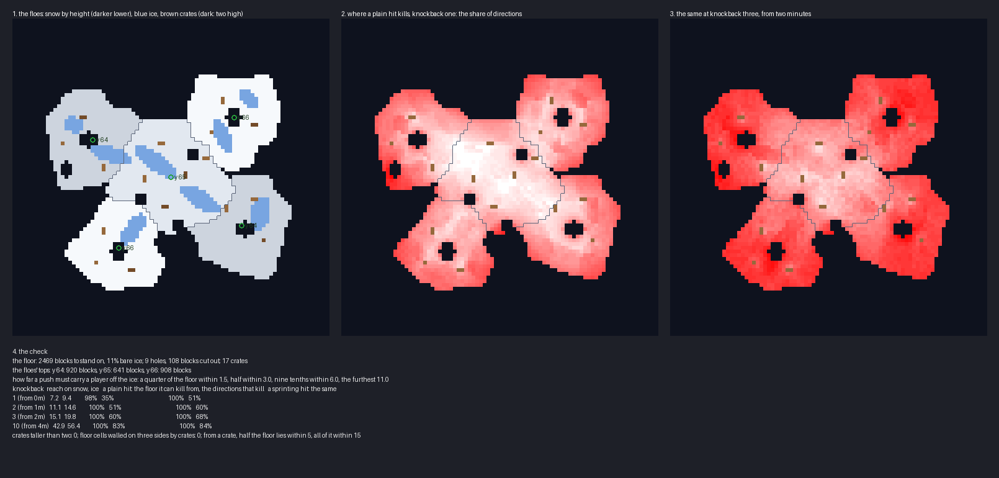

# Floe — the plan, superseded by the spark in PLAN.md

A knockback board, planned and waiting on a review before anything is built. Five floes of lake ice hang in the
sky over a polar sea, overlapping one another a step or two apart in height, with holes cut through them. Everyone
has a stick whose knockback grows as the match goes on. One life each; the last player on the ice wins.

## What the knockback maps do

**The genre is Knockout Stick Fight, in the community maps under blitz and arcade.**

- **Knockout Stick Fight:** five round floating floors of about fifteen blocks' radius, overlapping, a block or two
  apart in height, each in its own colours.
- **Its Pond Edition:** one floor of lily pads about a hundred across, with holes in it, water and sand out of
  bounds.
- **Knockout Stadium:** a team variant built round a ring to hold.
- **Bigger Bubble Brawl,** in the public maps, plays the same way with a fishing rod.

**Both Knockout Stick Fights play the same match.**

- **The stick:** knockback one, then two at one minute, three at two minutes, ten at four minutes. Each step is a
  forced kit given on a time filter, with a broadcast as it comes.
- **The life:** blitz, one life, a five-minute clock.
- **The start:** three seconds of resistance 255, a second of slowness, and knockback reduction of 0.9, taken off at
  three seconds, so nobody is knocked off before the match starts.
- **The rest:** regeneration and no fall damage, so nothing kills but the void. Hunger is off and nothing is built
  or broken.

**This plan follows that match exactly.** It adds only a floor of its own.

## The board

**Five floes, each a broken circle, the higher lying over the lower.**

| Floe | Centre | Radius | Top |
|---|---|---|---|
| the middle floe | 0, 0 | 15½ | 65 |
| the west floe | −21, −10 | 13 | 64 |
| the north-east floe | 17, −16 | 12½ | 66 |
| the east floe | 19, 13 | 13½ | 64 |
| the south floe | −14, 19 | 12 | 66 |

**Where two floes overlap, the higher one's edge is a step of a block or two.** That is the step Knockout Stick
Fight's circles make, and the only relief on the board.

**Nine holes are cut through the ice.** Each outer floe has a fishing hole near its middle. Three small ones lie on
the middle floe, and two lie near the far edges. Through a hole there is nothing but the sea far below.

**Two kinds of footing share the floor.** Snow stops a knocked player quickly. Bare blue ice, about one block in
nine, lets them slide, and each patch runs toward a hole or an edge.

**Seventeen crates and blocks of cut ice are the only things on the floor.** None is taller than two, and no cell
of floor is walled on three sides by them. They are something to brace against, never somewhere to hide.

## Where a hit kills

**The checker models a hit with Minecraft 1.8's own knockback code** (`renders/plan-check-v1.txt`). The horizontal
speed is 0.4 plus 0.5 for each level, sprinting counting as one level, and 0.4 up. Air drag is 0.91 a tick, and on
the ground the speed falls by the footing's slipperiness times 0.91. It is an upper bound, because a player who
steers against the hit goes less far.

| Knockback | From | Reach on snow | Reach on ice | Directions that kill, a plain hit | Directions that kill, sprinting |
|---|---|---|---|---|---|
| 1 | the start | 7 | 9 | 35% | 51% |
| 2 | 1 minute | 11 | 15 | 51% | 60% |
| 3 | 2 minutes | 15 | 20 | 60% | 68% |
| 10 | 4 minutes | 43 | 56 | 83% | 84% |

**A hit always kills from somewhere, so the measure that matters is the side it comes from.** Half the floor lies
within three blocks of a hole or an edge, and none of it further than eleven. From almost every block a well-aimed
hit at knockback one can put a player off.

**The share of directions that kill is the share of the circle round a player an attacker can stand in and win.**
At knockback one, the middle floe is mostly white in the sketch: an attacker has to come from the right side. By
knockback ten nearly every side kills.

## The scenery

**Nothing above the kill height lies within seventy blocks of the floes.** A knockback-ten hit carries a player
forty to fifty-six blocks, and anything they land on would let them wait out the match. So the polar sea lies at
y 20, the kill height at 40, and the icebergs in the sea stay below 40.

**Snow peaks stand round the horizon, ninety blocks and more out.** Their tops are above the floes, as the mountain
tops round the earlier boards are. The floes' undersides hang with packed ice and icicles, and a low sun sits over
the sea.

## The match

| Setting | Value |
|---|---|
| players | free for all, 2 to 64, each spawning spread over all five floes |
| the stick | knockback one; two at 1 minute, three at 2, ten at 4, each with a broadcast |
| the start | resistance 255 for 3 seconds, slowness for 1, knockback reduction 0.9 until 3 seconds |
| damage | regeneration, no fall damage, hunger off; nothing is built or broken |
| the end | below y 40 a player is out; blitz, one life; the last standing wins; a five-minute clock |

## What I would like a ruling on

- **The floor: five overlapping floes,** after Knockout Stick Fight's five circles, rather than one sheet.
- **The theme: lake ice over a polar sea,** with snow peaks round the horizon.
- **Knockout Stick Fight's schedule unchanged:** knockback one, two, three, then ten at four minutes.
