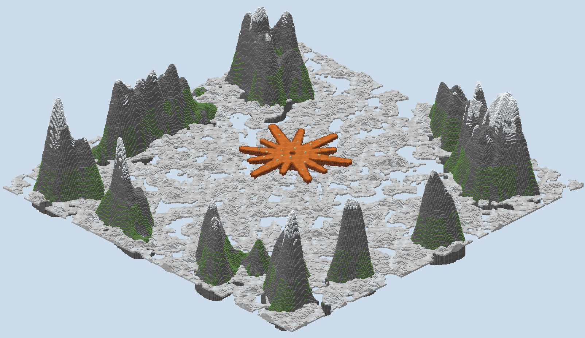
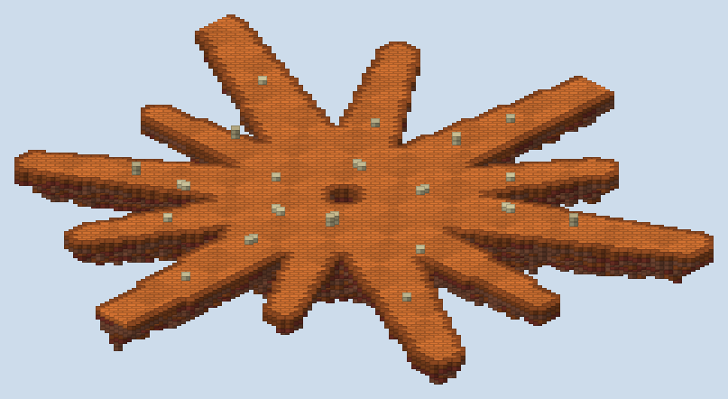
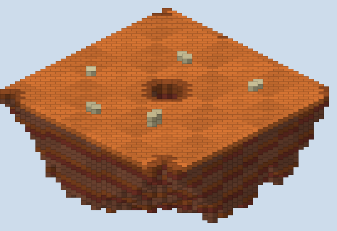
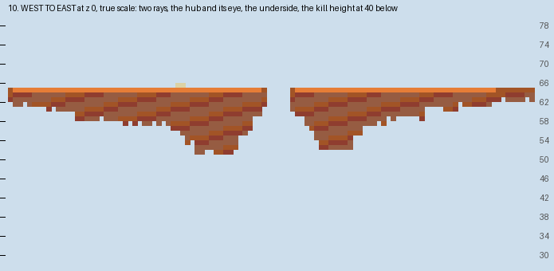

# Spark — the report

A knockback board built from the approved plan with my own generator. Its floor is the Claude spark, a terracotta
starburst of twelve rays round a hub, hung in the sky over a cream sea of cloud with snow mountains round it.
Everyone has a stick whose knockback steps up as the match goes on. One life each; the last player on the spark
wins.

## What is in the folder

- `scripts/plan.py`, `plan_check.py`, `sketch.py`: the spark's rays, hub, eye and blocks, the knockback model and
  its checker, and the sketch, as reviewed.
- `scripts/plan_v1.py`, `plan_check_v1.py`, `sketch_v1.py` and `PLAN_v1.md`: the five floes of the first plan,
  set aside for the spark.
- `scripts/gen.py`: the generator. `scripts/mapxml.py` writes `map.xml` from the plan.
- `scripts/walk.py`: the built world read back: the floor, nowhere to wait, the spawns, the scenery.
- `scripts/build.sh`: the whole build from nothing, in about half a minute.
- `world/`: the region files, `level.dat` and `map.xml`.
- `renders/`: the plan sketch, the studio's top-down and heightmap, a section, isometric views of the spark
  among its mountains, from two corners and close at the hub, `plan-check.txt` and `walks.txt`.

## What was built

**The spark is one floor of orange wool at y 64, 2,749 blocks to stand on.** It is ninety-six blocks from tip to
tip. Every edge has a rim of orange clay a shade darker, so the rays read against the cloud. The eye at the hub's
middle is open to the sky below.

**Under the floor hangs a tapering underside of banded terracotta.** It is fourteen blocks deep under the hub and
two or three under a ray's tip, and it lies wholly inside the floor's outline, so nobody falling past an edge
touches it.

**Twenty blocks of cream sandstone stand on the floor, none taller than two.** Eleven are round the hub and nine
along the rays.

**The scenery lies far out and far down.** A cream sea of cloud at y 20 runs to the world's edge, broken where the
sky shows through. Snow mountains rise out of it in separate massifs from about 130 blocks out, with ridged crests
and saddles, up to y 150, and snow on every top.

## Read back from the blocks

**Every check passes on the built world** (`renders/walks.txt`).

- **The floor:** every cell the plan calls floor is terracotta with headroom, or a block of cream stone the plan
  put there. Every cell the plan calls void, the eye and the gaps between rays, is open below the floor down past
  the kill height.
- **Nowhere to wait:** inside 120 blocks of the centre nothing stands above the kill height but the spark and its
  underside.
- **The underside:** under every floor cell it hangs in one unbroken piece from the floor.
- **The spawns:** all twelve points in `map.xml` stand on the floor with headroom.
- **The scenery:** the nearest block above the kill height lies 96 blocks beyond the furthest tip. A sprinting
  knockback-ten hit carries a player 47 blocks.

**The read-back caught one block of the plan on the void.** A cream block placed between two rays stood over
nothing, so a player could have stood on it in mid-air and waited out the match. It now stands on a ray.

## The match

**`map.xml` is written by `scripts/mapxml.py`, after Knockout Stick Fight's.**

- **The stick:** knockback one, then two at one minute, three at two minutes and ten at four. Each step is a
  forced kit given on a time filter, with a broadcast as it comes.
- **The start:** three seconds of resistance 255, a second of slowness, and knockback reduction 0.9, taken off at
  three seconds.
- **The spawns:** twelve points at the foot of the rays round the eye, each facing out along its ray, spread one
  player to a point.
- **The end:** below y 40 a portal takes a player into the void. Blitz, one life, the last standing wins, with a
  five-minute clock.
- **The rest:** regeneration, no fall damage, hunger off, no building or breaking, and the time of day locked at
  noon.

## What was not done

**The map has not been loaded on a PGM server or played.** The kits and filters copy Knockout Stick Fight's, but
how the spark plays wants a real match. The likeliest problem is the rays being too narrow at knockback one.

**The knockback model is an upper bound.** A player who steers against a hit goes less far than the plan's reach,
so in play the hub is probably safer than the sketch shows.

## What I wanted, how hard it was, and what a studio feature would need

| What I wanted | How hard it was | What a studio feature would need |
|---|---|---|
| A floor in the logo's shape | Easy: the rays as tapered strokes from the centre with rounded tips, the hub as a disc | A shape piece from strokes and discs, rasterised |
| A measure of where a hit kills | Moderate: the first measure, whether a hit could kill, saturated at once; the share of directions that kill did not | A knockback read per cell: the reach at each level, the share of directions over the void |
| Nowhere to land after a long hit | Easy once the reach was known: a clear ring of 120 blocks, checked on the built blocks | A no-stand check against a reach, not a fixed distance |
| Mountains that look like mountains | Moderate: cones first, then a ridged wall, then separate massifs smoothed into slopes | A ridged-noise mountain range with a clear inner radius |
| Validation of a knockback match | Not attempted | Kits on time filters and void portals in the studio's round-trip |

## After the playtest

**The spark is a quarter larger in every length, so its floor is half again what it was.** `plan.py` scales the
hub, the rays, the eye and the spawn ring by `SCALE = 1.25`; the crates keep their size and move out with it. The
floor went from 2748 blocks to 4326, the hub from 467 to 739, and tip to tip from 96 to 120 across.

**Every radius that was a typed number now comes from the plan.** The generator, the walk, the check and the
sketch each drew the floor inside a fixed 50 or 52 blocks, which would have cut the longer rays short. They now
use `REACH`, the longest ray and four, and the scenery's clear ring follows it out to 132.

**A hit carries a player off a little less of the floor.** A plain hit at knockback one can kill from 92% of the
floor against 97% before, and from 39% in its weakest direction against 48%. At knockback ten it is still all of
the floor, and the nearest scenery is still 96 blocks past the furthest tip.
