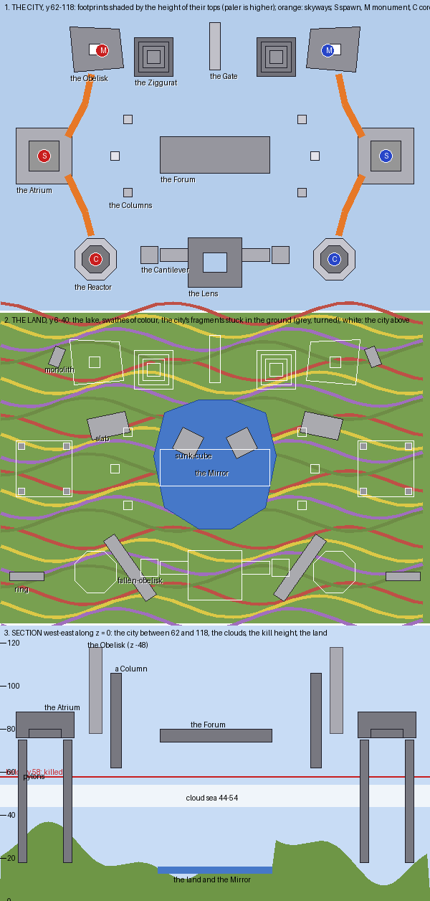

# Stratum — the plan

Written before anything was built. The sections after *As first drawn* record how the plan changed and why.

## The board in one sentence

**A brutalist city of concrete masses floats over a sea of cloud, above a painted land into which the city's
own geometry has fallen and been driven: the masses are the board, their faces are patterned in ways a
studio facade cannot be, and every gap between them is bridged.**

What a player remembers: the Obelisk's glyph-cut faces with the stair winding up them, the court of the
Atrium open to the sky, and the land far below through the gaps in the cloud with a monolith standing in it
at a slant.

## Three layers

**The city (y 62 to 118) is the board.** Masses are footprint polygons extruded between two heights. Two
skyways a side join the spawn to its objectives, and every other gap is bridged, as on Roziterman.

**The cloud sea (y 44 to 54) is glass, and broken.** Everything below y 58 kills: a player who falls is dead
before reaching the clouds or anything under them. PGM has no kill action, so `map.xml` gives a kit of
instant damage to anyone entering the region below y 58. Its source was read for this (`PotionEffects` and
`KitParser`).

**The land (y 6 to 40) is never played on and is there to be seen.** It is rolling hills laid in swathes of
colour, a lake under the middle, and woods. The city is stuck into it, so the place reads as whole: the
Atrium's four pylons come down to the ground, a monolith is driven in at a slant, an obelisk has fallen
across a field, a cube is half sunk in the lake, and a ring lies tipped on a hill.

## Mode: one core and one monument a team

**The core hangs in the Reactor, over a shaft open to the void.** A breach pours lava straight down the
shaft, so the leak is designed. **The monument is on a balcony cut into the Obelisk's east face at y 100**,
reached by the stair that winds round the Obelisk from its plaza.

## The places (red half; blue's are their mirror image)

| Place | Footprint | Height | What it is | Why |
|---|---|---|---|---|
| The Atrium | square, −93…−67 × −13…13 | 76–88, court 80 | a hollow square, its court open to the sky, gates north, south and east, four pylons to the land | **spawn** |
| The North Skyway | polyline to the plaza | 80 → 78 | a concrete beam, three wide | spawn to monument |
| The Obelisk | a skewed quadrilateral plaza, a 6 × 6 shaft | plaza 78, top 118 | glyph-cut faces, a stair wound round it | **monument** at 100 |
| The South Skyway | polyline to the Reactor | 80 | a concrete beam | spawn to core |
| The Reactor | octagon r 10.5, hollow r 7 | 66–96 | a gallery ring round a shaft, the core hung over it | **core** at 84 |
| The Columns | three 5 × 5 pillars | to 98, 106, 92 | stairs wound round each | the high ground over the middle |
| The Forum | −26…25 × −9…8, across the seam | 80 | colonnades, a sunken court with a glyph floor | the middle |
| The Gate | a square frame across the seam | 68–94 | its foot is a bridge | the north crossing |
| The Lens | a square ring lying flat across the seam | 74 | its rim is a bridge | the south crossing |
| The Ziggurat | four tiers round −29, −46 | 64–80 | stepped | the north flank |
| The Cantilever | a tower with a slab thrown east | 62–88 | a slab overhanging the gap | the south flank |

## The faces: what the studio cannot do

Every face in the city is patterned. A pattern is a function of where a block falls on its face — the
distance along the face, the height up it — and says whether that block stands flush, is set back one (an
**inset**), or is replaced by an accent. The patterns are:

- **inset bands:** a course set back one, in a contrasting colour;
- **flutes and panels:** a rhythm of flush and inset strips, or of whole panels;
- **glyphs:** five by five symbols inlaid into a face, set back and dark;
- **slits:** tall narrow windows of glass;
- **cornices:** a course thrown out a block at the top;
- **coffers:** the undersides of floating masses cut into a grid of recesses, a light in each.

## Palette, decided now

- **Concrete:** polished andesite and stone, smooth double slab for lighter faces, quartz for the Obelisk.
- **Accents:** light grey, grey and black clay for insets and glyphs; orange clay for one band on each mass;
  sea lanterns in the coffers. Team colour only on the spawn and the objectives.
- **The land:** grass, podzol and coarse dirt in swathes, fields of poppy, dandelion and allium, birch and oak
  woods, a lake with shelving shores.
- **Clouds:** white and light grey stained glass, plain glass at the edges.

## As first drawn

The tables and sketch above are the plan as written before building.
