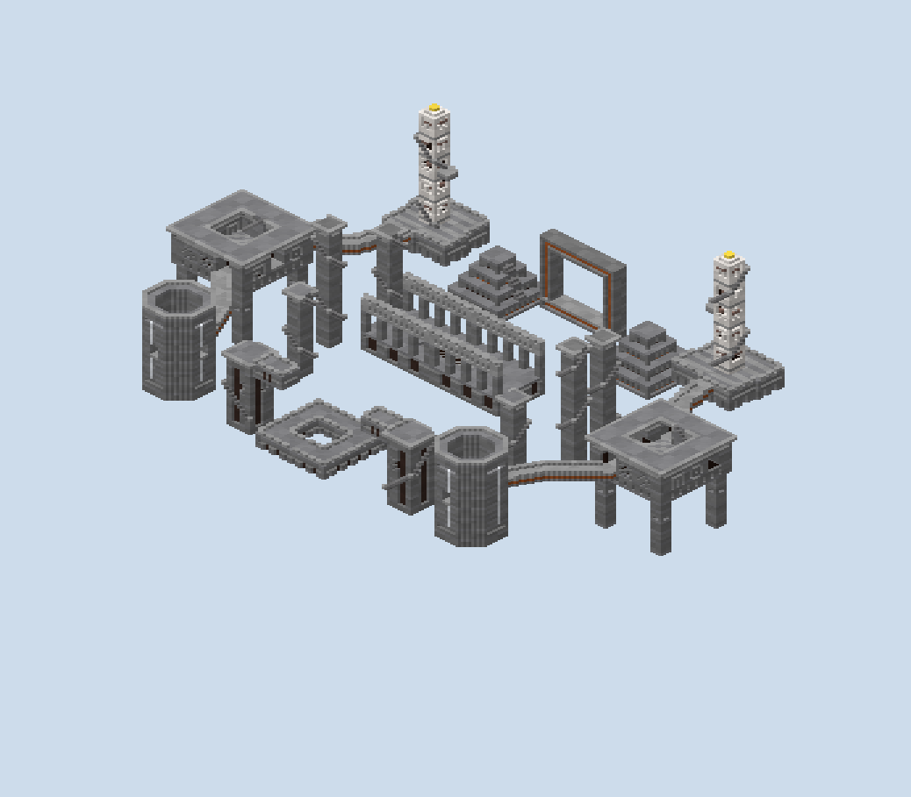
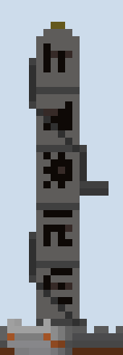
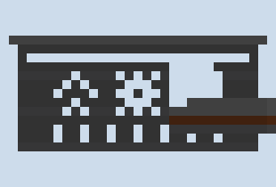
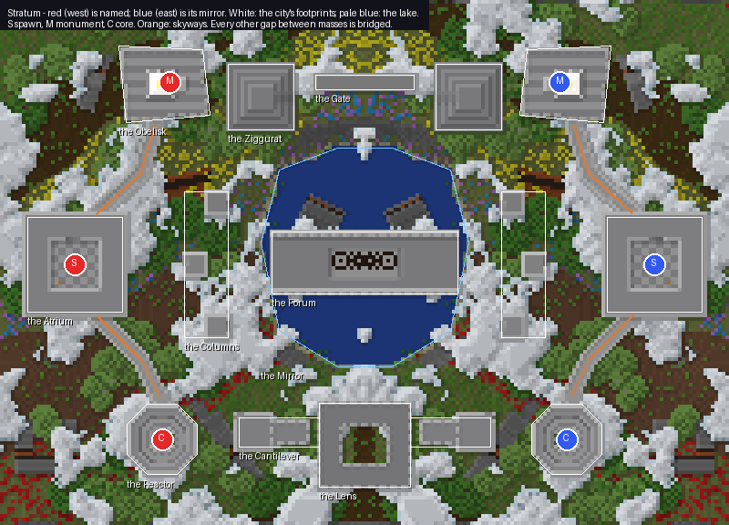

# Stratum — report

**A brutalist city of concrete masses floats over a sea of glass cloud, above a painted land.** The masses
are the board: an Atrium where each team spawns, an Obelisk with the monument on a balcony, a Reactor with the
core hung over a shaft into the void, and between them Columns, a Forum, a Gate, a Lens, a Ziggurat and a
Cantilever. Two skyways a side join the spawn to its objectives; every other gap is bridged. Anyone who falls
dies at y 58, long before the clouds, and the land below is there to be seen.

It is a combined board, one core and one monument a team (`<gamemode>dtm</gamemode><gamemode>dtc</gamemode>`).
It is sixteen a side, 200 × 144 blocks, the city from y 62 to 121. Blue's half is red's mirrored across
x = −0.5.

## What was asked, and where it is

| Asked | Where it is |
|---|---|
| Wild, abstract, brutalist floating shapes | eleven masses a side: hollow squares, a skewed slab, an octagon, a frame, a flat ring, stepped tiers, a tower with a slab thrown from its head |
| Clean geometry, patterns above all | every face patterned by `scripts/facade.py`: insets, stripes, flutes, panels, glyphs, slits, cornices, coffers |
| What the studio cannot do: inset faces, an inset colour stripe, flat and inset segments alternating, glyphs in the shapes | all of them, and each is a recess rather than a paint (below) |
| Players bridge | the walk reaches only the Atrium, the skyways, the plaza, the Obelisk and the Reactor; everything else is reached by building |
| Painterly terrain below, with the city's shapes stuck into it | the land in swathes of colour, a lake, woods; the Atrium's pylons come down to it; a monolith driven in at 24°, a fallen obelisk, a cube half sunk in the lake, a ring tipped on a hill, a slab askew |
| Obelisks, pillars with staircases | the Obelisk, its stair wound round it to the top; three Columns, a stair wound round each |
| A floating city above the clouds | the cloud sea, 25,825 blocks of glass on each half between y 44 and 54, broken so the land shows through |
| Kill players mid-fall | `<apply kit="fall-kill" region="the-fall"/>` on `<below y="58"/>` (below) |

## The faces

**A face's pattern is a function of where a block falls on that face.** `facade.py` finds every straight
run of a mass's edge and walks it. For each block it asks the mass's patterns in order, giving the distance
along the run, the run's length, and the height up the face. The first pattern with something to say decides
the block:

- **inset**: the block becomes air and the one behind it takes the pattern's material, so the face steps
  back a block there;
- **accent**: the block stays flush in another material;
- nothing: the block stays the mass's concrete.

Corners are never patterned, so every edge stays a crisp line.

**The patterns are each a few lines.**

- **Inset band:** a course set back, orange or grey or in team colour.
- **Flutes:** grooves on a rhythm.
- **Panels:** whole panels alternately flush and set back, divided evenly about the run's middle.
- **Glyph row:** five-by-five symbols from an alphabet of eight, centred on the run and spaced evenly,
  inlaid dark and set back.
- **Slits:** glass, tall and narrow.
- **Checker:** a field of inset squares.
- **Courses:** a dark pour line every four blocks, as board-formed concrete shows its pours.

Tops take a cornice thrown out a block, or a solid or slotted parapet. Undersides are coffered: a grid of
two-by-two recesses, a sea lantern in every other.

**Because the patterns are functions of the face, one pattern comes out right on any face.** The same glyph
row puts one glyph on a short wall and six on a long one, centred both times. A pattern on the octagon's
stepped faces falls back to the bands, which need no run length. `scripts/scratch/facades.py` is the test
bench: four masses, one pattern set each.

## A tour (red's side; blue's is its mirror)

**The Atrium (spawn) is a hollow square 27 across.** Its court at y 80 is open to the sky and paved in a
two-block checker with the spawn square in team colour. Gates open north and south toward the skyways and
east toward the middle, and a flight climbs the court's west wall to the roof. Outside, flutes run below a
row of glyphs, and a team-coloured course is set back under the cornice. Its four pylons go down through the
cloud to the land, fluted all the way.

**The North Skyway leads to the Obelisk.** The plaza is a skewed quadrilateral, its top laid in long light and
dark bands. The Obelisk is 6 × 6 and 40 high, white quartz with five rows of glyphs and a gold-capped
pyramidion. A stair of single blocks winds round it with nothing on its outer edge, wound from whichever
corner brings it to the middle of the east face at y 99. There a balcony is thrown out three blocks, and the
monument stands in a niche cut two into the shaft.

**The South Skyway leads to the Reactor.** It is an octagon 21 across and 30 high, slit with glass and banded
orange and in team colour. Inside, a gallery ring at y 80 surrounds a shaft open all the way to the void. The
core hangs over the shaft on four beams, so a breach pours its lava 33 blocks down before it meets anything.

**The middle.** Three Columns, 5 × 5 and fluted, stand east of the Atrium, each with a stair wound round it
to its top at 98, 106 or 92. The Forum lies across the seam, 52 × 18, with colonnades of 2 × 2 piers under
fluted architraves along both long sides. In its middle, a court sunk two blocks has a mosaic of four glyphs
in its floor.

**The flanks.** North, the Ziggurat rises in four tiers banded orange and grey, with a stair up its east
face. Beyond it the Gate stands across the seam: a frame 28 wide and 27 high, with an orange line set into
both faces, and its foot is the north bridge. South, the Cantilever throws an 11-block slab from its tower's
head toward the Lens, a square ring lying flat across the seam whose rims are the south bridge.

## The gaps, and how a match is meant to flow

**Each team walks to its own objectives and builds to everything else.** From the spawn, `scripts/walk.py`
measures 95 blocks to the monument's balcony, 68 to the core and 61 to the plaza. The Atrium's roof is 16 and
the Obelisk's top 127. Every other mass is reached only by bridging. The gaps, edge to edge:

| From | To | Blocks to bridge |
|---|---|---|
| The Atrium | the tallest Column | 16 |
| A Column | the Forum | 11 to 17 |
| The plaza | the Ziggurat | 5 |
| The Ziggurat | the Gate | 5 |
| The Reactor | the Cantilever | 10 |
| The Cantilever | the Lens | 2 |

**The flanks pair the objectives.** The north flank (plaza, Ziggurat, Gate) leads from one team's Obelisk
to the other's. The south flank (Reactor, Cantilever, Lens) leads from one Reactor to the other. The Forum,
from the Columns, is the long build through the middle.

## The kill height, and what PGM's source says

**PGM has no action that kills, so the fall is a kit.** I cloned PGM and read it:
- **No kill action:** `ActionParser` has none.
- **No health of zero:** `HealthKit` refuses one.
- **What does work:** a kit can carry a potion effect. `PotionEffects` names instant damage `instant damage`
  (or `harm`), and `KitParser` takes an amplifier.

`map.xml` gives a forced kit of instant damage VI to anyone entering `<below y="58"/>`. That is 96 points of
damage, applied on entering the region.

**The portals Hollowcrown uses are the form PGM parses.** `PortalModule` reads `x`, `y`, `z` and `yaw` with an
`@` prefix as absolute coordinates, an entrance `region`, and a passive `filter`. Hollowcrown's four lifts
are written exactly that way, so the doubt in its report is answered.

## What changed while building, and the audit

**`scripts/audit.py` checks the rules of a board played in the sky.** Nothing is built above the build
height, and the clouds stay between y 44 and 54.

**It also checks the objectives and the claims.** The core is whole, its lava falls at least ten blocks, the
monument is two obsidian, and no two masses claim the same ground. Its last run reads `no placement problems
found`. `PLAN.md` lists what moved. In short:

- the skyways left from solid wall and now leave from gates;
- the Gate stood along the seam and now stands across it;
- the Obelisk's stair missed the balcony and now starts from the corner that meets it;
- the Cantilever's arm ran into the Lens.

## What I am proud of

- **Insets and glyphs in a few lines each.** A pattern is a small function of the face, so a new one is a
  new function, and every mass on the board can take it.
- **The land and the city are one place.** The pylons go down into the land, and the land holds pieces of the
  city at angles. The cloud sea between them is broken, so the land shows through.
- **The objectives each have a designed shape**: a monument in a niche on a balcony at the head of a stair,
  and a core whose leak falls down a shaft into the void.

## What I would do next

- **More colour.** The board is grey with orange, as concrete is. A second accent per flank, and coloured
  glyphs on the Forum's floor, would help players tell the flanks apart from a distance.
- **Patterned undersides beyond coffers**: ribs, and stepped soffits on the Cantilever's arm.
- **Shorter walks to the monument.** The stair is 34 of its 95 blocks; a second stair on the other side
  would halve that for defenders.
- **It has not been played**, and nothing here, the kill kit included, has been checked in game.

## What I wanted to build, how hard it was, and what a studio feature would need

| What I wanted | How hard | What a studio feature would need |
|---|---|---|
| Faces set back in bands, flutes and panels | Easy once the face was found as runs: a recess is "this block air, the one behind it the material" | A **face pattern** on any wall: a function of along and up, answering flush, inset or accent |
| Glyphs inlaid in a face | Easy: a five-by-five bitmap centred on the run, spaced evenly, each set back | A **glyph alphabet** and a glyph-row pattern, so a symbol is a parameter, not a hand-placed set of blocks |
| An inset stripe in team colour | Easy: a band whose material the mirror recolours | **Team-coloured materials** in a pattern, swapped by the symmetry pass |
| Coffered undersides | Easy: a grid of recesses with a light in every other | An **underside** treatment for floating masses: plain, coffered, ribbed, stepped |
| Masses across the seam | Easy once a cell past the seam counted as the mass when its mirror image does | Masses that **cross the symmetry line** and are patterned as one |
| A stair wound round a shaft that meets a balcony | Medium: the stair is simple; meeting the balcony meant trying each starting corner | A **wound-stair** primitive with a waypoint it must pass at a given height |
| Fragments driven into the land at angles | Medium: a box turned by yaw and tipped by tilt, each block's centre taken back into its frame | **Rotated primitives** in three dimensions, sunk to a depth in the ground |
| A cloud sea players fall through | Easy: a thresholded field, grey underneath, plain glass at the rim | A **cloud layer** stage, and a **kill height** written into `map.xml` from the plan |

## Notes on the deliverable

- `scripts/build.sh` regenerates everything: the audit, the volume, the region files via `write_world.cs`,
  the renders, the annotated top-down and the walks. Generation is under a second and writing the region
  files about ten.
- `world/` holds the region files, `level.dat` and `map.xml`.
- The elevations (`renders/5x-*.png`) are where the patterns show; the isometric renders are too coarse to
  show a one-block recess.
- The trees are oak and birch, from Riftwater's cut of rockymine's tree showcase.
- Not checked in game.
