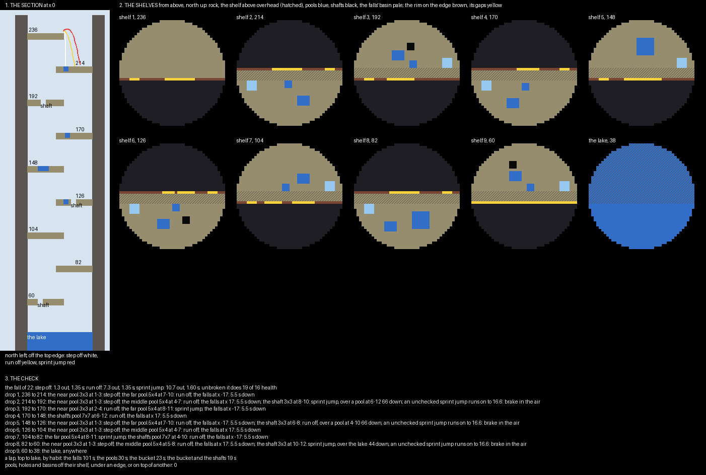

# Sunwell — the plan

> **Superseded.** Reviewed and set aside: a closed shaft gives no void to knock a player into and no way to run, which
> is the half of water drop that makes it a fight. Its fall model, its mirrored ways and its fourteen hills went into
> `../opus55-freeform-lanterndrop/`. The scripts here, `gen.py` among them, stopped part-way through the build.

A water drop board, planned and waiting on a review before anything is built. Every player against every other
drops down a jungle sinkhole two hundred deep, shelf by shelf, taking hills on the way. Every drop is twenty-two
blocks and kills unless it ends in water: a pool hit, a bucket placed in time, or the waterfall ridden down. A hill
scores for whoever touched it last, alive or not, and the most points when the clock runs out wins.

## What the water drop maps in PublicMaps do

**Eight of the arcade maps are this game, built in two ways.**

- **Sunrise over Paradise** and **Limbo II** are chains of floating islands falling about twenty at a time,
  mirrored about their middle: a left way and a right way that meet again.
- **Water Drop II** is one glass shaft, about 250 tall, whose walls step in and out as it falls.

**The rules are nearly the same everywhere.**

- **Kit:** three water buckets, locked in place; fists; two hearts taken away (`health boost -2`), so a fall of
  about nineteen kills.
- **Water:** it can be placed and taken back up, block physics are off so it never flows, and nothing else can be
  built. Water a player leaves behind stays until someone picks it up.
- **Fighting:** PvP is on everywhere but the spawn, so a player waiting at a landing can punch the next one off it.

**There are two ways to score.** Sunrise and the others count laps: a box at the foot gives a point and a portal
sends the player back to the top, and the first to three wins. Limbo II puts hills on the way down instead.

**Limbo II's hills are this plan's model.** There are fourteen of them, each a 5 × 5 × 5 box at a landing,
`capture-time="0.1s"`, `neutral-state="false"`. A player takes a hill by touching it, and it scores five a second
for them until someone else touches it, whether they are alive or not.

**Limbo II's hills follow its two ways down.** Mirrored hills sit on the two ways, and single hills sit on the
middle line where the ways meet. A launch pad at the foot throws players into a portal back to the top. Three
minutes, most points wins.

## The fall, in numbers

**A drop's targets are placed by how far each way of leaving an edge carries a player.** I modelled Minecraft
1.8's fall a tick at a time: gravity, air drag, and the push of a sprint or a jump. Over a drop of twenty-two:

| Way of leaving the edge | Carried out | Fall time |
|---|---|---|
| stepping off | 1.3 | 1.35 s |
| running off | 7.3 | 1.35 s |
| sprint-jumping | 10.7 | 1.60 s |

**A player can always land short of their reach by letting go, never beyond it.** So the near side of a pool
decides the gentlest way that hits it. A pool one to three out takes a careful step; one four to seven out a run;
one eight to eleven out a sprint jump, and nothing further is reachable.

**Unbroken, the fall does nineteen damage against sixteen health.** Every drop on the board is one that kills.

## The board

**The shaft is round, 43 across, and 200 deep.** Nine shelves, four blocks thick, jut from alternate sides,
twenty-two apart from 236 down to 60. Each runs to just past the shaft's middle, so it overhangs the next by five.
The lake fills the foot at 38, with an islet two blocks over the water.

**A player drops off a shelf's edge, lands on the shelf below, walks back under the overhang to that shelf's edge,
and drops again.** The edge is walled by a low rim, open only where something lies beyond: a pool, a shaft, a hill
or the falls. Crossing the shelf to the opening you want is part of every choice.

**The board is two ways down, left and right, mirror images of each other.** They meet on three shelves, where a
pool and a hill sit on the middle line and both ways land beside each other. The checker confirms every drop's right
side is its left's mirror.

| What lies beyond an opening | What it takes | On a miss |
|---|---|---|
| **a near pool**, 3 × 3, one to three out | a careful step off | death |
| **a middle or far pool**, 5 × 4, four to eleven out | a run, or a sprint jump | death |
| **the bare shelf** | a bucket placed under you as you land | death |
| **the falls**, down both side walls into basins | riding falling water down: safe, about five seconds a drop | — |
| **a shaft**, on three shelves each side | a run or a sprint jump into a hole in the shelf below, then braking in the air over a 7 × 7 pool two shelves down, 66 below | death |

## The hills

**Fourteen hills, as Limbo II has.** There are five mirrored pairs, three on the middle line and the islet. Each is
a 5 × 5 × 5 box at a landing, mostly over a pool, so taking it means hitting the pool. A hill scores one point a
second for its holder; the islet scores three. Walked by the quickest line, the bucket and the shafts
(`renders/plan-check.txt`):

| Drop | Hill | Lands by | To a drop | Soonest |
|---|---|---|---|---|
| 1 | the far pools, a pair | a run off | 10 | 4 s |
| 2 | the sun pool, the middle | a run off | 8 | 5 s |
| 3 | the near pools, a pair | a run off | 5 | 8 s |
| 4 | the bare rock, the middle | the bucket | 6 | 11 s |
| 5 | the far pools, a pair | a run off | 2 | 12 s |
| 6 | the moon pool, the middle | a run off | 7 | 16 s |
| 7 | the shafts' pools, a pair | a run off, or the shaft from two shelves up | 8 | 19 s |
| 8 | the middle pools, a pair | a run off | 3 | 18 s |
| 9 | the islet, three a second | the bucket: the islet is twenty under the last edge | 9 | 22 s |

**"To a drop" is how far a hill's holder stands from a place a punch could knock them down.** That is the shelf's
own edge or a shaft through it. The hills by the shafts on drops 5 and 8 are two and three from a fall, and the
hard ones to keep.

**The bare-rock hill and the islet are taken only with a bucket.** Every other hill can also be reached by the
falls and a walk.

## What a lap costs

**From the lake the spring at its far side sends a player back to the top.** A lap, top to lake, by habit:

| Habit | A lap |
|---|---|
| the falls every time | 66 s |
| the pools every time | 33 s |
| the bucket every time | 26 s |
| the bucket, and every shaft | 20 s |

**The safe way is three times slower than the bucket.** A player who cannot place a bucket under pressure still
gets down and still takes hills; one who can reaches them first and retakes them more often.

## The match

| Setting | Value |
|---|---|
| players | free for all, up to 40, each in their own colour |
| kit | three water buckets, locked; fists; sixteen health; three seconds of resistance at spawn |
| fighting | on everywhere but the top shelf |
| placing | water only, anywhere below the top shelf, taken back up at will; it never flows; nothing else |
| hills | fourteen, taken at a touch, held through death; one point a second, the islet three |
| winning | the most points when five minutes run out |
| the way back | the spring in the lake, and the void under the shaft if a player falls past everything, to the top |

## What I would like a ruling on

- **Hills, as Limbo II, rather than laps.** A laps variant is the same board with the islet as a score box and a
  limit of three, and could be a second map.xml.
- **The theme.** A cenote in the jungle: forest on the rim, roots and vines down the walls, waterfalls pouring in,
  ruins on the shelves, and sunlight on the lake.
- **Five minutes and fourteen hills.** Limbo II plays three minutes with five points a second.
