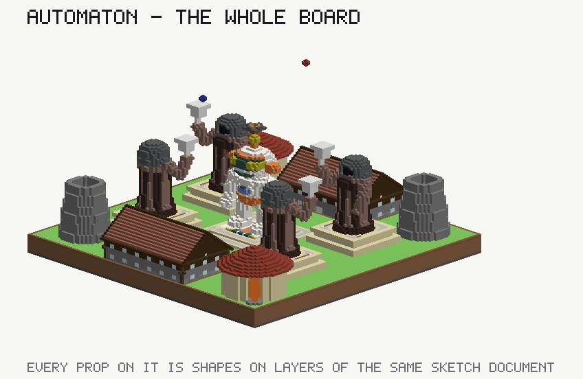
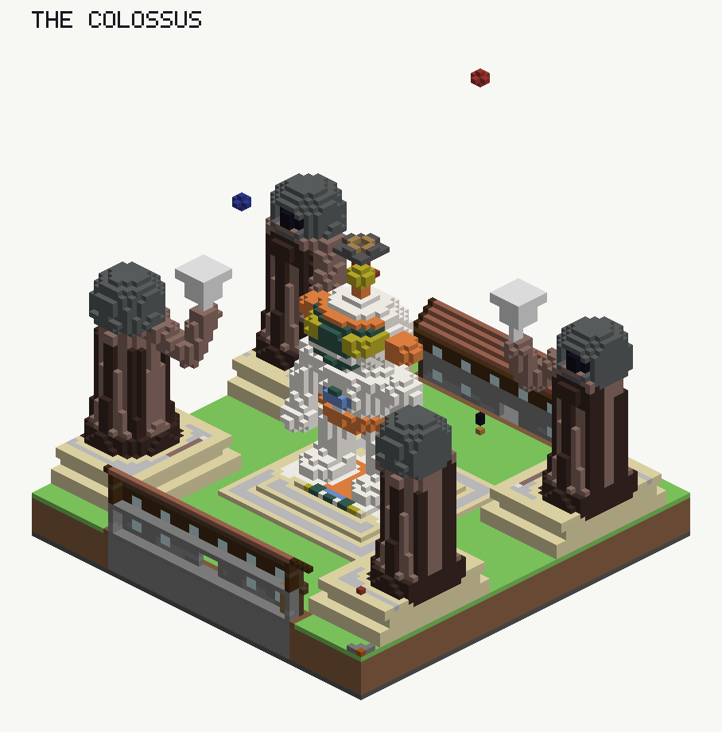

# Automaton — a board whose whole finish is sculpture

`maps/opus5-automaton` · `specs/opus5-automaton` · **110 × 110 blocks** · destroy, one monument a team ·
`rot_180` · 12 players · **31 layers**

The board exists to carry the props, so its ground says as little as a board can: one square piece, one spawn
piece a side, one destroyable a side, no relief, one meadow theme. Everything a player sees standing up out of
it is a sculpture written in sketch shapes — and the point of the board is that **nothing in the studio had to
change to put them there.** They arrive through the finish's `addLayers`, which is the key that already exists
for "the storeys a plan cannot state", and `drive.py` builds it like any other spec.

## What stands on it

| Prop | Where | How it is written | Layers | Shapes |
|---|---|---|---|---|
| the colossus | `(0, 0)`, on the symmetry centre | compiled from solids — 4,486 blocks, one layer per material run | 16 | 746 |
| its plinth | the same | a `ziggurat`: three nested rectangles on one layer | 1 | 3 |
| four sentinels | `(±30, ∓18)` | compiled — two authored on the north half, fanned to four | 8 | 726 |
| two rotunda walls | `(∓42, ∓42)` | one annulus polygon, an override-add floor, two override-add thresholds | 1 | 4 |
| two conical roofs | the same | nine discs narrowing as they rise, on one layer | 1 | 9 |
| two watchtowers | `(±40, ∓42)` | six nested annuli whose tops rise inward, on one layer | 1 | 6 |

The colossus is drawn once because it stands on the mirror and is its own image. Everything else is authored
on the north half with `mirrors: true` and the fan finishes it, which is the habit
`showcase/README.md` prescribes for a square board centred on the axis — and the reason the props sit where
they do is that each had to clear every *other* prop's reflection as well as the props themselves. The first
placement put a rotunda into a peristyle's image; the peristyle came off the board.

## What the pipeline said

**The plan scores 0, `valid true`, with no violation and no lint.** The goal walk is 19 blocks from its own
spawn and 72 from the enemy's, a ratio of 3.79 inside `GO1`'s 3.0–4.0 band; the longest chain is 110 against
`LN2`'s ceiling of 110. The export gate is open and `GET …/xml` answers 200.

Two families of complaint remain, and both are the rules reading a prop as a storey:

- **`SK11`, twenty-two of them** — every prop with a roof or an overhang. A dome on columns, a raised arm
  holding a lantern, an antenna ball: all are standable ground with sky over it and no route onto it, all are
  true, and none is a fault.
- **`SK10`, none on this board and nine on the first draft of it.** That draft carried a relief. A prop states
  an absolute `floor` and a relief moves the ground under it, so every prop was buried up to seven courses
  deep. **The board is flat for that reason and no other**, which is the sharpest limit the exercise found;
  `SCULPTING-WITH-LAYERS.md` §5 carries the two-pass fix.

Coverage reports 69.9% dead, which is the emptiness of a square board with two objectives on it rather than a
fault — the same reading every showcase square gets.

## What it cost

31 layers and 1,524 shapes for the props, against 1 layer and 2 shapes for the ground. The 24 layers named
`colossus-L*` and `sentinel-L*` are the price of compiling a figure with limbs; the six named for the rotunda,
its roof and the watchtower are the price of nine parametric forms, and they are one layer each.

That ratio is the finding. **A prop written in the sketch's own shapes costs one layer; a prop compiled from a
solid costs one layer per coloured run of its busiest column** — and on a board that has to show its storey
list to an author, the difference is the difference between a usable strip and thirty-one rows.
