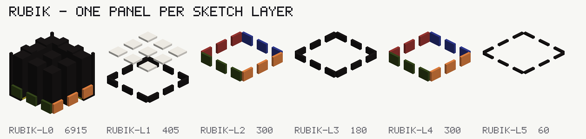
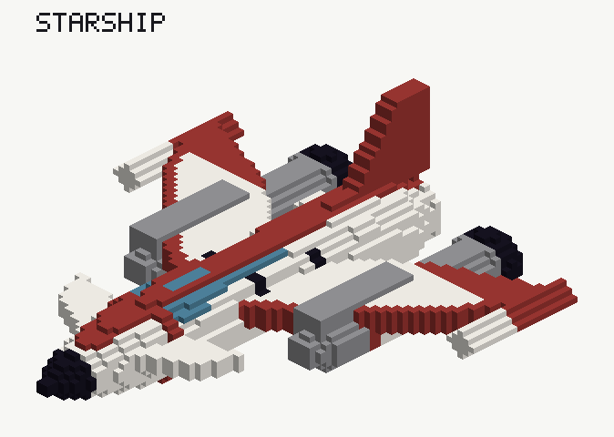

# sculpture/ — two ways to build a thing that is not terrain

Two boards, and the difference between them is the whole point. `SCULPTING-WITH-LAYERS.md` at the repository
root is the account; this is the pair of pictures it was written from. Both are exported worlds a server
loads — `maps/form-gallery` and `maps/sculpture-gallery` — so either can be walked round rather than looked
at. Each declares one visitor team and a pad at the south edge, because `EX2` refuses to export a map no
player can enter, and states no objective at all.

## `forms/` — written in the sketch's own shapes

Nine parametric structures on one deck, every one of them circles, polygons and rectangles with a floor and a
height. Eight of the nine are a **single layer**, because a layer holds one arbitrary height field and the
taller add wins each column outright — so a dome is concentric discs whose tops rise inward, and a hollow one
is the same discs with their floors rising too.


| form | layers | shapes |
|---|---|---|
| roundhouse wall (two doors, inner floor) | 1 | 4 |
| conical roof | 1 | 9 |
| hollow dome, radius 13, three thick | 1 | 13 |
| hollow ellipse, 15 × 9, rotated | 1 | 2 |
| tapered tower, thirty courses | 1 | 6 |
| ziggurat, five tiers | 1 | 5 |
| arch, twenty-two span | 1 | 11 |
| colonnade of twelve, with a saucer dome | 2 | 24 |
| amphitheatre, six tiers | 1 | 7 |

These stay editable in the Draw phase after they land, which is the reason to prefer them: the document holds
a circle with a radius, not four hundred rectangles that happen to look like one.

**The one form that needed a different answer is the amphitheatre.** Its height field falls inward, and
nesting can only build one that rises, so its tiers are annuli — and an annulus is one polygon, not an add
minus a subtract (`SCULPTING-WITH-LAYERS.md` §2).

## `models/` — compiled from solids

Seven models built as spheres, capsules, revolves, extruded profiles and booleans, then decomposed
mechanically: per column, maximal runs of one material, and the *n*-th run of every column goes on layer *n*.


| model | size (x, y, z) | blocks | **shape** | layers | shapes |
|---|---|---|---|---|---|
| robot | 26 × 45 × 14 | 4,486 | 5 | 16 | 746 |
| droid | 18 × 21 × 13 | 1,726 | 4 | 9 | 212 |
| Rubik's cube | 23 × 23 × 23 | 12,167 | **1** | **7** | 123 |
| hooded statue | 25 × 45 × 23 | 6,699 | 4 | 8 | 363 |
| car | 22 × 14 × 38 | 4,630 | **1** | 3 | 212 |
| starship | 66 × 28 × 70 | 15,518 | 2 | 4 | 540 |
| space station | 118 × 58 × 66 | 29,418 | 6 | 7 | 2,557 |

**shape** is what the geometry alone would need — maximal runs per column, ignoring colour. The layer count
is that plus every colour band, and the second term is the one that dominates: the cube is a **solid box**
with one run per column and takes seven layers, because a column down its east face crosses white, black,
red, black, red, black, red, black, yellow.



`models/renders/<name>-layers.png` draws each model one panel per layer. Beside it are `<name>-iso.png` and
`<name>-front.png` — an orthographic face, because an isometric view flatters a silhouette and a straight-on
elevation does not.

The starship is the one built almost entirely out of **bodies of revolution laid down**: `revolve_z` spins a
radius profile about the north-south axis, so the fuselage, both nacelles and their bells are each one
statement rather than a stack of rings. What is left is flat — wings are swept polygons three blocks thick
and the fins are silhouettes in the side plane.



## What is in each folder

```
forms/forms.layout.json          the sketch document that was posted
forms/renders/                   what the studio built from it
models/sculpture.layout.json
models/renders/
```

Both were posted whole through `POST /api/map/from-documents` — a layout and a minimal intent, no plan, since
a gallery board is played for nothing. `maps/opus5-automaton` is the same props on a board that *is* played
for something.

Rebuild and re-export either against a running studio:

```bash
python3 tools/sculpt/gallery_forms.py     sculpture/forms  maps/form-gallery
python3 tools/sculpt/gallery_sculpture.py sculpture/models maps/sculpture-gallery
```
