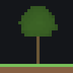

# 16 — planting a wood

**The technique: a wood is not an object the studio has — it is a list of trees an author placed, and the
whole craft is what makes that list read as a wood, a copse and an avenue rather than as scatter.**

`02-theme`'s board, meadow and buildings are untouched. The finish gains one relief block (a single knoll,
to give a copse something to shelter in the lee of), a woodcutter's lodge, twenty-five trees and two floor
patches of flora — all keyed onto island `team` and fanned by `rot_180` the way an authored shape always is.

## The document

The relief is one mark on top of the standard rim:

```json
"relief": { "team": {
  "base": 9, "reach": 16, "step": 1, "stairs": true,
  "grain": { "amplitude": 0.5, "scale": 9, "seed": 11 },
  "marks": [
    { "id": "coast", "kind": "rim",   "h": 9,  "depth": 1 },
    { "id": "knoll", "kind": "point", "at": [32, 45], "h": 15, "r": 4 }
  ]
} }
```

The dressing is a lodge, three stands of trees and two flora floors. One tree of each stand, and both
flora entries, in full — the other twenty-one trees are the same four fields at different `x`, `z`,
`height` and `seed`:

```json
"dressing": { "props": [
  { "kind": "house", "id": "lodge", "wings": [{ "corners": [[-40, 19], [-35, 24]] }],
    "front": "NegZ", "style": "@cottage", "seed": 50 },

  { "kind": "tree", "id": "wood-oak-1",     "x": -33, "z": 44, "form": "Template", "species": "oak",   "height": 9,  "seed": 1 },
  { "kind": "tree", "id": "wood-birch-1",   "x": -28, "z": 51, "form": "Template", "species": "birch", "height": 9,  "seed": 10 },
  { "kind": "tree", "id": "copse-spruce-1", "x": 31,  "z": 50, "form": "Template", "species": "spruce","height": 13, "seed": 20 },
  { "kind": "tree", "id": "avenue-w-1",     "x": 8,   "z": 63, "form": "Template", "species": "dark oak","height": 9,"seed": 30 },

  { "kind": "flora", "id": "wood-floor", "seed": 40,
    "points": [[-41, 26], [-25, 26], [-25, 72], [-41, 72]],
    "spec": { "coverage": 0.5, "scale": 10, "octaves": 3, "fernShare": 0.35, "flowerShare": 0.08, "flowerScale": 14, "tallShare": 0.1 } },
  { "kind": "flora", "id": "copse-floor", "seed": 41,
    "points": [[26, 40], [38, 40], [38, 58], [26, 58]],
    "spec": { "coverage": 0.3, "scale": 8, "octaves": 3, "fernShare": 0.1, "flowerShare": 0.3, "flowerScale": 10, "tallShare": 0.0 } }
] }
```

## The board a tree stands on

The compiled shape for island `team` is not the rectangle its pieces suggest. `s0` is a full-width strip,
`x −40..40, z 15..75`, with a second shape, `s1`, subtracted from its middle — `x −25..25, z 30..60` — the
gap the `flank-w`/`flank-e` pieces are named for. North of `z 75` the ground narrows to two prongs: the
spawn hall's, `x −30..−10, z 75..90`, and the wool cage's, `x 20..35, z 95..110`. Nothing planted below is
placed without this shape in mind — the first drive found that out the hard way, below.

## What form and species each control

A tree's `form` picks one of two generators, and every tree in Hazelholt uses the same one. `Template` is
the vanilla tree — a trunk of a known height under a canopy of a known profile, read off a six-row species
table. `Grown` is a different kind of tree altogether, a recursive branching skeleton in a chosen wood
rather than a species; Hazelholt has none, because a wood built from six vanilla profiles is already wide
enough to read as a wood, and mixing in a grown skeleton would be a second technique riding along on this
one.

Species, in the `Template` form, is three decisions bundled into one word: the wood (log and leaf blocks),
the canopy profile, and the height/radius ratio that `height` then scales from.

| Species | Profile | Natural height | Natural radius |
|---|---|---|---|
| oak | Blob | 8 | 2.6 |
| birch | Blob | 9 | 2.2 |
| spruce | Cone | 13 | 3.0 |
| dark oak | Blob, wide trunk | 9 | 3.4 |

Oak and birch share a profile — a round crown — so what tells them apart is proportion (birch is narrower
for its height) and colour, not shape. Spruce does not share it: `Cone` is a tiered, narrowing crown, and no
value of `height` turns a blob into a cone or back. Species is the shape; height is the scale.

`height` scales a species' *natural* radius by `height / naturalHeight`, and the trunk is whatever is left
under a canopy of that size — so a small tree is a small tree, not a full canopy on a stump. Two oaks,
height 6 and height 18:

| | height 6 | height 18 |
|---|---|---|
| canopy radius | 1.95 | 5.85 |
| reads as | a sapling | a mature standard |

 

Every wood tree in Hazelholt sits between these: heights 6–12, so the stand carries a spread of ages rather
than one silhouette repeated fourteen times.

## A crown claims what it stands under, not just where it stands

The dressing pass places water, then paths, then buildings, then boulders, then trees, then flora — each an
exclusion for what comes after. What a `TreeProp` claims is not its trunk cell: it is every cell any part of
the built tree touches, canopy included, out to `CanopyRadius(tree)` — the actual grown crown's reach,
measured from the same generation the tree is built with. A second trunk placed inside that radius is
declined, not silently interpenetrated.

The first drive found this by getting it wrong. `wood-oak-3` (height 11, radius 3.575) and `wood-birch-1`
were drawn 2.83 blocks apart — closer than oak-3's own crown reaches:

```
[decline] DR-CLAIM tree 'wood-birch-1' rests on (-32, 52), claimed by the prop 'wood-oak-3'
[decline] DR-CLAIM tree 'copse-spruce-4' rests on (33, 55), claimed by the prop 'copse-spruce-2'
```

Both were authoring mistakes, not the intended demonstration: spacing chosen by eye against a top-down
mental picture, not against each species' actual scaled radius. The fix is the rule stated above — space
trunks past the *taller* neighbour's own radius, not the sum of both — and every final placement in Hazelholt
clears that bar with at least half a block to spare. Canopies still touch: the avenue's dark oaks stand 5
blocks apart at radius 3.4 each, so neighbouring crowns overlap by 1.8 blocks and read as a continuous
tunnel (`renders/section-avenue.png`), without either trunk standing under the other's canopy.

## A wood has an edge

A grid of evenly spaced trunks reads as an orchard — a human decision applied uniformly. The wood's fourteen
trees carry no grid: measured to each tree's nearest neighbour, twelve of them sit 3.2–6.7 blocks apart,
tightening into two loose clusters (`wood-oak-1..4`/`wood-birch-1`/`wood-birch-3` around `z 39..51`, and
`wood-oak-6`/`wood-oak-edge`/`wood-birch-2`/`wood-birch-edge` around `z 57..63`) with `wood-oak-5` and
`wood-oak-7` sitting looser between and below them. Past that spacing, two trees stand in a different regime
entirely: `wood-oak-stray` (−28, 20), a lone mature oak **11.7 blocks** from its nearest neighbour, out on the
open shelf toward the frontline; `wood-birch-stray` (−39, 71), a young birch **8.3 blocks** clear, seeded near
the map's own edge. Neither reads as belonging to the wood in the render — that is the point. A margin that
thins rather than stops, plus a stray past the margin, is what tells a forest edge from a hedge.

The avenue is the deliberate opposite: six dark oaks, three a side, each 5 blocks from its neighbour, in two
straight rows either side of the lane. Regularity reads as intent — a colonnade someone planted to mark a
route — and the wood's irregularity reads as growth. Hazelholt needs both signals, so it states both.

## A wood is not one species

The wood's fourteen trunks are nine oak and five birch — 9:5, roughly two to one. One species repeated
fourteen times is a plantation row crop; two, at an uneven ratio with the minority filling gaps rather than
alternating, is what a stand looks like where a dominant canopy tree seeded first and a lighter-seeded second
species filled in behind it. The copse and the avenue are each a single species (spruce, dark oak) — that is
correct for what they are: a copse is one seed-fall in one favourable spot, and an avenue is planted, not
grown, so it is expected to be uniform. Only the wood needed the second species to read as wild.

## Flora is the floor of the wood

`flora` fills a drawn ring with a noise-driven scatter of grass, fern, flower and tall grass, and it is the
last thing the dressing pass places — it seats into whatever ground the trees and the lodge left, which is
why it reads as a floor rather than a layer drawn over the top of everything. `coverage` is how much of that
ground carries anything; `fernShare`, `flowerShare` and `tallShare` split the covered ground between fern,
flower cluster and tall (two-block) grass, with plain short grass taking what is left.

The wood's floor and the copse's floor are stated differently on purpose. A 16×16 sample of each, previewed
through the same pass the export runs:

| | `wood-floor` | `copse-floor` |
|---|---|---|
| `coverage` | 0.5 | 0.3 |
| `fernShare` | 0.35 | 0.1 |
| `flowerShare` | 0.08 | 0.3 |
| plants landed (of 256 cells) | 138 | 35 |

The wood's floor is denser and fernier — a closed canopy's understory, where flowers are rare because light
is. The copse's floor is thinner and carries three times the flower share — an open stand on a knoll top,
where the ground the trees do not shade grows meadow rather than shade plants. Both are drawn under their
trees in the finish, not beside them: `wood-floor`'s ring is the same rectangle the wood's trunks stand in,
and `copse-floor`'s is the knoll's own footprint.

## Nothing is scattered

Every stand answers *why here* from the board's own shape, not from a grid laid over it.

**The wood** fills the strip `s1`'s subtraction leaves on the map's west side — `flank-w`, `x −40..−25` — the
whole way from the shelf near the frontline up to four blocks short of the spawn hall's own south wall at
`z 75`. It runs beside the spawn's approach rather than into it (the door's keep-out is `x −30..−10`, well
east of every tree here), backing the team's spawn against the map's own edge without standing in front of
anything a player needs to walk through.

**The lodge** stands at the wood's southern tip, in the open shelf ground before the flank narrows — a
woodcutter's hut with a reason to be exactly where the trees are, and the deliberate `DR-CLAIM` case below.

**The knoll and its copse** stand in `flank-e`, the strip `s1`'s subtraction leaves on the map's other side.
The knoll is a single point mark, `h 15` over a `base` of 9 — six blocks of rise, `r 4` so the relaxation
still slopes it rather than pinning a plateau (`07-hill`'s finding). Wind, on this board, is read as coming
off the strait at `z 15` and blowing north; the copse's five spruce stand north of the peak, in the shelter
the rise gives on that side (`renders/section-knoll-copse.png` shows the trees standing where the ground has
already crested).

**The avenue** runs the length of the `lane` piece (`x 5..40, z 60..75`), the named route from the flank into
the spawn/wool approach — flanking it on both sides rather than standing in it, so the lane itself stays
clear.

## What went wrong first

The first drive of this board declined six props, none of them the deliberate demonstration:

```
[decline] DR-KEEP  tree 'claim-probe' rests on (-9, 82), which is kept clear for a spawn
[decline] DR-KEEP  tree 'keep-probe' rests on (-20, 70), which is kept clear as the approach in front of a door
[decline] DR-SITE  tree 'wood-oak-stray' has no ground at (-24, 52)
[decline] DR-CLAIM tree 'wood-birch-1' rests on (-32, 52), claimed by the prop 'wood-oak-3'
[decline] DR-KEEP  tree 'wood-birch-edge' rests on (-28, 70), which is kept clear as the approach in front of a door
[decline] DR-CLAIM tree 'copse-spruce-4' rests on (33, 55), claimed by the prop 'copse-spruce-2'
```

`wood-oak-stray` was planted at (−24, 52) on the assumption that `flank-w`/`flank-e` was one continuous
strip; it is not — `s1`'s subtraction starts at `x −25`, and (−24, 52) is one block inside it. The two
`DR-CLAIM`s are the canopy-radius mistake above. The two `DR-KEEP`s at the spawn are a padding mistake: every
`Spawn`/`WoolRoom`/`Structure` keep-out is grown two blocks past whatever rectangle it wraps
(`DressingScope.KeptClearAt`'s own `margin: 2`), which is why `claim-probe` at (−9, 82) — one block outside
the room's stated `x −30..−10` — still read as kept clear, and why `wood-birch-edge` at (−28, 70), inside the
door's twenty-block, room-width approach, was declined alongside the deliberately placed `keep-probe`. Every
one of these six was moved; the final drive below declines nothing.

With the geometry and the spacing rule both understood, the deliberate cases were provoked on purpose and
then honoured. A building's own claim is narrower than a spawn's keep-out but not as narrow as its drawn box:
`ClaimedCells` grows the wing by whatever the roof overhangs (the `@cottage` style's `roof.overhang` is 1),
and `HeldCells` grows that again by `StructureClearance` (1) — two blocks past the drawn wing in total. A
tree at (−33, 21), two blocks past the lodge's `x −40..−35` wing, to get a clean `DR-CLAIM` against a
*building* rather than another tree:

```
[decline] DR-CLAIM tree 'claim-probe' rests on (-33, 21), claimed by the building 'lodge'
```

And a tree at (−20, 70), squarely in the spawn's door approach, to get `DR-KEEP`:

```
[decline] DR-KEEP tree 'keep-probe' rests on (-20, 70), which is kept clear as the approach in front of a door
```

Both were removed rather than relocated into the final count — their only job was to be declined on the
record — and the committed board carries neither.

## What the renders answer, and what they do not

`renders/world-topdown.png` and `renders/world-heightmap.png` answer different questions and neither
substitutes. The top-down (category) render says what stands where in plan — the wood as a cluster of
violet blobs along the west edge, the lodge as an orange roof at its tip, the copse and avenue on the far
side — but it keeps no Y, so the knoll is invisible in it. The heightmap says the opposite: a pale patch
rising out of blue mid-`flank-e` is the knoll, at the resolution of a contour, with no hint that five trees
stand on its northern shoulder.

`GET …/render/topdown?subject=foliage` (`renders/world-foliage.png`) answers neither. It paints every leaf
and log one violet mass and nothing else, at whatever alpha the canopy's density gives it — which is exactly
why the wood's fourteen trunks are not countable in it: adjacent crowns fuse into a single blob the same way
they do inside the game's own foliage. The avenue's six trunks are countable, because 5-block spacing leaves
each canopy still a separate lobe; the wood's are not, because the wood is denser by design. The only
reliable trunk count is the authored document, or the provenance census below.

## What to look at

| Picture | Says |
|---|---|
| `renders/world-ground.png` | the whole board in real block colours — the wood, lodge, copse and avenue all in one frame |
| `renders/world-topdown.png` | category plan: ground, structure and foliage, no Y |
| `renders/world-foliage.png` | leaf and log only — the wood fuses into one mass, the avenue does not |
| `renders/world-heightmap.png` | the knoll as a contour; nothing about what stands on it |
| `renders/section-knoll-copse.png` | the knoll's profile and the copse standing in its lee, in one cut |
| `renders/section-wood.png` | one oak's trunk-canopy-ground relationship, cut through the core of the wood |
| `renders/section-avenue.png` | three dark oaks in profile, canopies touching across the lane |
| `renders/prop-oak-h6.png`, `prop-oak-h18.png` | the same species at two heights — trunk and canopy both scale |
| `renders/prop-birch-h9.png`, `prop-spruce-h13.png`, `prop-darkoak-h9.png` | the profile difference species carries — blob, cone, wide-trunked blob |
| `renders/house-lodge-section.png` | the lodge the `DR-CLAIM` case stands beside |
| `renders/flora-wood-floor.png`, `flora-copse-floor.png` | the same 16×16 sample the plant counts above were read from |
| `renders/world-mirror.png` | every authored prop and the knoll, mirrored — no unmirrored cell |

## Numbers

| Read | Answer |
|---|---|
| `POST /plan/evaluate` | score **0**, `valid: true` — the plan is untouched |
| `POST …/sketch/relief/read` | island team: cells 4 125 · low 9 · high **15** · relief **6** · symmetry error **0** |
| trees authored | 25 — 9 oak + 5 birch (wood) · 5 spruce (copse) · 6 dark oak (avenue) |
| `python3 -c "…Counter(o['kind']…)"` on `provenance.json` | `tree: 50` · `flora: 4` · `house: 2` — every authored prop landed at both mirror images, none missing |
| `GET …/coverage` | reached 7 979 · dead **225** of 8 250 = **2.7%** (down from `02-theme`'s 271/3.3% — **46** dead cells now carry a prop) |
| flora sample (16×16, 256 cells) | `wood-floor` 138 plants · `copse-floor` 35 plants |
| `GET …/preflight` | export gate **OPEN** |
