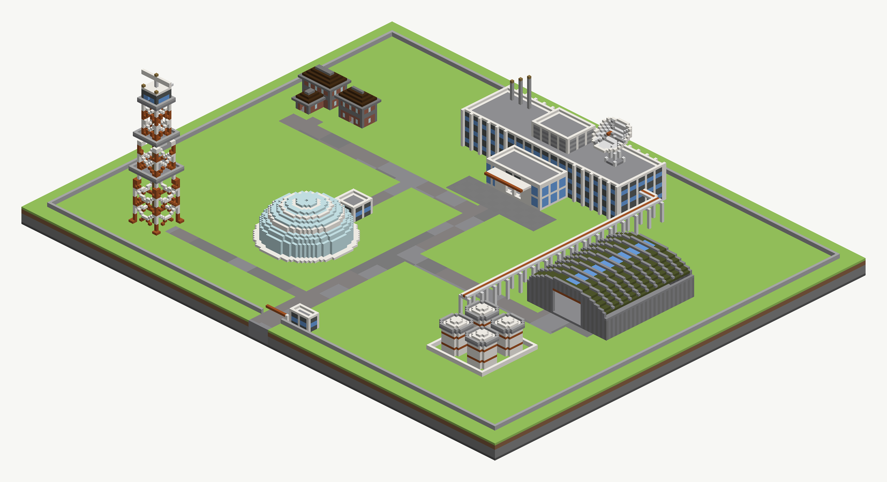

# A research campus

**A facility of several buildings reads as one place when the site states a language every building shares,
and each building states a style inside it.** This board is seven buildings in five styles inside one fence:
a curtain-walled laboratory, two brick houses, a barrel-vaulted hangar, a lattice signal tower, a glass
biodome, and a tank farm joined to the laboratory by a pipe rack. Open it in the studio as
`technique-a-research-campus`, or run `build.py`.

**`designing-a-structure` is the method, and this card is the method at scale.** What is drawn is drawn with
`techniques/made.py`: a module, a mass to a layer, a façade as paint, a door as a sill and a lintel. What
cannot be drawn is a voxel model in several materials, compiled by run index. Where the house stamper fits,
it builds the building.

## The document

One `ground` layer holds the site, the roads and the plaza as themed shapes. Twenty-six drawn `made` layers
all name `part_of: "campus"`, and twenty compiled ones name their model. One `dressing` block holds the two
houses and their style.

| building | how it is built | layers · shapes |
|---|---|---|
| laboratory, lobby, plant room, fins, antennas | drawn: four masses, three slab heights, a fin layer | part of 26 · 168 drawn |
| biodome and vestibule, tank farm, pipe rack, fence, gatehouse | drawn: rings, discs, rectangles | part of the same |
| the dish on the laboratory roof | compiled, five materials | 3 · 108 |
| the hangar | compiled, six materials | 3 · 177 |
| the signal tower | compiled, nine materials | 12 · 653 |
| three trees under the dome | compiled, two materials | 2 · 58 |
| two administration houses | the house stamper, style `brick` | 2 props, 0 declined |

## The site's language

**Four things are the same on every building, and they are what make five styles one campus.** One
ground, the moor. One paving family: andesite, gravel and cobblestone on the roads and a stone-brick checker
on the plaza. One accent pair, a safety orange and a light-blue glass. And one datum: every
height-pinned stack starts at y8, so bands line up across buildings that share nothing else.

**The orange is the thread.** It is the lobby canopy's fascia, the tanks' two courses, the middle pipe on
the rack, the hangar door's lintel, the tower's marking, the dish's feed and the gate's barrier arm. An
accent that appears once is decoration; appearing on every building, it is the facility's colour.

**Each style names its own built family, and none of them is the ground's.** The laboratory is quartz and
grey-teal clay. The houses are brick with a stone-brick band. The hangar is stone and andesite under a
green clay vault. The tower is quartz and orange.

## The laboratory: detail is layers placed where they do not disturb the façade

**The fins are a layer of their own, one block proud of every pier.** Drawn on the wall's layer they would
fuse with it and add their faces to the perimeter the façade's stripe cycle is counted round, pushing every
pier after the first fin off the grid. The fin at (−36, −71) reads quartz y8–24 beside a bay at (−35, −70)
reading three storeys of sill, glass and head.

**The lobby is a second façade style on the same module.** Its `curtain` stack is one course of quartz at
each slab line and four of glass between, so it reads floor-to-ceiling glass against the lab's banded
windows. It omits its first-floor slab, which makes it a double-height hall. Its entry is a sill and a
lintel with the head at eight courses: seven courses of air at (−2, −37).

**The plant room is a mass standing on the roof, with its own slab prefix.** `Made.mass` takes a `floor` and
a `slabs` name. Without them the plant room's first floor would share `slab-1` with the laboratory's, and
since a layer holds one span per column, the taller one would take the laboratory's columns. Its louvre
façade reads andesite and iron bars course by course from y24.

**Roof detail takes its floor from the roof.** The antennas, their lamps and the dish's pedestal all state
`top - 1`, the laboratory's own height, rather than a number typed twice.

## The houses: the stamper where it fits

**The house stamper builds a building with windows, a roof form and wings from a list of rectangles, and
it declines anything over 192 blocks of footprint.** `HP3` says so. A laboratory is 1,500 blocks, which is
why the large buildings here are drawn, and why the two houses are the small ones.

**A flat or pitched lower wing tucks under the hall correctly.** The `admin` house is a hall with a one-storey
cross wing under a hip roof. The hall's face above the wing keeps its windows, and the column at (−96, −38)
reads brick, a stone-brick band, brick, and the roof.

**A style forked from a shipped one says "no beams" as `{"block": -1}`.** Stating `"beams": null` does not
raise a finding: the store and every build of the board answer 500.

## The compiled half: detail costs layers, and paint along Y costs none

**The signal tower is nine materials and twelve layers.** Its busiest column passes through lattice,
platform, rail, cabin wall, glass, roof, lamp and radar. `tower-exploded.png` draws the twelve runs one at a
time. The lattice stays the first few runs however tall the tower is, because its white and orange marking
is one material banded along world Y rather than two materials.

**What the tower carries is what a signal tower has.** Two rest platforms and a deck, each with a railing
and a hatch. A ladder at (−72, 59) runs y8 to y63 without a break, up a steel spine and through every
hatch. A cabin with a glass band at y66–67 and glowstone on its corners. A radar array on a mast over it.

**The hangar is one model: walls, a vault, ribs, a clerestory and a door.** The vault is one course of green
clay following the arch, a polished-andesite rib stands proud of it every four blocks, and two blocks
either side of the crown are glass. The south door is an opening three bays wide, with an orange lintel at
y19 and the arch above it.

**The dish is a paraboloid shell tilted south on a trussed pedestal.** A tripod of bars meets at the focus,
where the feed is orange at y39. It is five materials and three layers, because no column passes through
more than three of its parts.

## The drawn detail that is not a building

**The biodome is sixteen rings on one layer, every fourth one a quartz rib.** A rib ring reads quartz
y16–19; the ring beside it glass y18–20. A kerb ring frames its foot, and three compiled trees stand
under it on the moor, at (−34, 26) reading oak log y8–14 and leaves y15–17 under glass at y21–23.

**The pipe rack is three layers, because a post, the beam on it and the pipe on the beam are three spans.**
Posts every six blocks, a beam across each, and three pipes — quartz, orange, steel — running north from
the tank farm and west into the laboratory's east wall. Mid-beam at (44, −30) reads the beam at y16 and the
orange pipe at y17.

**The tanks are drums with domed heads on one layer, and their bands are paint.** Orange at y11 and y16
reads off world Y. A walkway ring and a rail stand round each head on two layers of their own, and a bund
wall surrounds the four.

## The recipe

- **state the site's language first**: one ground, one paving family, one accent pair, one datum. Then give
  each building a style inside it.
- **put the accent on every building**, in one role each.
- **draw what the method draws**: masses on a module, façades as paint, doors as sills and lintels.
- **detail that projects from a wall is a layer of its own**, or it joins the wall's footprint and moves
  the façade's stripe cycle.
- **a mass on a roof states its own floor and its own slab prefix.**
- **use the house stamper for small buildings**, under 192 blocks, where its roofs, windows and wings are
  what the building wants.
- **compile what has struts at angles, curves in section or many small parts**, and band its colour along
  world Y wherever the colour is a band.

## Limits

**This board raises seventy-eight `SK23` complaints and nothing else.** Every one is a thin made shape: a
compiled strip, a ring, a fin, a wall. The houses place with none declined.

**The compiled half is not editable as shapes.** The tower is 653 rectangles nobody can adjust as a tower,
and changing it means changing `tower_model` in `build.py` and compiling again.

**A curved compiled surface is only as smooth as a block.** The dish's bowl steps visibly at 14 blocks
across; a dish that reads as a smooth curve wants to be larger.

## What checks it

- `columns.txt` — twenty-four columns, one per claim above, each named with its building.
- `findings.txt` — what `PUT …/sketch` answered, and what the dressing pass placed and declined.
- `a-research-campus.layout.json` — the board: forty-seven layers and 1,173 shapes.

Renders: `iso.png` and `iso-back.png` for the whole campus; `laboratory.png`, `laboratory-back.png`,
`tower.png`, `tower-exploded.png`, `hangar.png`, `biodome.png`, `tanks-and-rack.png`, `houses.png` and
`gate.png`.
