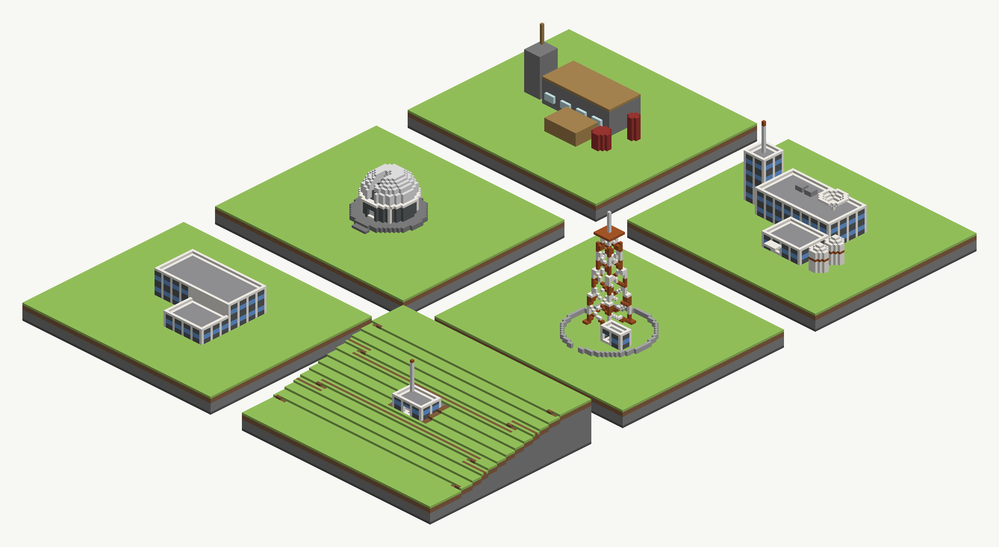

# Designing a structure

**A structure reads as one thing when four decisions are made before the first shape is drawn: a module,
a layer to each mass, a façade stated as paint, and three material families.** The instruments are the
ones `sculpture-with-layers` and `stacking-layers` already teach. What this card adds is the order they are
spent in, and the measured cost of skipping each decision. Open it in the studio as
`technique-designing-a-structure`, or run `build.py`.

**Six pads, and the first is the mistake.** `pile` and `station` carry the same programme: a laboratory,
an annex, a stair tower, a dish, two tanks and a mast. They differ only in the four decisions.
`observatory` and `relay` are the same method applied to a round thing and to a thing no hand can draw.
`one-layer` and `seated` are the two shortcuts the method invites, each built so it can be read.



## The document

One `ground` layer carries six pads, flat at y7, with the `seated` pad a grade from y20 down to y8.
Thirty-five `kind: "made"` layers stand on them. Every one states `part_of`, and every group states
`mirrors: false`.

| panel | layers · shapes | what it is |
|---|---|---|
| `pile` | 4 · 14 | the programme with no module, no families, stuck-on windows and a dome on the roof's own layer |
| `station` | 12 · 44 | three masses on one grid, one layer each; slabs shared by height; one layer of lintels; plant, dish, mast, tanks |
| `observatory` | 5 · 38 | a plinth, a drum with a cornice, a slit dome in rings, and a compiled telescope |
| `relay` | 7 · 185 | a lattice mast compiled from a solid (3 · 179), with a drawn hut and compound (4 · 6) |
| `one-layer` | 3 · 9 | the station's hall and annex fused on one layer, with doors made by one override each |
| `seated` | 4 · 6 | a one-storey outpost and its mast, stated with no height, and dug into the grade by `seat` |

## The module comes first

**Every dimension is a multiple of one bay and one storey, and that is most of what makes three boxes
read as one building.** Here a bay is four blocks from pier to pier. A storey is five courses: a slab, a
sill, two of glass and a head. The hall is 8 × 4 bays, the annex 4 × 3, the tower 2 × 2 and the relay's
hut 2 × 1.

**A side of 4n + 1 cells puts a pier on every corner.** The façade's stripe cycle starts at a corner and
steps one block at a time round the perimeter. So a side one block longer or shorter than that lands a
bay on a corner. The corner then reads as glass where it should read as frame.

**A door stands in a bay, never on a pier.** A door three wide centred on a two-bay face takes the pier
out of the middle of it. Above the door the pier is then a run of glass, and the face stops reading as a
grid. The station's doors are placed in bays: `tower-east` takes the three cells between the tower face's corner pier and its middle one.

**`pile` has no module at all.** Its hall is 30 × 14, its annex 14 × 10 and its tower 7 × 8. Every one of
its rectangles is legal, and none of them lines up with another.

## A façade is paint, not shapes

**One rectangle and one interior override are a whole façade, on one layer.** The `facade` theme's wall
bucket is a `wallRun` of a quartz pier one wide and a bay three wide. The bay is a `layered` material on
the `height` axis, from y8: slab, sill, glass, glass, head, repeated per storey.

```json
{"kind": "wallRun", "runs": [
  {"material": {"kind": "solid", "id": 155}, "width": 1},
  {"material": {"kind": "layered", "axis": "height", "from": 8, "stack": {"ending": "repeat", "bands": [
     {"material": {"kind": "solid", "id": 159, "data": 9}, "thickness": 2},
     {"material": {"kind": "solid", "id": 95, "data": 3}, "thickness": 2},
     {"material": {"kind": "solid", "id": 159, "data": 9}, "thickness": 1}]}}, "width": 3}]}
```

**Drawn as shapes, the same wall costs six layers.** A bay's column reads cyan y8–9, glass y10–11, cyan
y12–14, glass y15–16, cyan y17–18 and quartz y19. That is six runs, and a layer holds one span per column.
Painted, it is one run, so it stays one layer.

**A height-pinned stack is the datum every mass shares.** The annex, the tower and the tanks state the same
`from`, so a window band, a slab line and the tank's orange course all land on the same courses across
the whole facility. `station-south.png` is the elevation that shows it.

**`ending: "repeat"` repeats the last band, not the stack.** A cycle is therefore written out band by band
for as many storeys as the tallest mass has. The relay's first attempt at a four-and-four marking came out
orange from y16 to the top, because its stack named two bands and the second one claimed everything
above it.

**`pile`'s windows are the shape version, and they hang.** Each strip is three courses of glass one block
proud of the wall, with air under it (`columns.txt`).

## One mass, one layer

**Two masses that touch on one layer fuse, and the wall between them leaves the perimeter.** A cell off a
layer's outer perimeter has no place in the stripe cycle. `wallRun` then reads it as the start of the
loop, which is the pier, all the way up.

**`one-layer` measures it.** The hall's south wall where the annex abuts reads quartz from y8 to y19 in
one run. From above the roof, that is a blank band across the hall where the station shows two storeys of
bays (`one-layer.png` against `station.png`).

**The station gives each mass a layer, and masses abut rather than share a wall.** The annex starts one
block south of the hall's south wall, and the tower one block west of its west wall. So each wall is on
its own layer's perimeter. The same hall wall reads six runs of façade above the annex's roof.

**A slab is a second span over a mass's own floor, so slabs go on their own layer, one per height.** Every
mass's first floor shares `slab-1`, every second floor `slab-2`, and so on. The masses are not touching on
those layers, because their walls are not on them. The hall's interior reads three polished-andesite
courses at y8, y13 and y18, on `station-hall`, `station-slab-1` and `station-slab-2`.
`station-exploded.png` is the decomposition drawn one layer at a time.

## An opening is a sill and a lintel

**An override floored at the door's head does not open a wall.** An override standing in a wall keeps the
wall from its own floor up to the override's top. So `one-layer`'s two doors, each one override floored
four courses up, read quartz y8–19 through the shared wall and a full bay on the entry. Neither opens,
and nothing reports it.

**What opens is two shapes.** The sill is a one-course override on the wall's own layer, which replaces the
wall's column with the floor course. The lintel is the wall above the head: a second span over that
column, so it goes on the one layer every door's lintel shares. The station's hall-to-annex door reads a
quartz sill at y8, three courses of air, then the lintel from y12.

**A lintel takes the bay's paint without the pier.** Its own footprint is three cells, so a `wallRun` on
it would start a fresh cycle and put a pier over the door. The `lintel` theme is the storey stack alone.

**A round wall's opening is a gap in the ring.** `ring(..., gap=(bearing, width))` writes the annulus as a
C. The observatory's slit is a three-block gap through every ring of the dome, facing south. The
telescope rises through it: iron at y20–22 in a column with no dome over it.

## Three families, named before the paint

**Ground, built and accent, and the built family is never the ground's.** The ground is the moor. The
built family is a quartz frame, a cyan-clay skin, a polished-andesite roof and a stone-brick plinth. The
accent is light-blue glass and one orange, and the orange appears three times: the tanks' course, the
mast's tip and the relay's marking.

**`pile` names none.** It uses seven paints for seven parts: stone brick, planks, glass, red wool,
cobblestone, gold and an oak fence. A programme painted one material per part is a swatch, however well
each part is drawn.

**A colour a column passes through costs a layer, unless it is read off world Y.** The relay's lattice is
banded four and four in orange and white, and compiled as one material it is **3 layers and 179 shapes**.
Compiled with the bands as two materials it is **5 layers and 248 shapes**. The first leg column reads
orange y8–11, quartz y12–15 and orange y16–19, in one run on one layer.

## What stands on a mass, and what stands on nothing

**Plant stands on the roof course, set back from the parapet.** The two plant boxes stand five blocks in from
the hall's north parapet, so the skyline stays the parapet's. The dish is a falling field, rim high and
middle low, so it is four rings one course thick, as `sculpture-with-layers`' bowl is.

**A made thing stated at an absolute floor over another made thing is only right if both numbers are.**
`pile`'s mast is stated two courses too high. Its column reads cobblestone to y26, two courses of air,
then fence from y29. A `made` layer is out of `SK11`'s walk, so nothing says it hangs. The station's mast
takes its floor from the tower's own height (`tower - 1`) and reads iron from y29, on the tower's roof at
y28.

**A shape drawn on a mass's own layer is contested by that mass.** `pile`'s dome is two discs on the
hall's layer, above the hall's interior. The hall's interior override is laid after every ordinary add, so
it takes those columns. What is left is one gold course at y8 inside the hall, and the roof planks at y19
over it. No finding names it.

## A made thing on a grade

**`seat: "ground"` on every layer of one `part_of` drops the whole structure as a unit and cuts its bed.**
`seated` states the outpost at the plain's height and lets the studio settle it. The wall's pier stands on
ground cut to y11, quartz y12–18. A block uphill, the hill stands to y14 against it. The downhill door
reads grass at y11, the sill at y12, three courses of air and the lintel.

**A height-pinned façade does not move with the seat.** The stack's `from` is y8 and the outpost settled
four courses up, so its bands land one course off the station's. It reads a two-course sill under glass
at y15–16, where the station has a one-course sill under glass at y10–11. Set `from` to the settled
floor, read off `column`, once the seat is known.

## The compiled half

**Draw what a hand can draw, and compile the rest.** The telescope is a tilted tube and the relay's lattice
is four legs and forty braces at angles. Neither can be stated as rectangles and circles, so both are
`tools/sculpt/solid.py` beams put through `tools/sculpt/layers.py`. The hut and the compound beside the
lattice are drawn, because they can be, and stay editable in the Draw phase.

## The recipe

- **pick a bay and a storey**, and make every side 4n + 1 so the corners are piers.
- **name three families** before the first theme: ground, built, accent. The accent appears more than once.
- **state the façade as paint**: a `wallRun` of pier and bay, the bay a `height`-axis stack written out for
  every storey. One shape a wall, one layer a mass.
- **one mass, one layer**; masses abut with their own walls and never share one.
- **slabs on a layer per height**, shared by every mass that has a floor there.
- **a door is a sill and a lintel**: a one-course override on the wall's layer, and the lintel on the
  layer every lintel shares, in a bay, with the storey stack as its paint.
- **stack from the mass's own numbers**: plant, dish and mast take their floor from the height of what they
  stand on, never from a number typed twice.
- **seat a structure on a grade** with `seat: "ground"` on every layer of one `part_of`, then set the
  façade's `from` to the floor it settled on.
- **compile only what cannot be drawn**, and paint it along world Y so its colour costs no layer.

## Limits

**This board raises twenty-two `SK23` complaints and nothing else.** Every one is a made thing thinner than
three cells: a wall, a lintel, a ring, a compiled strip. A made thing's paint here is chosen per bucket,
so the complaint's reading — that only the rim and wall buckets reach those columns — is the design.

**None of the three faults `pile` and `one-layer` hold is reported.** A dome erased by an interior
override, a mast hanging two courses above its tower, and a door that did not open all store at 200 with
no finding. `column` is the read that sees each one.

**A layer's list stops being readable well before a facility stops growing.** The station alone is twelve
layers. Naming layers by mass and by slab height, as `Made` in `build.py` does, keeps the strip legible
where a run index would not.

## What checks it

- `columns.txt` — twenty-three columns, one per claim above, each named with its panel.
- `findings.txt` — what `PUT …/sketch` answered for this document: twenty-two `SK23`, no refusal.
- `designing-a-structure.layout.json` — six pads, thirty-six layers.

Renders: `iso.png` for the board; `station.png`, `station-back.png`, `station-south.png` (the datum, face
on) and `station-exploded.png` (one layer at a time); `observatory.png`, `observatory-back.png`;
`relay.png`; `pile.png`; `one-layer.png`; `seated.png`.
