# Authoring PGM maps as documents

### A white paper on pgm-studio, and on what it makes possible for one author, for an agent, and for the two working together

**Revision 1 · September 2026** · Measured against pgm-studio at `dae1d45`, driven live for every figure in it.

---

## Summary

A PGM map is two artifacts that nothing connects: a Minecraft world of about a million blocks, and a
`map.xml` describing a contest played on it. Both are authored by hand. Neither can be asked a question. The
world does not know that a monument stands on it; the XML does not know whether the ground under the region
it names can be walked. Every claim about how a map plays is settled by loading it on a server and looking.

**pgm-studio replaces the pair with four documents and a compiler.** A map is described at four grains — the
board, the ground, the play, and the world — each stored separately, each stating what the others cannot. The
documents compile downward into the world and the `map.xml` a server loads, and the studio checks every step
against **169 named rules**, answers **219 operations** over HTTP, and can be asked, at any point, what the
map it has actually built looks like: not as a picture, but as numbers with coordinates in them.

That last property is the one this paper is about, because it is what turns map making from a craft practised
by looking into a craft practised by measuring — and it is what makes an autonomous author possible at all. A
model cannot look at a Minecraft world. It can read that the ground at `(−11, −64)` steps four blocks and
that a bedrock plinth will be built there because of it, which is what the studio actually said about this
paper's own demonstration board, in a sentence naming the rule, the coordinate and the fix.

The evidence is a second repository. **`pgm-studio-mapgen` holds 111 built worlds, 94 authored specs and 49
run reports** — every board authored by a language model driving the studio's HTTP API, and every failure
written down. This paper takes its worked example from that corpus and adds one more: **Marlbeck**, a destroy
board built from nothing while this document was being written, in three revisions, with every refusal and
every correction reproduced below exactly as the studio reported them.

**What is claimed.** That describing a map as documents makes it checkable; that a system which refuses by
name and answers in numbers can be driven by an agent without a human watching each step; that the division
of labour between a person and a model is a real one with a clean seam; and that the seam is not where most
people would put it.

**What is not claimed.** That the studio decides whether a map is good. It does not, it cannot, and the one
place this repository tried to make it — a confident, filed, committed claim that every generated destroy map
was unwinnable, derived from a correct measurement and an invented conclusion — is documented in §10 as the
cautionary case it is.

---

## 1. What a PGM map is, and where the cost sits

PGM is the game engine behind Overcast-style competitive Minecraft: capture-the-wool, destroy-the-monument,
destroy-the-core. A map for it is a folder:

```
<map>/region/*.mca      the world — terrain, buildings, every block
<map>/level.dat
<map>/map.xml           teams, spawns, regions, filters, objectives, kits
```

The world is built in creative mode, by hand, over days. The `map.xml` is written in a text editor. The two
are joined only by coordinates that a person typed into both.

**Three costs follow from that, and they compound.**

**The XML is a contract with no feedback until it fails.** A region is a box of numbers. Whether the box
contains ground, whether that ground is reachable, whether the team barred from it is the team meant to be
barred — none of it is visible in the file, and the file is the only thing that gets read. The failure mode
is not a syntax error. It is a map that loads, plays for twenty minutes, and turns out to have a wool room
one team cannot reach.

**The world cannot be interrogated.** A finished map is a million blocks and no description. "Is the approach
to the east monument walkable?" is answered by walking it. "Is the board symmetric?" is answered by flying
over it and squinting. "Is any of this ground used?" is not answered at all — there is no instrument, so the
question stops being asked, and maps ship with a third of their surface on the way to nothing.

**Nothing is reusable, because nothing is described.** A hill that works is a hill; there is no statement of
it to copy, adjust or fan across a symmetry. Every board starts at bedrock.

The corpus bears this out from the other direction. Two of the earliest boards in `pgm-studio-mapgen` are
245 and 243 bytes of `map.xml` — a name, a gamemode, and nothing else — over real region files, reported by
the run that made them as *"Compiled, sketched, finished, exported successfully."* They satisfied every check
that existed, because the only check that existed was whether the pipeline threw. `README.md` keeps them and
says why: *"They are kept because they are evidence, not because they are playable… Do not load them."*

---

## 2. The idea: a map is four documents

The studio's central move is to stop treating the world as the map.

**A map is described at four grains.** Each is a document; each is stored separately; each states things the
others cannot say at all.

| Level | What it describes | The document | Authored in |
|---|---|---|---|
| **The board** | rectangles on a coarse cell grid, what each is for, where the objectives sit | `PlanModel` — `*.plan.json` | Plan |
| **The ground** | the real geometry at block resolution: outlines, heights, relief, paint, props | `SketchLayout` | Sketch |
| **The play** | teams, spawns, protections, build regions, objectives and how they are captured | `MapIntent` | Configure |
| **The map** | the voxel world and the `map.xml` a PGM server loads | `VoxelWorld` + `MapXml` | — (built) |

**These are grains, not stages of completeness**, and that distinction is the whole design. A plan is not a
rough draft of a layout. It states things a layout cannot — *this rectangle is a wool room*, *these two
pieces share a defence wall* — and it cannot state things a layout can, like a curve or a one-block step. The
same holds upward: a layout knows where every block of ground is and has no idea what any of it is for.

A finished map therefore needs all four, and no one of them is "the" map. What that buys is the ability to
ask a question at the level where the answer exists. *Is the objective too close to its own spawn?* is a
question about the board, and it is answerable before a single block is placed. *Is the approach walkable?*
is a question about the ground. *Can the blue team reach the red monument?* is a question about the play,
answered over the built geometry. Asking any of them of a folder of region files is what makes map making
expensive.

**The flow is one-way.** A plan compiles into a layout and an intent; a layout rasterizes into a world; an
intent projects into the map document; the document writes out as `map.xml`. Nothing reads back up. There is
no path from geometry to a plan and none from a finished `map.xml` to an intent — both deliberate.
Reconstructing what a finished map's plan would have been is a person's job, not a tool's.

```
                ┌──► layout ──finish───► world ────┐
plan ──compile──┤                                  ├──► what a server loads
                └──► intent ──project──► document ─┘
```

The two branches rejoin at the end rather than staying independent, because building the world **resolves**
part of the intent: a destroyable's and a core's block volume can only be fixed by the terrain they float
over, so the `map.xml` is rendered from a resolved copy rather than from what was authored.

Beside the four sits one thing that is not a level at all: a **library** of materials, themes, house parts
and room styles, which knows nothing about maps — no slug, no stage. Tools that build worlds reach into it
for a recipe and take a **copy**, so a library edit can never retroactively change a map that already
shipped.

---

## 3. The pipeline, and the five hand-offs

Five transitions carry a map from a plan to a folder a server loads. Each is a single HTTP call, and the
merge rules differ between them in ways that matter.

**Plan → layout and intent.** `POST /api/plan/compile` turns the plan into both halves at once, and it is
pure: the same plan compiles to the same pair on the server and in the browser. Abutting pieces of equal
height fuse into single polygons, so what arrives in Sketch is a board rather than a grid of rectangles.

**Layout onto a map.** `PUT /api/map/{slug}/sketch/from-plan` **merges** rather than replaces: themes, room
shells, dressing and author-corrected structural heights are carried onto the fresh geometry. Relief is the
exception — it is keyed by group id, group identity is derived from the geometry, and a recompile that
re-fuses the board produces different groups. That case answers **409** with one `SK1` finding per group it
would orphan, and `?force=true` accepts the loss. It is the author's call, not the server's.

**Intent onto a map.** `PUT /api/map/{slug}/intent/from-plan` carries much less: the authors and contributors
the stored intent already held, and nothing else. The plan owns the map's structure, so a rebuild replaces
teams, spawns, wools and build zones. What it does not own is who wrote the map.

**Layout → world.** `POST /api/map/{slug}/sketch/finish` rasterizes the layout into world geometry. This is
the only stage transition the studio performs at runtime.

**Intent → document → `map.xml`.** `PUT /api/map/{slug}/intent` stores the intent and projects it into the
PGM document — teams, kits, regions, filters, apply-rules, spawns — in one idempotent pass.

### The call a driver actually makes

A browser walks those five one at a time because a person edits one thing at a time. **A program does not
need to.** `POST /api/map/from-documents` takes a plan, a layout and an intent together and stores the whole
map: the plan to re-plan from, the drawing rasterized into geometry, the intent projected into the document,
the authors applied — and answers the slug it landed under. A map already at that slug is **replaced**, so a
corrected spec re-driven keeps one map row instead of leaving `board`, `board-2` and `board-3` behind.

This is the authoring call, not only the import one, and the distinction is the difference between a driver
that works and one that quietly loses edits. A driver walking the five stages pays six calls for one store,
originates a fresh slug on every correction, and has to know that the intent's projection lands after the
metadata write. One repository run lost every edit for two rounds to exactly that: *"I believed a 200 for two
rounds. My scratch loop posted the layout with `PUT …/sketch/from-plan`"* — the merging route — *"so an
edited relief answered 200, `relief/read` reported the new numbers (it reads the posted body) and
`render/heightmap` drew the old terrain (it builds the stored document). Two reads of the same map
disagreeing, both correct."*

### When the plan stops being the source of truth

While the staged loop runs, the plan is upstream: edit it, recompile, and whatever the downstream tools added
is re-derived. That stops the moment an author does hand work a plan cannot express — a curve, a relief, a
theme, a placed tree. From then on the sketch and the intent are the working artifacts and the plan is
provenance. Nothing enforces this; the 409 above is the one place the system notices and asks.

---

## 4. The seven surfaces

Seven tools, each working at one level, each writing one thing. The row order is the pipeline; Edit is the
exception, because it is not a step in it.

| Tool | Route | Works at | Writes |
|---|---|---|---|
| **Generator** | `/generator` | the board | nothing, until a candidate is kept |
| **Shape catalog** | `/catalog` | — | nothing; it is the vocabulary the generator builds from |
| **Plan** | `/maps/{slug}/plan` | the board | `plan_json` |
| **Sketch** | `/maps/{slug}/sketch` | the ground | `sketch_layout_json` |
| **Configure** | `/maps/{slug}/configure` | the play | `map_intent_json`, and the projected document |
| **Edit** | `/maps/{slug}/edit` | the map | the map document, directly |
| **Library** | `/library` | — | its own tables, shared across every map |

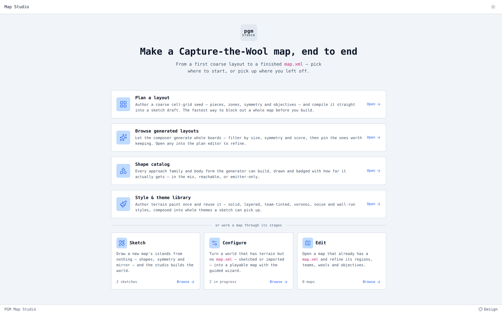

*Figure 1 — the front door. Four ways into a map, and three tools for one already under way. The counts are
live: the studio is describing its own database.*

### 4.1 Generator — whole boards from three numbers

`/generator` composes boards from a player count, a symmetry and a seed, and returns them as a browsable
feed with a score, a wool count and a size ratio on every card. Nothing is stored until a candidate is
kept; keeping one files it as a candidate, and authoring it originates a map at the plan stage.

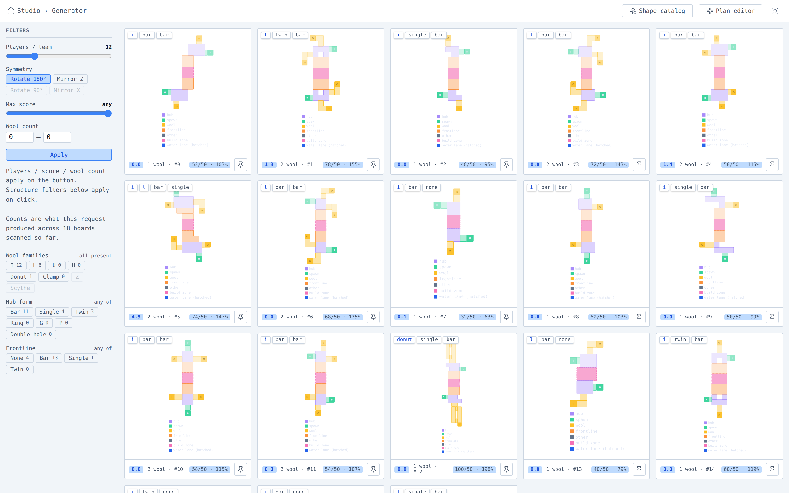

*Figure 2 — eighteen composed boards from one request, filtered by wool family, hub form and frontline
shape. The colours are roles, not terrain: purple hub, green spawn, yellow wool, orange frontline, pink
build zone.*

The generator is not how the boards in `pgm-studio-mapgen` were made, and the authoring brief is explicit
about why: *"Do not author from a composed board… painting a theme onto a composed board is what produced
fifteen boards that look like each other. Draw your own, informed by the model rather than emitted by it."*
What it is for is the **vocabulary** — the box model of hubs, lanes, frontlines and docks that the shape
catalog beside it enumerates, and which a hand-drawn board is better for knowing.

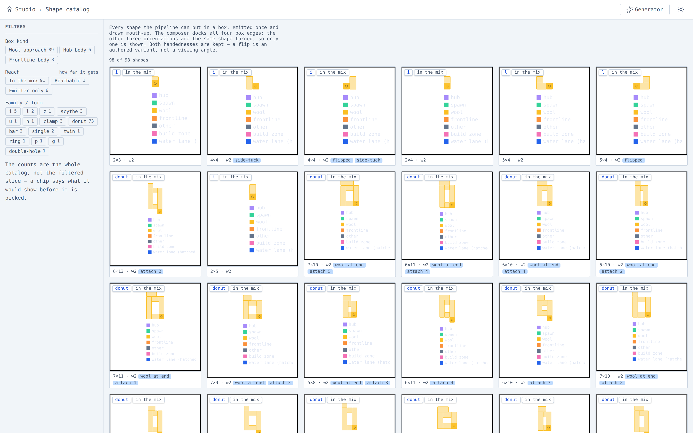

*Figure 3 — the shape catalog: every approach family and body form the generator can build, badged with how
far each actually gets — in the mix, reachable, or emitter-only. A vocabulary that says which of its own
words are load-bearing.*

### 4.2 Plan — the board

Plan authors a map at its coarsest scale: rectangles on a proxy grid, and the intent the finished map is
played by. **A plan is authored as one symmetry unit.** Everything drawn belongs to team 0; the compiler fans
it into the other teams' images by the plan's symmetry mode. Nothing in the document is per-team, and there
is no way to give one team a different board from another.

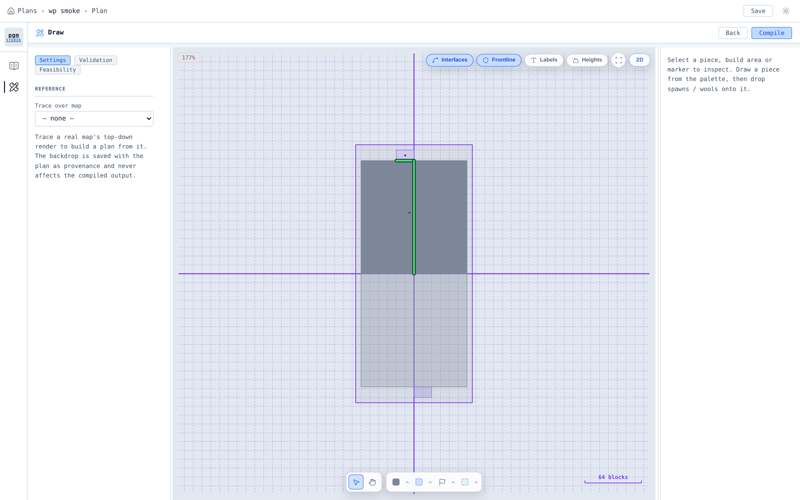

*Figure 4 — the Draw phase. The purple axes are the symmetry frame, the green line an interface between two
pieces, the shaded half the fanned image the author did not draw.*

The document is small. A piece is `[x, z, w, h]` in cells, with an optional `surface` overriding the global
height for that piece alone. Roles split in two: the **generating** roles produce terrain and take part in
connectivity and export — `piece` is anonymous ground, `wool-room` and `spawn` are the regions those rooms
stand on — and the one **annotation** role, `buffer`, produces nothing and states negative space.

**Cells state the ground and blocks state what stands on it.** A piece, a zone and a buffer are cell rects;
everything placed inside a piece is in blocks, because a 7-block hall is not expressible in fifths of itself.
That distinction is versioned: the document states `"plan": 2`, and a document stating version 1 — where
marker offsets were in cells — is refused `PL15` rather than read, *"because the unit a coordinate is in is
not visible in the coordinate."*

### 4.3 Sketch — the ground

Sketch is the largest tool and the one that decides what a map looks like. It works at block resolution over
five phases: **Draw** (shapes and groups), **Relief** (the height field), **Theme** (what the ground is made
of), **Dressing** (what stands on it), and Info.

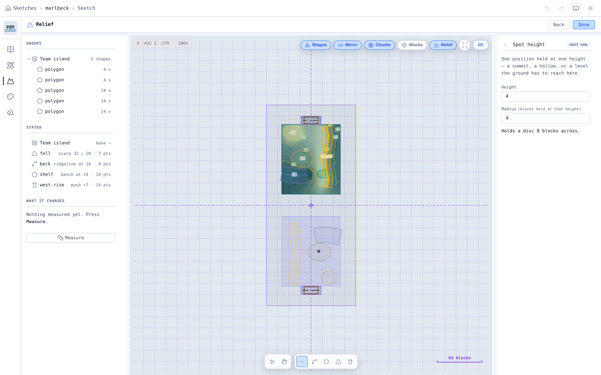

*Figure 5 — the Relief phase, on this paper's own board. The left rail is the five phases. **`STATED` is the
document**: `fell scarp 32 ↓ 20 · 7 pts`, `beck ridgeline at 16 · 4 pts`, `shelf bench at 24 · 14 pts`,
`west-rise push +7 · 14 pts` — the same four marks §5 authors as JSON, listed as the editor sees them. The
overlay is the solved height field with contours; the lower half is the mirror image, drawn and not editable.
`WHAT IT CHARGES` is the relief read-back of §7, available without leaving the phase.*

Four ideas carry most of the tool.

**Shapes and set algebra.** A layer holds shapes — rectangle, circle, polygon, lasso, polyline — each `add`
or `subtract`. A subtract removes ground entirely and is the instrument for cutting a channel; **no relief
mark of any kind cuts a hole.** A polyline is splined before its band is offset — centripetal Catmull-Rom,
eight samples a segment — so four clicked points draw as a flowing wall rather than a chain of chords.

**Relief is a constraint system, not a brush.** An author states heights over patches and the solver fills in
between: a `point` is a disc, a `line` a band either side of a polyline, an `area` every cell inside a ring,
a `rim` the footprint's own outer rings, and a `scarp` a band either side of a drawn line at two heights with
the face between them left free. Beside them sits the **push**, which takes a ring and raises the ground
inside it by an amount that falls away outside — and which composes, where a mark constrains.

**Themes are five statements about a column,** not a colour: `surface` (a top band with its own depth),
`fill` (everything under it), `rim` (the top course of the outermost ring), `wall` (the exposed face under
the rim), and `bedrock` (a height). Any of them can be a *material*, and a material can be one of fourteen
patterns — solid, layered, voronoi, cell, noise, turbulence, checker, wall-run and the rest.

**Dressing is placed, not scattered.** Six prop kinds — `stroke`, `water`, `tree`, `boulder`, `flora`,
`house` — each judged against the ground it lands on, and declined by name when it cannot stand there.

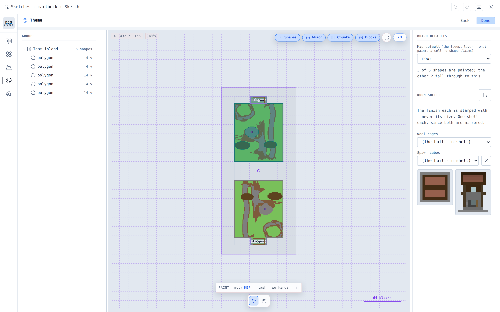

*Figure 6 — the Theme phase. The strip along the bottom is the theme registry — `moor DEF`, `flash`,
`workings` — and the panel states the rule that decides a cell: the map default paints what no shape claims,
and *"3 of 5 shapes are painted; the other 2 fall through to this."* The two shells beside it are what a spawn
and a wool room are stamped with.*

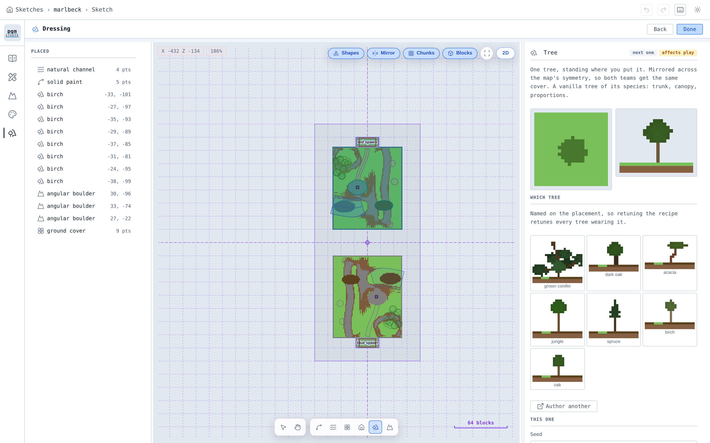

*Figure 7 — the Dressing phase. `PLACED` is every prop with its coordinates; the inspector is the tree
recipe, badged **affects play** because a tree is cover. The canvas draws the painted board under the props,
so a placement is judged against the ground it will actually stand on.*

### 4.4 Configure — the play

Configure turns geometry into a contest. Seven phases plus an import: Identity, World (scan, islands,
symmetry), Teams (teams and islands, spawn point, protection), Build (build height, buildable layer), Wools
(objectives, spawn, monuments, room), Cores (objectives, casing), and Review & Export (pre-flight, region
tree, XML).

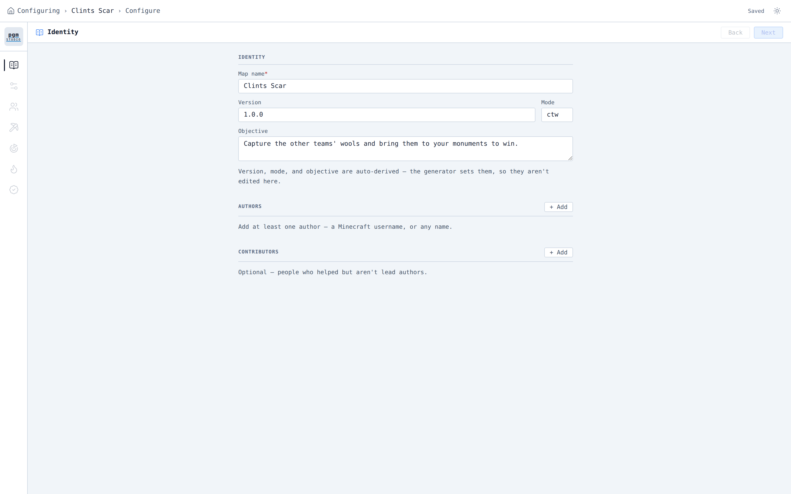

*Figure 8 — Identity, the first phase. Version, mode and objective are derived from what the map actually
carries rather than typed: a board with destroyables and no wool says so in its own `<gamemode>`.*

**There is no destroyable phase**, and that is a documented gap rather than an oversight — wools and cores
each have one, DTM does not, and a destroyable authored in a plan rides through untouched.

The phases gate each other, and the gate is the presence of a slice rather than a form validation. The three
objective phases share **one** gate: the map needs *an* objective, not one of each.

### 4.5 Edit, Library and the catalog

**Edit** is the other half of the studio entirely: it opens a map that already exists as a `map.xml` and
adjusts the document by hand. On a checkout that has imported a corpus, most maps sit there, because that is
where a parsed map lands. It is not a stage the flow advances into — the only runtime stage transition
anywhere in the tree is sketch → configure, at finish.

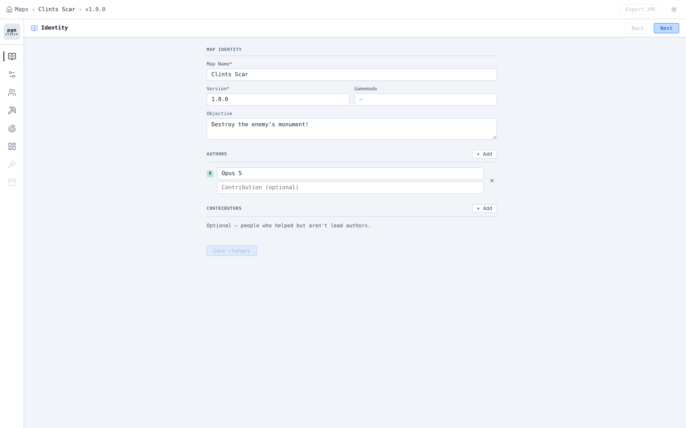

*Figure 9 — Edit, on a map that arrived as a parsed `map.xml`. Twenty-two write routes, all through one
path, all answering in the same envelope as everything else.*

**Library** holds materials, themes, house parts, room styles, tree styles and boulder styles, in eight
kinds composed in order — a style is one material, a theme a whole finish made of styles, a roof, a storey
and a porch the parts a house binds, and a house the building itself; trees and boulders sit beside them.
It knows nothing about maps, and what a map takes from it is a copy.

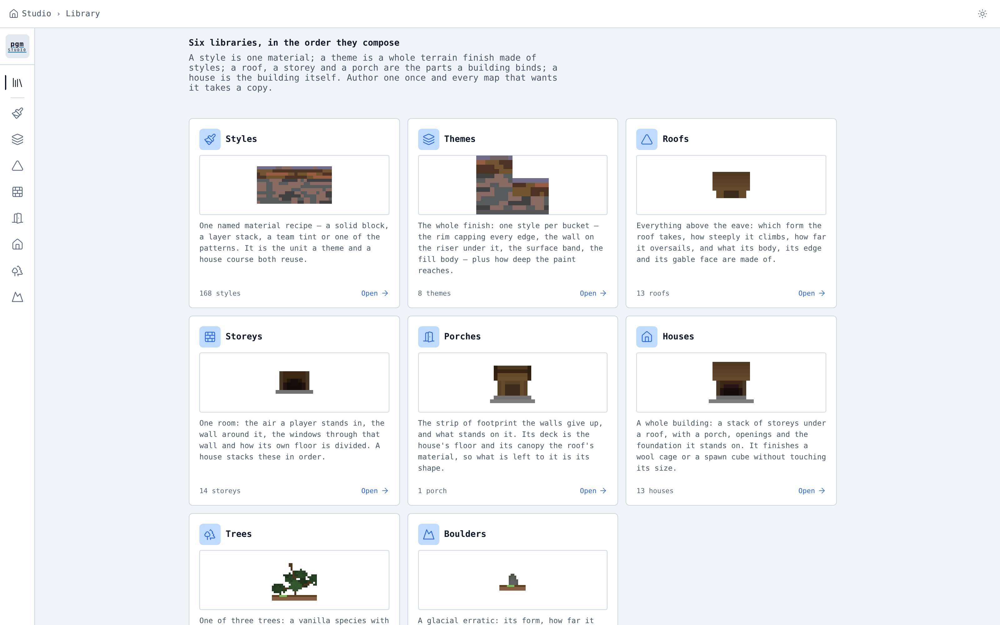

*Figure 10 — six libraries, in the order they compose. A style is one material; a theme is a whole terrain
finish made of styles; a roof, a storey and a porch compose into a room style a sketch binds.*

---

## 5. Marlbeck: a board, end to end

Everything below happened while this paper was being written, against the studio described above. **Marlbeck**
is a destroy-the-monument board: 84 × 256 blocks under `rot_180`, one monument a team, the two halves joined
only by a build zone over a 32-block strait. Its documents are in `marlbeck/`; its world is in
`marlbeck/world/`; every figure in this section is a file the studio produced.

It took **five revisions**. The revisions are the point of the section, so they are all here.

### 5.1 The board, and the first refusal

The plan is two pieces, one zone and two markers — the whole of it is Appendix A, and it fits on this page.
Posted to `POST /api/plan/evaluate` before anything else existed, it came back:

```
score 1.199   valid True
  VIOL GO1   goal-spawn-ratio 4.523 outside authored band [3, 4]
  VIOL GO3   opposing-goal-distance 155 outside authored band [85, 150]
  lint SP8   spawn egress steps 6 blocks at 'camp'–'moor' — use 1-level steps or a ramp
  lint ST9   the spawn building on 'camp' is 26×6 blocks — a footprint is at most 20×20
```

Four findings, no world, no blocks, about **two seconds**. Each names the number it measured and the band it
missed. `GO1` is the destroy board's central proportion — a monument sits three to four times as far from the
enemy's spawn as from its own, by walk — and 4.523 says the monument was too close to the team that defends
it. The arithmetic is solvable on paper: with spawns `L` apart and the goal `d` from its own, the ratio is
about `(L − d) / d`, so the band puts the goal between `L/5` and `L/4`. Moving it ten blocks toward the middle
answers `GO1` and `GO3` together; dropping the spawn shelf from 26 to 21 answers `SP8`; stating a footprint
answers `ST9`.

```
score 0   valid True   violations 0   lint 0
```

`POST /api/plan/inspect` then reads the board back in the terms the rules are stated in:

```json
"goalDistances": [{ "id": "dt-marl", "ownSpawnBlocks": 59, "enemySpawnBlocks": 192, "ratio": 3.254 }],
"islandGaps":    [{ "roleA": "team", "roleB": "team", "blocks": 32 }],
"frontlineRuns": [{ "team": 0, "widthBlocks": 108, "profile": "straight" }]
```

Everything decided so far is the *arrangement*, and none of it has cost a build.

### 5.2 The finish, and what the first build said

The plan states where things are. The **finish** — a second document, keyed onto what the compile produces —
states what the ground is shaped like, what it is made of, and what stands on it. Marlbeck's is three relief
marks, one push, three themes, three theme patches and fourteen props, written by a 198-line
`build-spec.py` that is committed beside it.

The first build stored, exported, and answered with eight findings on a `200`:

```
[complaint] SK3      shape 'flash-w' states kind '', which is not a kind the studio draws — it has 5
                     (rectangle, circle, polygon, lasso, polyline) — so it draws no ground
                     @ layers[0].layout.shapes[6].type
[complaint] SK3      shape 'flash-e' … @ layers[0].layout.shapes[7].type
[complaint] SK3      shape 'pit'     … @ layers[0].layout.shapes[8].type
[complaint] RL1      island 'team' says it is hills and measures rolling: 27 blocks of range over 11136
                     cells, which is 0.26 for the board's own size.
[complaint] RL5      island 'team' is 26 % level ground, the largest run of it 5 % of the island, against
                     16 face(s). The elevation was graded everywhere and left nowhere to stand.
[complaint] DR-DRY   water 'beck-water' stands against 220 open column(s) of drawn ground — first at
                     (-53, 16, -52), where the basin is dug to the water's own depth and holds none.
[complaint] DR-BANK  water 'beck-water' is 3 deep and its carve cut 8 course(s) of ground away above its
                     own line — a straight-sided wall from y17 to y24 at (23, -53).
[decline  ] DR-CLAIM boulder 'b2' rests on (37, -45), claimed by the channel 'beck-water'
[decline  ] DR-SITE  tree 't7' has no ground at (-44, -15)
```

**Read what those eight sentences actually contain.** `SK3` names the JSON path of a field that was written
`kind` where the studio reads `type` — and lists the five words it would have accepted. Nothing failed: the
three theme patches simply drew no ground, and without the finding the board would have shipped a theme short
with nothing anywhere saying so. That exact failure has happened in this corpus: **four boards shipped
unpainted** before `SK3` existed, and the run that made them believed they were themed.

`RL5` is the one worth dwelling on. It says the relief was graded everywhere and left nowhere to stand — 26%
of the island under ten degrees, against a 30% bar. The cause was one number: `reach: 0`, which does not mean
*no reach* but **unlimited** reach, so every mark decided the whole surface and the board became continuous
transition. Setting `reach: 45` lets ground more than forty-five blocks from any mark fall back to the base
height, which is what a moor is.

The coverage read said the rest:

```
reached 10180  decorated 1406  dead 10686  of 22272  = 48.0% dead
```

Nearly half the board on the way to nothing — because it was 108 blocks wide with a single objective down the
middle of it.

### 5.3 Five revisions, and what each one moved

| Rev | What changed | What it moved |
|---|---|---|
| 1 | first authored board | `SK3`×3 · `RL1` · `RL5` · `DR-DRY` · `DR-BANK` · `DR-CLAIM` · `DR-SITE` — **48.0% dead**, 194 barrier cells |
| 2 | `type` not `kind`; `reach: 45`; `landform: rolling`; water states a `level`; two props moved; board narrowed 108 → 84 | six findings cleared. **32.6% dead**. Two new: `WX11`×2, the monument standing four blocks above the cell beside it |
| 3 | monument moved to the centre of the lane; beck narrowed | `WX11` cleared — and **56.9% dead**, worse than revision 1, plus a new `RL3`: the beck and the fell meeting on an 8-block wall |
| 4 | monument back off-centre; the push moved *behind* the shelf; beck restored | everything clear but one. **34.2% dead**, 218 barrier cells, 4 faces |
| 5 | channel `form: natural`, ended clear of the fell, bed matched to the pool | **0 barrier cells, 0 faces**, 34.4% dead, one open complaint |

**Revision 3 is the most useful row in the table**, because it made the board worse in a way no human eye
would have caught. Moving the monument to the middle of the lane cleared a genuine fault — and turned both
flanks into ground no journey passed, from 32.6% dead to 56.9%. Nothing refused it. The board still exported.
The only thing that said so was a read nobody is required to take.

The `WX11` it cleared is worth its own sentence, because the cause was not where it looked. The monument's
shelf was authored as an `area` mark holding a flat pad at height 24 — and it was not flat. A **push** is
applied *after* the marks are solved, and the west push's falloff reached across the shelf and tilted it, so
the monument stood on a ramp and its foundation filled the drop in bedrock: *"a wall a player cannot climb and
nobody drew."* The fix was not to the shelf but to the push, twenty blocks away.

### 5.4 What Marlbeck is, measured

```
03-slopes.txt   cells: 15802 walked, 1670 scrambled, 0 barrier; faces: 0
06-claims.txt   placed 28, declined 1
relief          group team: cells 8736, low 16, high 34, relief 18, symmetry error 0
coverage        reached 10180  decorated 1280  dead 6012  of 17472  = 34.4% dead
themes          moor 15848 cells (90.7%) · flash 968 (5.5%) · workings 656 (3.8%)
preflight       round-trip ✓  mirror ✓  buildability ✓  traversability ✓  — export gate OPEN
```

Every cell of the board is walkable: **zero barrier cells and zero faces**, on ground with eighteen blocks of
relief in it. The symmetry error is zero, so the two teams stand on the same board. Three themes over 17,472
ground cells, in the proportion the corpus's own authoring brief argues for — *"a landscape board is one
theme, a relief and a handful of patches."*

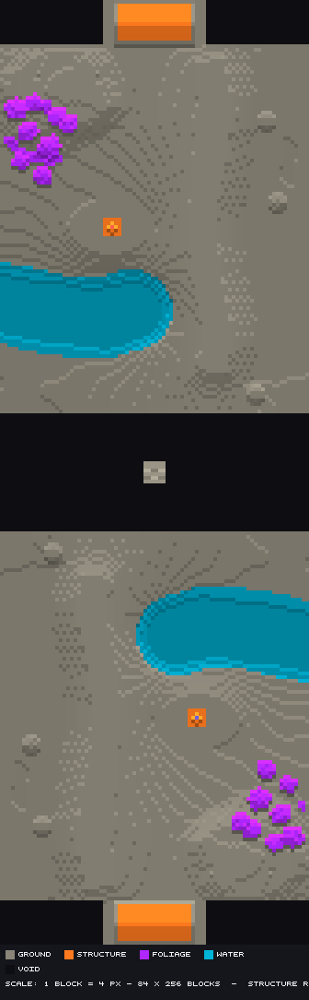

*Figure 11 — the board from above. Two land masses, a void strait between them with the observer platform in
it, a mere at the west of each half, a wood in one corner, the fell down the east side, and one monument a
team. `rot_180` means the lower half is the upper half turned, and nothing in the document says so twice.*

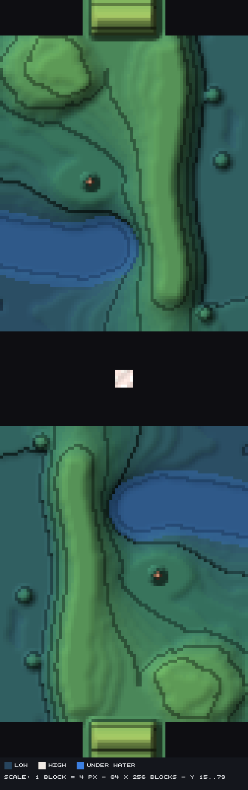

*Figure 12 — the same board as elevation, with contours every few blocks. The ridge down the east is the
`scarp` mark; the pale blob top-left is the `push`; the dark ring holding the marker is the `area` mark the
monument stands on; the blue is under water. Three marks, one push, and a grain field over all of it.*

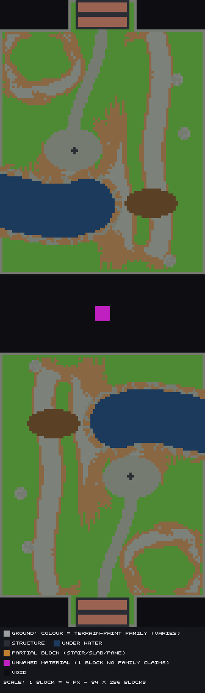

*Figure 13 — **the figure that makes the case for finishing ground by its angle.** The theme's surface is a
`layered` material on the `slope` axis, so one statement paints three things: green under 24°, brown from 24
to 40, grey above it. The fell's face, the beck's banks and the shelf's rim are all drawn by the same eleven
lines of JSON, and none of them is stated anywhere as a place. The two brown ellipses and the two grey ones
are the theme patches. The magenta square is the observer platform's bedrock, which has no tone family and
is not a fault.*

The alternative — a theme per plan piece, or one per height band — is the single most common way a board in
this corpus has come out looking wrong, and the reason is mechanical: nothing in the geometry tells a 45°
hillside from a meadow, so a board painted by height comes out a flat sheet from above however much relief is
under it.

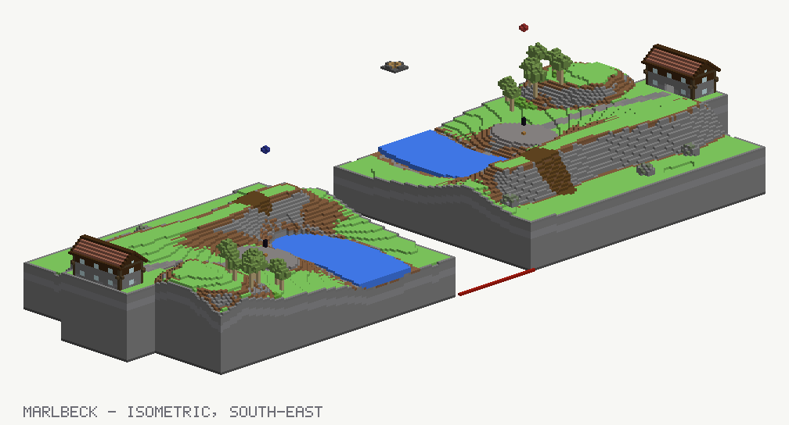

*Figure 14 — the isometric, drawn from the per-column runs the studio answers rather than by a camera in the
world. The strait, the spawn halls, the mere, the fell's stone face and the wood.*

### 5.5 The one complaint it ships with

Marlbeck is not clean. It carries one, on every build:

```
[complaint] DR-DRY  water 'beck-water' stands against 122 open column(s) of drawn ground — first at
                    (-42, 18, -58), where the basin is dug to the water's own depth and holds none.
                    The hollow and the pool that fills it are two statements about one lake; where the
                    hollow reaches further, the difference is a dry trench beside the water. Widen the
                    pool onto the ground that was dug for it, or stop digging it there.
```

Two documents describe one lake — a relief mark that cuts the bed and a water prop that fills it — and where
the cut reaches further than the fill, ground is excavated and never covered. Four attempts moved the count
from 400 to 122 and none of them reached zero, because the residue is at the board's own western edge where
the mark's band is clipped and the pool's end-disc does not cover it.

It is left in, and the rule itself says why that is a decision rather than an oversight: *"A complaint: the
world is built and the water is in it."* A complaint is a sentence the studio thinks is worth saying; it is
not a veto, and the author is the one who decides. **That the number is 122 and not "some" is the whole
difference between a system that reports and one that nags.**

---

## 6. What the studio refuses, and how it says so

This is the section that makes every other one possible. A system that only builds can be driven by a person
who looks at what it built. A system an agent can drive has to say what is wrong with what it was asked for,
by name, in a shape a program can act on.

### 6.1 One envelope, everywhere

Every gate answers in one shape, so one parser reads all of them:

```json
{ "error":   "invalid house style",
  "message": "doorHead.block (5) is not a stair. …",
  "findings": [ { "rule": "HS1", "message": "…", "severity": "refusal", "field": "doorHead.block" } ] }
```

`error` names the **gate**, never the fault. `message` is the findings' sentences joined. `findings` is what
to act on — each carrying a **rule id**, a **sentence with the measured numbers in it**, and where the fault
is: a `field` naming the JSON path, `subjects` naming the pieces an editor would highlight, or a `cites`
pointing at the rule that settled it. Some carry an `edit` — a mechanical fix, as a document, a path and an
operation.

Status codes are the gate's own and each route declares which it can answer: **400** a document wrong as
posted · **404** a subject the studio does not have · **409** well-formed but conflicting with stored state ·
**422** cannot be processed · **500** the studio's own fault. **156 of the 219 operations** declare at least
one of 404/409/422 for themselves rather than having it guessed from the path.

### 6.2 Three severities, and why a 200 is half an answer

| Severity | Means |
|---|---|
| `refusal` | the work stopped; nothing was written |
| `decline` | the work happened and one piece of what you wrote is not in it |
| `complaint` | the work happened and lost nothing; something is worth saying anyway |

**A `200` is not a promise that everything posted survived**, and this is the single most important thing to
know about driving the studio. Every 2xx JSON object answers a `warnings` array when something was
complained about or declined, and every operation declares a `Pgm-Warnings` response header —
`6 RQ3 SK3 SK4` — so the count and the rule ids are readable before the body is parsed. Non-JSON successes
(the world zip, the rendered `map.xml`, the 26 routes answering an array at the root) carry the header alone.

The mechanism is middleware rather than a field on each record: an endpoint hands its non-refusing findings
to one collector, and a stream wrapper decides at the first byte whether the response is a JSON object it can
add a key to. If complaints exist and there is nowhere to put them, the studio **logs an error naming the
route and the rules** rather than dropping them.

There is a second header for the opposite case. `Pgm-Unwalked` names the rules a read **did not ask** — a
partial sketch write reads the document only, so the eight rules that need rasterized spans are named as
unwalked rather than silently passed. *These were found* and *these were not asked* are different claims and
get different headers.

### 6.3 The finding that retired most of the guesswork

`RQ3` names every field of a posted document that **went unread**, by its JSON path:

```
[complaint] RQ3  layout.shapes[1].x   field 'layout.shapes[1].x' was not read …
```

Guessing a field name, nesting a block one level too deep, writing `x`/`z`/`w`/`h` where the rectangle wants
`min_x`/`min_z`/`max_x`/`max_z` — every one of those used to answer `200` and quietly build a smaller map.
The corpus records a run that **invented five material field names out of five** and lost the first build of
every board to it, and another that wrote an entire relief vocabulary from scratch — `{base, noise:{scale,
amp, octaves}, features:[…]}` against the real `{base, step, reach, stairs, grain:{…}, marks:[…]}` — of which
*"only `base` survives the crossing."*

The check after each post is now one line: **did anything come back under `warnings`.**

### 6.4 The catalogue

`GET /api/rules` answers **169 rule ids** — every no the system can say, each with what it *means*, how to
*fix* it, and the evidence behind its numbers. `?rule=GO1` and `?family=DR` filter it. It is not a
hand-written list: 129 of the ids are read by reflection off the constants that raise them, taking `means`
from each constant's own XML docstring and `fix` from its remarks, and the other 40 are parsed out of the
generator's rule law, which is embedded as a resource so the catalogue reads the law rather than a copy.

| Family | n | About |
|---|---:|---|
| `SK` | 26 | the sketch document and what it rasterizes to |
| `PL` | 15 | the plan's own structure |
| `DR` | 15 | what the dressing pass could not place |
| `WX` | 13 | rooms, footprints and what they stand on |
| `HS` | 10 | a house style's own materials and forms |
| `OB` | 9 | objective placement |
| `RQ` | 6 | the request itself, including `RQ3` |
| `IM` | 6 | the import |
| `EX` | 6 | the export gate |
| `RL` | 5 | a solved relief against what its island claims to be |
| `HJ` | 5 | how two wings of a house meet |
| `HP` `DC` | 3 each | house props; a destroyable's own casing |
| `PT` `ED` | 2 each | terrain paint the painter cannot honour; the document editors' own |
| `PC` `EZ` `CO` | 1 each | corner contact; inert ground; the composer |
| **129** | | **gate rules, in 18 families** |
| `CT` `WL` `ST` `SP` `FR` `GO` `G` `LN` `EL` | 40 | the layout law — what a board *should* be, cited by the plan lint and the evaluator |

Rules also carry a **category** (one of eight words: `malformed`, `unknown`, `conflict`, `unsatisfiable`,
`unplayable`, `forbidden`, `unavailable`, `internal`) and a **concerns** list from thirteen words, so a caller
can ask *should I fix the request, change the design, or report a bug* without knowing all 129 ids.

### 6.5 Where the gates run

| Where | What runs |
|---|---|
| **compile** | `PL1`–`PL15` and `PC-C` (the plan's structure and completeness) · objective placement · wing joints. `PL3`, *no objective of any kind*, is a **complaint** — which goal a map carries is the author's |
| **store** | the material/theme gate (`HS*`, `WX*`, `PT*` through the bound styles) · the `SK*` family · author names · `RQ3` at the edge, before any merge · a **409** with one `SK1` per relief group a recompile would orphan |
| **pre-flight** | round-trip (the codec loses no field) · mirror consistency · buildability · traversability **per team**, so a goal a team is barred from names the team barring it. Each answers `pass`, `fail` or **`skip`** |
| **export** | `OB20` the declared gamemode against PGM's enum · `SK2` a board past what the studio will realize · `OB17` objectives over the ground the rasterizer actually produced · `OB24` two goals in the same blocks · `EX1` traversable · `EX2`–`EX4` · then `EX5`/`EX6` as complaints on the built world |

**Pre-flight is the export's verdict at a fraction of its cost**, and it is the read most easily skipped
because nothing refuses you for skipping it. A wool room on the defenders' own spine compiles clean,
evaluates clean, and is refused at export as `EX1` after a whole world has been built. Pre-flight says so
first.

---

## 7. What the studio can be asked

The other half of the contract. A map that has been built can be interrogated — and the interrogation is the
instrument that does not exist for a hand-built world.

**Fifteen routes answer pictures. Fifteen answer `text/plain`, nine of them as `?format=text` twins of a
JSON answer.** That pairing is deliberate and it is the discipline the whole corpus turns on: *a picture
answers whether a thing came out; a number answers whether it is right.*

| The question | The read |
|---|---|
| What is actually at this coordinate? | `GET …/column?at=x,z` — every block named, bedrock to sky. **The workhorse**: every other read is a projection |
| Does this climb? Is that step walkable? | `GET …/transect?points=x,z;x,z&beside=2&format=text` — a polyline walked block by block, with every event named |
| Where does the ground step, over the whole board? | `GET …/slopes?format=text` — `.` walked, `:` scrambled, `#` barrier, plus a per-face summary |
| How **steep** is it, and where? | `GET …/incline?format=text` — the glyph is the tens of degrees, and under the grid, how much ground stands in each ten. This is the axis a slope band is picked by |
| Is there anywhere to stand? | `POST …/sketch/relief/read` → `level` (share under 10°) and `largestField`; `RL5` fires under 30% |
| Which two **marks** built that wall? | the same read → `seams`, worst first, each naming the pair and the cell |
| What did the route actually cost? | `GET …/walk?from=&to=&aim=&format=text` — reachability, distance, rises, falls, worst step, and what stands within two blocks |
| Is the board joined up, per team? | `GET …/preflight` |
| Is any ground unused? | `GET …/coverage` — the only read that asks whether a journey *goes* somewhere rather than whether it *can* |
| What is it made of, and what borders what? | `GET …/themes/census?format=text` |
| May a prop stand here? | `POST …/sketch/dressing?format=text`, then `POST …/sketch/seats` |
| Is this section what I think? | `GET …/render/section?axis=&at=&from=&to=&format=text` |
| What is wrong with this map right now? | `GET …/findings` — every gate the stored documents can reach, **plus the gates it did not ask and the route that pays for them** |
| What can I do next? | `GET …/state` — the stage, the artifacts held, and the moves they allow, each with its route |

Two properties of that catalogue matter more than its length.

**The build behind a read-back runs no gate, deliberately.** A board that fails a gate is exactly the board
somebody needs to look at, so the reads do not refuse.

**`GET …/findings` names what it did not ask.** A read that answers *here is what is wrong* and stays silent
about the checks it skipped is worse than no read, because it reads as a clean bill of health. This one lists
the unasked gates with the route that pays for each.

### Why the numbers beat the pictures, with the cases

This is not a stylistic preference. The corpus is a record of what happened when it was ignored.

> *"I read `world-material.png`, saw sand, and concluded the lake was missing."* — the material top-down
> draws the top **solid** block, so water reads as its own bed.

> *"I measured the channel off the picture at about 50 blocks deep and was about to redesign around it;
> `--section` reported 43 void columns, which is the 22 + 22 I authored. The picture answers *whether*, and I
> asked it *how much*."*

> *"Over seven builds I opened six renders. Of the twenty-five text reads the driver writes beside them I
> opened exactly one… It cost a fault that shipped in five consecutive builds."* — a one-block bump under a
> rail, invisible in a heightmap and an isometric alike, named with its coordinates in a file nobody opened.

> *"A transect of nothing is indistinguishable from a transect of flat ground; a column is not."* — two
> structures drawn with their axes swapped, neither built, both reading `walked end to end`.

**When two reads disagree, `column` is the one that is not a projection.** That sentence is the most repeated
conclusion in forty-nine run reports.

---

## 8. Agentic map making

**`pgm-studio-mapgen` is the evidence.** 111 built worlds, 94 authored specs, 83 measured records and 49 run
reports, every board authored by a language model driving the HTTP API described above, and every failure
written down by the model that made it. Marlbeck, in §5, is one more.

### 8.1 What an agent is actually given

Not a wrapper. Not a natural-language layer. **The API, the rules endpoint, and two documents.**

```
GET /api/openapi/v1.json   every route, its request, its answer, and the failure codes it declares
GET /api/rules             every rule id, what it means, how to fix it, and the evidence behind it
```

The authoring brief is explicit about why there is no capability list beside them: *"Do not learn the API
from a document — including this one… They are generated from the routes and the types, so they are current
by construction; a hand-written capability list is a copy free to disagree with the thing it describes."*

The driver is one 934-line Python file that posts documents and prints what came back. It computes no
placement, no clearance and no validation, and the reason is written into the repository's own rules: **do not
write a second copy of the system.** The one rule with teeth beside it is that a `build-spec.py` generating
the plan and the finish *is* the authoring work and is expected — the arithmetic of a bay grid or a per-course
stair belongs to the author — while anything that reads the *built world* does not, because those reads exist
and the home-made version has been wrong every time:

> *"Then I wrote three ground-finders and two of them were wrong. 'The topmost solid block' reads a roof.
> 'The topmost block that is not a leaf or a log' reads a plank roof… **Three wrong readings all produced
> plausible tables.**"*

### 8.2 The loop

```
build-spec.py            write the plan and the finish
tools/board.py           the grid — the relations between rectangles, before any map row exists
drive.py --dry           evaluate + inspect: the score, GO1/GO3/GO4, the island gaps, the lint table
                         ── iterate here; the board's shape is decided here, at two seconds a try ──
drive.py --out …         compile, store, read back, pre-flight, export, render, and write the text
03/06/04-*.txt           the three numbers, before the pictures
loop.py                  every placement question after the first drive — twenty seconds, not ten minutes
```

**The economics are the reason it works.** From one run's own accounting: five full drives at 12–18 minutes
each, seventeen `loop.py` passes at 20–70 seconds, and eleven plan variants posted straight to
`/plan/evaluate` at 2–4 seconds. Its conclusion: *"Every number in this report that decided something came out
of a loop pass or an evaluate probe. The drives confirmed and exported. The board's whole shape — the width,
the goal positions, the four bench rings, the block step, the road grades, the prop positions — was settled
before the second stored build."*

Marlbeck was built the same way. Its last three water revisions were `loop.py` passes at thirty seconds each;
only the first and last states of the board cost a full drive.

### 8.3 What closed, between August and September

The first fifteen boards were built on 11–12 August 2026. Every one of the nine destroy boards among them
declares `<gamemode>ctw</gamemode>` while carrying no wool at all — **the objective kind a board is played for
could not be stated.** Reading the arc from there is the clearest measure of what makes agentic authoring
work, because each gap was closed by a specific capability.

| What an agent could not do | What closed it |
|---|---|
| say that a destroy map is a destroy map | `Gamemodes.From(hasWools, hasDestroyables, hasCores)` — derived from what the map carries |
| read a built world vertically at all (*"six renderers, all plan-view"*) | `column`, `transect`, `section?format=text` — *"the read that settled every disagreement"* |
| post a plan and a finish together (the merge was hand-rolled) | `POST /map/from-documents` — one call, slug stated, replace on re-drive |
| separate a spawn's building from its protection region | `footprint` on a spawn and a wool placement, in blocks from the piece corner |
| find out that a theme name matched nothing | `SK3` — the finding that four unpainted boards were shipped for want of |
| know a field went unread | `RQ3`, by JSON path |
| paint a lower storey of a stacked board | per-layer paint, and `column` to check it |
| know which storey a walk was measured on | `from=x,z,y` on the walk, the `y` picking the storey |
| reshape one vertex of a compiled outline | `PATCH …/shapes/{id}/vertices/{index}` — one point moves, every other stays |
| draw a curve | a `polyline` shape, splined before its band is offset |

The shape of a board changed with them. Two rows from a survey of every spec that carries a layout:

```
haiku-chancel   (Aug)   1 layer ·     3 shapes ·  0 themes ·  0 props ·  0 relief marks
opus5-slipway   (Sep)  72 layers · 4,304 shapes · 28 themes · 81 props ·  7 relief marks
opus5-clints-scar (Sep) 1 layer  ·     4 shapes ·  1 theme  ·  1 prop  · 48 relief marks
```

The third row is not a regression. It is the corpus learning its own rule — *"a landscape board is a small
plan and a large relief"* — after boards cut into thirteen pieces so a theme would have somewhere to hang came
out reading chopped rather than coherent.

### 8.4 The failure modes, and what they have in common

Seven of them are distilled into a skill the repository loads before any board is built, *"distilled from 27
runs; every rule in it cost at least one build."* The common shape is worth stating on its own, because it is
the thing a white paper about agentic tooling ought to leave a reader with:

**A correct measurement plus an invented conclusion.** Not a hallucination, and not a wrong number. A real
reading, generalised one step too far, and then written down as though it had been checked.

> *"I rebuilt a board at twice its size because an evaluator printed the word 'hard'… I took that for *this
> will not build*, and doubling the cell satisfied both without moving a rectangle. **Nothing refuses on `G2`
> or `G5`.** They are scoring terms… I never ran that test; I inferred the answer from a word."*

The cascade that followed is the instructive part: doubling the cell doubled the two rectangles whose size is
a fact in blocks rather than in cells, which tripped a cap, which forced a split, which needed four shelf
pieces the author never drew — *"1,236 blocks of dead-level pad per quarter, 4,944 on the board, 21% of its
ground. Not one of those steps was in the plan, each was locally reasonable, and the chain was never re-read
against the original."*

And the same run's own verdict on what it then did with it: *"I did not merely make the mistake, I canonised
it… It is a sentence I invented to justify a change."*

**The mitigations that work are all mechanical**, and every one of them is something the system does rather
than something the agent remembers:

- a finding names a **rule id**, so *"what does this mean"* has a route (`GET /api/rules?rule=…`) instead of an
  inference;
- a finding names a **JSON path**, so a wrong field is a fact rather than a hunt;
- a `200` carries **`warnings`**, so *"it worked"* is not a status code;
- **three verdicts** are required before "missing from the system" may be written down — **missing** (no
  mechanism), **unreachable** (it exists, the surface hid it), **mistaken** (it exists, documented, not found)
  — and *"a verdict is not the model's to award on its own claim: it is settled by reading the code, and the
  reading is cited."* One run corrected two of its predecessor's "missing" claims to "mistaken" by doing
  exactly that.

One run's arithmetic on itself is the number to end this section with: *"of the nine things in this report I
could not say, **five were the schema being right and me reading it wrong**, three were a deliberate rule
saying no and saying why, and one was the surface genuinely unable to answer. That ratio is the useful
number."*

---

## 9. Human–AI collaboration

The seam between what a person decides and what a model can derive is not where most people would put it. It
is not *the model does the tedious parts*. It is this:

> **The measurements and the code reading are the model's. Every correction that mattered about the map was
> the author's.** — from the earliest report in the corpus, and unchanged since.

### 9.1 The oracle rule

A rule about the map **as it is played** is not derivable from the repository. The corpus shows what authors
did; the code shows what the tool does; neither says what is *correct*. So the rule is written down and
enforced socially: what an objective needs around it, where a goal may sit, whether a channel should be
bridgeable, how unequal two ways round may be — these are asked, not inferred.

**The failure this prevents has already happened, and it is the honest centre of this paper.** A destroyable
and a core float a few blocks above the terrain **by design** — a core on the ground cannot leak, and a
destroyable on the ground is trivially covered. That has been the server's behaviour from the start. Measuring
the gap and reasoning from first principles produced a confident, filed, committed claim that every generated
destroy map was unwinnable. **The measurement was right and the conclusion was invented.** Neither the corpus
nor the code would have corrected it; one question would have.

So the discipline is: make the judgement, **build it**, and record the question in the report as an open
question rather than filing it as a fact.

### 9.2 What a human review actually looks like

One board was reviewed by its author as eleven lines, transcribed verbatim into the run report:

> *"the water lane is encased by my own pieces; that is not what a lane is · dead space around the spawn ·
> the wools are not isolated enough and smush into pieces · the wall can be walked around; it belongs on an
> interface in front of the wool, blocking a full lane, void either side · the large stone area in front of
> the wall looks random · the middle is too wide; players will not meet · you want a U frontline, a
> double-hole hub, I and L wool lanes · one island in the middle · you made three themes and did not use them
> · four trees and no boulders, no water; the path ends randomly · keep the terrain the same or less"*

None of those is a measurement. Every one is a claim about how the board plays, and the rebuild that followed
took the ground from 533 cells to 207, the navigable columns from 26,818 to 10,898, and the evaluator score
from 3.243 with two terms firing to **0.0 with nothing firing**.

The agent's own post-mortem is the useful half: *"I read the tool documents and not the model. I treated the
evaluator's one number as a matter of taste — it was reporting the absence of a structure, and I answered it
by trimming corners. I never drew the board. I used features because they existed: the water lane went in
because the format has one, not because the board had two islands wanting a late connection."*

Other rulings that only a person could settle, each now written into the brief:

- **One objective on a small board.** Two monuments 28 blocks apart on a 68-wide board *"is one objective with
  two health bars."* The fix also moved `GO1` from 3.09 to a better-centred 3.55.
- **Noise scale.** A two-block noise at scale 18 on a small board *"will look worse than a single material."*
  The general form: on a board of a hundred blocks or less, reach for a second **shape** before a second
  **stop**.
- **A path's claim against a building.** Paths are laid first; a house drawn across the pavement stands and
  the road ends at its wall — so a route can run to a porch.

### 9.3 The round trip that closes the loop

The interesting direction is the other one: a person finishes a board **in game**, and the finish comes back
as documents.

It has been run once, on a board called Millrace, and every step is recorded. The map's author and a second
builder spent five hours in creative on a copy — *"the terrain, spawn platform, spawn house, objectives, canal
walls, water levels, bridges, boulders, and most house placements were kept intact… essentially all that was
done is theming and some dressing"* — and wrote down **every WorldEdit and Arceon command in the order it was
run**, because *"a diff says what the blocks became, and the list says what was asked."*

Then:

1. **A control.** Re-drive the original spec into a scratch directory and diff it against the committed world.
   Result: **4,020 differing cells of 1,060,630 — 0.4%**, every one of them a tree or two spawn terraces, and
   *"not one column of ground, water, wall, bridge, boulder or cairn moved."* **29,954 of 35,610 columns keep
   their surface height exactly.** That number is what makes the human diff readable at all: without
   determinism, the difference between "what the person changed" and "what the build does differently this
   time" cannot be separated.
2. **The diff**, provenance-keyed, so a changed cell is attributed to the pass that originally claimed it.
3. **The translation table** — each WorldEdit command mapped to the studio's own word. A nested
   `#vor[n][#turb[m][…]]` becomes one `cell` material whose palette is `turbulence` materials; a boulder brush
   becomes a boulder recipe whose rock is a `noise`; `//s #frac[…]` becomes `flora` props.
4. **The trees**, matched by leaf set under the eight symmetries of the square — *"forty-two standalone bodies,
   every one of them a showcase tree at 0.99 or better"* — and cut into the library so the next board can use
   them.
5. **The builds**, lifted out of the world into layers with a cost readout (*"the statue is 8 layers and 402
   shapes"*).
6. **Two boards come out**: the original restated with the human finish as documents, and a new board built
   on a new layout using what it taught.

The round trip also produced three studio fixes, one outright bug (25,000 blocks of void under walls the
person had filled by hand, now kept by the builder) and an eleven-item list of *what the studio cannot state*.
Its last item is the honest frontier:

> *"The chimneys, the flower pots, the player heads, the crates, the slab wall round the terrace, the smooth
> slabs at every rise of the bridge and the path… are all dressing at a grain no prop has: a block on a block.
> They are the 'alive' the author was after, and each is a placement of one to twelve blocks by hand."*

### 9.4 The division, stated plainly

| The model is good at | The person is the only source of |
|---|---|
| holding a 169-rule vocabulary and acting on ids | whether a board is worth playing |
| arithmetic over a document — bay grids, per-course stairs, ramp anchors | what an objective needs around it |
| taking every read and reporting what moved | which of two correct-looking arrangements is the better contest |
| iterating twenty times at thirty seconds a try | the conventions a corpus records but does not state |
| writing down what it could not do, by name | the block-on-a-block grain that reads, from the ground, as care |

**And the seam is not fixed.** Every row on the left was on the right a month before the capability that moved
it. That is the actual claim of this section: the boundary moves when a capability is added that turns a
question of taste into a question with a read behind it, and each of those is visible in the corpus as a date.

---

## 10. Limits

An honest section, because a white paper without one is marketing.

**The studio does not decide whether a map is good.** It checks 169 named things, none of which is *is this
worth playing*. A board can pass every gate, score zero against the evaluator, and be dull. Several in the
corpus are.

**No gate asks whether a board looks like anything.** The whole of a map's finish — the theme, the patches,
the dressing — is held to almost nothing, and it is the half every run has got wrong at least once. The
authoring brief's painting section is measured over 51 boards and enforced nowhere: *"Of the 277 patterns on
these boards, 85% carry three entries or more"* where two is a texture and five is a family shown off; *"44 of
50 voronois are on the surface and none is in the fill"* where a voronoi draws a diagram and belongs in the
rock nobody sees; *"9 of the 50 buildings are walled in the ground's own family."* All of that is advice, and
advice is what a gate is not.

**Coverage is a measurement and not a gate.** Nothing refuses on dead ground — which is exactly why a run that
does not take the read ships a board with a third of its surface on the way to nothing. Two boards, one with a
third of its ground unused and one with an eighth, *"pass every gate identically."* Marlbeck's own 34.4% is
in that category: it is a number the author accepted, not one the studio approved.

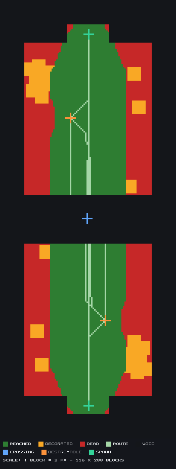

*Figure 15 — the read that no gate takes. Green is ground a journey passes, red is ground none does, orange
is the decorated fringe, and the pale lines are the routes themselves. Marlbeck's flanks are red because one
monument a side gives no reason to walk to them, and nothing in the studio refuses a board for it. Compare
the corpus, which runs from **0.0% dead** on a board with a hub and four arms to **69.9%** on one furnished
out of a sculpture gallery.*

**The flow is one-way and there is no route back.** No endpoint in the studio reads a `map.xml`. A map
authored against one studio reaches another only as a world, arriving without its plan, its drawing or its
intent, and can never be re-planned.

**The block-on-a-block grain is missing**, and it is the largest gap: chimneys, flower pots, crates, a slab at
every rise of a path. A person places one in a second; the studio's smallest instrument for it is a made thing
of hundreds of shapes.

**There is no destroyable phase** in Configure — wools and cores each have one, DTM does not — so a
destroyable authored in a plan rides through with no surface to adjust it on.

**Two export gates are still heard for the first time at 409, after a whole world is built**: an objective
overhanging void or standing in a spawn, and a prop inside a goal's clearance. Neither is in pre-flight.

**And the documentation drifts, measurably.** An audit taken for this paper found 34 factual errors in the
studio's own docs — a type name that does not exist, a rule family missing from a table that claims to list
them all, and twenty-two stale counts. The distribution is the finding: **every documented endpoint, path and
failure code is correct**, because three tests parse the endpoint tables and fail when a row and a route
disagree. Every stale figure is in ungated prose. Where a number is generated it is right; where it is
generated *and* re-typed 130 lines away in the same file, the typed copy is wrong. The corrections are in
`docs-audit.md` beside this paper, and the clear ones are applied.

---

## 11. Trying it

The studio is an ASP.NET Core app with a hosted Blazor client and a MariaDB database; the corpus repository is
Python and JSON. Neither needs anything unusual.

```bash
# the studio
sudo apt-get install -y dotnet-sdk-10.0 mariadb-server
sudo service mariadb start
sudo mariadb -e "CREATE DATABASE pgm_studio;
                 CREATE USER 'pgm'@'localhost' IDENTIFIED BY 'pgm_dev_pw';
                 GRANT ALL ON pgm_studio.* TO 'pgm'@'localhost';"
export ConnectionStrings__PgmStudio="Server=localhost;Database=pgm_studio;Uid=pgm;Pwd=pgm_dev_pw;"
dotnet run --project src/PgmStudio.Import -- --migrate-only     # the schema is explicit, never automatic
./tools/dev.sh restart                                          # :7894, API + client

# a board
export PGM_STUDIO_API=http://localhost:7894/api
python3 tools/drive.py whitepaper/marlbeck "Marlbeck" --out /tmp/world --renders /tmp/renders
```

`/api-docs` is the whole surface in a browser, over the document at `/api/openapi/v1.json`.

**Where to start reading**, in the order that costs least:

1. `GET /api/rules` — the whole vocabulary of refusal, before anything else. It is cheaper to read 169 rows
   now than to meet them one build at a time.
2. `docs/tools/flow.md` — the four levels and the five hand-offs. The map over everything else.
3. `showcase/` in the corpus repository — **23 folders, one technique each**, every one a complete map whose
   only reason to exist is the single line in its README. Each forks the same 100 × 100 square board and
   changes only what its technique needs, so **the diff is the lesson**: a reader who wants to know how a
   cliff is stated reads the eleven lines that state it rather than finding the cliff inside a thousand-line
   finish.
4. `whitepaper/marlbeck/build-spec.py` — this paper's own board, 198 lines, every fault it went through
   recorded in §5.

---

## 12. What this adds up to

Three claims, and what stands behind each.

**Describing a map as documents makes it checkable.** A plan is two pieces and two markers and answers `GO1`
in two seconds; a world is a million blocks and answers nothing. Every gate in §6 exists because there is a document to run it
against. The four-level split is not tidiness — it is what puts each question at the grain where it has an
answer.

**A system that refuses by name and answers in numbers can be driven without a human watching each step.**
111 worlds say so. The mechanisms that made it work are small and specific: a rule id per finding, a JSON path
per field, `warnings` on a `200`, and a text twin for every picture. Remove any one and the corpus records
what happens — four boards shipped unpainted, five builds shipping a fault nobody opened the file for, an
entire relief vocabulary invented because nothing said the field was unread.

**The seam between the person and the model is real, and it moves.** The person owns what the map is for; the
model owns what it measures. But every capability that turns a matter of taste into a question with a read
behind it moves the seam — and the corpus dates each one. The `slope` band axis moved *"does this board look
like anything"* one notch toward answerable. `GET …/coverage` moved *"is any of this used"* all the way.
Neither existed in August.

What has not moved, and shows no sign of moving, is the first row: **whether a board is worth playing is
asked, not derived.** The one time this repository forgot that, it committed a confident and entirely invented
conclusion, from a measurement that was correct. The rule that prevents it costs one question.

---

## Appendix A — Marlbeck's plan, in full

```json
{
 "plan": 2,
 "meta": { "name": "Marlbeck" },
 "globals": { "cell": 2, "symmetry": "rot_180", "maxPlayers": 16, "surface": 20, "observerY": 78 },
 "pieces": [
  { "id": "camp", "role": "spawn", "rect": [-7, -64, 14, 6], "surface": 21 },
  { "id": "moor", "role": "piece", "rect": [-21, -58, 42, 50], "surface": 20 }
 ],
 "zones": [ { "id": "crossing", "rect": [-21, -8, 42, 16] } ],
 "placements": {
  "spawns": [ { "id": "spawn-1", "piece": "camp", "at": [14, 6], "facing": "back",
                "footprint": [4, 1, 20, 10] } ],
  "destroyables": [ { "id": "dt-marl", "piece": "moor", "at": [30, 49], "style": "pillar-3",
                      "materials": "obsidian", "float": 4, "name": "The Marlstone" } ]
 }
}
```

Two pieces, one zone, two markers. Everything else on the board — the fell, the mere, the shelf, the wood, the
paint — is in the finish, because a plan states an *arrangement* and a piece added to give a theme somewhere
to hang is the failure this corpus is named after.

## Appendix B — the relief and the theme, the two statements that make the ground

The three marks and one push that shape 8,736 cells:

```json
"relief": { "*": {
  "base": 20, "reach": 45, "step": 1, "landform": "rolling",
  "grain": { "amplitude": 1.4, "scale": 24, "seed": 7 },
  "marks": [
    { "id": "fell",  "kind": "scarp", "high": 32, "low": 20, "face": 7, "band": 8, "points": [ … ] },
    { "id": "beck",  "kind": "line",  "r": 11, "tread": 8, "h": 16,                 "points": [ … ] },
    { "id": "shelf", "kind": "area",  "h": 24, "bevel": 5,                          "ring":   [ … ] }
  ],
  "pushes": [
    { "id": "west-rise", "amount": 7, "falloff": 10, "roughness": 2.5, "crown": 1.5, "ring": [ … ] }
  ]
}}
```

`reach: 45` is the field that made the board standable: at `0` — which means *unlimited*, not *none* — the
marks decide every cell and `RL5` fires at 26% level ground.

And the surface band that paints it by angle rather than by height:

```json
"surface": { "enabled": true, "depth": 4, "material": {
  "kind": "layered", "axis": "slope", "from": 0,
  "stack": { "ending": "repeat", "bands": [
    { "thickness": 24, "material": <grass over two dirt> },      // the moor
    { "thickness": 16, "material": <coarse dirt over two dirt> },// the shoulder
    { "thickness": 50, "material": <stone over two andesite> }   // the face
  ]}}}
```

A thickness on the `slope` axis is a span of **degrees**. `GET …/incline?format=text` is the read that says
where the bands should cut — it answers how much ground stands in each ten degrees, which is the only thing
that says whether a cut lands where it is meant to.

## Appendix C — every read Marlbeck was checked with

Written by one drive, beside the pictures:

```
00-board.txt          the plan as a grid, one character per cell
01-flow.txt           what the board asks of the two sides, in prose
02-heightmap.txt      elevation as bands, spawns and goals overprinted
03-slopes.txt         . walked  : scrambled  # barrier, plus the per-face summary
04-routes.txt         each team's walk to each goal: rises, falls, worst step, what stands within two
05-themes.txt         cells per theme, the distinct surface blocks, and what borders what
06-claims.txt         what claims each cell — free, route, structure, tree, goal clearance, spawn keep-out
transect-*.txt        a line walked block by block through every spawn, goal, boulder and water body
world-section-*.txt   two vertical cuts with a Y scale
```

and eighteen pictures, of which the three that decided anything are the heightmap, the surface and the
isometric. **The text was read first.** That ordering is the single most repeated instruction in the corpus,
and the reason is in §7.
